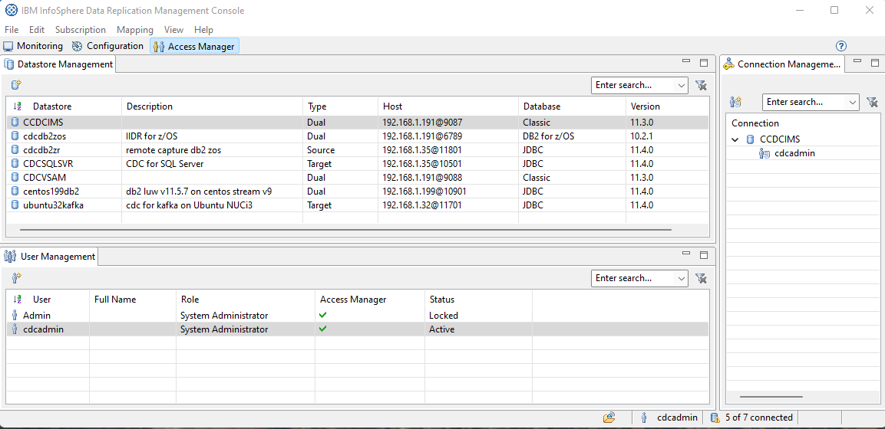

[Back to README.md and Table of Contents.](README.md)

# Environment for CDC Worked Examples
These CDC Worked Examples are based upon the systems landscape illustrated below. TCPIP addresses and ports are represented by the black boxes.

IBM InfoSphere Data Replication ( aka "CDC" ) provides a data replication capability between lots of heterogeneous data sources. 

1. Some data sources ( like IMS and VSAM ) can only act as CDC sources (<b>CDC Cap</b> - dark blue blocks).
2. Some data sources ( like Apache Kafka ) can only act as CDC targets (<b>CDC App</b> - light blue blocks).
3. Some data sources ( like DB2 z/OS ) can act as both CDC sources and CDC targets.
4. A set of common tools operate with all CDC agents (yellow blocks).
5. CDC integrates with industry standards to support common authentication and encryption services like LDAP and TLS.

## CDC Capture Sources

A CDC Capture Source (like Classic CDC for IMS shown below) can replicate data to any CDC Apply Target, as per the illustration below.

## CDC Apply Targets

A CDC Apply Target (like CDC for Kafka shown below) can receive replicated data from and CDC Capture Source, as per the illustration below.

## CDC Management Console view of the Servers

The screenshot below is how the various servers are represented in the CDC Management Console.

Note the three tabs, and what they are used for

* Access Manager tab, is where connections to CDC agents are defined, together with the corresponding authenticaton details.
* Configuration tab, is where CDC subscriptions are defined
* Monitoring tab, is where CDC subscriptions are operated, with monitoring dashboards

## About these Worked Examples

The raison d'etre for these articles is to provide an illustration of a simple implementation of CDC solutions between mainframe sources and cloud/midrange targets.

A secondary purpose is to bridge the collaboration gaps that exist between mainframe, midrange and cloud teams in Enterprises today.
* Much of the core business data is created and maintained on mainframe systems.
* Cloud and midrange systems want to consume that data for purposes like digital integration hubs.
* Enterprises typically have separate operations and development teams for these platforms, who don't have a common set of verbs and nouns.

It is assumed that the reader understands the scope of IBM InfoSphere CDC solutions, and is considering implementation.

These worked examples are <b>categorically not</b> a substitute for the official IBM 
documentation: <a href="https://www.ibm.com/docs/en/idr/11.4.0?topic=change-data-capture-cdc-replication">IBM CDC knowledge centre</a>

The author of these documents has found the knowledge center to be a very comprehensive and accurate source of information for all CDC software products.
However, sometimes the documentation can seem like a collection of lego bricks without a picture of the finished model. 
Hopefully these articles can serve as the the visualisation of the end point, to make the planning and building phases a little easier.
 
### Target Audience
These documents are aimed at two groups of people:

* Architects who need to evaluate and plan for the integration of CDC technology into their systems, and need to understand how CDC supports encryption, authentication, automation, monitoring, change control, devops and so forth.
* Systems professionals who need to install, customize, connect, test and generally make CDC do what it is intended to do.

[Back to README.md and Table of Contents.](README.md)