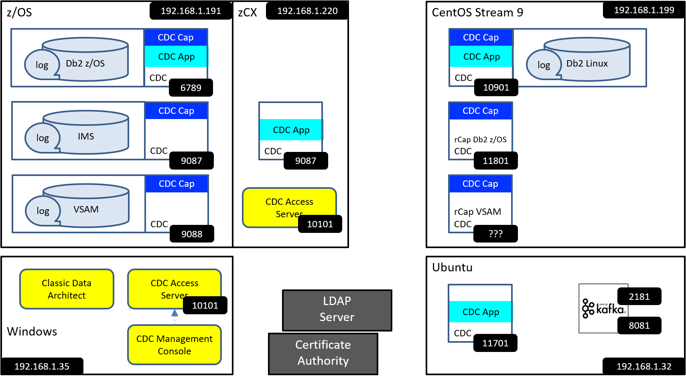
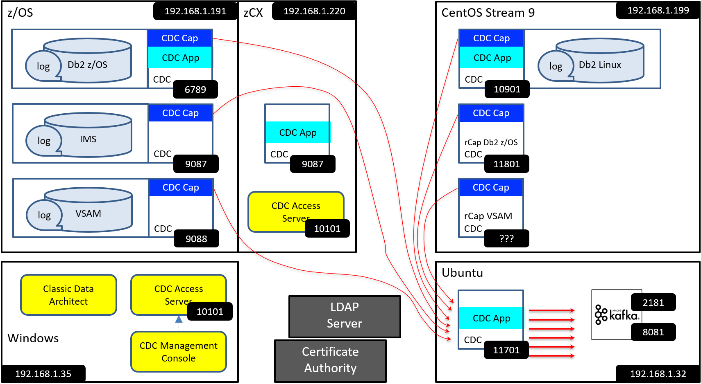

[Back to README.md and Table of Contents.](README.md)

# Environment for CDC Worked Examples
These CDC Worked Examples are based upon the systems landscape illustrated below. TCPIP addresses and ports are represented by the black boxes.

## CDC Replication Concepts

IBM InfoSphere Data Replication ( aka "CDC" ) provides a data replication capability between lots of heterogeneous data sources. 

1. Some data sources ( like IMS and VSAM ) can only act as CDC sources *CDC Cap*.
2. Some data sources ( like Apache Kafka ) can only act as CDC targets (CDC App).
3. Some data sources ( like DB2 z/OS ) can act as both CDC sources and CDC targets.
4. A set of common tools operate with all CDC agents.
5. CDC integrates with industry standards to support common authentication and encryption services like LDAP and TLS.

## CDC Capture Sources

A CDC Capture Source (like Classic CDC for IMS shown below) can replicate data to any CDC Apply Target, as per the illustration below.

## CDC Apply Targets

A CDC Apply Target (like CDC for Kafka shown below) can receive replicated data from and CDC Capture Source, as per the illustration below.

## About these Worked Examples

There is a lot of content contained in these papers, which will be helpful to some readers, but may be meaningless geek-speak to others. 
The words below set some expectations as to what these articles cover so that the reader can decide to view them, or invest their time elsewhere. 

<h3>Original Purpose for publishing these worked examples.</h3>

These worked examples are <b>categorically not</b> a substitute for the official IBM documentation, which 
can be found here <a href="https://www.ibm.com/docs/en/idr/11.4.0?topic=change-data-capture-cdc-replication">IBM CDC knowledge centre</a>

The author of these documents has found the knowledge center to be a very comprehensive and accurate source of information for all CDC software products.
However, the author sometimes struggled to see the wood for the trees as he followed the extensive documentation, and felt that some worked examples would 
have been helpful to visualise the something similar to the end point he sought, and the journey to get there. The result was the series of documents linked at the 
top of this page.

 
<h3>Target Audience</h3>

These documents are aimed at two groups of people:

<ol>
<li>Architects who need to evaluate and plan for the integration of CDC technology into their systems, and need to understand how CDC supports encryption, authentication, automation, monitoring, change control, devops and so forth.
<li>Systems professionals who need to install, customize, connect, test and generally make CDC do what it is intended to do.
</ol>

Architects will likely be most interested in column 1 ( Using CDC Articles )

Columns 2 & 3 may be more useful to professionals who need to deploy CDC software and make it work

<h3>Assumed Knowledge</h3>

These articles assume that the reader has a reasonable understanding of what the IBM CDC Software solutions do, and the likely use cases in their organisation.

A series of links that explain the basics of CDC Replication is provided at the bottom of the page should you need some additional background information.

<h3>Mainframe Focus</h3>

The raison d'etre for CDC Replication is to support heterogeneous data sources and targets. 
This series of articles is heavily focussed on mainframe data sources. 
Integration between mainframe sources and non-mainframe targets is the source of most of the deployment challenges faced by customers (devops, security etc... ). 
Kafka and Db2 Linux are chosen as a couple of examples of non-mainframe targets so that these challenges can be considered and addressed.

<h3>Feedback</h3> 

These papers represent the personal experience and opinion of the author. I welcome any constructive feedback to help improve these articles,

[Back to README.md and Table of Contents.](README.md)