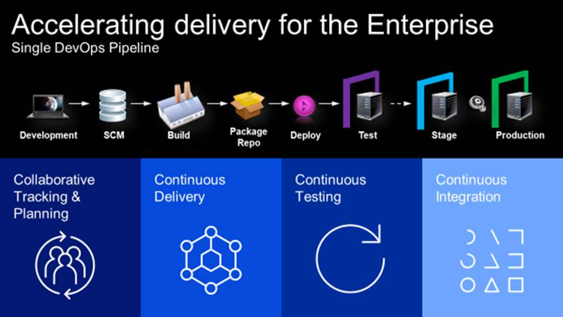
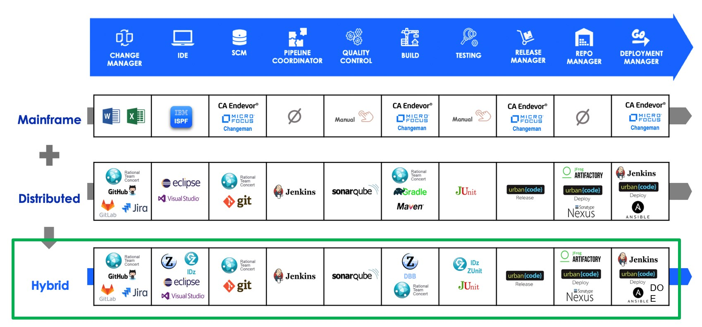

# Introduction
Any discussion of the software development lifecycle (SDLC) should begin with a definition of the process itself, which we provide here along with an overview of the latest evolution of SDLC: the DevOps methodology and the framework and tools it provides for rapid software development and delivery.

## **Stages of the** software development life cycle

The SDLC was developed as a formalized methodology and framework for building information systems and includes all aspects of planning, creating, testing, and deploying an application. 

Typically, the SDLC includes seven distinct stages:

1. **Investigation** During this initial stage, current business priorities and how they are implemented and managed are examined. A feasibility study is normally conducted to determine if creating a new application or improving an existing application is a viable solution to meet the needs of the business. This step is typically performed by business analysts and application architects.

2. **Analysis** The objective of this stage is to identify potential areas for improvement as they relate to the application system, if applicable. This stage involves breaking down the application into different pieces to facilitate analysis of the requirement, defining project goals, identifying changes and improvements, and enlisting end-users to help define and validate specific requirements. Business analysts, application architects, developers, and end users typically participate in this stage.

3. **Design** The initial input to the design stage is a formally approved business requirements document. For each requirement in this document, one or more design elements will be produced as a result of a combination of interviews, workshops, and prototyping efforts. This stage typically involves business owners, application architects, and developers.  Depending on the scope of the requirements, application database administrators (DBAs) and data modelers might also be involved.

4. **Environments** This stage involves defining and setting up the controlled environment that application developers will use to build, distribute, install, configure, test, and execute systems that move through the SDLC. Application designers, developers, and potentially system programmers, capacity planners, and application DBAs typically participate in this step.

5. **Testing** During this critical phase, the application code is developed, tested, and refined. Throughout the industry, many different opinions exist as to what the stages of testing are and how much iteration, if any, should occur. However, it's widely accepted that this stage should include some level of unit testing, system testing, and user acceptance testing. Many different roles might need to particpate during various phases of this stage, but the primary participants are application developers, software quality assurance engineers, and DBAs who must work together closely to achieve a common goal.

6. **Training and transition**  After the application has been stabilized as a result of thorough testing, the SDLC ensures that proper training on the system occurs and instructions for installing, configuring, and using the system are documented before the system is transitioned to its support staff and end users. This stage typically involves everyone who has participated in the previous stages. From a DBA's perspective, this stage is where performance, backup and recovery, and other DBA-related tasks are refined, agreed upon, and communicated to ensure that the Db2 constructs and data are maintained in a manner required to achieve the SLA of the application.

7. **Operations and maintenance** Because the deployment of the application includes changes and enhancements to existing processes, the effects of these changes must be clearly understood by members of the development, database administration, operations, capacity, and performance management teams. As with stage 6, this stage is critical to the DBA.
   

## Introduction to DevOps

DevOps is a set of practices that combines software development (Dev) and IT operations (Ops) into a cohesive methodology for developing and delivering high-quality software rapidly and efficiently. It has gained popularity over the last decade as the primary methodology for rapidly developing and releasing software. 

One of the most important practices for accomplishing these goals is creating a DevOps pipeline. A DevOps pipeline is a collection of processes and automation tools that enable cross-functional teams to meet the growing demand for frequent releases and updates by consolidating build, test, and deployment capabilities into a single framework.

Pipelines are the mechanism that DevOps teams rely on to implement the practices of continuous integration/continuous delivery (CI/CD), continuous testing, and collaborative tracking and planning to improve the efficiency and effectiveness of software development.
 
CI/CD is a practice for developing software with the  focus on delivering updates to consumers on a continuous basis. 

Continuous testing is a practice that provides testcases with code changes and automatically executes them as part of the pipeline execution in order to maintain a high level of code quality, even with frequent code changes.
 
Collaborative tracking and planning is critical for providing a productive environment within an organization.

A typical CI/CD pipeline includes the following high-level steps:

  1. Code, preferably developed in an Integrated Development Environment (IDE), is committed to a source control management system (SCM), which initiates the CI/CD pipeline.
  2. The application is compiled and built by the CI/CD tools and deployed to the test environment.
  3. Regression and unit tests are performed automatically as part of the pipeline execution.
  4. If tests are passed, the application is delivered and deployed into the integration and user-acceptance environments for additional tests.
  5. Finally, the application is delivered and deployed into production.

Ideally, pipelines enable development teams to automate most or all of the steps from code integration to deployment. These steps can be applied to any software development project.

As shown in the following figure, over many years there has been a myriad of processes to deploy application changes on IBM Z (also called the mainframe). However, in most cases they are not fully automated and still follow the waterfall development model in which many changes are combined and rolled out in releases only a few times each year.

Driven by the requirement to deliver code changes to a large number of environments, a new methodology that involved a different set of tools evolved on the distributed platform. This methodology focused on the full integration and automation of the tools to support an automated deployment pipeline. Many of those tools are available through open source projects and are widely adopted.

The following list identifies some of tools that are commonly used in the different stages of a CI/CD pipeline:

**Integrated Developer Environment (IDE)**: Eclipse-based IDz is widely used for development of cross-platform applications, and Microsoft Visual Studio Code (VS Code) with available extensions has become popular for intelligent development of applications in a wide range of languages, including legacy languages like COBOL, Java, and PLI, and newer languages such as Python, Javascript, and Go, that support accessing Db2 for z/OS via SQL or Db2 RESTful services.

**Source Control Management (SCM)**: Git and IBM Rational Team Concert (RTC) are both popular tools for source control management including database artifacts. Whereas RTC is used to manage application artifacts, many organizations use Git as a common SCM to manage database artifacts as well. We'll share best practices for managing database schemas in Git in a later chapter.  

**Pipeline orchestration**: Jenkins or GitLab are widely adopted tools to orchestrate the different steps in a pipeline, including functionality to easily see the history of pipeline executions.

**Build**: IBM Dependency Based Build (DBB) is a widely adopted tool for building applications that will run cross-platform, including IBM Z. Built application components, such as load libraries and DBRMs, are stored in Artifactory, ready to be deployed to the different environments by using a deployment tool.
 
**Deploy**: IBM UrbanCode Deploy (UCD) is a widely adopted tool for deploying application artifacts to all platforms, including on-premises, cloud, and mobile applications. Alternatively, RedHat Ansible has also become a popular tool for deployment automation of cloud-native applications. A deployment tool can substitute environment-specific definitions such as library names or, in the context of a Db2, schema names, to fit the target environment. 

**Testing and quality control**: Recently, many organizations have begun to focus more on automated testing in the pipeline. SonarQube is used for the continuous inspection of code quality, and JUnit is used for component testing. Both of these tools are open source.

As customer applications have become multi-platform, organizations are looking to adopt a single, multi-platform (hybrid cloud) automated CI/CD pipeline.

The steps in the CI/CD pipeline are typically associated with application code changes. In reality, a lot of application changes also require database code changes, such as adding columns to a table, adding an index, or changing a database stored procedure. So far, database changes are controlled and executed by DBAs who work independently of the pipeline. DBAs control this process and enforce rules to maintain the quality of a database as a highly shared asset.
