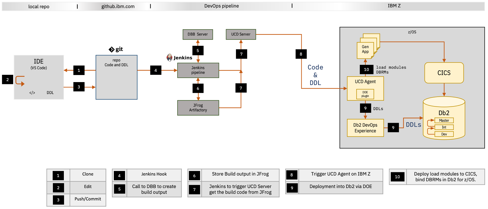

# Architectural overview

The following figure provides a high-level architectural overview of the setup that we use throughout this document:

  

## Steps 1, 2, and 3: Cloning, editing, and committing
Let's start with the central repository. We use git technology for our source control management (SCM) by means of GitHub Enterprise Edition. [Chapter 5](C005_codeRepoOrganization.md) will explain the structure of our SCM system in more detail. The SCM system is where all the artifacts for this project are stored.
 
The first time a developer needs to make changes to the code or DDL, they'll start by cloning the repository to a local version, as depicted in step 1 in the figure. Editing is done on a local integrated development environment (IDE). We're  using Microsoft Visual Studio Code (step 2), which interfaces with GitHub. After the developer has created a local version of the project, they can work locally and then save and commit their changes to the GitHub Enterprise environment (step 3).

## Step 4: Automating the process with Jenkins
The role of Jenkins is to orchestrate the pipeline, which means that it automates all of the different steps starting with  picking up the changes in the artifacts all the way to deploying these changes or, in the case of an error, rejecting them. 

In this step, Jenkins monitors the file system of the GitHub environment. Whenever a change is committed, Jenkins is triggered and the pipeline starts.

The following figure shows how a committed change moves through all the steps in our Jenkins pipeline:

  

## Step 5: Building the artifacts
Jenkins will trigger the Dependency Based Build (DBB) server to compile and link-edit the source code and to generate the Database Request Module (DBRM).

DBB is an IBM tool that allows the compiling, link-editing, and deployment of applications on IBM Z by means of modern scripting languages. It's extremely handy in the orchestration process that we use throughout this document. It can run Groovy on z/OS, which allows engineers who are not familiar with IBM Z to compile and link-edit programs and also to run MVS, TSO, and ISPF commands.

IBM DBB stores code dependencies and provides its own reporting tool. As an alternative for deeper analysis from the z/OS perspective, it's possible to write SMF records when the script calls z/OS commands.

A more detailed overview of DBB is beyond the scope of this document, but you can read [Build a pipeline with Jenkins, Dependency Based Build, and UrbanCode Deploy](https://developer.ibm.com/components/ibmz/tutorials/build-a-pipeline-with-jenkins-dependency-based-build-and-urbancode-deploy/) for more information about how to set it up.

**Note:** For our use case, we recognize that the changes that we make to the SQL will also change the DBRM. However, because our changes don't cause a change in the build process, we don't cover the DBRM in relation to DBB in this document. 

If the build fails, Jenkins reports the failure in the overall Stage View and notifies the appropriate users.
 
## Step 6: Storing the build output in a central repository
When a build completes successfully, its output is stored in the JFrog Artifactory, which is a single source of truth for all artifacts as they move across the entire CI/CD pipeline.

## Steps 7 and 8: Moving the build output to the deployment stage
When JFrog has received all the artifacts, Jenkins triggers the IBM UrbanCode Deploy (UCD) Server to pick up the build output and transfer it to the UCD Agent running on IBM Z. UCD standardizes and simplifies the process of deploying software components to each environment in your development cycle. [Chapter 8](C008_ucd_overall.md) describes UCD in more detail, including how to set it up and how it integrates with the other components, specifically DevOps Experience for Db2 for z/OS. 

## Step 9: Deploying the DDL into Db2 for z/OS via DOE
In this step, the UCD Agent triggers DOE to have the DDL deployed into Db2 for z/OS. If this step completes successfully, we can continue with the final step.

## Step 10: Deploying the load modules in CICS and binding the DBRM
Apart from triggering DOE to deploy the DDL as described in step 9, the UCD Agent will also deploy the newly compiled and built load modules into CICS. A third and final task for the UCD Agent will be to bind the DBRM in Db2 for z/OS.

