[Back to README.md and Table of Contents.](README.md)

# Setting Up Classic CDC for IMS - Worked Example
This chapter is a worked example of setting up Classic CDC for VSAM. 

## Contents

<ul class="toc_list">
<li><a href="#abstract">Abstract</a>   
<li><a href="#1.0">1 Introduction to Classic CDC for VSAM</a>
<ul>
  <li><a href="#1.1">1.1 Requirements to Replicate VSAM Data</a></li>
  <li><a href="#1.2">1.2 The Classic CDC Started Task</a></li>
</ul>
<li><a href="#2.0">2. High Level Review of Implementation Steps</a>
<li><a href="#3.0">3. SMPE Installation of Code Libraries</a>
<li><a href="#4.0">4. Creating the Classic CDC Instance</a>
<ul>
  <li><a href="#4.1">4.1 Create the Instance Libraries</a></li>
  <li><a href="#4.2">4.2 Edit the Parameters member</a></li>
  <li><a href="#4.3">4.3 Generate the Customised JCL members</a></li>
  <li><a href="#4.4">4.4 Define CDC Logstreams</a></li>  
  <li><a href="#4.5">4.5 Define and Mount the Classic Catalog zFS</a></li>
  <li><a href="#4.6">4.6 Define and Populate the Configuration Datasets</a></li>
  <li><a href="#4.7">4.7 Create the Metadata Catalog</a></li>
  <li><a href="#4.8">4.8 Create the Replication Mapping Datasets</a></li>  
  <li><a href="#4.9">4.9 Setup Encrypted Passwords</a></li>  
</ul> 
<li><a href="#5.0">5. Configure the z/OS Environment</a>
<ul>
  <li><a href="#5.1">5.1 APF Authorised Load Libraries</a></li>
  <li><a href="#5.2">5.2 TCPIP Ports</a></li>
  <li><a href="#5.3">5.3 RACF Started Task ID</a></li>
  <li><a href="#5.4">5.4 Test Start the Classic CDC Server</a></li>  
</ul>
<li><a href="#6.0">6. Configure the CICS-VSAM Environment</a>
<ul>
  <li><a href="#6.1">6.1 VSAM Access Service</a></li>
  <li><a href="#6.2">6.2 CICS-TS or CICS-VR to write the replication logstream</a></li>
  <li><a href="#6.3">6.3 Augment VSAM to write replication log records</a></li>
</ul>
<li><a href="#7.0">7. Integrate with the wider CDC Landscape</a>
<ul>
  <li><a href="#7.1">7.1 Deploy Classic CDC as a Started Task</a></li>
  <li><a href="#7.2">7.2 Deploy and use the Classic Data Architect IDE</a></li>
  <li><a href="#7.3">7.3 Connect from Management Console to Classic CDC Started Task</a></li>
  <li><a href="#7.4">7.4 Use CHCCLP Scripting</a></li>  
  <li><a href="#7.5">7.5 Conforming to site standards for cross-platform devops and security</a></li>
</ul> 
</ul>


<hr>


<h2 id="abstract"> Abstract</h2>

This document is a basic worked example of setting up Classic CDC for VSAM as a CDC Source Server. 

* It deals with the practical considerations for implementing VSAM as a CDC data source. 
* It's scope is limited to a "basic up and running guide", and is intended to be easy to follow (assuming a base of z/OS and CICS-VSAM practical experience).
* It does not attempt to cover all the product's features.
* It is categorically <b>not</b> a replacement for the  <a href="https://www.ibm.com/docs/en/idr/11.4.0?topic=replication-infosphere-classic-cdc-zos">IBM Classic CDC knowledge centre</a>, which is the comprehensive official product documentation.
 

It is part of a series of documents providing practical worked examples and 
guidance for seting up CDC Replication between mainframe data sources and mid-range or Cloud targets.
The complete set of articles can be accessed using the links at the very top of this page 

<br><hr>

<h2 id="1.0">1. Introduction to Classic CDC for VSAM</h2>  

Classic CDC for VSAM is a CDC Capture Source only. It does not have CDC Apply functionality. 

<b>Aside:</b> Classic CDC for VSAM is licensed seperately from Classic CDC for IMS. However, these two 
products share a lot of common components. The sister document [3. Setting up Classic CDC for IMS.](C003_cdcims.md) follows the same pattern as this worked 
example for much of the setup work, but has differences with regard to the services to access IMS and capture changes from IMS. 

CDC Replication is a set of products that implement a common data replication architecture spanning 
a large number of diverse data sources and targets. The CDC common architecture is based upon replication of 
data that conforms to the relational model. Any CDC capture or apply agent that supports a non-relational data structure 
must perform whatever conversion work that is necessary to implement a mapping between that data structure and the 
relational model of data. 

<h3 id="1.1">1.1 Requirements to Replicate VSAM Data</h3> 

The core functionaility of any CDC Capture agent is to read the source database logs asynchronously, 
stage captured data (preferably in memory) until the Unit of Work is commited or rolled back, 
and then publish the committed changes over TCPIP sockets to a CDC Apply agent. 

In addition to the usual requirements, Classic CDC for VSAM needs to handle the fact that VSAM data structures are stored in copybooks, and VSAM does not write a "database log". 

<b>Regarding copybook data structures:</b> The Classic CDC for VSAM product provides 
a tool (Classic Data Architect) to map the copybook data structures
into relational projections of that data, for the purposes of acting as a CDC Replication capture agent. 
The mappings of data structures are stored in a zFS dataset called the "Classic Catalog". This contains relational catalog tables 
like Db2 ( sysibm.systables , sysibm.syscolumns etc... ) that contain the mapping between the fields in the relevant copybooks for the 
VSAM data, and their relational projection. The mapping information allows SQL access to the VSAM datasets to retrieve the base data.

<b>Regarding VSAM logs:</b>Classic CDC for VSAM works by taking advantage of z/OS logstreams. VSAM datasets are augmented to specify an assosiated z/OS logstream. 
If the VSAM dataset is under control of CICS, then CICS Transaction Server is responsible for writing replication log records to the logstream. 
If the VSAM dataset is independent of CICS and written to in batch, then a separately licensed prodyuct ( CICS VSAM Recovery ) can be used to write replication log records to the logstream. 


<h3 id="1.2">1.2 The Classic CDC Started Task</h3>

The diagram below is a representation of the components within a Classic CDC for VSAM started task, and how they 
relate to external artefacts. 

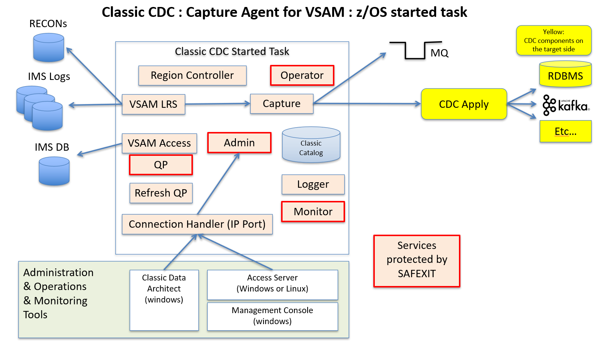

The services that are outlined in red are the ones that can be protected by the SAF Exit. 
The primary services involved in the cdc capture server are  the VSAM Log Reader Service (VSAM LRS) and the Capture process (Capture). 
The following is a brief summary of what some of the key services do.


| Service | Function |
| --- | --- |
| Connection Handler | Listens on a TCPIP port for requests from other CDC components (Classic Data Architect, Management Console & Access Server, CDC Apply agents). |
| Admin Service | Dispatches tasks to appropriate services within the Started Task. |
| Query Processor | Converts SQL requests into DL/I language to access IMS data structures. |
| VSAM Access | Sevice to connect to and read from VSAM. |
| VSAM LRS | VSAM z/OS Logstream Reader Service. |
| Capture | Extracts log changes needed for subscriptions, and publishes them over TCPIP to CDC Apply Agents. |
| Operator | Command Processor. (Start, Stop, Park etc... ). |
| Logger | Writes Started Task logs to z/OS logstreams. |
| Monitor | Tracks health and performance data. |

All the services, and their governing parameters are documented in the knowledge 
center <a href="https://www.ibm.com/docs/en/idr/11.4.0?topic=zos-configuration-parameters-classic-data-servers-services">Classic Services</a>.

<br><hr>

<h2 id="2.0">2. High Level Review of Implementation Steps</h2>

There are a lot of moving parts, and a lot of inter-related dependencies in setting up Classic CDC for VSAM. 
It is helpful to establish a structured overview of the main installation and configuration activities before 
diving into the technical details of very nut and bolt. This paper identifies five separate stages of implementation.

1. SMPE Installation of Code Libraries
2. Creating the Customised Classic CDC Instance
3. Configure the z/OS Environment
4. Configure the CICS-VSAM Environment
5. Integrate with the wider CDC Landscape


<br><hr>

<h2 id="3.0">3. SMPE Installation of Code Libraries</h2>

SMPE installation is a well documented, standardised process that every systems programming shop manages with 
their own standards. It is outside the scope of this paper, aside from noting that it is a pre-requisite to the 
followng stages. 

Once the SMPE installation is complete, the following target libraries will exist under the chosen high level qualifier. (CDCV in this example). 

 <table>
  <tr><td width=200><b>Library</b></td><td width=500><b>Contents</b></td></tr> 
  <tr><td>CDCV.SCACBASE</td><td>Samples</td></tr> 
  <tr><td>CDCV.SCACCONF</td><td>Configuration datsets</td></tr>  
  <tr><td>CDCV.SCACLOAD</td><td>Load modules</td></tr>  
  <tr><td>CDCV.SCACMAC</td><td>Macros</td></tr>  
  <tr><td>CDCV.SCACMSGS</td><td>Messages</td></tr> 
  <tr><td>CDCV.SCACSAMP</td><td>Sample JCL</td></tr>  
  <tr><td>CDCV.SCACSIDE</td><td>Load Modules</td></tr>  
  <tr><td>CDCV.SCACSKEL</td><td>ISPF skeleton library</td></tr>  
</table> 

<br><hr>
	
<h2 id="4.0">4. Creating the Classic CDC Instance</h2>

The installed product code can now be used to support one or more instances of Classic CDC for VSAM. 
This worked example will create a single instance, under the instance high level qualifier of CDCV.I2 (in this example). 

<h3 id="4.1">4.1 Create the Instance Libraries</h3> 

Creating the instance libraries is easy. Job CECCUSC1 will allocate the instance library, 
and populate the instance library with a parameters file and a job to generate fully customised versions of all the JCL and configuration members that you need 

Just edit CDCV.SCACSAMP(CECCUSC1) to specify the high level qualifier for 
the installation library (CACINHLQ=CDCV) and the instance library (CACUSHLQ=CDCV.I2), and submit the job to create the instance libraries. 

``` 
//GENSAMPE EXEC GENSAMP                                          
//CRTSAMP.SYSTSIN  DD *                                          
 PROFILE NOPREFIX  MSGID                                         
                                                                 
 ISPSTART CMD(%CACCUSX1                                         +
      CACDUNIT=SYSALLDA                                         +
      CACINHLQ=CDCV                                             +
      CACUSHLQ=CDCV.I2                                          +
      ISPFHLQ=ISP                                               +
      ISPFLANG=ENU                                              +
      SERVERROLE=(CDC_VSAM_SRC)                                 +
 )                                                               
/*                                                                                                                             
```


<p>The result should be to allocate the following libraries.</p>
 <table>
  <tr><td width=200>Library</td><td width=500>Initial Contents</td></tr> 
  <tr><td>CDCV.I2.USERCONF</td><td>empty</td></tr> 
  <tr><td>CDCV.I2.USERSAMP</td><td>just a parameters member plus generation job, listed below:</td></tr>  
</table> 

```
CECCUSC2                                                         
CECCUSPC                                                                                                                   
```


<h3 id="4.2">4.2 Edit the Parameters member</h3> 

Editing the parameters member <code>CDCV.I2.USERSAMP(CECCUSPC)</code> is a critical step. It will generate 
fully customised JCL for pretty much everything you need to do to deploy the Classic CDC instance in your environment. 
You will need to gather configuration information for z/OS, TCPIP, IMS, MQ and so forth to populate the parameters member. 

Many of the default paramaters will be just fine. You should review the descriptions for each of the parameters that are 
provided inside the parameters member to assess whether they need to be changed in your system. 
In this worked example the parameters (and line numbers for V11.3) that we edited were as follows. 

<ul>
<li>Line 45, specify the installation HLQ <code>CACINHLQ="CDCV"</code> 
<li>Line 47, specify the instance HLQ <code>CACUSHLQ="CDCV.I2"</code> 
<li>Line 49, specify the default UNIT for DSN creation <code>CACDUNIT="SYSALLDA"</code> 
<li>Lines 60 and 61, provide a job card for all the JCLs that will be generated
<li>Line 71, provide the HLQ for the various source datasets that will be created for this instance <code>CDCPHLQD="CDCV.I2.CDCSRC"</code>
<li>Line 83, provide the zFS path for the Metadata Catalog that will be created <code>CATPATH="/opt/IBM/ccdci1/catalogv"</code> 
<li>Line 105, provide the TCPIP listener port for the Server <code>CDCPPORT="9088"</code>  
<li>Line 106, provide the Data Source Name for the Server <code>CDCDSRCE="SAMPLEVS"</code>  
<li>Line 111, provide the SYSADM ID for the Server <code>CDCADMUS="ADMUSER"</code>  
<li>Line 156, Accept the default supplied security exit name for the SAF-protected services <code>CDCPSAFX="CACSX04"</code> 
<li>Line 187 and 194, Comment the storage classes for the logstreams (which will result in DASD logstreams, rather than CF logstreams <code>**CPLGSC="STG1"</code> and <code>**CPEVSC="STG1"</code> 
</ul>
<p>... and optionally, if you also want to use the ability to publish changes to MQ (in addition to CDC Apply agents)</p>
<ul>
<li>Line 202, provide the HLQ for the MQ Libraries <code>CDCMQHLQ="CSQ911"</code>
<li>Line 203, provide the name of the Queue Manager to connect to for MQ publishing<code>CDCMQMGR="CSQ9"</code>
<li>Line 208, provide the name of the Bookmark Queue to use for MQ publishing <code>CDCBKMKQ="CDCV.BOOKMARK"</code> 
<li>Line 213, provide the name of the Subscription Queue to use for MQ publishing <code>CDCSUBLQ="CDCV.PUBLISH1"</code>
</ul>


Browse the entire PARMS file in the github repository (opens new tab) <a href="https://github.com/zeditor01/recipes/blob/main/samples/cdc/CECCUSPC_VSAM.TXT" target="_blank">here.</a> 

<h3 id="4.3">4.3 Generate the Customised JCL members</h3> 

The list of parameters above is enough to completely define the Classic CDC instance. All you need is to run a program 
that will merge those paramaters with some skeleton files in order to generate all the customised JCL and configuration members from them. 
Simply edit and submit <code>CDCV.I2.USERSAMP(CECCUSC2)</code> to do this.


You should end up with 4 configuration members in <code>CDCV.I2.USERCONF</code> and 50 JCL members in <code>CDCV.I2.USERSAMP</code>.


<h3 id="4.4">4.4 Define CDC Logstreams</h3> 

Classic CDC uses z/OS Logstreams for the diagnostic log and the event log. The logstreams can be either CF logstreams or DASD logstreams. 
By commenting out the Logstream Storage Class they will ge generated as DASD logstreams in this simple example.


Review and submit member <code>CDCV.I2.USERSAMP(CECCDSLS)</code> to define these as DASD logstreams.


```
//*********************************************
//* ALLOCATE THE LOG STREAM FOR THE EVENT LOG *
//*********************************************
//ALLOCEV    EXEC  PGM=IXCMIAPU                
//SYSPRINT DD SYSOUT=*                         
//SYSOUT   DD SYSOUT=*                         
//SYSIN    DD *                                
   DATA TYPE(LOGR) REPORT(NO)                  
   DEFINE LOGSTREAM NAME(CDCSRC.I2.EVENTS)     
          DASDONLY(YES)                        
          MAXBUFSIZE(4096)                     
          LS_SIZE(1024)                        
          STG_SIZE(512)                        
          RETPD(14) AUTODELETE(YES)            
/*                                             
```

and

```
//************************************************
//* ALLOCATE THE LOG STREAM FOR THE DIAGNOSTIC LOG
//************************************************
//ALLOCDG    EXEC  PGM=IXCMIAPU                   
//SYSPRINT DD SYSOUT=*                            
//SYSOUT   DD SYSOUT=*                            
//SYSIN    DD *                                   
   DATA TYPE(LOGR) REPORT(NO)                     
   DEFINE LOGSTREAM NAME(CDCSRC.I2.DIAGLOG)       
          DASDONLY(YES)                           
          LS_SIZE(1024)                           
          STG_SIZE(512)                           
          RETPD(7) AUTODELETE(YES)                
/*                                                
```

and

```
//************************************************
//* ALLOCATE THE LOG STREAM FOR THE IVP LOGSTREAM 
//************************************************
//ALLOCDG    EXEC  PGM=IXCMIAPU                   
//SYSPRINT DD SYSOUT=*                            
//SYSOUT   DD SYSOUT=*                            
//SYSIN    DD *                                   
   DATA TYPE(LOGR) REPORT(NO)                     
   DEFINE LOGSTREAM NAME(CDCSRC.IVP.REPLLOG)      
          DASDONLY(YES)                           
          LS_SIZE(1024)                           
          STG_SIZE(512)                           
          RETPD(7) AUTODELETE(YES)                
/*                                                
``` 


<h3 id="4.5">4.5 Define and Mount the Classic Catalog zFS</h3> 

The Metadata Catalog is conceptually similar to the Db2 catalog ( SYSTABLES, SYSCOLUMNS etc… ). 
Not only does it store metadata about IMS Tables, but it also contains the details of the IMS to relational model mapping.


The Metadata catalog is deployed as a zFS which needs to be mounted at the path specified for “CATPATH” in CECCUSPC.


The zFS is allocated with generated job CECCRZCT. 
The VSAM cluster is defined in the first job step as <code>CDCV.I2.ZFS</code>, and the zFS is formatted in the second job step. 
Review the submit <code>CDCV.I2.USERSAMP(CECCRZCT)</code> to define the Metadata Catalog.


```
 DEFINE CLUSTER ( -    
   NAME(CDCV.I2.ZFS) - 
   LINEAR -            
   MEGABYTES(150 128) -
   VOLUMES(*) -        
   SHAREOPTIONS(3 3)  -
   CISZ(4096))         
``` 

and

``` 
//FORMAT EXEC PGM=IOEAGFMT,REGION=0M,       
//    COND=(0,LT),                          
//    PARM='-aggregate CDCV.I2.ZFS  -compat'
```


<h3 id="4.6">4.6 Define and Populate the Configuration Datasets</h3> 

Classic CDC for IMS is governed by a number of parameters that are defined in the configuration datasets. 
Parameters governing threads, memory, tcpip ports and so forth, as documented in the knowledge centre. 
The creation and population of the configuration datasets is controlled by job CECCDCFG. Review the generated JCL and submit when happy.

 
```
//CFGALLOC     EXEC PGM=IEFBR14                       
//CACCFGD      DD  DSN=&CPHLQ..CACCFGD,               
//             UNIT=&DISKU,                           
//             STORCLAS=&STGCL,                       
//             MGMTCLAS=&MGTCL,                       
//             SPACE=(TRK,(20,10)),                   
//             DCB=(RECFM=FBS,LRECL=64,BLKSIZE=27968),
//             DISP=(NEW,CATLG,DELETE)                
//CACCFGX  DD  DSN=&CPHLQ..CACCFGX,                   
//             UNIT=&DISKU,                           
//             STORCLAS=&STGCL,                       
//             MGMTCLAS=&MGTCL,                       
//             SPACE=(TRK,(10,5)),                    
//             DCB=(RECFM=FBS,LRECL=64,BLKSIZE=27968),
//             DISP=(NEW,CATLG,DELETE)                
//*                                                   
```

and the final step imports the default parameter values into the configuration datasets

```
//ALLOCATE EXEC ALLOCFG                         
//CFGINIT.SYSIN DD *                            
IMPORT,CONFIG,FILENAME=DDN:IMPORTCF(CECCDXFG)   
REPORT                                          
QUIT                                            
/*                                              
```

<h3 id="4.7">4.7 Create the Metadata Catalog</h3> 

The Metadata Catalog is a zFS that holds catalog tables ( systables, syscolumns etc... ). 
The CACCATUT utility is used to create the metadata catalog tables in the Metadata Catalog. 
This is performed using job CECCDCAT. Review the generated JCL and submit when happy. 

```
//INIT     EXEC PGM=CACCATUT,PARM='INIT',REGION=&RGN        
//STEPLIB  DD  DISP=SHR,DSN=&CAC..SCACLOAD                  
//SYSOUT   DD  SYSOUT=&SOUT                                 
//SYSPRINT DD  SYSOUT=&SOUT                                 
//MSGCAT   DD  DISP=SHR,DSN=&CAC..SCACMSGS                  
//CACCAT   DD  PATHDISP=(KEEP,KEEP),                        
//             PATH='/opt/IBM/isclassic113/catalogv/caccat' 
//CACINDX  DD  PATHDISP=(KEEP,KEEP),                        
//             PATH='/opt/IBM/isclassic113/catalogv/cacindx'
```

<h3 id="4.8">4.8 Create the Replication Mapping Datasets</h3> 

The Replication Mapping datasets are used to hold the metadata to support subscriptions from IMS to targets like Kafka. 
These mapping datasets will be empty until you start defining subscriptions using Management Console or CHCCLP scripts. 
This is performed using job CECCDSUB. Review the generated JCL and submit when happy. 

```
 DEFINE CLUSTER                  - 
    (NAME(&CPHLQ..SUB)        -    
     RECSZ(1024 2048)            - 
     KEY(80 12)                  - 
     CYL(2 1)                    - 
     SPEED REUSE)                - 
  DATA                           - 
    (NAME(&CPHLQ..SUB.DATA)   -    
     CISZ(8192)                  - 
     FSPC(20 5))                 - 
  INDEX                          - 
    (NAME(&CPHLQ..SUB.INDEX)  -    
     CISZ(6144))                   
 /**/                              
 DEFINE CLUSTER                  - 
    (NAME(&CPHLQ..RM)        -     
     RECSZ(512 2432)             - 
     KEY(20 12)                  - 
     CYL(15 5)                   - 
     SPEED REUSE)                - 
   DATA                          - 
     (NAME(&CPHLQ..RM.DATA)   -    
      CISZ(8192)                 - 
      FSPC(20 5))                - 
   INDEX                         - 
     (NAME(&CPHLQ..RM.INDEX)  -    
      CISZ(2048))                  
/*                                 
```


<h3 id="4.8">4.9 Setup Encrypted Passwords</h3> 

Assuming that you enabled security in the CACCUSPC parameters file earlier: <code>CDCPSAFX="CACSX04"</code> 
you will need to setup encrypted passwords for connections to the Classic CDC instance. (Enabling security requires providing a password for all user access. 
The utilities used in the validation job require encrypted passwords to access the Classic data server.) 

The following steps are required to generate an encrypted password for the userid that will run jobs to access Classic CDC, and save it in a referencable PDS member.


Edit <code>CDCV.I2.USERCONF(CACPWDIN)</code>. Set the value to the TSO password (SYS1) for the User ID (IBMUSER) that you use to run the customization jobs.


Submit <code>CDCV.I2.USERSAMP(CACENCRP)</code> JCL to run the password generator utility, which updates <code>CDCV.I2.USERCONF(CACPWDIN)</code> with the encrypted value.


Edit <code>CDCV.I2.USERCONF(CACPWDIN)</code> again and copy the hex string value for the ENCRYPTED= keyword.


Edit <code>CDCV.I2.USERCONF(CACMUCON)</code> and replace the X'.ENCRYP PASSWD..' string with the hex string copied in the previous step.


Edit <code>CDCV.I2.USERSAMP(CACQRSYS)</code> and replace the second line of the member with the hex string that you copied.


<code>CDCV.I2.USERCONF(CACMUCON)</code> and <code>CDCV.I2.USERSAMP(CACQRSYS)</code> will be 
referenced by the Installation Verification Jobs, and other utility jobs. Click through the slideshow sequence below to follow the example above.


<br><hr>

<h2 id="5.0">5. Configure the z/OS Environment</h2>

Every z/OS environment will have different constraints and considerations for deployment. 
This worked example was implement on a Z Development and Test v13 environment, using the z/OS v2.4 stack provided by ADCD v13. 
The z/OS customizations that I needed to do were as follows.

<h3 id="5.1">5.1 APF Authorised Load Libraries</h3>

The Classic CDC Load Libraries need to be APF Authorized. 
With the ADCD distribution I simply added these libraries to ADCD.Z24C.PARMLIB(PROGAD)  


```
/**********************************************/                      
/*  CDCV 11.4                                 */                      
/**********************************************/                      
APF ADD                                                               
    DSNAME(CDCV.SCACLOAD)                               VOLUME(USER0B)
```	
	
<h3 id="5.2">5.2 TCPIP Ports</h3> 

Classic CDC for VSAM is configured to listen on one port. I used the custom port of 9088 because 9087 was already taken by my Classic CDC for IMS server. 
The ADCD z/OS v2.4 distribution does not lock high ports, so I didn’t have any network administration to perform to open port 9088. 

<h3 id="5.3">5.3 RACF Started Task ID</h3> 

For the ZD&T environment I didn’t bother the define a started task ID to RACF. 
I just added the PROC to ADCD.Z24B.PROCLIB and ran it as START1. 

<h3 id="5.4">5.4 Test Start the Classic CDC Server</h3> 

This is a good point to start the server and resolve any problems with the Classic CDC Server.  
You can test the Classic CDC as a Job using the JCL in member CECCDSRC, and then deploy it as a started task later on.
Upon first start, you should expect to see the Classic CDC Server come up.


If you configured the CECCUSPC parameters to include an MQ target, then you are likely to experience MQ connection errors until you resolve RACF permissions.  

<br><hr>

<h2 id="6.0">6. Configure the VSAM Environment</h2>

This is the section where Classic CDC differs from deploying CDC for a relational data source. 
CDC needs the following 3 things that are more complex to provide from IMS than Db2. 

* Provide read Access to VSAM datasets (for development work, and cdc initialization of target)
* Configure CICS-TS or CICS-VR to write replication logs to a z/OS logstream
* Alter the VSAM datasets to identify the z/OS logstream to use as a replication log.
 

<h3 id="6.1">6.1 VSAM Access Service</h3>

This is done automatically by the customisation process. The steps in section 4 will create the VSAM Access Service definition and provide it with a default set of configuration paramaters. 


<h3 id="6.2">6.2 CICS-TS or CICS-VR to write the replication logstream</h3> 

This is outwith the direct Classic CDC for VSAM setup tasks. It is simply a pre-requisite that must be in place before Classic CDC for VSAM can do it's job. 

Classic CDC for VSAM works by using a z/OS logstream as a replication log. 

* If the VSAM dataset is augmented correctly (step 6.3) and under CICS-TS control, then CICS-TS will write replication log records to the z/OS logstream when VSAM writes are performed.
* If the VSAM dataset is augmented correctly (step 6.3) and outside control, then CICS-VR will write replication log records to the z/OS logstream when VSAM writes are performed.
 

In this worked example, the VSAM changes were executed using a CICS sample transaction that places orders for pens. 
We were operating this VSAM dataset under CICS-TS control, which provided the log writing function. 


<h3 id="6.3">6.3 Augment VSAM to write replication log records</h3> 

A third difference between Classic CDC for VSAM and CDC for a relational source is the very existence of a transaction log. 

The first step is to define a z/OS logstream to be the log, shown below. 

```
//************************************************
//* ALLOCATE THE LOG STREAM FOR A VSAM DATASET    
//************************************************
//ALLOCDG    EXEC  PGM=IXCMIAPU                   
//SYSPRINT DD SYSOUT=*                            
//SYSOUT   DD SYSOUT=*                            
//SYSIN    DD *                                   
   DATA TYPE(LOGR) REPORT(NO)                     
   DEFINE LOGSTREAM NAME(STREAM1.VSMLOG1)         
          DASDONLY(YES)                           
          LS_SIZE(1024)                           
          STG_SIZE(512)                           
          RETPD(7) AUTODELETE(YES)                
/*                                                
```

The second step is to ALTER the VSAM dataset to associate the logstream, shown below. 


```
//STEP1 EXEC PGM=IDCAMS                           
//SYSPRINT DD SYSOUT=*                            
//SYSIN DD *                                      
  ALTER -                                         
  IBMUSER.EXMPLAPP.EXMPCAT -                      
  LOGSTREAMID(STREAM1.VSMLOG1) -                  
  LOGREPLICATE                                    
/*                                                
```

That's it for the Classic CDC Server !!!

<br><hr>

<h2 id="7.0">7. Integrate with the wider CDC Landscape</h2>

Now that the mainframe CDC Capture Server is ready for business, you will need to start using some non-mainframe tools in order 
to define "VSAM Tables", and define Subscriptions from them to target systems. Section 7 covers this matters. 

<h3 id="7.1">7.1 Deploy Classic CDC as a Started Task</h3> 

Assuming you want to run Classic CDC as a started task, rather than a batch job, you should copy 
the contents of the JCL to run Classic CDC as a batch job <code>CDCV.I2.USERSAMP(CECCDSRC)</code> 
to your PROCLIB, and follow your site standards for establishing a new started task.


<h3 id="7.2">7.2 Deploy and use the Classic Data Architect IDE</h3>

The next step is to create some "VSAM Tables" to be used as CDC replication source objects.


The Classic CDC Metadata catalog contains the mapping information from VSAM structures to  
a relational projection, as this is required to participate in CDC data replication. The mapping process is enabled 
by using an Eclipse-based tool called the Classic Data Architect to define the data mapping.


The current release of the Classic Data Architect tool should be downloaded from IBM fix Central. 
Installation to Windows is a standard setup.exe style of installer.


Once CDA is installed, the tasks you will need to perform with it are as follows:

1. Configure the connection to the Classic CDC started task
2. Create a data development project, and Import Copybooks for the mapping work
3. Develop a relational model "VSAM Table" based on the imported copybooks 
4. Deploy the "VSAM Table" to the Classic CDC for VSAM Started Task
5. Test the validity of the VSAM Table Mapping using SQL through the CDA
6. Make the VSAM Table available for use as a source for CDC subscriptions 


<h4>7.2.1 Configure the connection to the Classic CDC started task</h4>

Start up the CDA and choose a workspace on your PC filesystem.

Verify that you are using the "Data Perspective" from the Action Bar : Window - Open Perspective - Data.

The Data Perpective is shown in the screenshot below.


* Top-Left Window : The project explorer
* Top-Middle Window : Working subject pane (contents depend on what objects are selected)
* Bottom-Left Window : Data Source Explorer (data soucre data access) and Console Explorer (data source configurations).
 
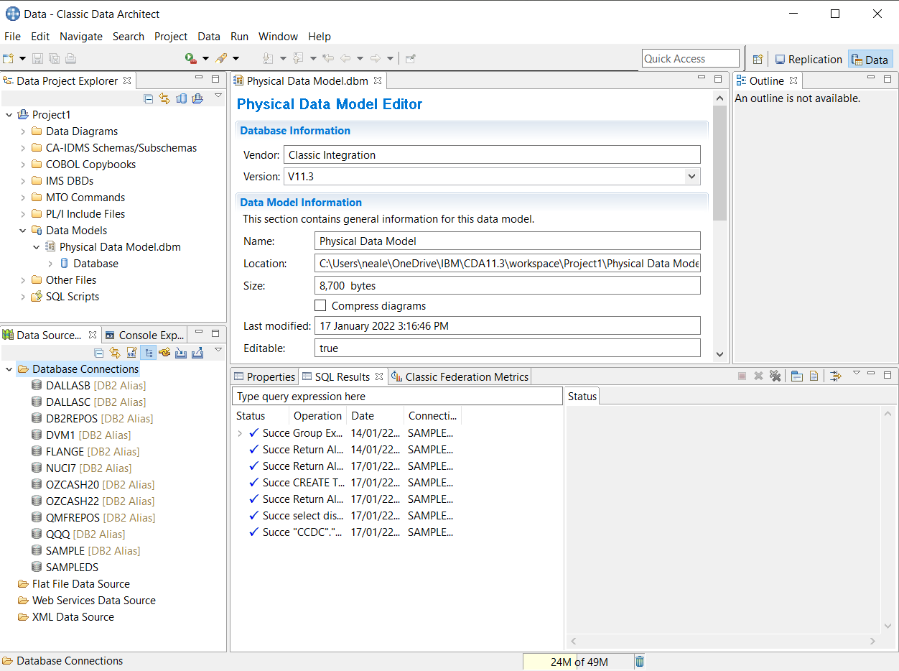
 
In order to make a connection to the Classic CDC Server you must open up the "Data Source Explorer" 
(bottom left window in the Data Perspective), right click on "Database Connections" and choose "New". 
Then fill in the connection details ( 192.168.1.191:9088 IBMUSER/SYS1 ), test the connection and press OK.

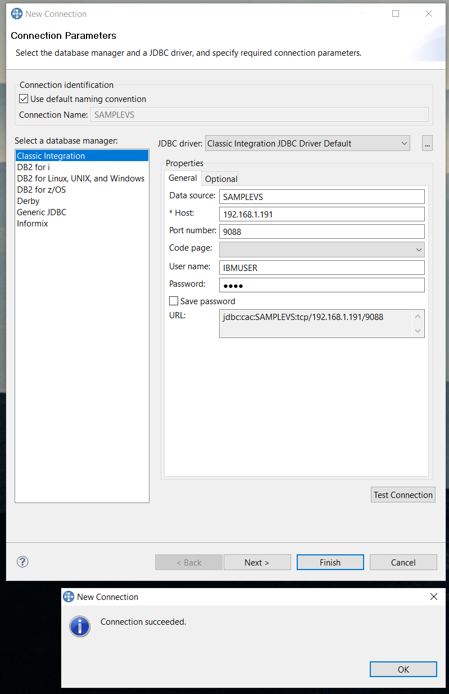

You must also repeat this process to define a connection on the "Console Explorer" window. Defining a connection in one window does 
not copy that connection to the other window. 

If the connection fails, the most likely cause is a firewall. Once you have eliminated firewalls, 
check in the Classic CDC started task output for correction errors. 

Once connected, you can expand the "SAMPLEDS" datasource and explore the schemas, and the table objects within the schemas. 
Initially, the Catalog Tables will be visible under schemas "SYSIBM" and "SYSCAC". When you have developed some IMS Tables" 
they will be visible under the schema that they were created in. 

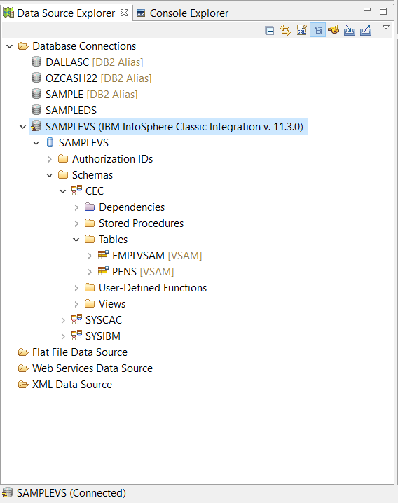


Click on the Console explorer tab now, and expand the Services and Configuration Tabs. 
If you select a configuration (such as the VSAM Log Reader Service configuration) and edit the properties, you can make parameter changes here. 


<h4>7.2.2 Create a data development project, and Import DBDs and Copybooks for the mapping work</h4>

Having configured CDA to operate with the Classic CDC server, the next task is to define an IMS Table. 
This is a multi-step graphical dialog, that enables you to use DBDs and Copybooks to create a relational 
projection of data slices from the IMS hierarchical database. 

Go to the "Data Project Explorer" (top left window) and create a new project, such as "Zeditor"

The steps you need to follow are described in the list below, and illustrated in the slideshow below that. 

1. Create a Data Development Project.
2. Create a physical data model (Classic Integration) within that project.
3. Import the VSAM Copybooks that describe the VSAM dataset.
4. Create a VSAM Table mapping based on the imported Copybooks.
5. Generate DDL to create that VSAM Table definition.
6. Execute the DDL against the target Classic CDC server.
7. Verify the generated object


Scroll through the screenshots below to following the GUI dialog to Define and Verify a VSAM Table.

Screenshot 1 of 15 : Create a new Data Design Project 


Screenshot 2 of 15 :  Call it CDCVSAM
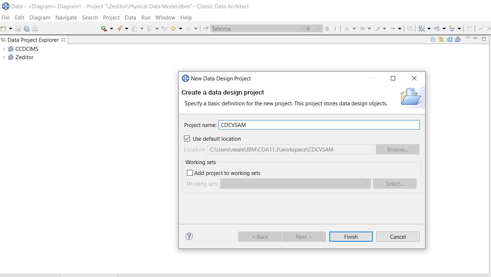

Screenshot 3 of 15 :  Inside the project, create a new physical data model
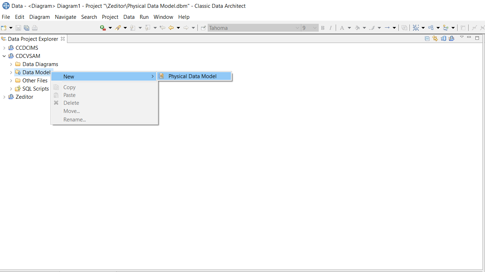

Screenshot 4 of 15 :  Use the Classic Integration template for this data model
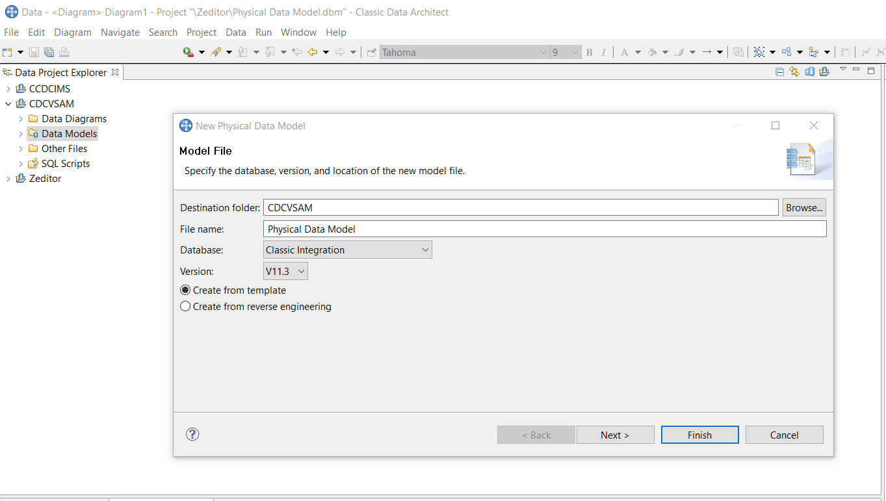


Screenshot 5 of 15 :  Import copybooks
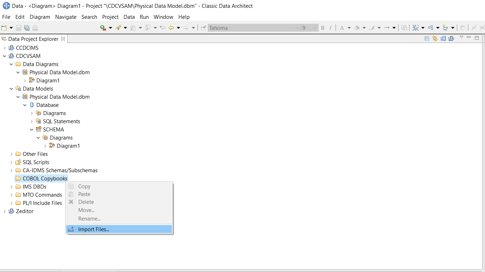

Screenshot 6 of 15 :  Import from either 3270 or local PC files
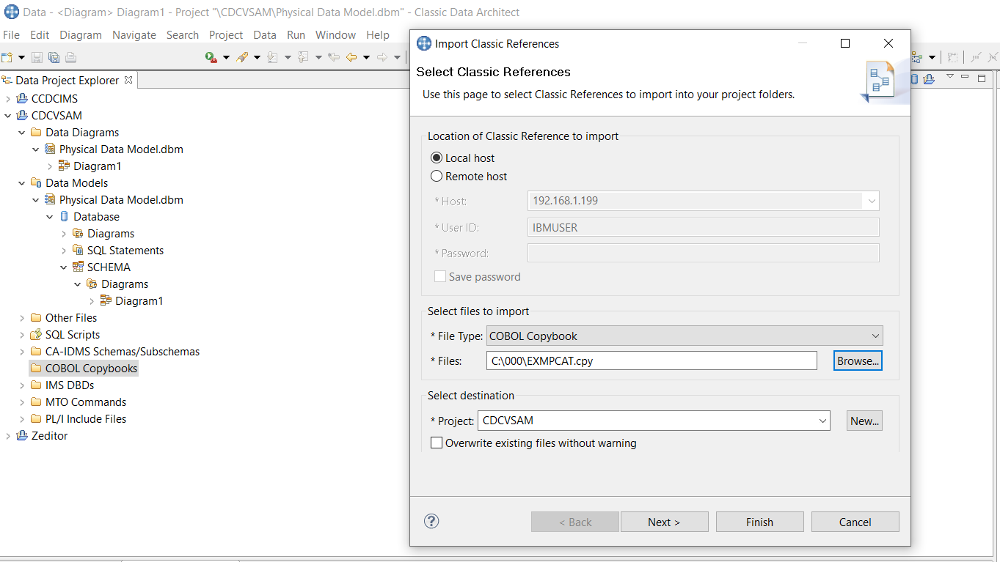

Screenshot 7 of 15 :  View the object and Finish
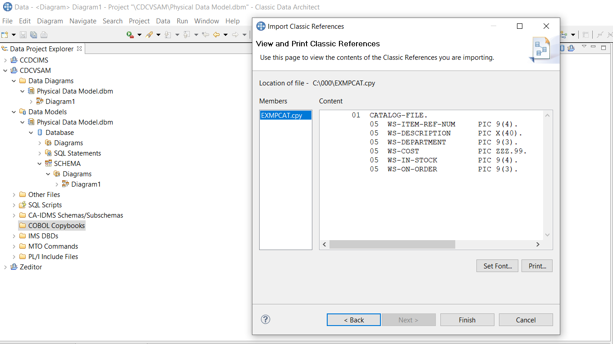


Screenshot 8 of 15 :  Add a Classic Object: A VSAM Table
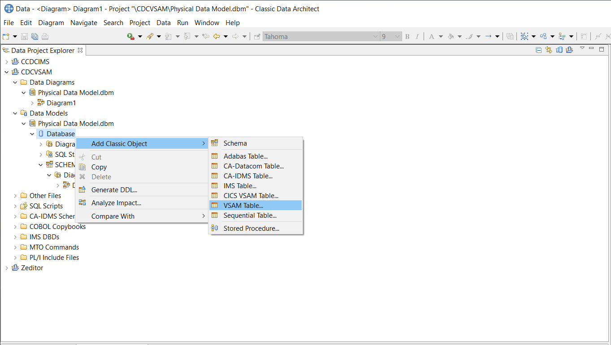

Screenshot 9 of 15 :  Specify copybook, table schema and table usage
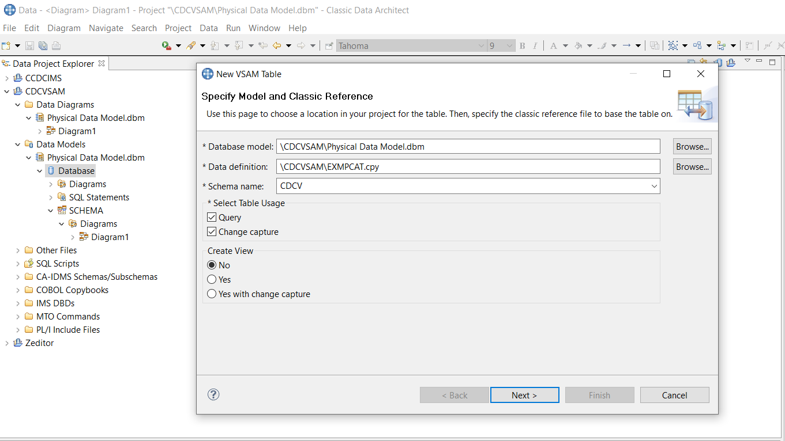

Screenshot 10 of 15 :  Identify the VSAM dataset, and name the table to be created
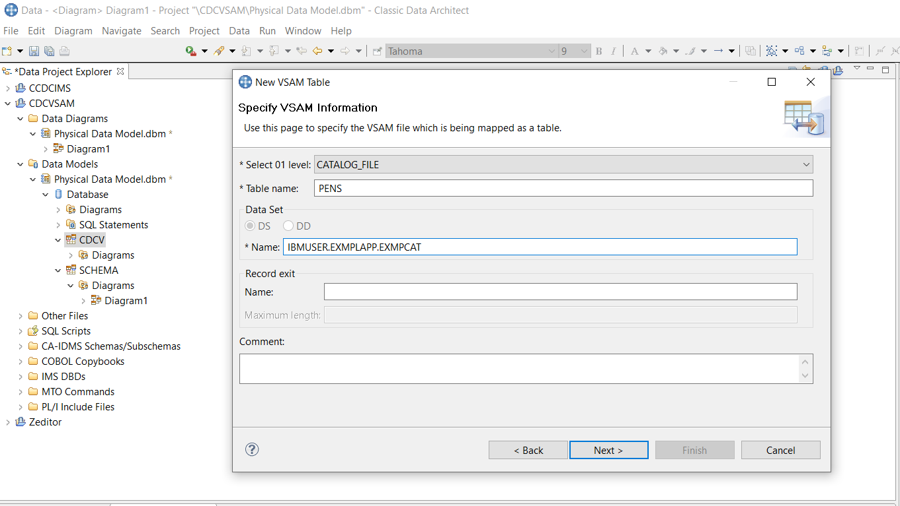

Screenshot 11 of 15 :  Choose the fields to map from the copybook


Screenshot 12 of 15 :  Review the field and datatype mappings
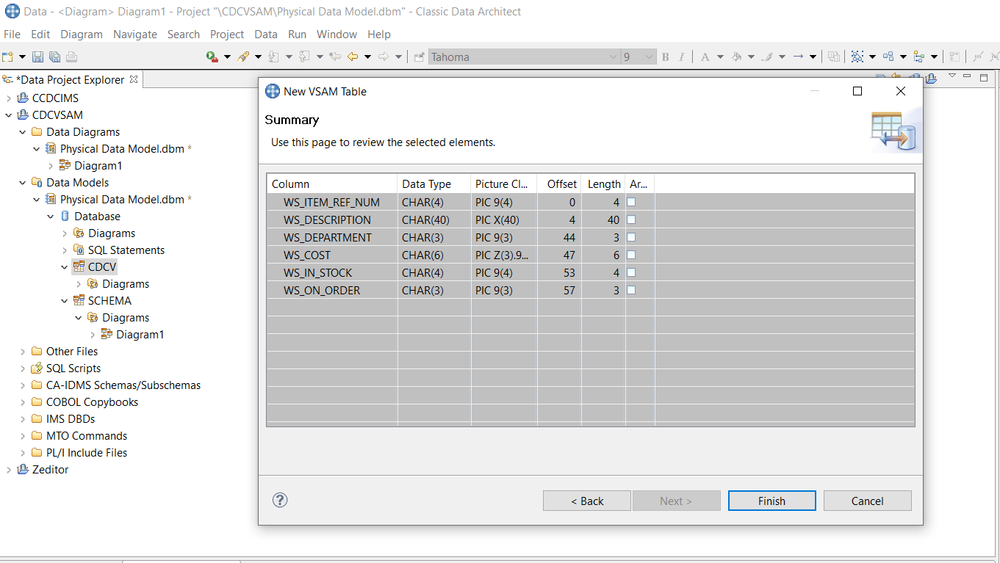

Screenshot 13 of 15 :  Highlight the modelled table, right mouse click, generate DDL
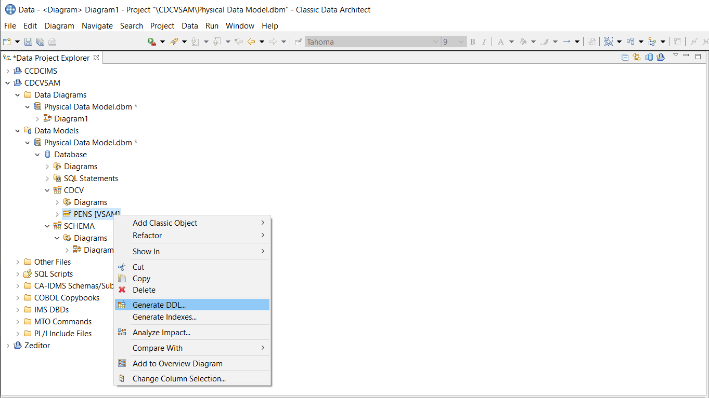

Screenshot 14 of 15 :  Choose the DDL artefacts to generate
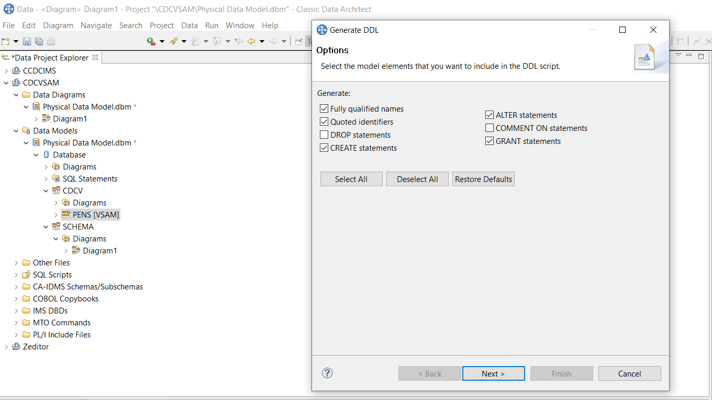

Screenshot 15 of 15 :  Review DDL, and tick to execute DDL on Classic CDC Server
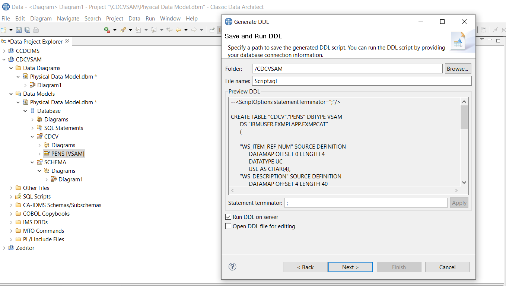


  
<br>

<h4>7.2.3 Test the validity of the IMS Table Mapping using SQL through the CDA</h4>
<p>Once you have deployed the IMS Table to the Classic CDC Server, you should validate that the table mapping is correct. 
The simplest way to do this is to run an SQL query against the mapped IMS Table. 
Right Click on the Table, and either "return all rows" or choose "sample contents" to eyeball the data for validity</p>
<center></center> 

<p>You can dig deeper into data validation with more probing SQL through the Classic Data Architect. 
Just click the SQL icon in the Data Source Exporer window (bottom-right) and SQL away.</p>

<p>Be mindful of the fact that many test VSAM systems have "dirty data". 
If this is true for your environment, you can overcome dirty data with some forgiving Classic CDC parameters. 
However, at some point before deploying to production, you must take responsibility for validating the data and the accuracy of the mapping.</p>

<p>The "forgiving" Classic CDC parameters that are available to you are as follows</p>

 <table>
  <tr>
    <td width=300>Parameter</td>
    <td width=500>Purpose</td>
  </tr> 
  <tr>
    <td>DATACONVERRACT</td>
    <td>1 will convert invalid numeric data to -9s for query actions</td>
  </tr> 
  <tr>
    <td>DATAVALIDATEACT</td>
    <td>1 will convert invalid numeric data to -9s for change data capture actions</td>
  </tr>   
  <tr>
    <td>CSDATAVALIDATEAC</td>
    <td>1 will convert invalid numeric data to -9s for change data capture actions</td>
  </tr> 
</table> 


<p>Deploying the VSAM Table <b>(with Change Capture Table Usage)</b> makes it visible to the CDC Management Console and Access Server 
when they connect to the Classic CDC Server</p>

<h3 id="7.3">7.3 Connect from Management Console to Classic CDC Started Task</h3>
<p>This document is primarily concerned with everything that needs to be done to establish Classic CDC for VSAM as a CDC source.</p>
<p>Using the the CDC administration tools is now a standard CDC task which is covered in 
the <a href="/recipes/docs/NA_CDC/cdcu2.html">Devops Options for CDC.</a> paper.</p>


<h3 id="7.4">7.4 Use CHCCLP Scripting for z/OS</h3>
<p>CDC Replication is traditionally a Windows-centric environment for operations and control, but it also has advanced scripting capabilities for automation.</p>
<p>The CDC Management Console is a comprehensive GUI that addresses all parts of the devops 
lifecycle ( access control, definition, operations, monitoring ).</p>
<p>The CHCCLP Scripting tools offer automated devops controls using scripts. These can be executed from the Windows-based 
Management Console, or from the Access Server on Windows or Linux. 
The CHCCLP scripting option will be attractive to all shops that wish to implement strong devops governance and control to their 
CDC replication environments. Shops with a z/OS operation bridge should know that the CHCCLP scripting environment can also be deployed 
inside z/OS, either from unix system services (USS) or from JCL (using the java batch scheduler).<p>
<p>All of these devops options are covered in the the <a href="/recipes/docs/NA_CDC/cdcu2.html">Devops Options for CDC.</a> paper 
and <a href="/recipes/docs/NA_CDC/cdcu3.html">CHCCLP Scripting.</a> paper in this series of articles.</p>

<h3 id="7.5">7.5 Conforming to site standards for cross-platform devops and security.</h3> 
<p>So far, this document has been primarily concerned with the mechanics of making CDC operate from VSAM to any number of heterogeneous targets. 
It may be hard to believe, but that was the easy part!</p>
<p>The author has worked with several mainframe customers deploying CDC for VSAM to feed a stream of changes to midrange and Cloud targets. 
The challenges to overcome will include...</p>
<ul>
<li>different development and operational teams supporting the capture and apply services
<li>co-ordinating devops tasks between cross-platform teams
<li>change control procedures
<li>implementing TLS encryption between the application-transparent z/OS platform and application-controlled LUW platforms
</ul>
<p>A good approach is to start by considering the non-functional requriements for the business service that CDC will support. If the business 
requires a high level of service ( low latency, stringent monitoring and alerting, minimal downtime, fast recovery from outages etc... ) then
an operational support model can be developed to meet those requirements.</p>

<p>Once the required service levels are defined, that is a useful reference point for assessing whether the opertional 
management controls and interfaces between different operations teams can satisfy those service levels</p>
<p>In some cases, the co-operation between different operational teams can be adjusted to satisfy the required service levels</p>
<p>In other cases, it may be helpful to use technology options to shift the CDC operations entirely to mainframe, or entirely to non-mainframe. 
This case be done by selecting different CDC agents in many cases, as follows</p>
<ul>
<li>If a Windows/Linux operations hub is desired, then there are remote capture agent options for VSAM and DB2 z/OS.
<li>If a z/OS operations hub is desired, then the Linux-based CDC agents can be deployed as software containers inside z/OS Container Extensions
</ul>
<p>Please be aware of the flexible CDC deployment options that exist, and take an early view on what choices may provide the best 
devops lifecycle proposition for your organisation.</p>

<p>This series of articles includes a heavy focus of worked deployment examples, but the articles in the "Using CDC" column do aim 
to address the practical devops challenges with recommendations on how to address common challenges.</p>


<br><hr>

<h2 id="App">Appendix</h2>
<p>placeholder</p>


<!-- End of Page Content   -->

	<div class="w3-center w3-dark-grey" style="max-width:1100px;margin-top:80px;margin-bottom:80px">
	<p>copyright &copy; zeditor.org</p>
    </div>
	
</div>
	
<script>
// Slideshow
var slideIndex = 1;
showDivs(slideIndex);

function plusDivs(n) {
  showDivs(slideIndex += n);
}

function currentDiv(n) {
  showDivs(slideIndex = n);
}

function showDivs(n) {
  var i;
  var x = document.getElementsByClassName("mySlides");
  var dots = document.getElementsByClassName("demodots");
  if (n > x.length) {slideIndex = 1}    
  if (n < 1) {slideIndex = x.length} ;
  for (i = 0; i < x.length; i++) {
    x[i].style.display = "none";  
  }
  for (i = 0; i < dots.length; i++) {
    dots[i].className = dots[i].className.replace(" w3-white", "");
  }
  x[slideIndex-1].style.display = "block";  
  dots[slideIndex-1].className += " w3-white";
}
</script>
	
</body>
</html>	
	
</body>
</html>
	

