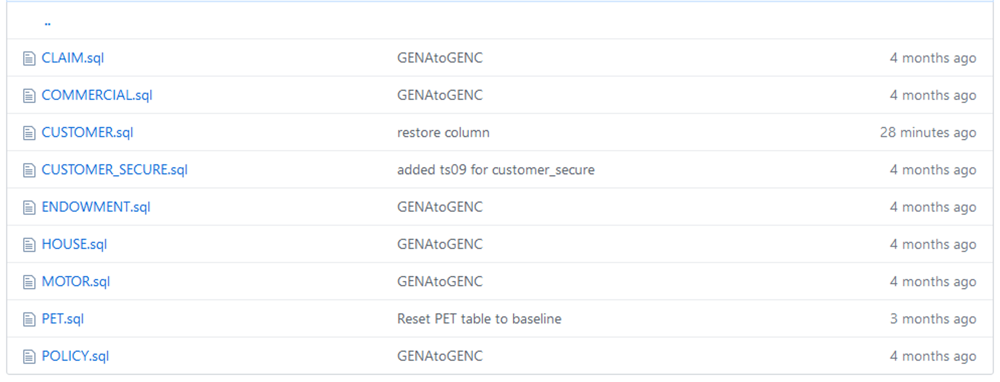

# Code repository organization   
Most organizations have implemented change management processes to ensure that changes to a product or system are introduced in a controlled and coordinated manner. As a best pratice, we recommend using a source control management system to persist and keep track of the changes to all types of artifacts, such as application source code files, data definition language (DDL) files, Jenkins pipeline scripts, environment properties files, and so on, in the change management process. 

A source control management system (SCM) or version control system tracks changes in source code and other files during the software development process. An SCM enables you to retrieve any of the previous versions of the original source code and the changes that were stored. 

There are many SCM systems available today. We chose to use GitHub Enterprise as the SCM in the solution and in the demo described in this document. 

GitHub is based on Git, which is a free and open source distributed version control system designed to track changes in any set of files. It's typically used for coordinating work among programmers who collaboratively develop source code during the software development process. 

GitHub is a provider of Internet hosting for software development and version control. GitHub offers the distributed SCM functionality of Git plus its own features, such as access control and a robust set of collaboration features including bug tracking, feature requests, task management, continuous integration, and wikis for every project. GitHub Enterprise is similar to GitHub but is designed for large-scale projects and is deployed behind a company's firewall.

Although we use GitHub Enterprise, the solution and the demo can be adapted to use any other SCM software. For example, you can use Rational Team Concert (RTC), Subversion, and similar products, or you can use other Git providers, such as GitLab and Bitbucket. The only requirement is that the SCM software that you use must have the interfaces available to integrate with pipeline orchestration so that a code change event triggers the pipeline automation. 

### Treat data object definitions as source code

Data Definition Language (DDL) is a subset of Structured Query Language (SQL). It's a syntax for creating and modifying database objects, such as tables, indexes, views, and so on. DDL statements are similar to a computer programming language for defining data structures, especially database schemas.

When you store DDL statements in the SCM, you can easily track any changes to the data object definitions and manage the changes and different versions or variations in the deployment process, just as you might do for the source code of other programming languages. 

If your organization hasn't done so already, we strongly suggest that you start to persist your database schemas in the SCM. 

### Design your code repository structure
When you design your code repository structure, you typically need to consider the programming languages, frameworks, deployment needs, code separation, ownership/responsibilities, and potentially many other factors based on the needs of your organization. You could choose to keep everything in a single repository or in multiple repositories based on your organization's situation.

For the purposes of this document, we chose to keep the database schema or DDL statements, deployment pipeline, configuration files, and the application source code in a single repository. However, the solution and demo in this document can be adapted to use a multiple-repository structure, such as storing the database schema in one repository and the application source code in another repository. To adapt the solution to work with multiple repositories, you need to customize the Jenkins pipeline to monitor and extract the artifacts from different repositories.

#### Overall repository structure
The following figure illustrates the code repository structure to store the artifacts that are used in the demo in this document. As you can see, all artifacts are structured in folders: the Jenkins pipeline scripts file is stored in the **`Jenkins`** folder, the API artifacts in the **`api`** folder, and so on.

  

#### Db2 schema structure
The database schema is stored in the **`db2`** folder, which contains a few subfolders for the different types of data objects, as shown in the following figure. For example, **`TB`** contains the DDL statements for the tables, **`SP`** contains the DDL statements for the stored procedures, **`IX`** contains the DDL statements for the indexes, and so on.

  

Each table definition is stored in one .sql file in the **`TB`** subfolder, as shown in the following figure. The same approach applies to other types of data objects. 

Although you can store all of your data definitions for all data objects in one big DDL file, we recommend organizing the definitions at the data object level. This approach makes it easier to change the definition for a small number of data objects because you don't need to open and edit a huge DDL file, and it helps eliminate potential merge conflicts when multiple people need to modify the definitions for different objects.

  

#### Application code structure
The application code (COBOL files in this case) is stored in the **`base/src`** folder, which contains a few subfolders to store files that are related to each other. For example, **`cobol`** contains all COBOL source code files, **`copy`** contains all COBOL copybook files, **`testcases`** contains test case files, and so on.

  

The samples in this chapter provide you with an example of how different types of artifacts are organized in the repository; however, you can and should design the structure based on your specific situation and future plans. After you settle on the structure, branching strategy, and continuous integration / continuous deployment process, you can start to build your pipeline accordingly. See [Chapter 7](C007_jenkins_overall.md) for more details about setting up a pipeline.
