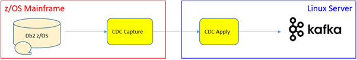

[Back to README.md and Table of Contents.](README.md)

# Setting Up CDC for Kafka in z/OS Container Extensions (zCX) - Worked Example
This chapter is a worked example of setting up CDC for Kafka inside a zCX container.

* The primary focus of this article is the zCX deployment of a CDC agent. (the example is CDC for Kafka, but it could be any CDC agent). 
* Please review [7. Setting up CDC for Kafka.](C007_kafka.md) for an article that is more focussed Kafka as a CDC agent.

## Contents

<ul class="toc_list">
<li><a href="#abstract">Abstract</a>   
<li><a href="#1.0">1 Why Deploy CDC as a z/OS Container ?</a>
<ul>
  <li><a href="#1.1">1.1 Traditional benefits of containers</a></li>
  <li><a href="#1.2">1.2 Choice of Operational Platform for CDC</a></li>
</ul>
<li><a href="#2.0">2. Benefits of deploying CDC agents as zCX Containers.</a> 
<ul>
  <li><a href="#2.1">2.1 Simpler, Faster Deployment.</a></li>
  <li><a href="#2.2">2.2 A single operations team to run the entire CDC solution.</a></li> 
  <li><a href="#2.3">2.3 A Better Physical Recovery Solution.</a></li>
  <li><a href="#2.4">2.4 Faster, Lower Risk Software Upgrades.</a></li>
  <li><a href="#2.5">2.5 Inherit z/OS Qualities of Service.</a></li> 
  <li><a href="#2.6">2.6 Inherit z/OS Security Strengths.</a></li>
</ul>
<li><a href="#3.0">z/OS Container Extensions (zCX).</a> 
<ul>
  <li><a href="#3.1">3.1 zCX Concepts.</a></li>
  <li><a href="#3.2">3.2 zCX Setup.</a></li>
</ul>
<li><a href="#4.0">4. Worked Example: CDC for Kafka in zCX.</a>
<ul>
  <li><a href="#4.1">4.1 Creating the CDC Docker Container.</a></li>
  <li><a href="#4.2">4.2 Operating the CDC Docker Container.</a></li>
  <li><a href="#4.3">4.3 Configuring the CDC instance.</a></li>
  <li><a href="#4.4">4.4 Integration with z/OS Operations.</a></li>  
</ul> 
<li><a href="#5.0">5. Docker Build</a>
<ul>
  <li><a href="#5.1">5.1 Dockerfile Listing</a></li>
  <li><a href="#5.2">5.2 Docker build Output</a></li>
</ul>
</ul>


<br><hr>
 
 
<h2 id="abstract"> Abstract</h2>
This document is a basic worked example of setting up CDC for Kafka inside a zCX container. Please bear in mind the following:
       
	   
* IBM CDC software is shipped with installer programs to perform installations on Linux, Unix and Windows platforms.
* IBM CDC software is supported whether installed to a native Operating System, a Virtual Machine, or a Software Container.
* IBM does not provide container images with CDC software: it is a user responsibility to build the software container from the installer programs. 

The approach adopted in this paper is a worked example. Other methods may vary from the details presented here.

It is part of a series of documents providing practical worked examples and 
guidance for seting up CDC Replication between mainframe data sources and mid-range or Cloud targets.
The complete set of articles can be accessed using the README link at the very top of this page. 

<br><hr>

<h2 id="1.0">1. Why Deploy CDC as a z/OS Container ?</h2>

CDC Data Replication is based on a Capture Agent running on (or close to) a Source Datastore, and an Apply Agent running on (or close to) a Target Datastore. 
One of the most common scenarios is a capture agent for a z/OS datastore like IMS or Db2 z/OS and an Apply agent on a midrange or cloud target like Kafka.



Recently, IBM has released a couple of remote CDC agents for z/OS data sources. This allows the capture agent to run on linux, and make calls to a lightweight log reader service that still runs on the mainframe. 
The remote capture agent for Db2 z/OS actually calls a stored procedure that calls the Db2 log API and returns the filtered log records to the Capture program to process them, as illustrated below:


The sales messaging for the remote capture agents tends to focus on the CPU offload from the mainframe. 
In practice you are likely to save only 50% of the CPU compared to a local agent, because the log reading is the most expensive part, and that isn't zIIP eligible. 

The opinion of the author us that the primary benefit of using a remote capture agent is for linux sites to manage all their CDC operations on Linux. 
In some sites it can be challenging to get the mainframe and linux operations teams to collaborate well, both practically and culturally!

The advent of containers presents yet more options for operational deploymemt. 
You might deploy some of these CDC agents in containers in order to move the CDC solution into a cloud-provisioned world either on private or public cloud. 
But container technology can also move the ball to the other end of the pitch, as shown below.


Containers provide deployment and operational flexibility. z/OS Container Extensions (zCX) allows docker containers to run inside z/OS, and to execute on zIIP processors (that do not attract software consumption charges). 
Deploying CDC agents within z/OS offers the option for z/OS centric sites to run CDC linux agents inside z/OS and take advantage of z/OS robustness, z/OS operations, z/OS high availability, and z/OS system automation!
The purpose of this document to examine the merits of the z/CX option, and provide a worked example of how to do it. 

<br><hr>

<h2 id="2.0">2. The Benefits of deploying CDC agents as zCX Containers.</h2>

Software containers can offer many benefits over traditional software installations, potentially including

1. less overhead
2. increase portability
3. more consistent operation 
4. simple and efficient devops

The specific benefits of deploying a CDC agent as a zCX container would include the following 


<h3 id="2.1">2.1 Simpler, Faster Deployment.</h3>

Software containers are designed for point and shoot provisioning. 
This is a benefit that you will realise for software containers on any platform. z/OS doesn't miss out.


<h3 id="2.2">2.2 A single operations team to run the entire CDC solution.</h3>


The author of this document has worked with many organisations who implement data replication solutions between mainframe and midrange platforms like Linux. It is the norm that

1. z/OS and midrange systems are managed by different operation teams
2. z/OS and midrange operations team will use different tools and different procedures.
3. Even if there is complete goodwill and commitment from both teams to work together there will be difficulties in managing a service that spans two operations teams.

One anonymous example is that it was designated that the mainframe team had operational responsibility for the CDC service, 
but they were not allowed to have read access to the CDC log directory on the CDC for Linux Apply Server. 
As a generalisation with CDC, if a simple restart doesn't fix a problem, then the critical problem determination information will probably reside in the apply log file on the target side. 
The consequence of this decision is elongated restart times.


Of course, if the Apply agent runs as a container within zCX, then the mainframe operations team will be able to access the Apply log themselves without queueing to speak with a help desk that fronts the Linux operations team.

<h3 id="2.3">2.3 A Better Physical Recovery Solution.</h3>

Any given group of CDC subscriptions can only be operated by one capture and one apply agent at once. 
In fact, CDC has serialization checks to ensure you don't accidentally breach this data integrity matter. 
A consequence of this architectural model is that high availability configurations for CDC are based on the cluster failover model.
There are several OS clustering solutions on the market for Linux. 
But none of them come close to the speed and sophistication of system automation for restarting address spaces elsewhere in a z/OS parallel sysplex. 
The zCX address space can be configured with a DVIPA so that it can be automatically restarted on another LPAR in the event of a failure. 
This puts CDC Apply agents on the same level as z/OS started tasks like Classic CDC for IMS.


<h3 id="2.4">2.4 Faster, Lower Risk Software Upgrades.</h3>

If you deploy CDC for Linux on a Linux Server, then a software upgrade will require the service to be stopped, a software upgrade to be applied (a few minutes) and 
a degree of risk the the upgraded software may have problems and require a fallback procedure.

When CDC is deployed as a software container, it can be deployed and tested inside the same zCX address space as the live service. 
Once testing is complete, you can stop the old container, attach the shared volume with the CDC instance information to the new container, and start the subscriptions over there. 
If problems occur, just reverse the process to fallback to the old container.


<h3 id="2.5">2.5 Inherit z/OS Qualities of Service.</h3>

z/OS qualities of service are exceedingly high. (reliability, robustness, performance, automated local failover, GDPS disaster recovery etc...)

Deploying CDC inside z/OS as a docker contain is an easy way to achieve z/OS qualities of service for very little effort. 
The main effort will be to establish zCX as another well-managed z/OS started task, with all the standard z/OS operational practices.

<h3 id="2.6">2.6 Inherit z/OS Security Strengths.</h3>


Operating CDC Apply engines inside zCX places them inside the IBM Z protected shell. This includes a range of heightened security provisions including

* Pervasive encryption of all datasets
* In-memory networks ( hipersockets ) that can't be snooped on
* EAL5 certified LPAR security

<br><hr>

<h2 id="3.0">3. z/OS Container Extensions (zCX).</h2>


z/OS Container Extensions, is essentially a framework for supporting docker within z/OS. 
If you know docker on Linux, Unix, Windows or Mac, then you know docker on z/OS.
The primary scope of this document is deploying CDC inside zCX. 
If you want to read more about zCX then please review some other source of zCX information, including the following Redbooks.

Getting started with z/OS Container Extensions and Docker
https://www.redbooks.ibm.com/abstracts/sg248457.html

IBM z/OS Container Extensions (zCX) Use Cases
https://www.redbooks.ibm.com/abstracts/sg248471.html

<h3 id="3.1">3.1 zCX Concepts.</h3>


zCX Support docker containers. Docker containers are more efficient than virtual machines in that rather than having multiple instances of the guest operating system, 
you only have one OS kernel (linux based) which is referenced by all the running docker containers. 
It is also operationally simpler in that the OS kernel is largely hidden from the containers, and you only need to deal with the containerised application.


When Docker containers are deployed inside a zCX address space, they are tightly integrated with the z/OS software and IBM Z hardware environment. For example 


* They use a Dynamic Virtual IP Address for communications with other address space and with the outside word. 
* TCPIP connectivity inside z/OS with other z/OS subsystems can use in-memory links (hipersockets).
* System Automation for zCX Address Space(s) can automatically restart zCX services on different LPARs, and retain the same TPCIP and Disk connections.
* z/OS storage subsystems can provide Hyperswap for local failovers and GDPS for geographically remote failovers.


<h3 id="3.2">3.2 zCX Setup.</h3>


Chapter 4 of "Getting started with z/OS Container Extensions and Docker" is the best guide to installing and confguring zCX. 
I am not going to repeat that information here. Please review the redbook to learn how to setup zCX.

https://www.redbooks.ibm.com/abstracts/sg248457.html
Table of contents
* Chapter 1. Introduction
* Chapter 2. z/OS Container Extensions planning
* Chapter 3. Security - Overview
* Chapter 4. Provisioning and managing your first z/OS Container
* Chapter 5. Your first running Docker container in zCX
* Chapter 6. Private registry implementation
* Chapter 7. Operation
* Chapter 8. Integrating container applications with other processes on z/OS
* Chapter 9. zCX user administration
* Chapter 10. Persistent data
* Chapter 11. Swarm on zCX

Chapter 5 addresses deploying docker containers within zCX.

Chapter 7 addresses the operation of docker containers within zCX.

<br><hr>

<h2 id="4.0">4. Worked Example: CDC for Kafka in zCX.</h2>


Having explained why you might want to consider deploying CDC agents inside zCX, the remainder of this document is a simple worked example.
The scenario implemented is to capture from IMS and apply to Kafka. Classic CDC for IMS is the capture agent. CDC for Kafka for linux on z390 is the Apply agent.


Note: we cannot containerise linux for Intel or linux for Power software for zCX. 
We must use software that is compiled for z390 because that is the runtime hardware platform. 
This is not a great restriction as many linux software products are compiled for s390 as well as other platforms.

<h3 id="4.1">4.1 Creating the CDC Docker Container.</h3>


There are a great many docker containers that are pre-built for s390, and ready to deploy in zCX. 
Pop over to docker hub and browse the containers that you can pull on demand. 
Filter by s390 platform to see which of them are available for Z.
https://hub.docker.com/ 

CDC software is not actually shipped as a Docker container. 
That's not a problem because you can build your own container with a "Dockerfile". 
A dockerfile is a set of instructions to build a container from a software image. 
You can download a dockerfile for CDC for Kafka at the following IBM github repository.
https://github.ibm.com/replication/cdc-luw-docker/tree/master/cdckafka 

That dockerfile was actually written for CDC for Kafka on Intel. 
However, if you change the name of the CDC installer binary to the s390 version, the dockerfile runs perfectly in zCX ! 
That's an experience which demonstrates that docker is docker even on Z.
The dockerfile source code is pasted into the Appendex for review. 
The only difference to deploy to zCX is to reference setup-iidr-11.4.0.0-5001-linux-s390.bin. 
But even that doesn't require a dockerfile change, because the installer image is named as an input parameter to the dockerbuild command.

<b>Step 1 : Assume ZCX environment is Established</b>

* My ZCX is running at IP Address 192.168.1.220
* My ZCX is listening on port 8022
* My zCX has connectivity to the internet, needed to pull packages from repositories


<b>Step 2 : Verify Docker with hello world.</b>

ssh into the zCX shell and issue docker run hello-world


<b>Step 3 : Create a directory to gather everything you need to run the dockerfile</b>  

```
mkdir /home/admin/cdckafka
cd /home/admin/cdckafka
```

This is where you will gather the artefacts to build the docker container

<b>Step 4 : Gather the following 4 files</b> 

* The Dockerfile
* The response file for a silent install of CDC for Kafka for Linux on Z
* The kafkaproducer.properties file ( to save editing it after the install )
* The installer binary.


<b>Step 5 : Invoke the Docker build process</b> 

Run the following command from /home/admin/cdckafka

```
docker build --build-arg CDCINSF=setup-iidr-11.4.0.0-5001-linux-s390.bin -t zcdckafka .
```

That's it. The docker build runs in a few minutes on my ZD&T environment. 
It should run in seconds on a real Z system. I attach screenshots of the docker build output in the appendix.

<h3 id="4.2">4.2 Operating the CDC Docker Container.</h3>

  
Before we start the container, we want to add a docker volume. This is not strictly necessary for CDC for Kafka since the container is persisted. 
However by placing the instance metadata (bookmark etc� ) on a shared docker volume, you have flexibility for things like fast low-risk software upgrades.
Standard docker commands to create a docker volume.


Now you can start the container, referencing the shared volume and it�s mountpoint within the container. You also need to surface the listener port 11701 outside the zCX DVIPA.

```
docker run -idt -v cdcvol:/cdcinstance/ -p 11701:11701 zcdckafka 
```

Remember the difference between docker run and docker start 


* Docker run will create an instance and start it.
* Docker start will restart a previously created container instance, with all the metadata that you want to keep.

After you start the container, run ```docker ps -a``` to discover the container ID.


Now connect to that container and start a bash shell

```
docker exec -it 733de0daa126 /bin/bash 
```

<h3 id="4.3">4.3 Configuring the CDC instance.</h3>


  
From here on in, it's no different from running CDC in Linux. Create an instance as normal.
From /opt/cdckafka/bin
issue ```./dmconfigurets```


And then start the instance
cd /opt/cdckafka/bin 

```
./dmts64 -I zcxcdckafka &
```

Now you can point all your normal CDC Administration Tools ( Management Console, Access Server, CHCCLP for linux, CHCCLP for z/OS ) at the CDC instance on 192.168.1.220:11701

<b>Reminder:</b> This worked example is primarily focussed on deploying a CDC agent in zCX. Please review [7. Setting up CDC for Kafka.](C007_kafka.md) if you need more detailed 
discussion on the CDC for Kafka agent and it's connection to Kafka.

Creating and Operating CDC subscriptions via CDC for Kafka in zCX is no different from any other supported CDC platform.

IBM provides support (i.e. accept/work support tickets) for our CDC software, whether it is running on bare metal, VMs, or in a container.

IBM provides our customers with a sample set of instructions on how to create docker images for our CDC software. 
The customer is free to use those sample instructions, or create their own docker images as they choose. 
Our support will be limited to our CDC software that runs in the container or on the VM

<h3 id="4.4">4.4 Integration with z/OS Operations.</h3>

  
The steps we went through to get into the docker container within zCX first time around were not as simple as you would want for an agile Devops environment. 
No problem : we can feed commands into the docker container from outside.

For example, from the zCX shell you can invoke the command to start the CDC instance as follows, without needing to open a bash shell inside the CDC container.

```
docker exec -it <containerId> /opt/cdckafka/bin/dbts64 -I cdc5569
```

And if you want to wrap it in standard JCL, just place your docker commands in a file and invoke them from BPXBATCH

```
//DEFACL   EXEC PGM=IKJEFT01                        
//SYSPRINT DD SYSOUT=*                              
//SYSUDUMP DD SYSOUT=*                              
//SYSTSPRT DD SYSOUT=*                              
//STDOUT DD SYSOUT=*                                
//STDERR DD SYSOUT=*                                
//SYSTSIN DD *                                      
    BPXBATCH SH +                                   
    ssh admin@<zcxIPaddr> -p 8022 < zcxCmds.sh 
```

Easy As !

Running CDC agents inside zCX would be a great option if you seek the qualities of service provided by z/OS, have some zIIP processor capacity, 
and want to take advantage of z/OS operational practices and platform capabilities.

<br><hr>

<h2 id="5.0">5. Docker Build.</h2>

Having read how to setup CDC for Kafka in zCX, the remainder of this paper is sourcecode and screenshots of doing it.

<h3 id="5.1">5.1 Dockerfile Listing.</h3>

The code sample below is the actual dockerfile listing used in this example.

```

FROM registry.access.redhat.com/ubi7/ubi:latest

ARG CDCINSF

# check if CDCINSF build argument is set and exit if not

RUN if [ -z $CDCINSF ] ; then printf "\033[32m" ; echo -e "\n\nMandatory argument CDCINSF not set! \n\nARGUMENT: \n CDCINSF - cdc installer name eg. setup-iidr-11.4.0.2-5512-linux-x86.bin \n To be provided from the command line (docker build --build-arg CDCINSF=setup-iidr-11.4.0.2-5512-linux-x86.bin)\n\n"; printf "\033[39m" ; exit 1 ; else : ; fi

ARG RFILE=cdckafka.rfile

RUN printf "\033[32m" ; echo -e "\n\nARGUMENT:\n RFILE - CDC installer response file name\n\n" ; printf "\033[39m"

ARG EXP_PORT=11701

RUN printf "\033[32m" ; echo -e "\n\nARGUMENT:\n CDC instance port to be exposed. By default 11701\n\n" ; printf "\033[39m"

ARG IMAGE_DISPLAY_NAME="Docker image with CDC Replication Engine"

ARG IMAGE_DESCRIPTION="This image runs IBM InfoSphere Data Replication for Kafka software"

# required by RedHat certification / UBI label overrides

# see https://github.com/projectatomic/ContainerApplicationGenericLabels/blob/master/vendor/redhat/labels.md

LABEL name="cdcforkafka" \

summary="${IMAGE_DISPLAY_NAME}" \

description="${IMAGE_DESCRIPTION}" \

io.k8s.display-name="${IMAGE_DISPLAY_NAME}" \

io.k8s.description="${IMAGE_DESCRIPTION}"

# location of installation and instance directories 

ENV CDC_HOME=/opt/cdckafka

ENV CDC_INSTANCE_PATH=/cdcinstance

# upgrade image and install required packages 

RUN yum -y upgrade

RUN yum -y install unzip wget

# Copying installer and response file

COPY $CDCINSF $RFILE /tmp/

USER root

RUN mkdir -p $CDC_HOME $CDC_INSTANCE_PATH && \

chmod +x /tmp/$CDCINSF 

RUN groupadd -g 1100 cdc \

&& useradd -u 1100 -g 1100 cdc

RUN printf "\033[32m" ; echo -e "\n\nInstalling CDC using silentmode and response file\nInstance directory $CDC_INSTANCE_PATH should be stored on the persistent volume\n\n" ; printf "\033[39m"

WORKDIR /tmp

ADD kafkaproducer.properties /tmp

RUN sed -i -e "s|###CDC_INSTANCE_PATH###|$CDC_INSTANCE_PATH|g" $RFILE && \

sed -i -e "s|###CDC_HOME###|$CDC_HOME|g" $RFILE && \

./$CDCINSF -i silent -f $RFILE && \

cp /tmp/kafkaproducer.properties $CDC_HOME/conf && \

rm -rf $CDCINSF /tmp/$RFILE && \

chown -R cdc:cdc $CDC_HOME $CDC_INSTANCE_PATH

USER cdc

CMD tail -f /dev/null

EXPOSE $EXP_PORT


```

<h3 id="5.2">5.2 Docker build Output.</h3>


The three screenshots below are the output from running the dockerfile above.


