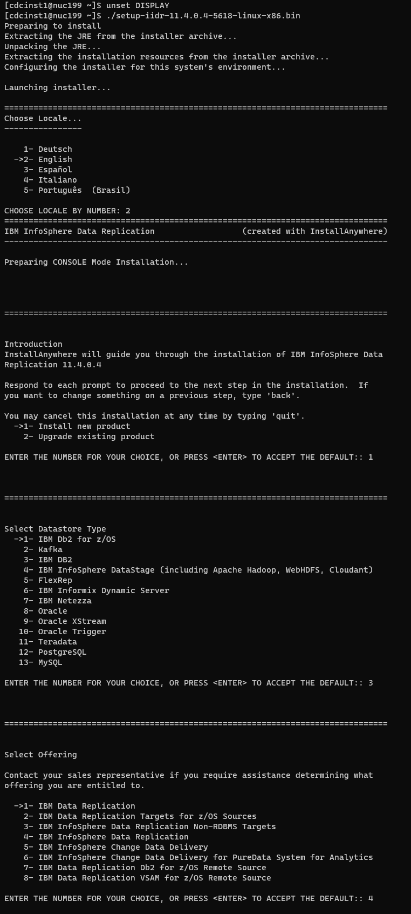
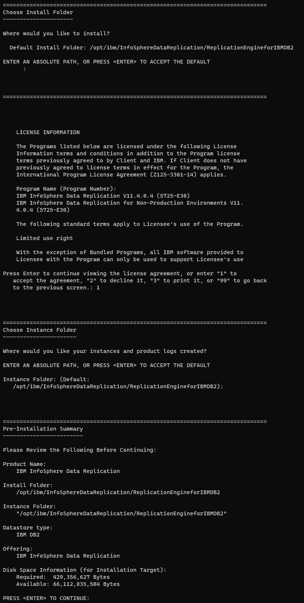
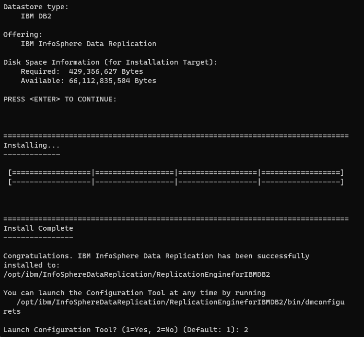
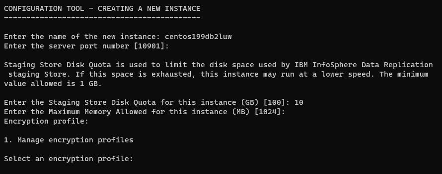
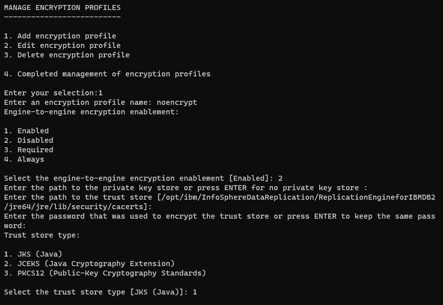
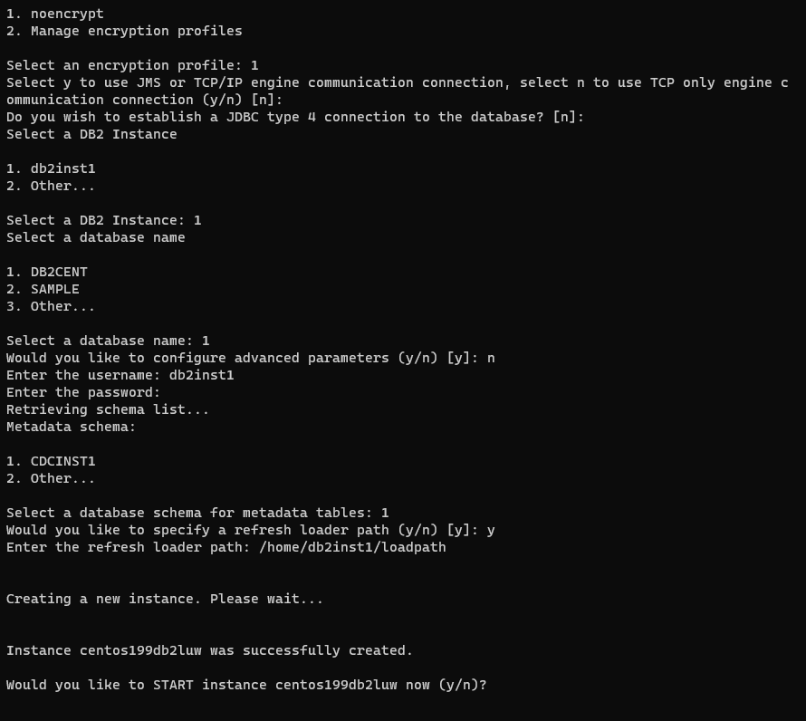
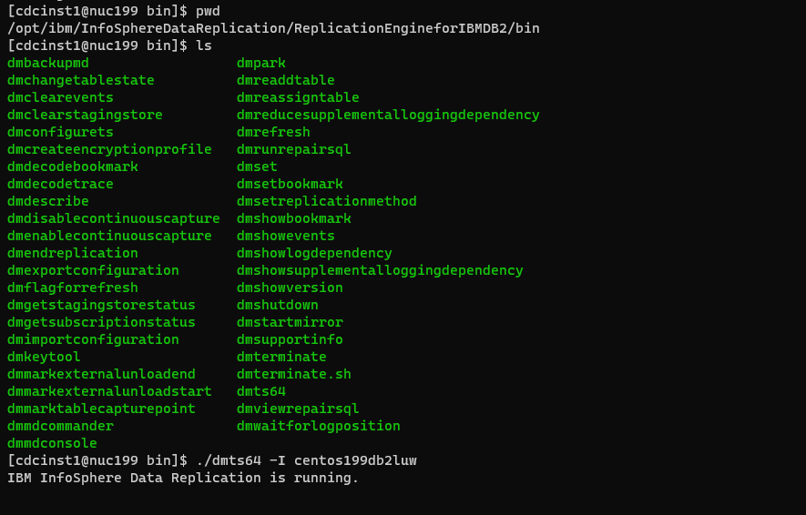
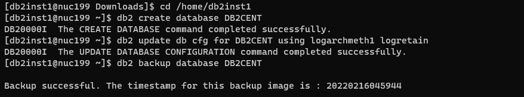

[Back to README.md and Table of Contents.](README.md)

# Setting Up CDC for Db2 Linux - Worked Example
This chapter is a worked example of setting up CDC for Db2 on Linux. 

## Table of Contents

<ul class="toc_list">
<li><a href="#abstract">Abstract</a>   
<li><a href="#1.0">1 Introduction to CDC for Db2 on Linux</a>
<ul>
  <li><a href="#1.1">1.1 Requirements to Replicate Db2 for Linux data</a></li>
</ul>
<li><a href="#2.0">2. High Level Review of Implementation Steps</a>
<li><a href="#3.0">3. Installing CDC for Db2 for Linux</a>
<ul>
  <li><a href="#3.1">3.1 Linux paths and permissions</a></li>
  <li><a href="#3.2">3.2 Install the CDC Agent for Db2 Linux</a></li>
  <li><a href="#3.3">3.3 Create the CDC for Db2 Linux Instance</a></li>
</ul> 

<li><a href="#4.0">4. Configure the Linux Environment</a>
<ul>
  <li><a href="#4.1">4.1 TCPIP Ports</a></li>
  <li><a href="#4.2">4.2 Db2 connection Properties</a></li>
</ul>

<li><a href="#5.0">5. Configure the Db2 Linux Environment</a>
<ul>
  <li><a href="#5.1">5.1 Configure Db2 for archival logging</a></li>
  <li><a href="#5.2">5.2 Alter Source Tables for full row logging</a></li>
  <li><a href="#5.3">5.3 Db2 configuration considerations</a></li>
</ul>


<li><a href="#6.0">6. Integrate with the wider CDC Landscape</a>
<ul>
  <li><a href="#6.1">6.1 Automation of the CDC for Db2 Linux Service</a></li>
  <li><a href="#6.2">6.2 Connect from Management Console to the CDC for Db2 Linux instance</a></li>
  <li><a href="#6.3">6.3 Use CHCCLP Scripting</a></li>  
  <li><a href="#6.4">6.4 Conforming to site standards for cross-platform devops and security</a></li>
</ul> 
</ul>


<br><hr>


<h2 id="abstract"> Abstract</h2>

This document is a basic worked example of setting up CDC for Db2 on Linux. 
 
* It deals with the practical considerations for implementing CDC for Db2 on Linux. 
* It's scope is limited to a "basic up and running guide", and is intended to be easy to follow (assuming a base of Linux experience).
* It does not attempt to cover all the product's features.
* It is categorically <b>not</b> a replacement for the  
<a href="https://www.ibm.com/docs/en/idr/11.4.0?topic=replication-cdc-engine-db2-luw">IBM CDC for Db2 LUW knowledge centre</a>, which is the comprehensive official product documentation.


It is part of a series of documents providing practical worked examples and 
guidance for seting up CDC Replication between mainframe data sources and mid-range or Cloud targets.
The complete set of articles can be accessed using the README link at the very top of this page. 

<br><hr>

<h2 id="1.0">1. Introduction to CDC for Db2 on Linux</h2>  

CDC for Db2 Linux is a full CDC implementatuion: both Capture and Apply. 

CDC Replication is a set of products that implement a common data replication architecture spanning 
a large number of diverse data sources and targets. The CDC common architecture is based upon replication of 
data that conforms to the relational model. Any CDC capture or apply agent that supports a non-relational data structure 
must perform whatever conversion work that is necessary to implement a mapping between that data structure and the 
relational model of data.

<h3 id="1.1">1.1 Requirements to Replicate Db2 for Linux data</h3> 

The core functionaility of any CDC Capture agent is to read the source database logs asynchronously, 
stage captured data (preferably in memory) until the Unit of Work is commited or rolled back, 
and then publish the committed changes over TCPIP sockets to a CDC Apply agent.

Any supported version of Db2 for Linux is ready to go with CDC. The customisation of Db2 to support CDC is limited to:


* Creating a few CDC control tables insid Db2 for Linux
* Binding a few packages
* Granting the CDC task ID sufficient privileges to access the Db2 Catalog and Log Interface
* Altering source tables to enforce full row logging so that the log records contain enough information to support replication

<br><hr>

<h2 id="2.0">2. High Level Review of Implementation Steps</h2>  

Deploying CDC for Kafka software is a simple process, comprising the following steps. 


1. Prepare the Linux paths and permissions
2. Run the software installer binary
3. Create an instance of CDC for Db2 Linux with it's own operational paramaters
4. Configure TCPIP Network and Security

<br><hr>

<h2 id="3.0">3. Installing CDC for Db2 for Linux</h2>  

Download the CDC for Linux x64 package from Passport Advantage or Fix Central. 
The filename of the version that was used in this example is <b>setup-iidr-11.4.0.4-5618-linux-x86.bin</b> 

The version is 11.4.0.4 and the specific build is 5618. New builds are published periodically without necessarily incrementing the version number. 

Note that this installer binary contains all the CDC agents for Linux on Intel. The installer dialog will prompt you to specify which agent you wish to install. 

<h3 id="3.1">3.1 Linux paths and permissions</h3> 

I have chosen to use cdcinst1 as the linux userid that owns all cdc programs for my demo environment.
I created a group ( cdcadm1 ) for the user ( cdcinst1 ) and requested to reset the password for cdcinst1 with the following commands.

```
sudo groupadd -g 970 cdcadm1
sudo useradd -u 1070 -g cdcadm1 -m -d /home/cdcinst1 cdcinst1
passwd cdcinst1 
```

Next, create the directories that the installer will install the program to. 

```
/opt/ibm/InfoSphereDataReplication will hold all the cdc agents
/opt/IBM/InfoSphereDataReplication will hold the access server
```

Make cdcinst1 the owner of those directories, with the following commands

```
chown cdcinst1:cdcadm1 /opt/ibm/InfoSphereDataReplication
chown cdcinst1:cdcadm1 /opt/IBM/InfoSphereDataReplication
```

Also, add cdcinst1 to Sudoers for convenience

```
usermod -aG wheel username
```

If the JRE is not installed, do so now with the following command

```
sudo yum install unzip libnsl
```

<h3 id="3.2">3.2 Install the CDC Agent for Db2 Linux</h3>


logon as cdcinst1 and switch to the directory where the installer binary was downloaded to.

unset the DISPLAY variable to force a terminal dialog, rather than a GUI

```
unset DISPLAY
```

Invoke the installer with the following command

```
./setup-iidr-11.4.0.4-5618-linux-x86.bin
```

Respond to the installer dialog as follows to specify "Install New", followed by "Datastore Type:Db2" followed by the license type of your entitlement. 



Next, accept the installation path, Choose instance directory, and Review the install request. 



Then let the installer run, and defer the instance creation till later. 




<h3 id="3.3">3.3 Create the CDC for Db2 Linux Instance</h3>

<b>Procedural Warning:</b> Before you create a cdc instance for Db2 you must ensure that the Db2 database is correctly configured to support archival logging. 
The consequence of failing to do this is that the cdc instance will only be able to act as a CDC Apply server. 
Please refer to <a href="#5.0">5. Configure the Db2 Linux Environment</a> if your Db2 database is not suitably configured. 

The dmconfigurets command in the installation/bin directory will start a dialog to allow you to create a CDC instance. Run the command below as cdcinst1. 

```
/opt/ibm/InfoSphereDataReplication/ReplicationEngineforKafka/bin/dmconfigurets
```


Now, create an instance called centos199db2, listening on port 10901, allocated 8MB of memory. 


Next step is to define an encryption profile. This dialog is iterative, allowing you to define multiple encryption profiless, and then choose the one to use. 
You can also return to this dialog later and change the encryption profile of the instance. The configuration of TLS and encryption profiles is handled as a separate 
topic in [13. Security for CDC (LDAP and TLS).](C013_security.md). For now we will create an encryption profile that disables encryption. 

Select 1 to manage encryption profiles, and then select 1 again to drive the "ADD encryption profile" dialog here 




Having defined encruption profile "noencrypt", we can select it and complete the instance creation. 

The CDC for Db2 instance will use the Db2 data source logon to authenticate connections from the Access Server. 
In most real world scenarios you would configure the Access Server 
to use an LDAP directory for authentication services. LDAP configuration is covered in [13. Security for CDC (LDAP and TLS).](C013_security.md)



Once the installation is created, you can start it immediately from the dialog. The command to start it at any other time is

```
/opt/ibm/InfoSphereDataReplication/ReplicationEngineforIBMDB2/bin/dmts64 -I centos199db2
```



<br><hr>

<h2 id="4.0">4. Configure the Linux Environment</h2>  
A couple of pieces of Linux adminsitration must be done. 

<h3 id="4.1">4.1 TCPIP Ports</h3> 
We configured this instance to listen on port 10901. You must ensure that the Linux Firewall allows incoming traffic on this port, as well as any 
other network firewalls between other CDC components and this instance. 

```
firewall-cmd --permanent --zone=public --add-port=10901/tcp
firewall-cmd --reload
```

<h3 id="4.2">4.2 Db2 connection Properties</h3>
Connections to Db2 are performed with the userid and password specified during the instance creation, and are established using the 
TCPIP address and port specified during that dialog. 

<br><hr>

<h2 id="5.0">5. Configure the Db2 Linux Environment</h2> 

<h3 id="5.1">5.1 Configure Db2 for archival logging</h3>

A default Db2 instance is created with circular logging, which is incapable of supporting replication capture. This is only likely to 
be an issue in a playpen environment (like mine!). I configured archive logging for my demo database with the following command. 

```
db2 update db cfg for DB2CENT using logarchmeth1 logretain
``` 

After configuring archival logging, you will also need to take a db2 backup. My actions are captured in the screenshot below. 




<h3 id="5.2">5.2 Alter Source Tables for full row logging</h3>

By default Db2 only logs enough data to perform rollforward and rollback recovery processing. Unchanged column values are not usually logged, but a data replication 
product needs to see all the before and after column values of the entire row. This is achieved by ALTERing the Db2 table to instruct Db2 to perform full row logging 
for all logged SQL operations. 

You don't even need to do this in advance, because the CDC administration tools will detect if "Data Capture None" is in force for any source table, and generate an ALTER 
statement to make the change. 

```
ALTER TABLE TABSCHEMA.TABNAME DATA CAPTURE CHANGES
```

<h3 id="5.3">5.3 Db2 configuration considerations</h3> 

There is nothing else that needs to be done for a basic up and running exercise. 

As you progress with CDC for Db2 LUW you may need to perform some Db2 tuning. Examples of the sorts of work you may need to do are: 


* Db2 log buffer configuration should be adjusted to ensure that all log reads for Db2 are satisfied from memory
* For Ultra-active Db2 systems you will want to schedule the ALTER TABLE commands for a quiet time
* If you replicate a lot of tables, the increase in logging may prompt you to review your log configuration.

<br><hr>

<h2 id="6.0">6. Integrate with the wider CDC Landscape</h2>

Now that the CDC for Db2 instance is created and started, you can start to use the wider CDC landscape to develop and operate subscriptions. 
Section 6 covers this matters. 


<h3 id="6.1">6.1 Automation of the CDC for Db2 Service</h3> 

CDC for Db2 is no different from any other linux service with regard to automation. Use whatever method is standard at your site (cron, shell scripts, tools) 
to automate the execution and operation of the CDC instance.  

<h3 id="6.2">6.2 Connect from Management Console to CDC for Db2 instance</h3>

This document is primarily concerned with everything that needs to be done to establish CDC for Db2 as a CDC source and target. 

Using the the CDC administration tools is now a standard CDC task which is covered in [11. Devops Options for CDC.](C011_devops.md)

<h3 id="6.3">6.3 Use CHCCLP Scripting</h3>

CDC Replication is traditionally a Windows-centric environment for operations and control, but it also has advanced scripting capabilities for automation. 

The CDC Management Console is a comprehensive GUI that addresses all parts of the devops lifecycle ( access control, definition, operations, monitoring ). 

The CHCCLP Scripting tools offer automated devops controls using scripts. These can be executed from the Windows-based 
Management Console, or from the Access Server on Windows or Linux. 
The CHCCLP scripting option will be attractive to all shops that wish to implement strong devops governance and control to their 
CDC replication environments. Shops with a z/OS operation bridge should know that the CHCCLP scripting environment can also be deployed 
inside z/OS, either from unix system services (USS) or from JCL (using the java batch scheduler). 

All of these devops options are covered in the  [11. Devops Options for CDC.](C011_devops.md) paper 
and the [12. CHCCLP Scripting.](C012_chcclp.md) paper.

<h3 id="6.4">6.4 Conforming to site standards for cross-platform devops and security</h3> 

So far, this document has been primarily concerned with the mechanics of making CDC operate with Db2 for Linux

The author has worked with several customers deploying CDC from mainframe sources to midrange and Cloud targets. 
The challenges to overcome will include... 


1. different development and operational teams supporting the capture and apply services
2. co-ordinating devops tasks between cross-platform teams
3. change control procedures
4. implementing TLS encryption between the application-transparent z/OS platform and application-controlled LUW platforms

A good approach is to start by considering the non-functional requriements for the business service that CDC will support. If the business 
requires a high level of service ( low latency, stringent monitoring and alerting, minimal downtime, fast recovery from outages etc... ) then
an operational support model can be developed to meet those requirements. 


Once the required service levels are defined, that is a useful reference point for assessing whether the opertional 
management controls and interfaces between different operations teams can satisfy those service levels 

* In some cases, the co-operation between different operational teams can be adjusted to satisfy the required service levels 
* In other cases, it may be helpful to use technology options to shift the CDC operations entirely to mainframe, or entirely to non-mainframe. 
This case be done by selecting different CDC agents in many cases, as follows 

1. If a Windows/Linux operations hub is desired, then there are remote capture agent options for VSAM and DB2 z/OS.
2. If a z/OS operations hub is desired, then the Linux-based CDC agents can be deployed as software containers inside z/OS Container Extensions

Please be aware of the flexible CDC deployment options that exist, and take an early view on what choices may provide the best 
devops lifecycle proposition for your organisation. 

This series of articles includes a heavy focus of worked deployment examples, but the articles in the "Using CDC" column do aim 
to address the practical devops challenges with recommendations on how to address common challenges.
