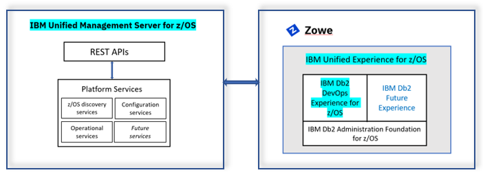
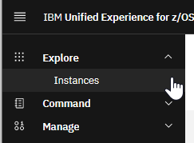
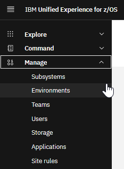

# Delivering database changes at the same speed as application changes 

As described in in [Chapter 2](C002_position.md), many of the leading businesses that have begun their digital transformation journey rely on IBM Z for running their mission-critical applications and on Db2 for z/OS for storing one of their most valuable assets: their core business data. Therefore, it's imperative that IBM continues to respond their business needs in a timely manner to help them grow and win, regardless of the industry in which they operate.

Digital transformation demands that businesses have the ability to respond quickly and efficiently to changes in their industry. Responding to an ever-evolving business environment often results in application changes that need to be implemented, tested, and deployed quickly with little to no downtime. In many cases, application code changes also require changes to the database schema such as adding or changing indexes to support new access patterns and changing database application code including stored procedures, user-defined functions, and Db2 for z/OS native REST services. This dependency requires that database code changes move at the same speed as application code changes as work progresses through a CI/CD pipeline. 

 Db2 DevOps Experience for z/OS (DOE) provides the essential capabilities that enable an organization to meet these demands. For example:

 - Application developers can self-provision Db2 for z/OS schemas without waiting for IT or requiring mainframe knowledge, while keeping all necessary security and control in the hands of the IT department.

 - Database administrators can define a policy that integrates automated deployment of database code changes into a CI/CD pipeline right alongside the corresponding application code changes.
 
 - DevOps engineers can automate the mainframe application delivery pipeline to include database code changes, therefore reducing risk, cost, and complexity while improving responsiveness to changing market and customer needs.

## Db2 DevOps Experience architecture

Db2 DevOps Experience is built on top of an IBM Unified Management Server (UMS), which is the foundation that provides the common functions such as base metadata and core services that are needed for database management. 

Db2 DevOps Experience uses a single interface called the IBM Unified Experience for z/OS. This browser-based user interface is built on top of the open-source Zowe Virtual Desktop and provides you with the ability to interact with Db2 assets based on the task you want to accomplish. This interaction with Db2 is supported via REST APIs, which provide the ability to interact with Db2 in a modern, efficient, and flexible way.

One of the key benefits of Db2 DevOps Experience enables application developers to be self-sufficient with tasks such as on-demand provisioning of Db2 modifications while DBAs retain a high level of control.

For example, Db2 DBAs have the ability to control which team members are authorized to perform which actions and how those actions must be performed (for example, "only registered team members can create a table, and the table name must conform to a pre-defined schema naming convention"). 

Application developers can be self-sufficient when they need to make database changes for their development or testing environment. The DBA no longer needs to spend time responding to and implementing database change requests and therefore has more time for other tasks while still retaining the oversight and control that is needed to guarantee the service levels and standards that they are responsible for. The application developer no longer needs to wait for the DBA to approve and make database changes and therefore is more productive and efficient. 

## Db2 DevOps Experience interactions with Db2 for z/OS
All services and capabilities that application developers and DBAs use to interact with Db2 are handled by a series of REST APIs. These services and capabilities can be exploited either through the browser-based interface or by scripting the REST APIs.

### Using the browser-based user interface (Unified Experience for z/OS)

By using the **Explore** > **Instances** feature of DOE, as shown in the following figure, application developers and DBAs can provision and deprovision database objects with or without data, which simplifies the process of making and testing application code changes. If a change requires a database change, the developer can also make stateful changes and evaluate them on their own instance before merging the changes into the CI/CD environment.

As shown in the following figure, DBAs can use the **Manage** feature to define the policy and rules for each application and its artifacts. See [Establishing the policy for database provisioning and schema changes](./C006s03_doe_dba.md) for more details.

The following sections of this chapter explain how developers' actions can be validated immediately under the DBA's control and rules.

### Scripting the REST APIs

All actions that can be performed by using the user interface can also be scriptable to facilitate the automation of the followign tasks:
- Creating, testing, and destroying schema changes to test applications using Db2.
- Analyzing and applying database schema changes, including stored procedures, through CI/CD pipeline by scripting those services in an automation tool such as Jenkins, UrbanCode Deploy (UCD), or Ansible. [Chapter 7](C007_ucd_overall.md) and [Chapter 8](C008_jenkins_overall.md) describe how scripting can be implemented in the context of our use case.

The following sections provide detailed information about key concepts of Db2 DevOps Experience and how its features can help you overcome the challenges described in [Chapter 2](.C002_position.md). They illustrate how administrators and application developers can exploit DOE’s features when adopting agile development practices with Db2 for z/OS.

- [DOE key terms and concepts](./C006s01_doe_concepts.md)
- [DOE roles and responsibilities](./C006s02_doe_roles_responsibilities.md)
- [Establishing the landscape of Db2 subsystems, environments and teams](./C006s02a_doe_landscape_ss.md)
- [Establishing the policy for database provisioning and schema changes](./C006s03_doe_dba.md)
- [Defining Db2 site rules](./C006s03a_doe_defining_site-rules.md)
- [DOE setup for DevOps engineer](./C006s04_doe_devops.md)

See [IBM Db2 DevOps Experience for z/OS](https://www.ibm.com/docs/en/ddefz/1.2.0) for more information about the architecture, installation, and configuration of UMS and DOE.

