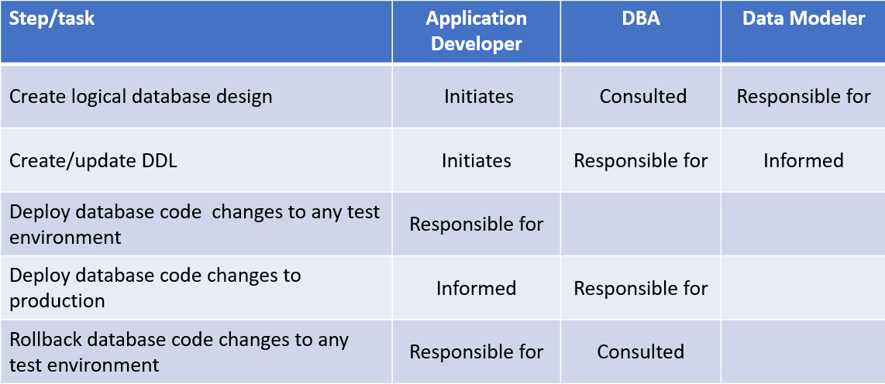
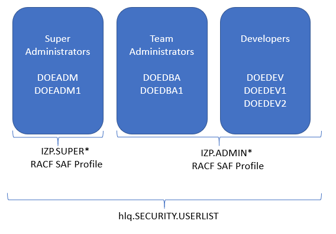

# DOE roles and responsibilities

This section provides definitions of the roles and responsibilities under DOE so that you can assign your existing team personnel appropriately based on these definitions.

DOE provides support for a granular separation of duties by associating specific roles with specific responsibilities. The role-based access-control feature is provided through an external security manager, such as RACF, ACF2, or Top Secret. In this document we use RACF. More information about the required RACF definitions is provided later in this section. 

In preparation for defining roles for an application in DOE, you need to understand the roles and resposnibilites as defined by your organization for processes such as deploying database code change to an integration environment.

The following table shows which role is responsible for each step in the process of deploying database schema changes to different environments, such as test or production. These roles will be matched to roles in DOE.

  

There are three main roles when using DOE: 
-	Super administrators
-	Team administrators
-	Team members

Once you understand which tasks are associated with these roles, you can assign your personnel accordingly. 

**Super administrators:** 
Users under the *super administration profile* can execute the following tasks:
- Register subsystems
- Create environments
- Create teams
- Assign teams to environments
- Assign team administrators to teams
- Specify storage limits
- Create site rules
- Assign site rule to environments
- Create applications
- Assign applications to teams

**Team administrators:** 
Users under the *team administrator profile* can execute the following tasks:
- Update team members
- Perform the following tasks for their team's applications:
   - Create applications
   - Assign applications to teams
   - Assign site rule to team’s applications
   - Approve or decline pull requests
   - Merge pull-request changes to originating applications

**Team members** 
Users not under the the previous two profiles can execute the following tasks:
- Provision application instances
- Perform the following tasks for their instances:
  - Update instances objects
  - Issue pull requests 
  - Apply updates to instances 
  - Deprovision instances

In summary, application developers and testers provision application instances into their team's environments. They can then change the definitions of the application objects that are included in the application instances in their own local environments for application program development and testing. After they make changes and submit pull requests, team administrators and additional reviewers of the team that owns the originating application can review their changes and approve or decline those requests. 

## DOE roles and RACF definitions

This section provides a high-level overview of implementing security for UMS/DOE. See [IBM Unified Management Server for z/OS](https://www.ibm.com/docs/en/umsfz/1.1.0) for a more detailed explanation of this topic.

As part of the UMS/DOE installation and configuration, your security administrator will have to define a RACF CLASS **IZP**, and two SAF profiles: **IZP.SUPER*** and **IZP.ADMIN***. You should assign IDs that will have the *super administrator* role to the **IZP.SUPER*** profile, and assign regular IDs that will become *team administrator* or *team member* to the **IZP.ADMIN*** profile.

Sample JCL is provided (IZPUSRMD) that should be executed by your security administrator to add or remove IDs to these profiles. Additionally, the IDs will be recorded into a **SECURITY.USERLIST** data set. The name of this data set is supplied to UMS/DOE via its PARMLIB. Any time that a UMS API is called when executing DOE tasks, these RACF profiles and userlist data set will be checked to certify that the ID has the appropriate authorizations. The IDs recorded in the userlist will be prompted to the *super administrator* and *team administrator* when they create or manage a team under DOE.

**Notes:** 
1. When this document was written, UMS/DOE did not support RACF groups for super administrators or regular users; therefore, specific IDs must be added or removed individually. Nothing prevents from permitting the READ through a RACF group, but the user ID must be listed in the userlist. At the execution of IZPUSRMD, the script will “explode” the group into individual user IDs. 
2. The names of the userlist data set, RACF CLASS provided here are based on default values; however, your security administrator might use different names according to your site's conventions. Also, the IZPUSRMD sample JCL will help complete these tasks, but your security administrator might decide to perform them in a different way.  

For ease of reference, we use the following configuration for roles and responsibilities. 

  

In the following sections of this document, you will see how these IDs are used to execute specific tasks to establish the landscape of Db2 systems and the policy for database provisioning and schema changes.
