#  Establishing the landscape of Db2 subsystems, environments, and teams

Most of the steps in this section must be performed by a UMS/DOE user who has super administrator authority. Super administrators need to set up subsystem environments for application development teams. To set up subsystem environments, the super administrator needs to do the following tasks:

## Registering Db2 subsystems

1. Log in to IBM Unified Experience for z/OS as the super administrator with the **DOEADM** ID.

2. Click **Manage > Subsystems**. 

This page has two tabs: **Registered** and **Discovered**. If subsystems have already been registered, they will be displayed on the **Registered** tab (the tab will be empty if no systems have been registered by the super administrator). The **Discovered** tab contains a list of Db2 subsystems that have been discovered by the UMS. 

3.  Click **Manage > Subsystems> Discovered >**. Select the Db2 subsystem and click **Register Subsystem** to open the **Register Subsystem** window.

The information in the **System** tab is populated automatically by the discovering API-based process.

The following screenshot shows an example of the **System** tab:

  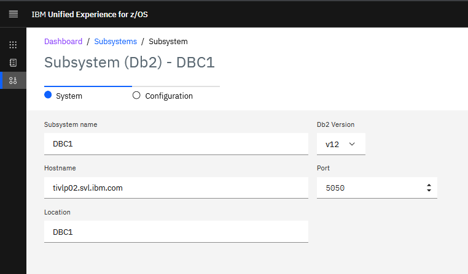

4. Click the **Configuration** tab and enter the following information. You can use the tooltips on each field to display information about the values that you need to enter.

  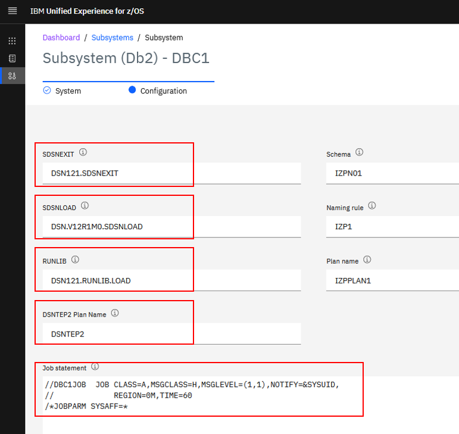

The following screenshot shows what a registered Db2 system looks like in the UMS/DOE dashboard:

  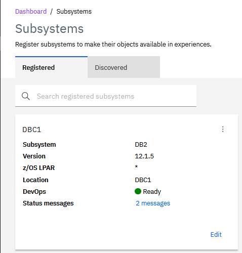

After the subsystem is registered, the objects from that system can be used when creating an application, which we show later.

**Note:** At the time this paper was written, the Db2 catalog information of the registered subsystem will be automatically refreshed every 4 hours by default. This means that if new objects are created after the subsystem has been registered, they will not be discovered immediately; however, the super administrator can manually refresh the registration by clicking the three dots and selecting **Refresh Discovery**, as shown in the following screenshot:

  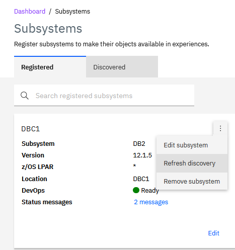

## Creating environments

Now that you have registered Db2 subsystems to work with, the next step is to create environments that can be assigned to a team of developers.

1. Log in to IBM Unified Experience for z/OS as the super administrator with the DOEADM ID.

2. Open the **Create environment** window by clicking **Manage > Environment > Create environment**.

3. Assign a name for the environment (for example, DEVENV) and assign a Db2 subsystem to that environment (for example, DBC1):

  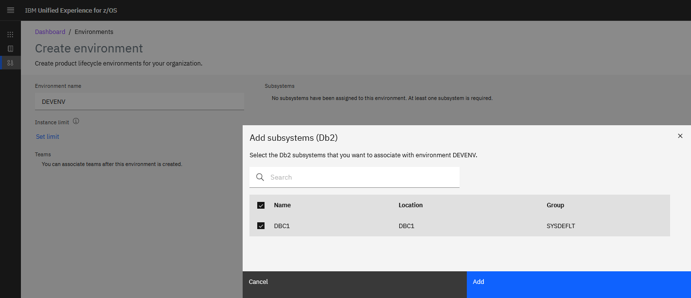

You can limit the number of *instances* that can be provisioned under this environment, and you can establish provisioning rules that will be applied when a team member provisions an instance. In the following example, the number of instances that can be provisioned has been limited to three, and a rule has been established that automatically assigns the characters "GENC" to the names of schema objects that are provisioned in this instance. 

  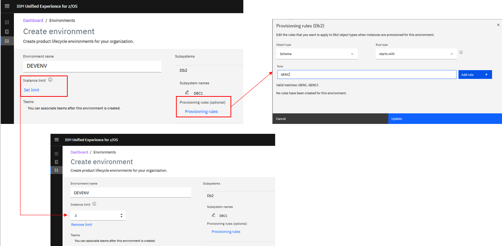

## Creating teams 

Now that you have registered Db2 subsystems and created an environment, your next step is to create teams of developers.

1. Open the **Create team** window by clicking **Manage > Create team** and provide the following information:

- A name for the team (for example, *DEVTEAM*)
- Optionally, a JOB prefix to be used under this team (for example, *DBC1*)

2. Click **Manage Users**, then select the users to add to the team, including whether they are team administrators (a role that is typically assigned to a DBA or lead developer). 
**Note:** The IDs prompted here are the contents of the *hlq.SECURITY.USERLIST*, dicussed in [DOE roles and responsibilities](./C006s02_doe_roles_responsibilities.md).

3. Assign the team an environment (for example, *DEVENV*) and optionally assign a limit to the number of instances that the team and each team member can establish.

The following screenshot shows the result:

  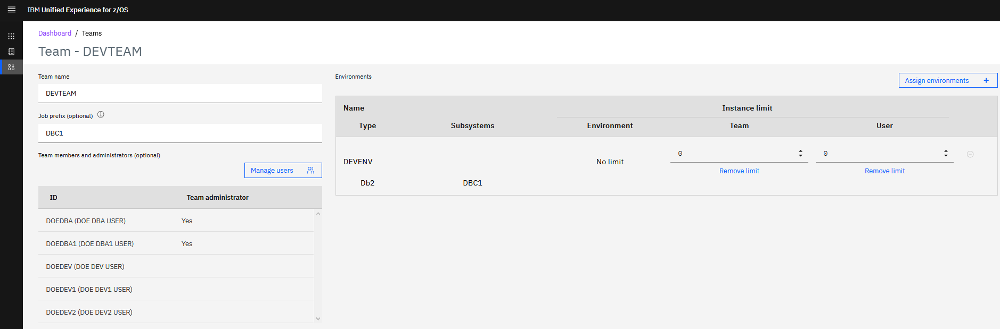

### Managing team members

You can always add new users to an existing team, remove users from a specific team, or remove users from all teams that they are assigned to. However, only a super administator (**DOEADM**) or a team administrator (**DOEDBA** or **DOEDBA1**) can perform these operations.

**Assigning a new user to the team**

1. Open the **Users** window by clicking **Manage > Users**.
2. From the **ID** column, select the user that you want to assign to a team. For example, user *DOEDEV3* should be assigned to our new *DEVTEAM* team.
3. From the **Teams** column, click the blue pencil to display a list of teams. Select the team from the **Team name** column or type the team name in the search field.
4. Indicate user role (Member or Team administrator).
5. Click **Assign**.

  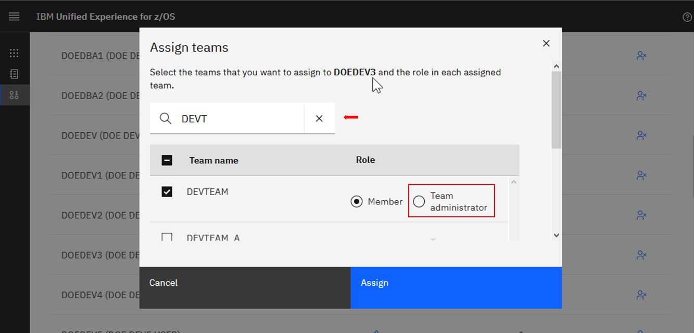

**Removing users from teams**

1. Click **Manage > Users**.
2. From the **ID** column, select the user that you want to remove from a team. For example, user *DOEDEV2* should be removed from the *ANSTEAM* team.
3. From the **Teams** column, click the blue pencil to display a list of teams. Select the team from the **Team name** column or type the team name in the search field.
4.  Click **Assign**.

  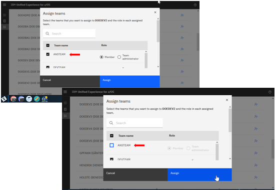

To remove user *DOEDEV2* from all teams:

1. Click **Manage > Users**.
2.  From the **ID** column, select the user you that you want to remove from all teams. For example, user *DOEDEV2* should be removed from all teams. 
3. Click the **Remove from all teams** icon in the far-right column:

  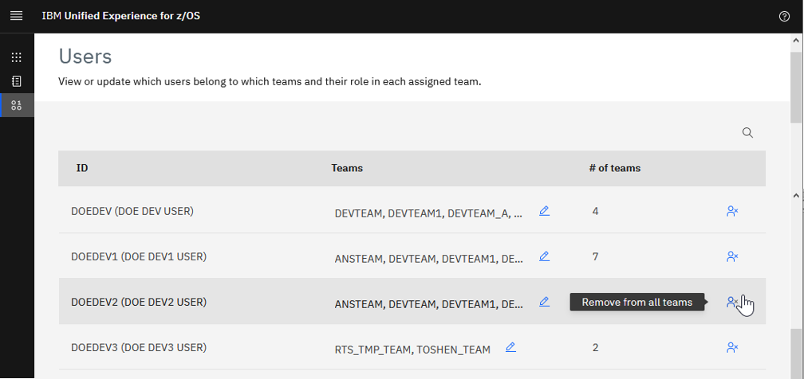

4. You'll be prompted to confirm or cancel the operation as follows:

  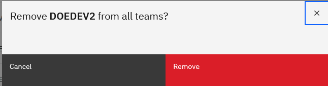

