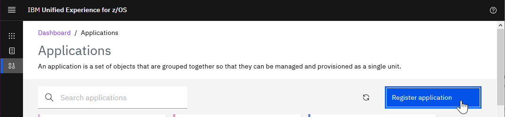
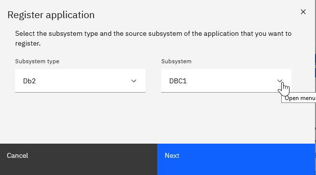
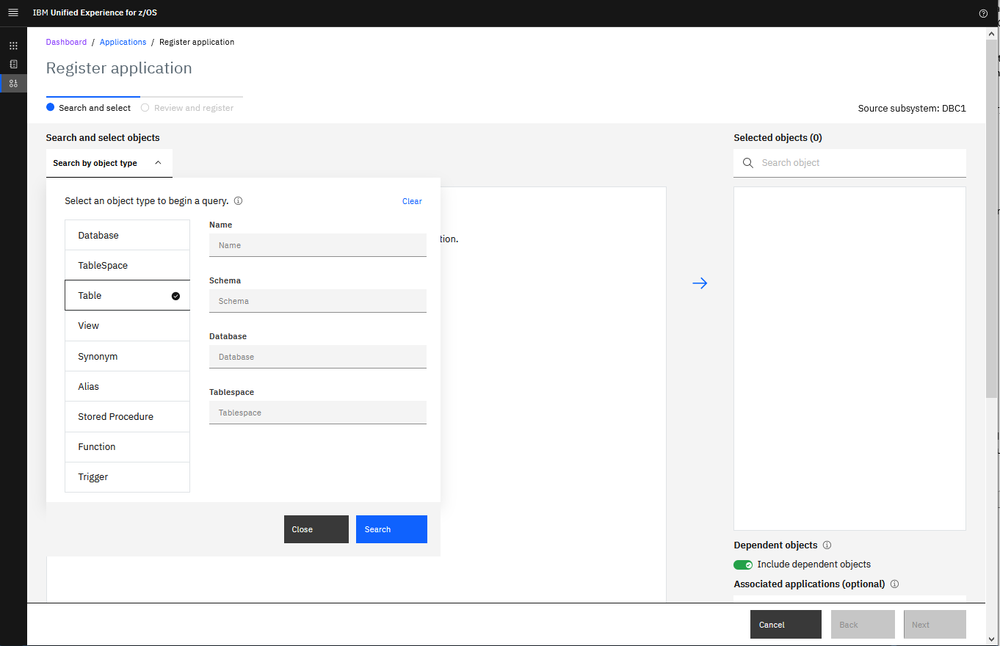
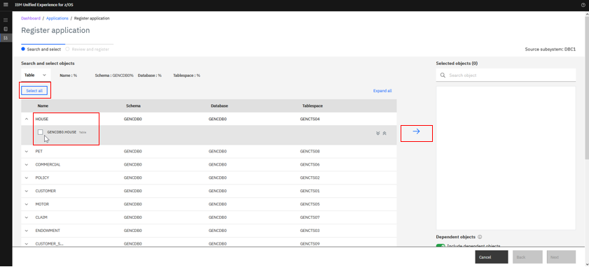
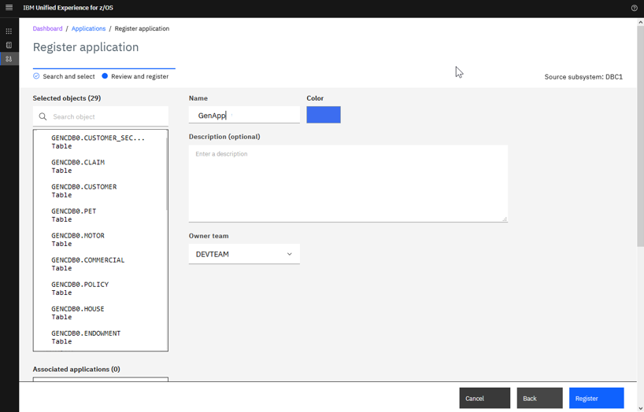
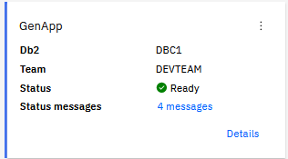
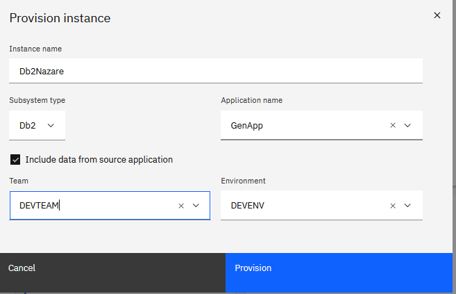
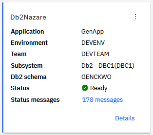

# Establishing the policy for database provisioning and schema changes

UMS/DOE team administrators are responsible for setting up the policy that defines an application.

The following sections provide step-by-step instructions for setting up an application. These steps must be performed by a *super administrator* or a *team administrator*.

## Registering applications  

As previously discussed in [DOE key terms and concepts](./C006s01_doe_concepts.md), in DOE the term _application_ refers to a set of Db2 objects grouped together and used in application programs.  
Registering an application under DOE can be done by a super administrator (in our example, DOEADM) or by the team administrator (in our example, DOEDBA or DOEDBA1) of the team that will work on the application programs that use that set of Db2 objects. 

When an application is registered, it is assigned to a team, which enables developers, testers, and other members of that team to provision application instances in their own environment and to work on the objects.

**Note:** The use case in this paper uses an instance for the integration branch.

### Registering applications

1. Click **Manage > Application > Register Application:**

  

2. Select the previously registered Db2 subsystem that stores the objects for this application and click **Next**:

  

3. Use the next screen to search for and select the objects that will form the set for the application that you are registering.

**Note:** Values entered in the search argument are case sensitive.

  

4. After you submit the search criteria, you can select the required objects from the list that is returned.

**Note:** You can select all objects or you can select individual objects. You can select objects from multiple schemas to be part of the application.

  

5. After you select the objects you want, click **Next** and complete the registration by providing the following information:
-	A unique name for your application (for example, *GenApp*) 
-	A color for the tile of the application in the dashboard
-	Optionally, a description for the application
-	The team that owns that application (for example, *DEVTEAM*)

6. Click **Register** to complete the registration.

  

When the registration is complete, a new tile for the application is added to the **Dashboard / Applications**. The color you selected appears as a vertical bar at the left of the tile.

  

### Provisioning an application instance 

As mentioned previously, when an application is assigned to a team, the developers and testers on that team can provision their own application instances. For the purpose of this document, we're illustrating how a database administrator can provision an instance for their continuous integration environment. In later sections of this document, we'll explain how information that's registered in DOE is correlated to the pipeline orchestrator (for example., Jenkins) and to the deployment manager (for example, UrbanCode Deploy – UCD). 

The following steps must be performed by a team administrator of the team.

1. Click **Explore > Instances > Provision instance**.

The following image shows an example of how to enter the information to provision an instance based on our use case: 

  

2. Click **Provision**. A new tile for that instance is created in the **Dashboard / Instances**.

  

Note that the provisioned instance has schema as **GENC**WKO, which adheres to the provisioning rules established when the DEVENV environment was created. See [Creating environments](./C006s02a_doe_landscape_ss.md#creating-environments) for more details.

As super administrator, you can also manage the storage used by teams, environments, users, and applications. The limits are soft, which means that when they are exceeded Unified Experience for z/OS displays alerts but does not prevent continued activity. To set storage limits, follow the intructions in [IBM Unified Management Server for z/OS - Setting storage limits](https://www.ibm.com/docs/en/umsfz/1.1.0?topic=experience-setting-storage-limits).
