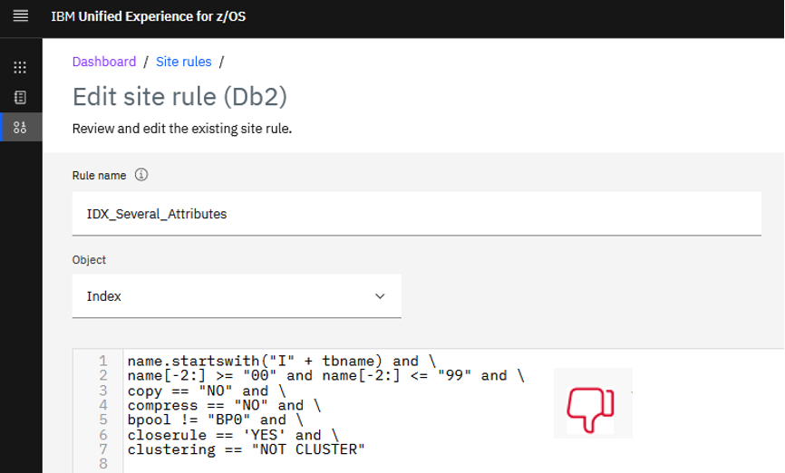

# Defining Db2 site rules

When you adopt a development model that provides the flexibility and agility to application developers to make application changes as well as DDL changes on their own development environment, it's imperative that DBAs have mechanisms to enforce Db2 guidelines and rules. Although the application developer can independently make database changes to test new features or to accommodate application code changes, those changes must maintain the installation standards such as naming convention rules and attribute values.

Although the creation of site rules is optional, they are extremely important to constrain how application developers can change object definitions in provisioned application instances. DBAs defining the site rules must have *super administrator* role under DOE.  

Once a rule is defined, it can be associated to one or more *applications*, *environments*, or both. The rule will be honored for every provisioned application instance of that application and for every provisioned application instance to that environment.

Site rules can be classified as:
 - Simple site rules
 - Complex rules
## Simple site rules
A simple rule is characterized by involving *object, attribute*, and *verification*. For example, you can create a site rule that specifies that column (*object*) names (*attribute*) must have a maximum length of 20 characters (*verification*). 

1. To create a simple site rule, click **Manage > Site rules > Create rule**.

You can use the drop-down arrows to define the segments: 

  

2. After you create the site rule, you assign it to applications and environments. Operations such as editing, duplicating, and deleting are also available. 

  

## Complex site rules
You can also create *complex site rules*, which give you a more flexible way to define a rule by adding some logic to it. A subset of the Python syntax can be used to compose a site rule. In the following example, a rule has been defined by using the *startswith* Python function:

  

Although it’s possible to create a rule that involves several attributes of an object, the best practice is to create one rule for each attribute of an object so that it's easy to identify which rules an object definition might potentially violate. Otherwise, troubleshooting an object that violates multiple rules can become a tedious chore that requires multiple rounds of debugging. For example, **don't** create a rule that looks like this:

  

Instead, break the rule down into individual rules to be assigned:

  

You can define as many site rules as you want. For a complete reference of objects, attributes, and Python functions that you can use to create your site rules, see [Unified Management Server for z/OS - Managing site rules](https://www.ibm.com/docs/en/umsfz/1.1.0?topic=experience-managing-site-rules). 
