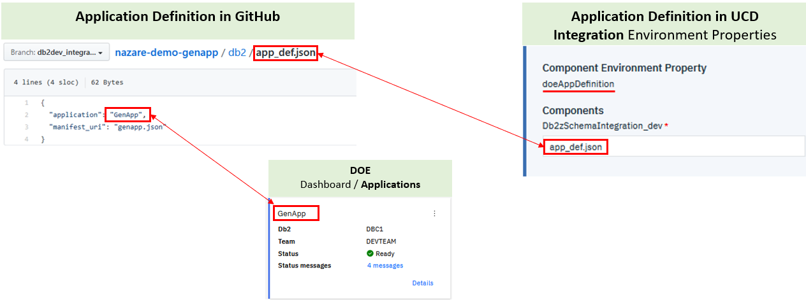
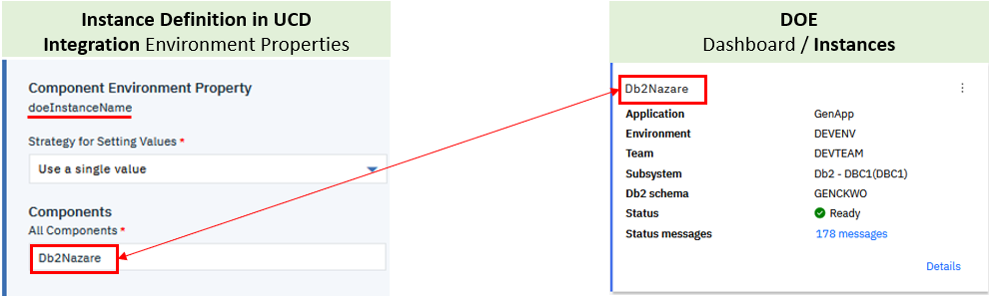

# DOE setup for DevOps engineer

When you have established the policy for database provisioning and schema changes in your environment, you must provide your DevOps engineer with critical information that they'll need when they set up the pipeline and the automated deployment. 

## Mapping DOE definitions to GitHub and UCD  
In this section, you'll see how the definitions that were created in the previous sections should be mapped in the pipeline orchestrator (Jenkins) and UCD configuration.

### DOE and GitHub
[Chapter 8](C008_jenkins_overall.md) of this document provides all the details about setting up the Jenkins pipeline. The name of the application (*GenApp*) defined under DOE must be used by your DevOps engineer when they configure the pipeline. In our use case, we use GitHub as our source code management (SCM) system. The json file (*app_def.json*) in GitHub contains the application definition. To illustrate this mapping, we'll be using the *db2dev_integration* branch in GitHub and the Integration UCD environment for deployment. The following image shows how the name of the application defined under DOE correlates to and how it is stored in GitHub and how it is used in UCD by the DOE-UCD plugin during the deployment process. 

  

### DOE and UCD
[Chapter 7](C007_ucd_overall.md) of this document provides all the details about configuring the UCD artifacts for automated deployment of Db2 schema changes. The name of the instance (*Db2Nazare*) defined under DOE must be used by your DevOps engineer when they configure UCD. 

Note that the name of the application defined under DOE (*GenApp*) is also passed to UCD, as described previously.  
In UCD, an *application* is also defined. For each application, there will be *environments* into which that application can be deployed. When you configure the *environment* properties, the application instance name that was defined under DOE must match the environment configuration. 
In our use case, we use the *Integration* environment to pass the *Db2Nazare* instance of the *GenApp* application. 

  

