# IBM UrbanCode Deploy 
This chapter introduces you to the basic concepts of IBM UrbanCode Deploy (UCD) and describes how you integrate IBM Db2 DevOps Experience for z/OS (DOE) into an automated deployment process to drive Db2 for z/OS schema changes.

Instructions for installing UCD are beyond the scope of this document. See [Installing UrbanCode Deploy](https://www.ibm.com/docs/en/urbancode-deploy/7.1.2?topic=installing) for complete instructions.

## Introduction to IBM UrbanCode Deploy
IBM UrbanCode Deploy (UCD) helps you meet the challenge of deploying software throughout your enterprise by providing tools that improve both deployment speed and reliability. UCD standardizes and simplifies the process of deploying software components to each environment in your development cycle. It provides functionality to model processes that orchestrate complex deployments across every environment and approval gate.

The IBM UrbanCode Deploy elements that you use to model software deployments include applications, environments, components, and related processes. The following figure shows the relationships between these different elements.

<p align="center">
    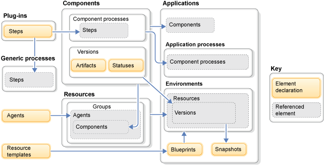
</p>

To implement Db2 for z/OS schema changes, you must define the following elements in your environment:

### Components
Components represent deployable items, also called artifacts, which can be files, images, database schema definitions (DDL), configuration materials, or anything else that is associated with a software project. Artifacts can come from a number of sources, such as file systems, build servers, source version control systems, and more. Each time that you import new files that are associated with a component, a new component version is created. The server keeps copies of these component version artifacts, and you specify which component version to use each time you deploy.

Components have one or more component processes associated with them. A component process contains all the steps that are necessary for the server to deploy the component to an environment. These steps describe all actions, such as starting an application server and creating or updating tables in a database. Many process steps are available by default, and you can obtain more steps from plug-ins.

### Applications
An application is a logical group of components that are deployed together. Applications have processes, but their steps usually start processes or modify resources. An application contains environments, which describe all the deployment locations that are needed in your deployment process, and you run application processes to deploy components to environments.

### Resources
Resources represent the relationships between components, the agents that deploy the components, and the target deployment environments. You create groups to represent target servers and environments, attach the agents that deploy to the environments, and attach components to the agents that run their processes.

### Agents
An agent is a lightweight process that runs on a deployment target host and communicates with the UCD server. It does the actual work of deploying components.

### Environments
An environment is a user-defined collection of resources that hosts an application. Environments are typically modeled on some stage of the software project lifecycle, such as development, integration, quality assurance (QA), or production. An environment can consist of a single server or it can be spread over several servers or clusters of servers. Environments are assigned to specific applications.

For a more detailed explanation of these components, see [Elements overview](https://www.ibm.com/docs/en/urbancode-deploy/7.1.2?topic=deploy-elements-overview) in the official UCD documentation.

## Db2 DevOps Experience plugin for UCD
DOE provides a rich set of REST APIs that provide all the functionality that you need to drive Db2 for z/OS schema changes. You can access the Swagger API documentation by browsing `https://<host>:<port>/ws/swagger-ui.html` where `<host>` is the DNS name or IP address of the z/OS system where you installed DOE, and `<port>` is the port number that you specified for Swagger (`12023` by default). The following figure shows the API documentation in Swagger.

<p align="center">
    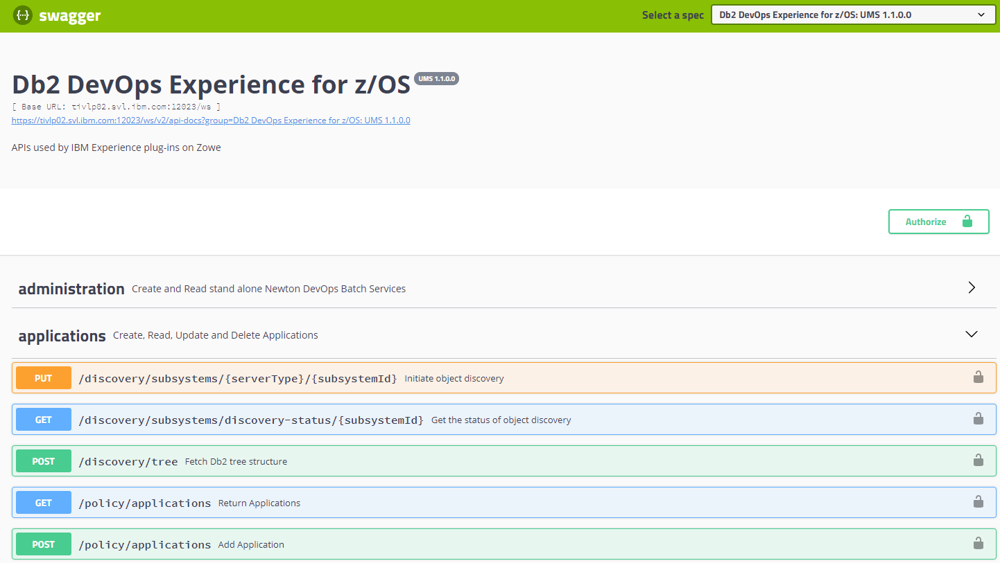
</p>

To make it easier for you to drive Db2 for z/OS schema changes using DOE from a UCD deployment process, IBM developed a plugin that implements the following tasks by calling the REST APIs provided by DOE:

| Task     | Description |
| ------------|-------------|
| Provision    | Provision a Db2 schema instance of an application. |
| Deprovision  | Deprovision a Db2 schema instance of an application. |
| Analyze       | Analyze schema changes on a Db2 schema instance. |
| Apply        | Apply schema changes on a Db2 schema instance of an application. |
| Promote       | Promote schema changes from a Db2 schema instance to the golden master copy of an application. |
| Sync-up     | Sync up schema changes from the golden master copy to a Db2 schema instance of an application. |

You can download the Db2 DevOps Experience plugin from the [UCD plugins website](https://www.urbancode.com/plugin/ibm-db2-devops-experience-for-zos/). 

### DOE APIs used by the plugin
As described previously, the DOE plugin for UCD calls multiple DOE APIs to implement a certain task. This section lists the required parameters and APIs that are called by each task.

All tasks require the following input parameters:
* The hostname or IP address of the DOE server
* The port of the DOE server
* The user ID and password that are used to execute the API calls

The following parameters are optional:
* If the plugin will accept untrusted (for example, self-signed) certificates. The default is NO.
* If the full REST API request and response should be printed in the log. The default is NO. 

#### Provision
**Input parameters**
* The name of the application
* The name of the environment where the new instance should be provisioned
* The name of the team that will own the newly provisioned instance
* The name of the instance to be created

**API calls and flow**
1. Get the unique identifiers (UUIDs) for the application, environment, and team.
```
GET /policy/application/{appId}
GET /policy/environments/{envId}
GET /policy/teams/{teamId}
```
2. Provision the new instance.
```
POST /policy/instances
```

**Output parameters**
* `doe.schemaName`: The schema of the newly created instance
* `doe.dbName`: The database name of the newly created instance
* `doe.provisionStatus`: The completion status of the Provision task (success or failure)

#### Deprovision
**Input parameters**
* The name of the instance to be deprovisioned

**API calls and flow**
1. Deprovision the instance.
```
DELETE /policy/instances/{instanceId}
```

**Output parameters**
* `doe.deprovisionStatus`: The completion status of the Deprovision task (success or failure)

#### Analyze
**Input parameters**
* The DOE instance name
* The application definition path (JSON file) as described in [DOE setup for DevOps engineer](./C006s04_doe_devops.md)

**API calls and flow**
1. Get the UUID for the instance.
    ```
    GET /policy/instance/{instID}
    ```
2. Validate syntax and site rules for each object in the application definition (JSON file). Exit in case of syntax errors or site rule violations.
    ```
    POST /site-rules/validate/db2
    ```
3. Save the object definition.
    
    3.1 If the object already exists, update the definition.
    ```
    PUT /policy/instances/{instanceId}/objects/def
    ```
    3.2 If the object does not exist, add a new object to the instance.
    ```
    PUT /policy/instances/{instanceId}/objects/def?objectName={objectId}
    ```
    3.3 If saving fails for any object, restore all objects to the last committed state and exit.
    ```
    PUT /policy/instances/{instanceId}/objects/restore
    ```
4. Request the instance changes report.
    ```
    POST /policy/instances/{instanceId}/objects/reports
    ```
5. Receive the report.
    ```
    GET /policy/instances/{instanceId}/reports/{jobId}
    ```

**Output parameters**
* `doe.analysisResult`: A report that lists the registered changes for each object
* `doe.analysisStatus`: The completion status of the Analyzing task (success or failure)


#### Apply
**Input parameters**
* The DOE instance name

**API calls and flow**

1. Get the UUID for the instance.
    ```
    GET /policy/instance/{instID}
    ```
2. Apply the pending changes to the instance.
    ```
    POST /policy/instances/{instanceId}/objects/apply
    ```
3. Get the apply report.
    ```
    GET /policy/instances/{instanceId}/apply/{jobId}
    ```
4. If the apply failed for any object, discard the changes and restore the object definitions to the last committed state.
    ```
    PUT /policy/instances/{instanceId}/objects/discard-apply
    ```

**Output parameters**
* `doe.applyResult`: A report that lists the changes that were applied to each object 
* `doe.applyStatus`: The completion status of the Apply task (success or failure)

#### Promote
**Input parameters**
* The instance name
* The approver user ID
* The approver password

**API calls and flow**
1. Get the instance UUID.
    ```
    GET /policy/instance/{instID}
    ```
2. Create a pull request.
    ```
    POST /ws/policy/pull-requests/
    ```
3. Approve the pull request.
    ```
    POST /policy/pull-requests/{pullRequestId}/approve
    ```
4. If the pull request status is *opened*, request to merge it.
    ```
    POST /policy/pull-requests/{pullRequestId}/merge
    ```
5. Check the pull request status until the status is *merged*.
    ```
    GET /policy/pull-requests/{pullRequestId}
    ```

**Output parameters**
* `doe.promoteResult`: The completion status of the Promote task (success or failure)

#### Sync-up
**Input parameters**
* The instance name

**API calls and flow**
1. Get the UUID for the instance.
    ```
    GET /policy/instance/{instID}
    ```
2. Pull the object definitions from the application upstream.
    ```
    POST /policy/instances/{instanceId}/objects/pull
    ```
3. Apply the changes as described in steps 2 to 4 of the Apply task.

**Output parameters**
* `doe.syncResult`: A report that lists the objects that were pulled from the master branch
* `doe.syncStatus`: The completion status of the Sync-up task (success or failure)

### Installing the **DevOps Experience** plugin
After you download the plugin to your local system, complete the following steps to install it on the UCD server.

1. Log in to the UCD web interface with an administrative user ID. 

2. Navigate to **Settings** in the upper menu bar.

3. In the **Automation** pillar, click **Automation Plugins**.

4. Click **Load Plugin** on the right side.

5. In the popup window, click **Browse** and select the downloaded plugin on your local system. Click **Submit** to upload and install the plugin on the UCD server.

The *DOE* plugin is displayed in the list of installed plugins, as shown in the following figure. 

<p align="center">
    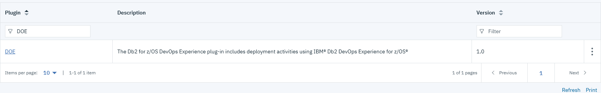
</p>

## Configuring UrbanCode Deploy
The next step is to define and configure the UCD elements that are required to deploy Db2 schema changes by using the DOE plugin.

For the UCD configuration related to the COBOL application, follow the instructions in [Build a pipeline with Jenkins, Dependency Based Build, and UrbanCode Deploy](https://developer.ibm.com/components/ibmz/tutorials/build-a-pipeline-with-jenkins-dependency-based-build-and-urbancode-deploy/).

For details about configuring UCD elements, see [Modeling software deployment](https://www.ibm.com/docs/en/urbancode-deploy/7.1.2?topic=modeling-software-deployment) in the UrbanCode Deploy documentation.

The examples and figures in this section might not represent a complete configuration of all UCD elements. See the appendix for instructions for downloading a complete snapshot of the UCD elements.

### Creating roles and teams
Before you configure the deployment, you need to define the roles and teams that control access to applications and environments in UCD.

A role is a set of granted permissions and does not impart its granted permissions to any particular user. Roles and their associated permissions are applied to users or groups by adding them to teams.

You can configure roles and teams under **Settings** > **Security**. For our demo environment, we configured a set of DBA users called **DOEDBA, DOEDBA1**, and **DOEDBA2**. We also created a group called **DOEDBA** and added the users to the group. Next, we added a role called **DOEDBA**. Finally, we created a team called **DOEDBA** and added the users and group to the team as shown in the following figure. We use the **DOEDBA** team in the manual approval step and when configuring notifications later in this chapter. 

<p align="center">
    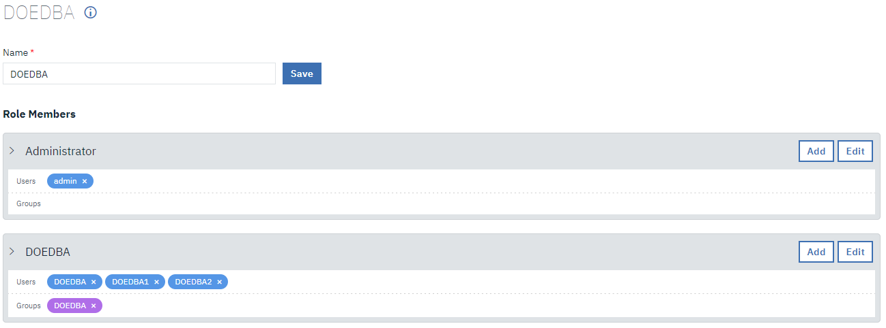
</p>

### Creating the component
To create a new component:

1. Navigate to the **Components** tab of the upper menu bar.

2. Click **Create Component**. 

3. In the popup window, fill in the required fields. The following images show you the sample configuration that was used for the demo.

<p align="center">
    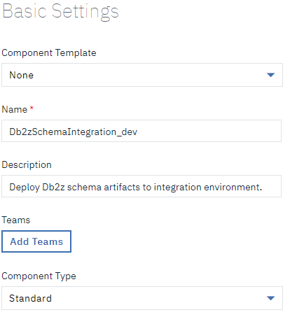
</p>

4. In the **Version Source Configuration** section, select Git as the source configuration type and enter the repository URL, branch, username, and password. Each time a change is committed to the specified repository, a new component version is automatically created in UCD.

<p align="center">
    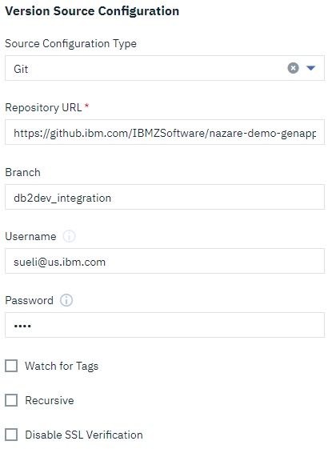
</p>

5. In the **Includes** field, specify `db2/**/*` so that only the content of the `db2` directory of the repository will be part of the component. In the **GIT Path** field, specify the path to the Git executable on the UCD server. If you added the Git executable to the system PATH, you can simply specify the executable name as `git`.  

<p align="center">
    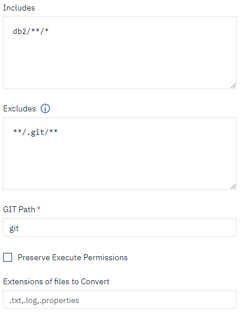
</p>

6. Select **Copy to CodeStation** to copy artifacts from the specified source to the UCD server's repository from which they can be retrieved during deployments.

<p align="center">
    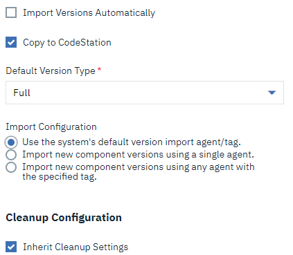
</p>

7. Click **Save**.

8. After you create the component, select it from the list of all components and click the **Configuration** tab. From the menu on the left side, select **Environment Property Definitions**. From here you can define component properties for each environment where the component will be deployed. The following figure shows the properties that we defined in our demo. 

<p align="center">
    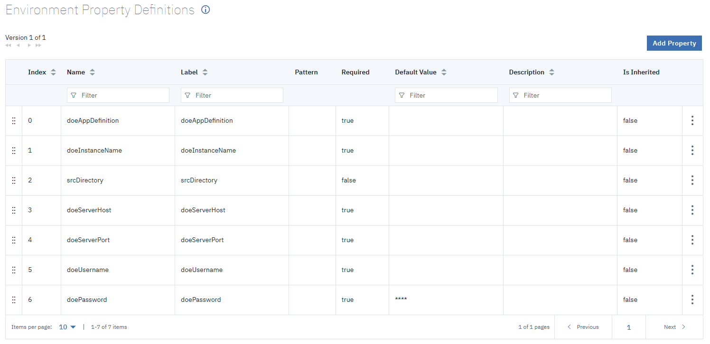
</p>

### Creating the component deployment process
After you create the component for the database schema definition, you have to create the deployment process. 

1. Navigate to the **Components** tab in the top menu bar and select the previously created component from the list of all components.

2. Click the **Processes** tab and then click **Create Process**.

3. Fill out the required fields on the popup window, then click **Save**. The **Process Designer** will open, and you can start modeling the deployment process.

<p align="center">
    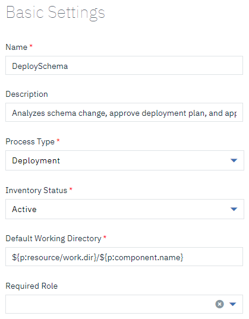
</p>

A list of predefined actions is displayed on the left side of the process designer.If you installed the UCD DOE plugin as described previously, the tasks in the **Db2zOS / DevOpsExperience** entry in the **Database** section will be available, as shown in the following figure.

<p align="center">
    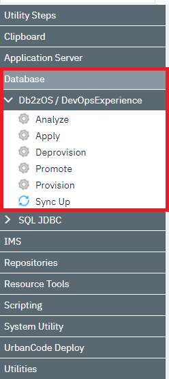
</p>

You can use these tasks to model the deployment process according to the sample shown in the following figure. The steps of the process are described in the following sections.  

<p align="center">
    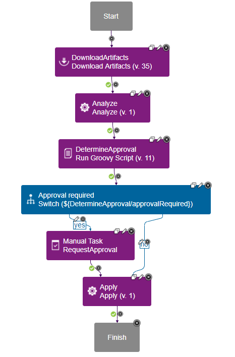
</p>

#### 1. DownloadArtifacts
The first step in the deployment process is to download the specified version of the component artifacts to the agent's working directory. When you run the process, you specify which version of the component artifacts to use. The corresponding task **Urban Code Deploy / Download Artifacts** is located in the **Artifacts** section under **Repositories**. No customization is required for this task.

#### 2. Analyze
Next, the Analyze task provided by the UCD DOE plugin is used to read the DDL from the working directory, validate syntax and site rules, and register the new object definitions in DOE. The task requires the DOE instance name where the DDL changes should be deployed, the path to the application definition (JSON file), and the DOE server name and port. You can either specify concrete values for the parameters or you can use environment properties. In our demo we use the `${p:environment/<property name>}` notation to point to environment properties as shown in the following figure. The environment properties are mapped to their particular values later in this chapter.

<p align="center">
    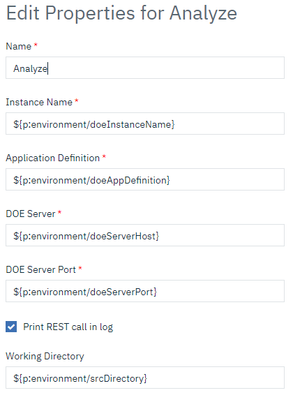
</p>

#### 3. DetermineApproval
The output of the Analyze task is a JSON report that contains information about the schema changes (for example, ALTER) that will be executed. This step consists of a Groovy script that parses the JSON report and determines if there are disruptive changes that require a manual approval. You can model the step using the **Run Groovy Script** task that is listed in the **Groovy** section under **Scripting** in the task palette. The Groovy script code is shown in the following example.

```
import groovy.json.JsonSlurper

// recursive loop through the summary report JSON
def loop(array) {
    def count = 0
    array.each { entry ->
        println(entry["Object type"] + " " + entry["Source Object"] + ": " + entry["Result"])
        if(entry["Result"] == "Dropped/created")
            count++
        if(entry["Children"].size() > 0)
            count += loop(entry["Children"])
    }
    return count
}

// get the summary report JSON from the previous step
def summaryReport = '${Analyze/doe.analysisSummaryReport}'

// parse the report
def parsedJson = new JsonSlurper().parseText(summaryReport)

// loop through the report
def c = loop(parsedJson["Results"])

// determine, if approval is required
def approvalRequired
if(c > 0)
    approvalRequired = "yes"
else
    approvalRequired = "no"
println("Approval required: ${approvalRequired}")

// set the output properties of the step
outProps.put("approvalRequired", approvalRequired)
outProps.put("Status", "Success")
outProps.put("exitCode", "0")
```   
The script loops through the hierarchy of objects and checks the `Result` field. In our demo, we set the `approvalRequired` output variable to `yes` if the value of `Result` is `Dropped/Created` for any of the objects. For all other values (e.g., `Altered` or `No change`), we set `approvalRequired` to `no`. This handling can easily be changed in the script according to your individual requirements.

#### 4. Approval required
In this step, the `approvalRequired` output variable of the previous step is evaluated. You can implement it using the **Switch** step listed under **Utility Steps**. You need to edit the step properties and fill in the **Property Name** that should be evaluated.

<p align="center">
    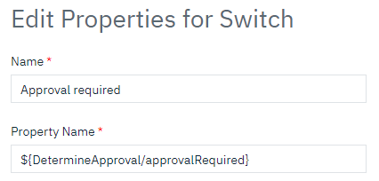
</p>

You also need to draw the links from this step to the following steps and edit the condition for each link. If `approvalRequired` is `yes`, the manual approval step is called next. If `approvalRequired` is `no`, the Apply step is called next.

<p align="center">
    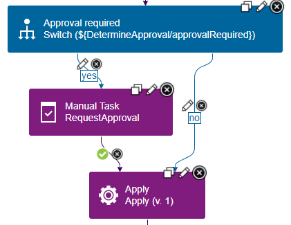
</p>

#### 5. RequestApproval
For the manual approval, UCD provides the **Manual Task** step under **Utility Steps**. For the demo, we customized the manual approval step to create a manual task in UCD that must be approved by a member of the DOEDBA team. We also added the summary report of changes that is generated by the Analyze step as a property to the approval task. You can review our demo configuration in the following figure.

<p align="center">
    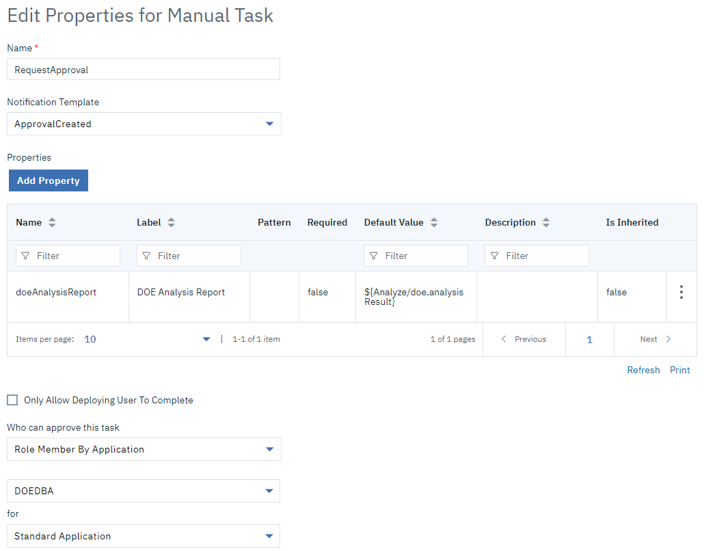
</p>

#### 6. Apply
The final step in the deployment process is the Apply provided by the UCD DOE plugin. This step materializes the previously registered changes to the Db2 for z/OS schema. You need to customize the DOE instance name, server, and port. You can either specify these parameters directly in the step or you can define them as environment properties.

<p align="center">
    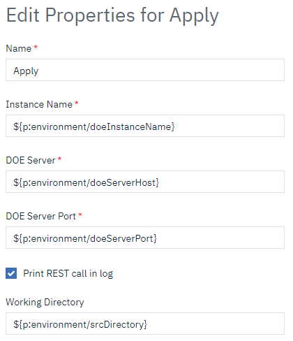
</p>

Finally, save the process.

### Creating the resource
To deploy the previously created component on a target environment, you must create a resource that associates UCD agents with components. For this step, you need a UCD agent on z/OS that has been configured and started. These instructions are beyond the scope of this document. See the descriptions in the IBM tutorial *Build a pipeline with Jenkins, Dependency Based Build, and UrbanCode Deploy* at the [IBM developer website](https://developer.ibm.com/components/ibmz/tutorials/build-a-pipeline-with-jenkins-dependency-based-build-and-urbancode-deploy/) and the [official UCD documentation](https://www.ibm.com/docs/en/urbancode-deploy/7.1.2?topic=deployment-resources). The following figure shows the resource configuration in our demo.

<p align="center">
    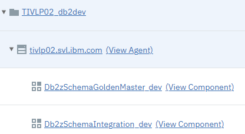
</p>

### Creating the application
1. Continue creating the application by clicking the **Applications** tab in the top menu. 
2. Click **Create Application**,  select **New Application**, and fill in the required fields. 

The following figure shows the application definition in our demo. (Note that the figure already contains a notification scheme. Ignore it for now and leave it blank. Instructions for configuring notifications are provided later in this chapter.)

<p align="center">
    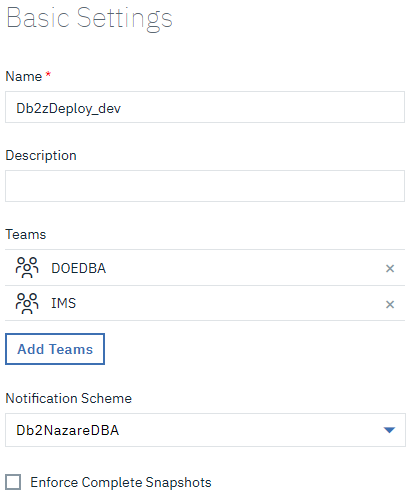
</p>

### Associating the component with the application
1. Select the previously created application from the list of all applications and click the **Components** tab. 
2. Click **Add Component**, select the previously created component, and click Save.

The following figure shows the components that we added to the application in our demo.

<p align="center">
    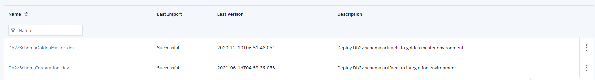
</p>

### Defining the process to install the component

1. Select the application and navigate to the **Processes** tab. 
2. Click **Create process**, fill out the required fields in the popup window, and click **Save**. 

The following figure shows the process configuration in our demo. 

<p align="center">
    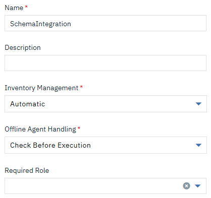
</p>

3. After you save the process configuration, the **Process Designer** will open. Use the **Install Component** step from the **Application Steps** section to model the process as shown in the following figure.

<p align="center">
    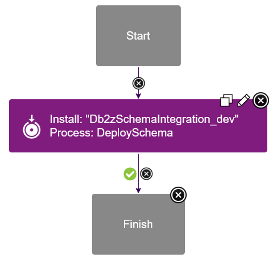
</p>

4. Customize the step by specifying the **Component Name** and **Component Process** values.

The following figure shows the configuration in our demo environment.

<p align="center">
    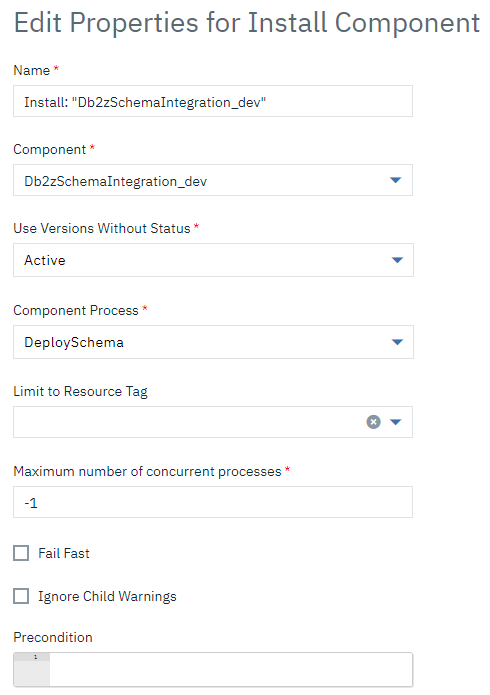
</p>

### Creating the environment for the application

1. Select the application and navigate to the **Environments** tab. 
2. Click **Create Environment** and fill in the required fields in the popup window.

For our demo we created two environments, **Integration** and **GoldenMaster**, as shown in the following figure. 

<p align="center">
    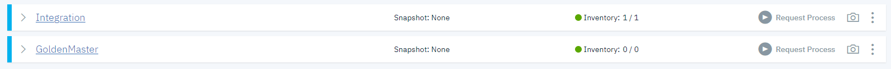
</p>

Each environment is mapped to an individual DOE instance by setting environment properties. 

3. To set the properties, click on the environment, then go to the **Configuration** tab and select **Environment Properties** from the menu on the left side. A list of properties that you can set for the environment is displayed in the **Component Environment Properties** section. 

The following figure shows the configuration in our demo environment.

<p align="center">
    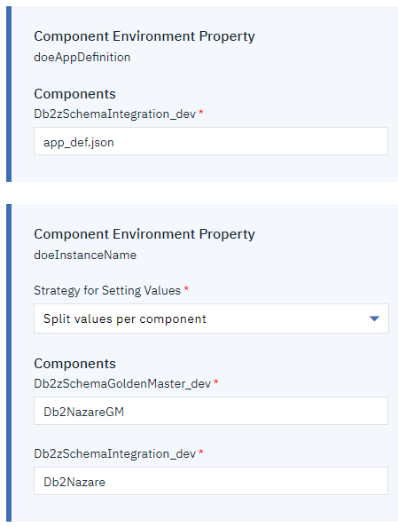
</p>

### Assigning the resources to the environment
Finally, you need to assign resources to the environments where the application can be deployed. 

1. Click on the environment to display a list of assigned resources. The list should be empty. 
2. Click **Add Base Resource** and select the previously created resource. The following figure shows the configuration in our demo environment.

<p align="center">
    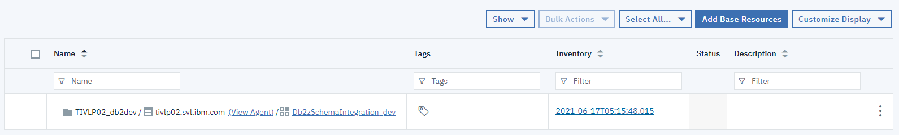
</p>

### Configuring notifications
If you want to be informed of events related to the deployment, you can configure notifications.

1. Go to **Settings** in the top menu and click **Notification Schemes** in the **System** pillar. 
2. Click **Create Notification Scheme** and fill out the required fields in the popup window. 
3. Click **Add Notification Entry** to add notifications to the scheme. 
4. In the popup window fill out the required fields. 

The following figure shows an example for a notification when a deployment process is started.

<p align="center">
    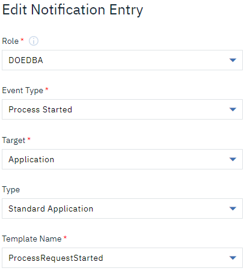
</p>

For **Role**, we selected the DBA role that we created at the beginning of this chapter. For the templates, we used the default templates provided by UCD. If you want to customize notification templates, check out the official UCD documentation at https://www.ibm.com/docs/en/urbancode-deploy/7.1.2?topic=function-creating-notification-templates.

The following figure lists all notifications that we added to the scheme in our demo, including notifications on process start, start error, failure and success, as well as approval failure.

<p align="center">
    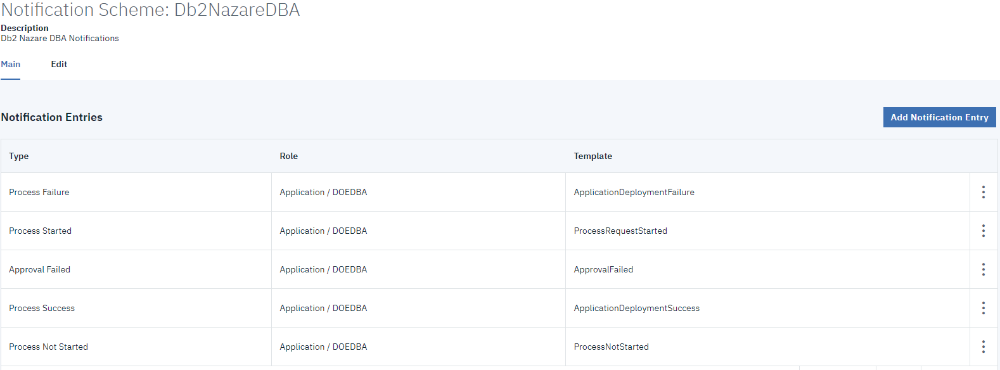
</p>

5. To enable notifications for an application, go to the application and click the **Configuration** tab. Under **Notification Scheme**, select the previously created notification scheme from the drop-down list as shown in the following figure.

<p align="center">
    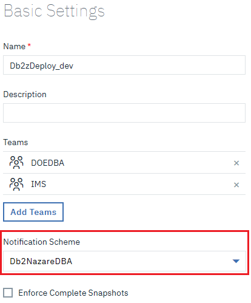
</p>

## Summary
If you followed all the steps in this chapter, you successfully configured UCD to deploy Db2 for z/OS schema changes using the DOE plugin.
