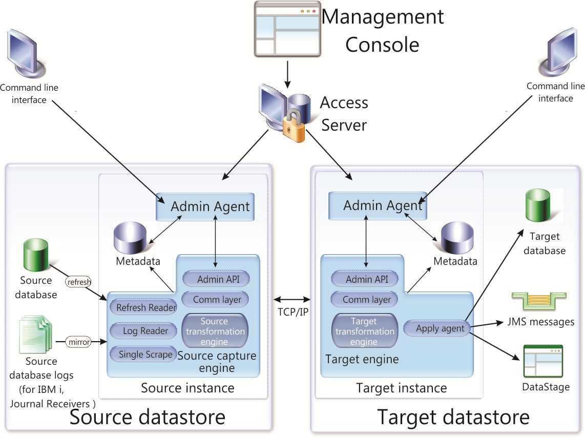
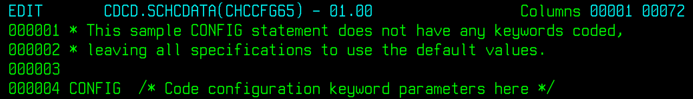
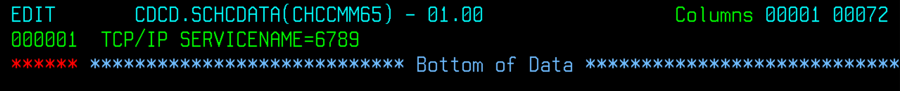
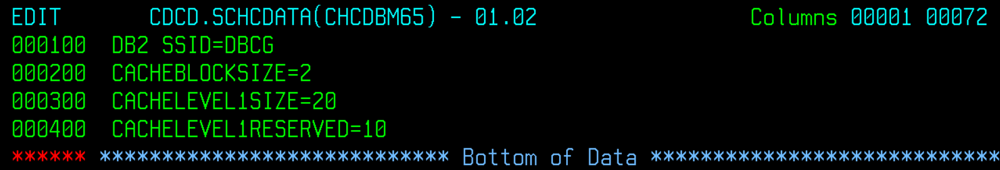
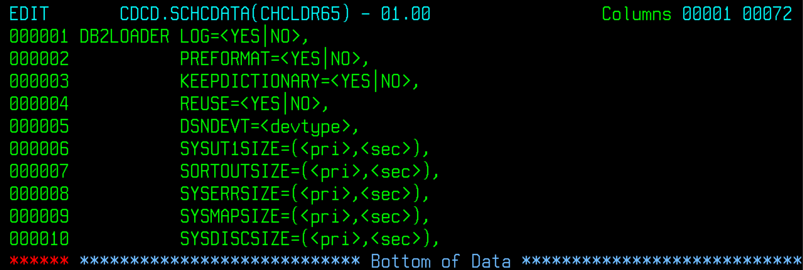
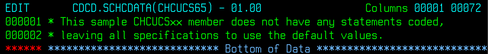
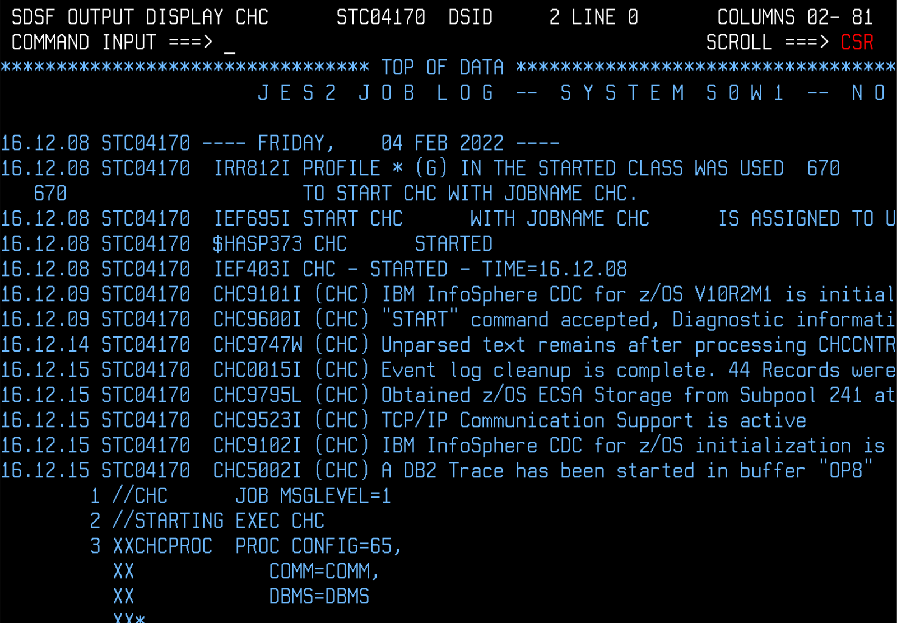

[Back to README.md and Table of Contents.](README.md)

# Setting Up CDC for Db2 z/OS - Worked Example
This chapter is a worked example of setting up CDC for Db2 z/OS. 

## Contents

<ul class="toc_list">
<li><a href="#abstract">Abstract</a>   
<li><a href="#1.0">1 Introduction to CDC for Db2/z/OS</a>
<ul>
  <li><a href="#1.1">1.1 Requirements to Replicate Db2 z/OS Data</a></li>
  <li><a href="#1.2">1.2 The CDC Started Task</a></li>
</ul>
<li><a href="#2.0">2. High Level Review of Implementation Steps</a>
<li><a href="#3.0">3. SMPE Installation of Code Libraries</a>
<li><a href="#4.0">4. Creating the CDC Instance</a>
<ul>
  <li><a href="#4.1">4.1 Edit the SCHCDATA config dataset members</a></li>
  <li><a href="#4.2">4.2 Create PAL ( Product Admin Log )</a></li>
  <li><a href="#4.3">4.3 Create cluster for metadata</a></li>
  <li><a href="#4.4">4.4 Bind Packages for metadata utility</a></li>  
  <li><a href="#4.5">4.5 Create Metadata tables in Db2</a></li>
  <li><a href="#4.6">4.6 Grant Package Execution</a></li>
  <li><a href="#4.7">4.7 Bind CDC Plan</a></li>
  <li><a href="#4.8">4.8 Create Log Cache ( Single Scrape )</a></li>  
</ul> 
<li><a href="#5.0">5. Configure the z/OS Environment</a>
<ul>
  <li><a href="#5.1">5.1 APF Authorised Load Libraries</a></li>
  <li><a href="#5.2">5.2 TCPIP Ports</a></li>
  <li><a href="#5.3">5.3 RACF Started Task ID</a></li>
  <li><a href="#5.4">5.4 Test Start the CDC Server</a></li>  
</ul>
<li><a href="#6.0">6. Configure the Db2 z/OS Environment</a>
<ul>
  <li><a href="#6.1">6.1 Alter Source Tables for full row logging</a></li>
  <li><a href="#6.2">6.2 Db2 configuration considerations</a></li>
</ul>
<li><a href="#7.0">7. Integrate with the wider CDC Landscape</a>
<ul>
  <li><a href="#7.1">7.1 Deploy CDC as a Started Task</a></li>
  <li><a href="#7.2">7.2 Connect from Management Console to Classic CDC Started Task</a></li>
  <li><a href="#7.3">7.3 Use CHCCLP Scripting</a></li>  
  <li><a href="#7.4">7.4 Conforming to site standards for cross-platform devops and security</a></li>
</ul> 
<li><a href="#App">Appendix</a>
</ul>


<h2 id="abstract"> Abstract</h2>

This document is a basic worked example of setting up CDC for Db2 z/OS. 

* It deals with the practical considerations for implementing Db2 z/OS as a CDC data source. 
* It's scope is limited to a "basic up and running guide", and is intended to be easy to follow (assuming a base of z/OS and Db2 z/OS practical experience).
* Comprehensive details of the product's features are covered in <a href="https://www.ibm.com/docs/en/idr/11.4.0?topic=replication-infosphere-cdc-db2-zos">IBM CDC knowledge centre.</a>

It is part of a series of documents providing practical worked examples and 
guidance for seting up CDC Replication between mainframe data sources and mid-range or Cloud targets.
The complete set of articles can be accessed using the links at the very top of this page.

<h2 id="1.0">1. Introduction to CDC for Db2 z/OS</h2>  

IBM InfoSphere Data Replication for z/OS (aka CDC for Db2 z/OS) is a full CDC implementation providing both CDC Capture and CDC Apply functionality.

CDC Replication is a set of products that implement a common data replication architecture spanning 
a large number of diverse data sources and targets. The CDC common architecture is based upon replication of 
data that conforms to the relational model. Any CDC capture or apply agent that supports a non-relational data structure 
must perform whatever conversion work that is necessary to implement a mapping between that data structure and the 
relational model of data.

Since Db2 z/OS is a relational database with robust, well-documented interfaces for accessing data and logs, the implementation of CDC for Db2 z/OS 
is very straightforward indeed, as this article will show. 

<h3 id="1.1">1.1 Requirements to Replicate Db2 z/OS Data</h3> 

The core functionality of any CDC Capture agent is to read the source database logs asynchronously, 
stage captured data (preferably in memory) until the Unit of Work is commited or rolled back, 
and then publish the committed changes over TCPIP sockets to a CDC Apply agent.

The core functionality of any CDC Apply agent is to listen for changes from CDC source agents, process those 
changes (along UoW boundaries) and generate write operations to apply the changes to the target according to whatever mapping 
definitions have been specified in the subscription.

Any supported version of Db2 z/OS is ready to go with CDC. The customisation of Db2 to support CDC is limited to:

1. Creating a few CDC control tables inside Db2 z/OS
2. Binding a plan and a few packages
3. Granting the started task ID sufficient privileges to access the Db2 Catalog and Log Interface
4. Altering source tables to enforce full row logging so that the log records contain enough information to support replication


<h3 id="1.2">1.2 The CDC Started Task</h3>

The diagram below is a representation of the components within a CDC capture instance, a CDC Apply instance, and how they 
relate to external artefacts. 




<p>The CDC services are summarised in the table below.</p>

 <table>
  <tr>
    <th width=300>Service</th>
    <th width=500>Function</th>
  </tr>
  <tr><td>Admin Agent</td>
    <td>Listens on a TCPIP port for requests from other CDC components and communicates with other services.</td>
  </tr> 
  <tr>
   <td>Admin API</td>
   <td>Processes commands and scripts. (operations, monitoring etc... )</td>
  </tr> 
   <tr>
   <td>Comm Layer</td>
   <td>handles TCPIP sockets between CDC Capture and CDC Apply servers.</td>
  </tr> 
  <tr>
   <td>Refresh Reader</td>
   <td>Reads Db2 tables for initialisation of subscriptions.</td>
  </tr> 
  <tr>
   <td>Log Reader</td>
   <td>Uses DB2 IFI to read Db2 logs.</td>
  </tr> 
  <tr>
   <td>Single Scrape</td>
   <td>Cache to ensure that logs are read only once if you have multiple subscriptions.</td>
  </tr> 
  <tr>
   <td>Source Transformation Engine</td>
   <td>Performs transformations that are configured to execute on the Capture server</td>
  </tr>  
  <tr>
   <td>Target Transformation Engine</td>
   <td>Performs transformations that are configured to execute on the Apply server</td>
  </tr> 
  <tr>
   <td>Apply Agent</td>
   <td>Writes data to target tables.</td>
  </tr> 
</table> 


All the services, and their governing parameters are documented in the knowledge centre <a href="https://www.ibm.com/docs/en/idr/11.4.0?topic=zos-about-cdc-replication">here</a>.


<h2 id="2.0">2. High Level Review of Implementation Steps</h2>

It is helpful to establish a structured overview of the main installation and configuration activities before 
diving into the technical details of very nut and bolt. This paper identifies five separate stages of implementation

1. SMPE Installation of Code Libraries.
2. Creating the Customised CDC Instance.
3. Configure the z/OS Environment.
4. Configure the Db2 z/OS Environment.
5. Integrate with the wider CDC Landscape.


<h2 id="3.0">3. SMPE Installation of Code Libraries</h2>
<p>SMPE installation is a well documented, standardised process that every systems programming shop manages with 
their own standards. It is outside the scope of this paper, aside from noting that it is a pre-requisite to the 
followng stages.</p>
<p>Once the SMPE installation is complete, the following target libraries will exist under the chosen high level qualifier. (CDCD in this example).</p>

 <table>
  <tr><td width=200><b>Library</b></td><td width=500><b>Contents</b></td></tr> 
  <tr><td>CDCD.SCHCASM</td><td>Assembler Samples</td></tr> 
  <tr><td>CDCD.SCHCC</td><td>Samples</td></tr>  
  <tr><td>CDCD.SCHCCNTL</td><td>Sample JCL</td></tr>  
  <tr><td>CDCD.SCHCCOB</td><td>COBOL Samples</td></tr>  
  <tr><td>CDCD.SCHCDATA</td><td>Configuration library</td></tr> 
  <tr><td>CDCD.SCHCDBRM</td><td>DBRM Library</td></tr>  
  <tr><td>CDCD.SCHCH</td><td>Headers</td></tr>  
  <tr><td>CDCD.SCHCLOAD</td><td>Load Modules</td></tr>  
  <tr><td>CDCD.SCHCMAC</td><td>Macros</td></tr>  
  <tr><td>CDCD.SCHCNOTC</td><td>Samples</td></tr>  
  <tr><td>CDCD.SCHCTTL</td><td>Data</td></tr>  
</table> 


	
<h2 id="4.0">4. Creating the CDC Instance</h2>
<p>The installed product code can now be used to support one or more instances of CDC for Db2 z/OS. 
This worked example will create a single instance, under the instance high level qualifier of CDCD (in this example).</p>

<h3 id="4.1">4.1 Edit the SCHCDATA config dataset members</h3> 
<p>With CDC for Db2 z/OS an instance of CDC is defined by creating a set of members in the SCHCDATA dataset that define the identity of the instance.</p>
<p>Inside CDCD.SCHCDATA you will find four 'XX' template members (CHCCFGXX. CHCCMMXX, CHCDBMXX, CDCLDRXX and CHCUCSXX). Make copies of these members into a different 
suffix (65) which will be the identity of the CDC for z/OS instance that we are going to create.</p>

```CHCCFGXX 
CHCCMMXX
CHCDBMXX
CHCLDRXX
CHCUCSXX
CHCCFG65
CHCCMM65
CHCDBM65
CHCLDR65
CHCUCS65
CHCMTDIN
CHCTMZON
CHCUEIMP
CHCUTIL                                                          
```


<b>CDCD.CHCCFG65</b> contains the general configuration statements for this instance. The defaults are all fine for a basic first setup. 



<b>CDCD.CHCCMM65</b> contains TCPIP information. Idefined the listener port as 6789 in this example.



<b>CDCD.CHCDBM65</b> contains Db2 z/OS connection paramaters. I identified my Db2 z/OS V12 system by providing SSID. 
I also provided the configuration values for a basic log cache which helps performance when you have multiple subscriptions.



<b>CDCD.CHCLDR65</b> contains data loader configuration statements. The defaults are all fine for a basic first setup.



<b>CDCD.CHCUCS65</b> contains code page configuration parameters. The defaults were fine for my system.



After you have got a basic CDC server up and running, you will want to review all the parameter settings in the context of your scenario. 
The documentation describes all the paramaters that can be coded (and their default values) 
in the <a href="https://www.ibm.com/docs/en/idr/11.4.0?topic=ccdz-modifying-cdc-db2-zos-configuration-control-data-set">knowledge centre</a>. However,
the defaults will be fine for an initial setup.

 

<h3 id="4.2">4.2 Create PAL ( Product Admin Log )</h3> 

Customize the job CDCD.SCHCCNTL(CDCDFPAL) to create a VSAM cluster for the CDC Replication product administration log (PAL). 
The purpose of the PAL is to store messages for easy retrieval by the CDC Administration tools (Management Console and CHCCLP scripts).


```
  DEFINE -                                                               
    CLUSTER -                                                            
     (NAME(CDCD.PAL)                                                  -  
      VOL(USER0A)                                                     -  
      SHAREOPTIONS(2 3) -                                                
      CYL(1 1)  -                                                        
      RECSZ(36 1024) -                                                   
      INDEXED -                                                          
      NOREUSE -                                                          
      KEYS(32 0)) -                                                      
    DATA -                                                               
     (NAME(CDCD.PAL.DATA))                                            -  
    INDEX -                                                              
     (NAME(CDCD.PAL.INDEX))                                              
                                                                         
  REPRO -                                                                
    INFILE(CHCPALDT) -                                                   
    OUTDATASET(CDCD.PAL)                                                 
```


<h3 id="4.3">4.3 Create cluster for metadata</h3> 

Customize the job CDCD.SCHCCNTL(CDCDFMTD) to create the CDC Replication metadata VSAM cluster. Some of the metadata for CDC is stored in 
Db2 z/OS tables. Some is kept in this VSAM cluster.

```
  DEFINE -                                                               
    CLUSTER -                                                            
     (NAME(CDCD.META)                                                 -  
      VOL(USER0A)                                                     -  
      SHAREOPTIONS(3 3) -                                                
      CYL(20 20)  -                                                      
      RECSZ(512 2048) -                                                   
      CISZ(4096) -                                                       
      INDEXED -                                                          
      NOREUSE -                                                          
      KEYS(128 16)) -                                                    
    DATA -                                                               
     (NAME(CDCD.META.DATA))                                           -  
    INDEX -                                                              
     (NAME(CDCD.META.INDEX))                                             
                                                                         
  REPRO -                                                                
    INFILE(VSAMINIT) -                                                   
    OUTDATASET(CDCD.META)                                                
```


<h3 id="4.4">4.4 Bind Packages for metadata utility</h3> 

<p>Customize the job CDCD.SCHCCNTL(CDCMDMDB) to bind the packages and plan for the CHCMDMUT (metadata install and upgrade utility) program.</p> 

```
//SYSTSIN  DD *                                                          
  DSN SYSTEM(DBCG)                                                       
  BIND -                                                                 
    PACKAGE(CHCPK165)                                                 -  
    MEMBER(CHCMDMMN) -                                                   
    ACTION(REPLACE) -                                                    
    CURRENTDATA(NO) -                                                    
    ENCODING(UNICODE) -                                                  
    OWNER(IBMUSER)                                                    -  
    QUALIFIER(IBMUSER)                                                   
  BIND -                                                                 
    PACKAGE(CHCPK165)                                                 -  
    MEMBER(CHCMDMDB) -                                                   
    ACTION(REPLACE) -                                                    
    CURRENTDATA(NO) -                                                    
    ENCODING(UNICODE) -                                                  
    OWNER(IBMUSER)                                                    -  
    QUALIFIER(IBMUSER)                                                   
  BIND -                                                                 
    PACKAGE(CHCPK265)                                                 -  
    MEMBER(CHCDB2DL) -                                                   
    ACTION(REPLACE) -                                                    
    CURRENTDATA(NO) -                                                    
    ENCODING(UNICODE) -                                                  
    OWNER(IBMUSER)                                                    -  
    QUALIFIER(IBMUSER)                                                   
  BIND -                                                                 
    PLAN(CHCMDM65)                                                    -  
    PKLIST(CHCPK165.CHCMDMMN -                                           
           CHCPK165.CHCMDMDB -                                           
           CHCPK265.CHCDB2DL -                                           
          ) -                                                            
    ACTION(REPLACE) RETAIN -                                             
    CACHESIZE(256) -                                                     
    ISOLATION(CS) -                                                      
    OWNER(IBMUSER)                                                    -  
    RELEASE(COMMIT)                                                      
  END                                                                    
```                                         

		   

<h3 id="4.5">4.5 Create Metadata tables in Db2</h3> 

<p>Customize the job CDCD.SCHCCNTL(CHCMDMUT) to create or upgrade the CDC Replication metadata tables. This table defines the identity of 
a CDC instance by identifying all the DB2 z/OS artefacts that the instance should refer to. The SYSIN data for this job is commented very 
well, and the values used in this worked example are shown below.</p> 

``` 
//SYSIN    DD  *                                                        
*Lines with an '*' in column 1 are treated as comments.                 
*                                                                       
* Subsystem or data sharing group name of the                           
* DB2 system which holds (or will hold) the metadata.                   
SUBSYS=DBCG                                                             
* The plan suffix used when the plan CHCMDMxx was bound.                
PLANSFX=65                                                              
* The name of the DB2 storage group which should be used                
* to create any metadata objects. This storage group                    
* will be created if it does not exist.                                 
STOGROUP=SYSDEFLT                                                       
* The list of volume names to be used to create the                     
* storage group if it does not exist. Must be specified                 
* if the storage group does not exist.                                  
*OLUMES=<CHCVOLSER>                                                     
* The name of the catalog to use in creating the                        
* storage group if it does not exist. Must be specified                 
* if the storage group does not exist.                                  
*ATLG=<CHCCatlg>                                                        
* The name of the database which holds the metadata.                    
* This database will be created if it does not exist.                   
DBNAME=CHCDB                                                            
* The name of the table space which will contain the majority           
* of the metadata tables. This tablespace should be a Unicode           
* table space with a page size of 4K. This table space will             
* be created if it does not exist.                                      
TBSP01=CHCTBSP1                                                         
* The name of the table space which will contain metadata tables        
* which require a 32K page size. This tablespace should be a            
* Unicode table space with a page size of 32K. This table space         
* will be created if it does not exist.                                 
TBSP02=CHCTBSP2                                                         
* The buffer pool to be used when creating a new database,              
* tablespaces and indexes requiring a 4k page size.                     
* By default, bufferpool BP0 will be used.                              
* If the database specified by DBNAME already exists then its           
* buffer pool will be used instead.                                     
BPOOL4K=BP0                                                             
* The  buffer pool to be used when creating a new tablespace,           
* and index that requires a 32k page size.                              
* By default, bufferpool BP32K will be used.                            
BPOOL32K=BP32K                                                          
* The user name which owns the metadata.                                
OWNER=IBMUSER                                                           
* The SQLID this job should operate under. By default, this             
* is the user ID this job is executing under.                           
SQLID=IBMUSER                                                           
* When set to Y, this option will cause all existing metadata           
* tables to be dropped and a completely new set of metadata             
* created. This option is intended to facilitate start over             
* scenarios, e.g. if re-running a fresh install or if running           
* an upgrade where metadata is not needed and will be recreated.        
* It should be set to N otherwise.                                      
* In general, it is not recommended to be set to Y for upgrade          
* since all existing product metadata will be lost.                     
DROPTBL=N                                                               
* When set to Y, this option will cause all DB2 system                  
* catalog tables indexes to be created. The storage group               
* used for the indexes will be the storage group specified.             
CRSYSIND=N                                                              
* When set to Y, this option will set DATA CAPTURE CHANGES              
* on selected DB2 system catalog tables.  This is necessary for         
* certain product features to function properly.                        
STSYSCAP=N                                                              
/*                                                                      
```  


<h3 id="4.6">4.6 Grant Package Execution</h3> 

<p>Customize the job CDCD.SCHCCNTL(CDCGRNTA) to grant Db2 authorities to the userid for the started task.</p> 
<p>The objects that the started task ID needs execute authority on are PACKAGE CHCPK165.* and PACKAGE CHCPK265.*</p>

<h3 id="4.7">4.7 Bind CDC Plan</h3> 
<p>Customize the job CDCD.SCHCCNTL(CDCBNDPL) to bind the Db2 Packages and Plans that will be used by CDC Replication to access the DB2 log, metadata tables, and application data tables that are to be replicated.</p> 
<p>30 packages and 15 plans will be bound.</p>

<h3 id="4.8">4.8 Create Log Cache ( Single Scrape )</h3> 
CDC for Db2 can be configured to use a log cache. The purpose of this log cache is to ensure that the Capture task only has to read the Db2 log once. For example, 
if a subscription fails, then when the problem is resolved, CDC Capture does not need to re-read the Db2 log which is relatively expensive: it can just
retried the cached change from this VSAM cluster.
Customize the job CDCD.SCHCCNTL(CDCCRCCH) to allocate the VSAM cluster that will back up the Log Cache (which was configured <b>CDCD.CHCDBM65</b>). 

``` 
  DEFINE -                                                               
    CLUSTER -                                                            
     (NAME(CDCD.CHCCACHE)                                             -  
      VOL(*) -                                                           
      RECORDSIZE(32760 32760) -                                          
      NUMBERED -                                                         
      SHAREOPTIONS(2))-                                                  
    DATA -                                                               
     (NAME(CDCD.CHCCACHE.DA)                                          -  
      BUFFERSPACE(8388608) -                                             
      CYLINDERS(600))                                                    
```


<h2 id="5.0">5. Configure the z/OS Environment</h2>
Every z/OS environment will have different constraints and considerations for deployment. 
This worked example was implement on a Z Development and Test v13 environment, using the z/OS v2.4 stack provided by ADCD v13. 
The z/OS customizations that I needed to do were as follows:

<h3 id="5.1">5.1 APF Authorised Load Libraries</h3>
The CDC Load Libraries need to be APF Authorized. 
With the ADCD distribution I simply added these libraries to ADCD.Z24C.PARMLIB(PROGAD).

```
/**********************************************/                      
/*  IIDR 11.4                                 */                      
/**********************************************/                      
APF ADD                                                               
    DSNAME(CDCD.SCHCLOAD)                               VOLUME(USER0B)
```
	
<h3 id="5.2">5.2 TCPIP Ports</h3> 
CDC for Db2 z/OS is configured to listen on port 6789, as per the editing CDCD.CHCCMM65. 
The ADCD z/OS v2.4 distribution does not lock high ports, so I didn’t have any network administration to perform to open port 6789. 
Most sites would need to explicitly unlock ports and change firewall rules in the network. 

<h3 id="5.3">5.3 RACF Started Task ID</h3> 
For the ZD&T environment I didn’t bother the define a started task ID to RACF. 
I just added the PROC to ADCD.Z24C.PROCLIB and ran it as START1. 
Most sites would create a dedicated started task userid, and permit it the necessary privileges to operate.

<h3 id="5.4">5.4 Test Start the CDC Server</h3> 
This is a good point to start the server and resolve any problems with the CDC Server.  
You can test CDC as a Job using the JCL in ```CDCD.SCHCCNTL(CHCPROC)```, and then deploy it as a started task later on.
Upon first start, you should expect to see the Classic CDC Server come up.





<h2 id="6.0">6. Configure the Db2 z/OS Environment</h2>
<p>There is very little to do here.</p>


<h3 id="6.1">6.1 Alter Source Tables for full row logging</h3>
<p>By default Db2 z/OS only logs enough data to perform rollforward and rollback recovery processing. Unchanged column values are not usually logged, but a data replication 
product needs to see all the before and after column values of the entire row. This is achieved by ALTERing the Db2 table to instruct Db2 to perform full row logging 
for all logged SQL operations.</p>
<p>You don't even need to do this in advance, because the CDC administration tools will detect if "Data Capture None" is in force for any source table, and generate an ALTER 
statement to make the change.</p>

<p><code style="color:#00FF00; background-color:#000000">ALTER TABLE TABSCHEMA.TABNAME DATA CAPTURE CHANGES</p> 

<h3 id="6.2">6.2 Db2 configuration considerations</h3> 
<p>There is nothing else that needs to be done for a basic up and running exercise.</p>
<p>As you progress with CDC for Db2 z/OS you may need to perform some Db2 tuning. Examples of the sorts of work you may need to do are:</p>

<ul> 
<li>Db2 log buffer configuration should be adjusted to ensure that all log reads for Db2 are satisfied from memory
<li>For Ultra-active Db2 systems you will want to schedule the ALTER TABLE commands for a quiet time
<li>If you replicate a lot of tables, the increase in logging may prompt you to review your log configuration.
</ul>


<p>That's it for the CDC Server !!!</p>

<br><hr>

<h2 id="7.0">7. Integrate with the wider CDC Landscape</h2>
<p>Now that the mainframe CDC Capture Server is ready for business, you will need to start using some non-mainframe tools in order 
to define Subscriptions from them to target systems. Section 7 covers these matters.</p>

<h3 id="7.1">7.1 Deploy CDC as a Started Task</h3> 
<p>Assuming you want to run CDC as a started task, rather than a batch job, you should copy 
the contents of the JCL to run CDC as a batch job <code style="color:#00FF00; background-color:#000000">CDCD.SCHCCNTL(CHCPROC) 
to your PROCLIB, and follow your site standards for establishing a new started task.</p> 


<h3 id="7.2">7.2 Connect from Management Console to CDC Started Task</h3>
<p>This document is primarily concerned with everything that needs to be done to establish CDC for Db2 z/OS as a started task.</p>
<p>Using the the CDC administration tools is now a standard CDC task which is covered in 
the <a href="/recipes/docs/NA_CDC/cdcu2.html">Devops Options for CDC.</a> paper.</p>


<h3 id="7.3">7.3 Use CHCCLP Scripting for z/OS</h3>
<p>CDC Replication is traditionally a Windows-centric environment for operations and control, but it also has advanced scripting capabilities for automation.</p>
<p>The CDC Management Console is a comprehensive GUI that addresses all parts of the devops 
lifecycle ( access control, definition, operations, monitoring ).</p>
<p>The CHCCLP Scripting tools offer automated devops controls using scripts. These can be executed from the Windows-based 
Management Console, or from the Access Server on Windows or Linux. 
The CHCCLP scripting option will be attractive to all shops that wish to implement strong devops governance and control to their 
CDC replication environments. Shops with a z/OS operation bridge should know that the CHCCLP scripting environment can also be deployed 
inside z/OS, either from unix system services (USS) or from JCL (using the java batch scheduler).<p>
<p>All of these devops options are covered in the the <a href="/recipes/docs/NA_CDC/cdcu2.html">Devops Options for CDC.</a> paper 
and <a href="/recipes/docs/NA_CDC/cdcu3.html">CHCCLP Scripting.</a> paper in this series of articles.</p>

<h3 id="7.4">7.4 Conforming to site standards for cross-platform devops and security.</h3> 
<p>So far, this document has been primarily concerned with the mechanics of making CDC operate from VSAM to any number of heterogeneous targets. 
It may be hard to believe, but that was the easy part!</p>
<p>The author has worked with several mainframe customers deploying CDC for VSAM to feed a stream of changes to midrange and Cloud targets. 
The challenges to overcome will include...</p>
<ul>
<li>different development and operational teams supporting the capture and apply services
<li>co-ordinating devops tasks between cross-platform teams
<li>change control procedures
<li>implementing TLS encryption between the application-transparent z/OS platform and application-controlled LUW platforms
</ul>
<p>A good approach is to start by considering the non-functional requriements for the business service that CDC will support. If the business 
requires a high level of service ( low latency, stringent monitoring and alerting, minimal downtime, fast recovery from outages etc... ) then
an operational support model can be developed to meet those requirements.</p>

<p>Once the required service levels are defined, that is a useful reference point for assessing whether the opertional 
management controls and interfaces between different operations teams can satisfy those service levels</p>
<p>In some cases, the co-operation between different operational teams can be adjusted to satisfy the required service levels</p>
<p>In other cases, it may be helpful to use technology options to shift the CDC operations entirely to mainframe, or entirely to non-mainframe. 
This case be done by selecting different CDC agents in many cases, as follows</p>
<ul>
<li>If a Windows/Linux operations hub is desired, then there are remote capture agent options for VSAM and DB2 z/OS.
<li>If a z/OS operations hub is desired, then the Linux-based CDC agents can be deployed as software containers inside z/OS Container Extensions
</ul>
<p>Please be aware of the flexible CDC deployment options that exist, and take an early view on what choices may provide the best 
devops lifecycle proposition for your organisation.</p>

<p>This series of articles includes a heavy focus of worked deployment examples, but the articles in the "Using CDC" column do aim 
to address the practical devops challenges with recommendations on how to address common challenges.</p>


<br><hr>

<h2 id="App">Appendix</h2>
<p>placeholder</p>


<!-- End of Page Content   -->

	<div class="w3-center w3-dark-grey" style="max-width:1100px;margin-top:80px;margin-bottom:80px">
	<p>copyright &copy; zeditor.org</p>
    </div>
	
</div>
	
<script>
// Slideshow
var slideIndex = 1;
showDivs(slideIndex);

function plusDivs(n) {
  showDivs(slideIndex += n);
}

function currentDiv(n) {
  showDivs(slideIndex = n);
}

function showDivs(n) {
  var i;
  var x = document.getElementsByClassName("mySlides");
  var dots = document.getElementsByClassName("demodots");
  if (n > x.length) {slideIndex = 1}    
  if (n < 1) {slideIndex = x.length} ;
  for (i = 0; i < x.length; i++) {
    x[i].style.display = "none";  
  }
  for (i = 0; i < dots.length; i++) {
    dots[i].className = dots[i].className.replace(" w3-white", "");
  }
  x[slideIndex-1].style.display = "block";  
  dots[slideIndex-1].className += " w3-white";
}
</script>
	
</body>
</html>	
	
</body>
</html>
	

