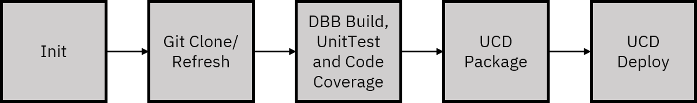
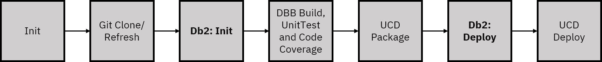

# Jenkins
This chapter introduces you to the basic concepts of the Jenkins automation server and describes how you integrate the previously developed UCD process into the pipeline.

## Introduction
Jenkins is an open source automation server that can be used to automate all sorts of tasks related to building, testing, and delivering or deploying software. The official Jenkins website that hosts downloads, documentation, and more is located at [https://www.jenkins.io](https://www.jenkins.io).

A core component of Jenkins is Pipeline, which supports implementing and integrating continuous delivery (CD) pipelines into Jenkins. A CD pipeline is an automated expression of your process for getting software from version control directly to your users and customers. Every change to your software that gets committed in source control goes through a complex process on its way to being released. This process involves building the software in a reliable and repeatable manner, as well as progressing the built software (called a "build") through multiple stages of testing and deployment.

Pipeline provides an extensible set of tools for modeling very simple to extremely complex delivery pipelines as code via the Pipeline domain-specific language (DSL) syntax. 

The definition of a Jenkins Pipeline is written into a text file called a `Jenkinsfile`, which in turn can be committed to a project’s source control repository. This capability is the foundation of pipeline-as-code because it enables the CD pipeline to be treated as a part of the application, to be versioned and reviewed like any other code.

## Resources for installing and configuring Jenkins
Instructions for installing and configuring Jenkins are beyond the scope of this document. For detailed instructions, review the [official Jenkins documentation](https://www.jenkins.io/doc/book/installing/) and the IBM tutorial ["Build a pipeline with Jenkins, Dependency Based Build, and UrbanCode Deploy"](https://developer.ibm.com/components/zos/tutorials/build-a-pipeline-with-jenkins-dependency-based-build-and-urbancode-deploy).

For our demo, the Jenkins pipeline is configured to execute automatically when a change is pushed to the repository.

## GenApp pipeline stages overview 

The GenApp pipeline that we use for our demo already implements the stages for the application build and deployment as shown in the following figure.

<p align="center">
  
</p>

### 1. Init
Initialize values that are used throughout the pipeline, e.g., build type (commit, merge, or pull request), the Jenkins agent, or environment properties.

### 2. Git Clone/Refresh
Get a fresh local copy of the content of the source code repository.

### 3. DBB Build, UnitTest, and Code Coverage
Run DBB and zUnit to compile the COBOL source code into executable load modules and test them.

### 4. UCD Package
Push a new component version of the COBOL load modules and DBRMs to UCD.

### 5. UCD Deploy
Run the UCD deployment process for the new COBOL component.

## Extending the pipeline with Db2 for z/OS schema changes

Including Db2 for z/OS schema changes in the previously described pipeline requires the addition of two stages, `Db2:Init` and `Db2:Deploy`, as shown in the following figure. These stages are functionally similar to the existing stages 4 and 5. In the sections that describe these two new stages, only parts of the pipeline code are listed. Check out the appendix for instructions for downloading the complete pipeline code.

<p align="center">
  
</p>

### Db2:Init stage
The first stage that you must add to the pipeline initializes and sets parameters for the Db2 schema deployment. The parameters all relate to the definitions that you created in UCD, as described in the previous chapter. The values depend on the type of build that triggered the pipeline. In the case of a commit, the pipeline should deploy to the integration environment. In the case of a merge or pull request, the pipeline should deploy to the golden master environment. The following example shows how to set these parameters for both cases.

```
// Set deployment properties based on build type.
if (!isPullOrMergeRequest()) {
    db2DeployProps = [
        ucdApplication: 'Db2zDeploy_dev',
        ucdEnvironment: 'Integration',
        ucdComponentSchema: 'Db2zSchemaIntegration_dev',
        ucdApplicationProcessSchema: 'SchemaIntegration',
    ]
}

// Deploy to Golden Master, if Pull or Merge Request
else {
    db2DeployProps = [
        ucdApplication: 'Db2zDeploy_dev',
        ucdEnvironment: 'GoldenMaster',
        ucdComponentSchema: 'Db2zSchemaGoldenMaster_dev',
        ucdApplicationProcessSchema: 'SchemaGM',
    ]
}
```

### Db2:Deployment stage
The second stage that you must add to the pipeline pushes a new component version to UCD and executes the deployment process. You can use the [UCD plugin for Jenkins](https://github.com/UrbanCode/jenkins-pipeline-ucd-plugin) to execute both tasks. 

The following example shows the code to push a new component version to UCD. It uses the DDL in the agent's copy of the repository as input.

```
// Push artifacts to UCD.
step([
    $class: 'UCDeployPublisher',
    siteName: 'THINKDEMO',
    component: [
        $class: 'com.urbancode.jenkins.plugins.ucdeploy.VersionHelper$VersionBlock',
        componentName: db2DeployProps.ucdComponentSchema,
        delivery: [
            $class: 'com.urbancode.jenkins.plugins.ucdeploy.DeliveryHelper$Push',
            pushVersion: currentTime.format("yyyy-MM-dd'T'hh:mm:ss.mmm"),
            baseDir: "${WORKSPACE}/nazare-demo-genapp/db2",
            fileIncludePatterns: '',
            fileExcludePatterns: '',
            pushProperties: "JenkinsBuildURL=${BUILD_URL}",
            pushDescription: 'Pushed from Jenkins'
        ]
    ]
])
```

The following example shows the code to execute the deployment process in UCD. It uses the values that you set in the `db2DeployProps` array in the *Db2:Init* stage.

```
// Deploy UCD application process.
step([
    $class: 'UCDeployPublisher',
    siteName: 'THINKDEMO',
    deploy: [
        $class: 'com.urbancode.jenkins.plugins.ucdeploy.DeployHelper$DeployBlock',
        deployApp: db2DeployProps.ucdApplication,
        deployEnv: db2DeployProps.ucdEnvironment,
        deployProc: db2DeployProps.ucdApplicationProcessSchema,
        deployVersions: db2DeployProps.ucdComponentSchema + ':latest',
        deployOnlyChanged: false
    ]
])
```
## Summary
After you add the two Db2-related stages to the pipeline, you're ready to execute your first integrated COBOL and Db2 for z/OS change.
