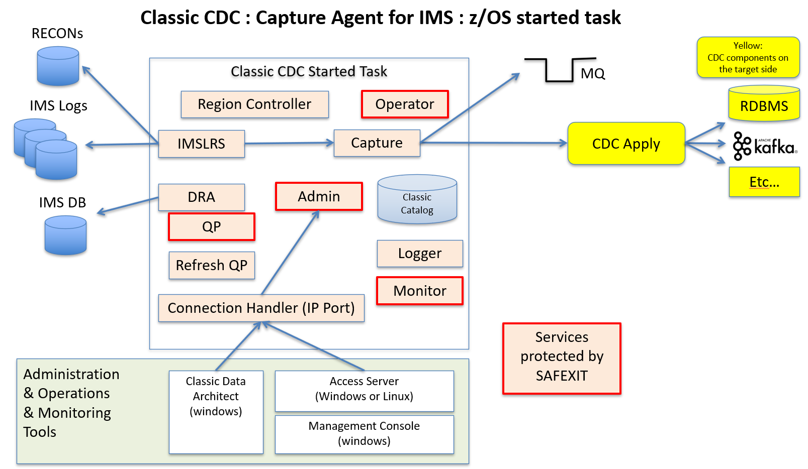

[Back to README.md and Table of Contents.](README.md)

# Setting Up Classic CDC for IMS - Worked Example
This chapter is a worked example of setting up Classic CDC for IMS. 

## Contents

<ul class="toc_list">
<li><a href="#abstract">Abstract</a>   
<li><a href="#1.0">1 Introduction to Classic CDC for IMS</a>
<ul>
  <li><a href="#1.1">1.1 Requirements to Replicate IMS Data</a></li>
  <li><a href="#1.2">1.2 The Classic CDC Started Task</a></li>
</ul>
<li><a href="#2.0">2. High Level Review of Implementation Steps</a>
<li><a href="#3.0">3. SMPE Installation of Code Libraries</a>
<li><a href="#4.0">4. Creating the Classic CDC Instance</a>
<ul>
  <li><a href="#4.1">4.1 Create the Instance Libraries</a></li>
  <li><a href="#4.2">4.2 Edit the Parameters member</a></li>
  <li><a href="#4.3">4.3 Generate the Customised JCL members</a></li>
  <li><a href="#4.4">4.4 Define CDC Logstreams</a></li>  
  <li><a href="#4.5">4.5 Define and Mount the Classic Catalog zFS</a></li>
  <li><a href="#4.6">4.6 Define and Populate the Configuration Datasets</a></li>
  <li><a href="#4.7">4.7 Create the Metadata Catalog</a></li>
  <li><a href="#4.8">4.8 Create the Replication Mapping Datasets</a></li>  
  <li><a href="#4.9">4.9 Setup Encrypted Passwords</a></li>  
</ul> 
<li><a href="#5.0">5. Configure the z/OS Environment</a>
<ul>
  <li><a href="#5.1">5.1 APF Authorised Load Libraries</a></li>
  <li><a href="#5.2">5.2 TCPIP Ports</a></li>
  <li><a href="#5.3">5.3 RACF Started Task ID</a></li>
  <li><a href="#5.4">5.4 Test Start the Classic CDC Server</a></li>  
</ul>
<li><a href="#6.0">6. Configure the IMS Environment</a>
<ul>
  <li><a href="#6.1">6.1 DRA Startup Module</a></li>
  <li><a href="#6.2">6.2 IMS Logging and Notification Exits</a></li>
  <li><a href="#6.3">6.3 Augment DBD to generate T99 Log Records</a></li>
  <li><a href="#6.4">6.4 Copy the IBM-Supplied Exits into IMS RESLIB</a></li>  
</ul>
<li><a href="#7.0">7. Integrate with the wider CDC Landscape</a>
<ul>
  <li><a href="#7.1">7.1 Deploy Classic CDC as a Started Task</a></li>
  <li><a href="#7.2">7.2 Deploy and use the Classic Data Architect IDE</a></li>
  <li><a href="#7.3">7.3 Connect from Management Console to Classic CDC Started Task</a></li>
  <li><a href="#7.4">7.4 Use CHCCLP Scripting</a></li>  
  <li><a href="#7.5">7.5 Conforming to site standards for cross-platform devops and security</a></li>
</ul> 
</ul>


<br><hr>

<h2 id="abstract"> Abstract</h2>
This document is a basic worked example of setting up Classic CDC for IMS as a CDC Source Server. 

* It deals with the practical considerations for implementing IMS as a CDC data source. 
* It's scope is limited to a "basic up and running guide", and is intended to be easy to follow (assuming a base of z/OS and IMS practical experience).
* It does not attempt to cover all the product's features.
* Comprehensive details of the product's features are covered in <a href="https://www.ibm.com/docs/en/idr/11.4.0?topic=replication-infosphere-classic-cdc-zos">IBM Classic CDC knowledge centre.</a>
 

It is part of a series of documents providing practical worked examples and 
guidance for seting up CDC Replication between mainframe data sources and mid-range or Cloud targets.
The complete set of articles can be accessed using the README link at the very top of this page. 

<br><hr>

<h2 id="1.0">1. Introduction to Classic CDC for IMS</h2>  

Classic CDC for IMS is a CDC Capture Source only. It does not have CDC Apply functionality.

<b>Aside:</b> Classic CDC for IMS is licensed seperately from Classic CDC for VSAM. However, these two 
products share a lot of common components. The sister document [Chapter 10.  Setting up Classic CDC for VSAM.](C010_vsam.md) follows the same pattern as this worked 
example for much of the setup work, but has differences with regard to the services to access VSAM and capture changes from VSAM. 

CDC Replication is a set of products that implement a common data replication architecture spanning 
a large number of diverse data sources and targets. The CDC common architecture is based upon replication of 
data that conforms to the relational model. Any CDC capture or apply agent that supports a non-relational data structure 
must perform whatever conversion work that is necessary to implement a mapping between that data structure and the 
relational model of data. 

<h3 id="1.1">1.1 Requirements to Replicate IMS Data</h3> 

The core functionaility of any CDC Capture agent is to read the source database logs asynchronously, 
stage captured data (preferably in memory) until the Unit of Work is commited or rolled back, 
and then publish the committed changes over TCPIP sockets to a CDC Apply agent.

In addition to the usual requirements, Classic CDC for IMS needs to handle the fact that IMS data is stored 
in hierarchical structures (not relational), and the Log configurations supporting IMS workloads (online and batch) 
are significantly different to a comparatively simple recovery log used by most relational databases.

<b>Regarding hierarchical data structures:</b> The Classic CDC for IMS product provides 
a tool (Classic Data Architect) to map the hierarchical data structures
into relational projections of that data, for the purposes of acting as a CDC Replication capture agent. 
The mappings of data structures are stored in a zFS dataset called the "Classic Catalog". This contains relational catalog tables 
like Db2 ( sysibm.systables , sysibm.syscolumns etc... ) that contain the mapping between the fields in the relevant copybooks for the 
IMS data, and their relational projection. The mapping information allows SQL access to the IMS database to retrieve the base data, 
and also allows IMS log records to be consumed for the purposes of capturing IMS database changes.</p>

<b>Regarding IMS logs:</b> Interfaces must be established between Classic CDC and the IMS logging environment, which is managed by DBRC. 
DBRC provides Classic CDC with information about all the IMS log datasets that it needs to track, and notifies Classic CDC when 
log datasets become full and are switched. 
Additionally, new log record types (Type 99) must be cut for IMS databases, because standard Type 50 log records do not contain enough 
information for the purposes of data repliaction.


<h3 id="1.2">1.2 The Classic CDC Started Task</h3>
The diagram below is a representation of the components within a Classic CDC for IMS started task, and how they 
relate to external artefacts.



The services that are outlined in red are the ones that can be protected by the SAF Exit. 
The primary services involved in the cdc capture server are  the IMS Log Reader Service (IMSLRS) and the Capture process (Capture). 
The following is a brief summary of what some of the key services do. 
 <table>
  <tr>
    <th width=300>Service</th>
    <th width=500>Function</th>
  </tr>
  <tr><td>Connection Handler</td>
    <td>Listens on a TCPIP port for requests from other CDC components (Classic Data Architect, 
	Management Console & Access Server, CDC Apply agents).</td>
  </tr> 
  <tr>
   <td>Admin Service</td>
   <td>Dispatches tasks to appropriate services within the Started Task.</td>
  </tr> 
   <tr>
   <td>Query Processor</td>
   <td>Converts SQL requests into DL/I language to access IMS data structures.</td>
  </tr> 
  <tr>
   <td>DRA</td>
   <td>Sevice to connect to IMS via the IMS Database Remote Access interface.</td>
  </tr> 
  <tr>
   <td>IMSLRS</td>
   <td>IMS Log Reader Service.</td>
  </tr> 
  <tr>
   <td>Capture</td>
   <td>Extracts log changes needed for subscriptions, and publishes them over TCPIP to CDC Apply Agents.</td>
  </tr> 
  <tr>
   <td>Operator</td>
   <td>Command Processor. (Start, Stop, Park etc... )</td>
  </tr> 
  <tr>
   <td>Logger</td>
   <td>Writes Started Task logs to z/OS logstreams.</td>
  </tr> 
  <tr>
   <td>Monitor</td>
   <td>Tracks health and performance data.</td>
  </tr> 
</table> 


All the services, and their governing parameters are documented in the knowledge 
centre <a href="https://www.ibm.com/docs/en/idr/11.4.0?topic=zos-configuration-parameters-classic-data-servers-services">Classic Services</a>.

<br><hr>

<h2 id="2.0">2. High Level Review of Implementation Steps</h2>

There are a lot of moving parts, and a lot of inter-related dependencies in setting up Classic CDC for IMS. 
It is helpful to establish a structured overview of the main installation and configuration activities before 
diving into the technical details of very nut and bolt. 
This paper identifies five separate stages of implementation


1. SMPE Installation of Code Libraries
2. Creating the Customised Classic CDC Instance
3. Configure the z/OS Environment
4. Configure the IMS Environment
5. Integrate with the wider CDC Landscape


<br><hr>

<h2 id="3.0">3. SMPE Installation of Code Libraries</h2>
<p>SMPE installation is a well documented, standardised process that every systems programming shop manages with 
their own standards. It is outside the scope of this paper, aside from noting that it is a pre-requisite to the 
followng stages.</p>
<p>Once the SMPE installation is complete, the following target libraries will exist under the chosen high level qualifier. (CCDC in this example).</p>

 <table>
  <tr><td width=200><b>Library</b></td><td width=500><b>Contents</b></td></tr> 
  <tr><td>CCDC.SCACBASE</td><td>Samples</td></tr> 
  <tr><td>CCDC.SCACCONF</td><td>Configuration datsets</td></tr>  
  <tr><td>CCDC.SCACLOAD</td><td>Load modules</td></tr>  
  <tr><td>CCDC.SCACMAC</td><td>Macros</td></tr>  
  <tr><td>CCDC.SCACMSGS</td><td>Messages</td></tr> 
  <tr><td>CCDC.SCACSAMP</td><td>Sample JCL</td></tr>  
  <tr><td>CCDC.SCACSIDE</td><td>Load Modules</td></tr>  
  <tr><td>CCDC.SCACSKEL</td><td>ISPF skeleton library</td></tr>  
</table> 

<br><hr>
	
<h2 id="4.0">4. Creating the Classic CDC Instance</h2>
<p>The installed product code can now be used to support one or more instances of Classic CDC for IMS. 
This worked example will create a single instance, under the instance high level qualifier of CCDC.I1 (in this example).</p>

<h3 id="4.1">4.1 Create the Instance Libraries</h3> 
<p>Creating the instance libraries is easy. Job CECCUSC1 will allocate the instance library, 
and populate the instance library with a parameters file and a job to generate fully customised versions of all the JCL and configuration members that you need</p>
<p>Just edit CCDC.SCACSAMP(CECCUSC1) to specify the high level qualifier for 
the installation library (CACINHLQ=CCDC) and the instance library (CACUSHLQ=CCDC.I1), and submit the job to create the instance libraries.</p> 

```
//GENSAMPE EXEC GENSAMP                                          
//CRTSAMP.SYSTSIN  DD *                                          
 PROFILE NOPREFIX  MSGID                                         
                                                                 
 ISPSTART CMD(%CACCUSX1                                         +
      CACDUNIT=SYSALLDA                                         +
      CACINHLQ=CCDC                                             +
      CACUSHLQ=CCDC.I1                                          +
      ISPFHLQ=ISP                                               +
      ISPFLANG=ENU                                              +
      SERVERROLE=(CDC_IMS_SRC)                                  +
 )                                                               
/*                                                                                                                             
```


The result should be to allocate the following libraries. 
 <table>
  <tr><td width=200>Library</td><td width=500>Initial Contents</td></tr> 
  <tr><td>CCDC.I1.USERCONF</td><td>empty</td></tr> 
  <tr><td>CCDC.I1.USERSAMP</td><td>just a parameters member plus generation job, listed below:</td></tr>  
</table> 

```
CECCUSC2                                                         
CECCUSPC                                                                                                                   
```


<h3 id="4.2">4.2 Edit the Parameters member</h3> 
<p>Editing the parameters member <code>CCDC.I1.USERSAMP(CECCUSPC)</code> is a critical step. It will generate 
fully customised JCL for pretty much everything you need to do to deploy the Classic CDC instance in your environment. 
You will need to gather configuration information for z/OS, TCPIP, IMS, MQ and so forth to populate the parameters member.</p>
<p>Many of the default paramaters will be just fine. You should review the descriptions for each of the parameters that are 
provided inside the parameters member to assess whether they need to be changed in your system. 
In this worked example the parameters (and line numbers for V11.3) that we edited were as follows.</p> 
<ul>
<li>Line 43, specify the installation HLQ <code style="color:#00FF00; background-color:#000000">CACINHLQ="CCDC"</code> 
<li>Line 45, specify the instance HLQ <code style="color:#00FF00; background-color:#000000">CACUSHLQ="CCDC.I1"</code> 
<li>Line 47, specify the default UNIT for DSN creation <code style="color:#00FF00; background-color:#000000">CACDUNIT="SYSALLDA"</code> 
<li>Lines 58 and 59, provide a job card for all the JCLs that will be generated
<li>Line 69, provide the HLQ for the various source datasets that will be created for this instance <code style="color:#00FF00; background-color:#000000">CDCPHLQD="CCDC.I1.CDCSRC"</code>
<li>Line 81, provide the zFS path for the Metadata Catalog that will be created <code style="color:#00FF00; background-color:#000000">CATPATH="/opt/IBM/ccdci1/catalog"</code> 
<li>Line 103, provide the TCPIP listener port for the Server <code style="color:#00FF00; background-color:#000000">CDCPPORT="9087"</code>  
<li>Line 104, provide the Data Source Name for the Server <code style="color:#00FF00; background-color:#000000">CDCDSRCE="SAMPLEDS"</code>  
<li>Line 104, provide the SYSADM ID for the Server <code style="color:#00FF00; background-color:#000000">CDCADMUS="ADMUSER"</code>  
<li>Line 154, Accept the default supplied security exit name for the SAF-protected services <code style="color:#00FF00; background-color:#000000">CDCPSAFX="CACSX04"</code> 
<li>Line 185 and 192, Comment the storage classes for the logstreams (which will result in DASD logstreams, rather than CF logstreams <code style="color:#00FF00; background-color:#000000">**CPLGSC="STG1"</code> and <code style="color:#00FF00; background-color:#000000">**CPEVSC="STG1"</code> 
<li>Line 198, provide the HLQ for the IMS Libraries <code style="color:#00FF00; background-color:#000000">IMSINHLQ="DFSF10"</code> 
<li>Line 208, provide the HLQ for the IMS RESLIB <code style="color:#00FF00; background-color:#000000">IMSSTEPL="&IMS..SDFSRESL"</code> 
<li>Line 228, provide the HLQ for the IMS DBD Library <code style="color:#00FF00; background-color:#000000">IMSDBDLB="&IMS..DBDLIB"</code> 
<li>Line 232, provide the TCPIP port for the Log Reader Notification Exit <code style="color:#00FF00; background-color:#000000">IMCPNPRT="5003"</code>
<li>Line 235, provide the Userid that will access IMS via DRA <code style="color:#00FF00; background-color:#000000">IMSDRAUS="IBMUSER"</code>
<li>Line 236, provide the identification suffix for the DRA Table to use <code style="color:#00FF00; background-color:#000000">IMSDRASX="00"</code> 
</ul>
<p>... and optionally, if you also want to use the ability to publish changes to MQ (in addition to CDC Apply agents)</p>
<ul>
<li>Line 249, provide the HLQ for the MQ Libraries <code style="color:#00FF00; background-color:#000000">CDCMQHLQ="CSQ911"</code>
<li>Line 250, provide the name of the Queue Manager to connect to for MQ publishing<code style="color:#00FF00; background-color:#000000">CDCMQMGR="CSQ9"</code>
<li>Line 255, provide the name of the Bookmark Queue to use for MQ publishing <code style="color:#00FF00; background-color:#000000">CDCBKMKQ="CCDC.BOOKMARK"</code> 
<li>Line 260, provide the name of the Subscription Queue to use for MQ publishing <code style="color:#00FF00; background-color:#000000">CDCSUBLQ="CCDC.IMSPUB"</code>
</ul>

<p>Browse the entire PARMS file in the github repository (opens new tab) <a href="https://github.com/zeditor01/recipes/blob/main/samples/cdc/CECCUSPC_IMS.TXT" target="_blank">here.</a></p>

<h3 id="4.3">4.3 Generate the Customised JCL members</h3> 
<p>The list of parameters above is enough to completely define the Classic CDC instance. All you need is to run a program 
that will merge those paramaters with some skeleton files in order to generate all the customised JCL and configuration members from them. 
Simply edit and submit <code style="color:#00FF00; background-color:#000000">CCDC.I1.USERSAMP(CECCUSC2)</code> to do this.</p>
<p>You should end up with 4 configuration members in <code style="color:#00FF00; background-color:#000000">CCDC.I1.USERCONF</code> and 43 JCL members in <code style="color:#00FF00; background-color:#000000">CCDC.I1.USERSAMP</code>.</p>


<h3 id="4.4">4.4 Define CDC Logstreams</h3> 
<p>Classic CDC uses z/OS Logstreams for the diagnostic log and the event log. The logstreams can be either CF logstreams or DASD logstreams. 
By commenting out the Logstream Storage Class they will ge generated as DASD logstreams in this simple example.</p> 
<p>Review and submit member <code style="color:#00FF00; background-color:#000000">CCDC.I1.USERSAMP(CECCDSLS)</code> to define these as DASD logstreams.</p>

<div class="w3-container" style="color:#00FF00; background-color:#000000">   
<pre> 
<code>//*********************************************</code>
<code>//* ALLOCATE THE LOG STREAM FOR THE EVENT LOG *</code>
<code>//*********************************************</code>
<code>//ALLOCEV    EXEC  PGM=IXCMIAPU                </code>
<code>//SYSPRINT DD SYSOUT=*                         </code>
<code>//SYSOUT   DD SYSOUT=*                         </code>
<code>//SYSIN    DD *                                </code>
<code>   DATA TYPE(LOGR) REPORT(NO)                  </code>
<code>   DEFINE LOGSTREAM NAME(CDCSRC.EVENTS)        </code>
<code>          DASDONLY(YES)                        </code>
<code>          MAXBUFSIZE(4096)                     </code>
<code>          LS_SIZE(1024)                        </code>
<code>          STG_SIZE(512)                        </code>
<code>          RETPD(14) AUTODELETE(YES)            </code>
<code>/*                                             </code>
</pre>
</div>

<p>and</p>

<div class="w3-container" style="color:#00FF00; background-color:#000000">   
<pre> 
<pre>
<code>//************************************************</code>
<code>//* ALLOCATE THE LOG STREAM FOR THE DIAGNOSTIC LOG</code>
<code>//************************************************</code>
<code>//ALLOCDG    EXEC  PGM=IXCMIAPU                   </code>
<code>//SYSPRINT DD SYSOUT=*                            </code>
<code>//SYSOUT   DD SYSOUT=*                            </code>
<code>//SYSIN    DD *                                   </code>
<code>   DATA TYPE(LOGR) REPORT(NO)                     </code>
<code>   DEFINE LOGSTREAM NAME(CDCSRC.DIAGLOG)          </code>
<code>          DASDONLY(YES)                           </code>
<code>          LS_SIZE(1024)                           </code>
<code>          STG_SIZE(512)                           </code>
<code>          RETPD(7) AUTODELETE(YES)                </code>
<code>/*                                                </code>
</pre>
</div>

<h3 id="4.5">4.5 Define and Mount the Classic Catalog zFS</h3> 
<p>The Metadata Catalog is conceptually similar to the Db2 catalog ( SYSTABLES, SYSCOLUMNS etc… ). 
Not only does it store metadata about IMS Tables, but it also contains the details of the IMS to relational model mapping.</p> 
<p>The Metadata catalog is deployed as a zFS which needs to be mounted at the path specified for “CATPATH” in CECCUSPC.</p>
<p>The zFS is allocated with generated job CECCRZCT. 
The VSAM cluster is defined in the first job step as <code>CCDC.I1.ZFS</code>, and the zFS is formatted in the second job step. 
Review the submit <code>CCDC.I1.USERSAMP(CECCRZCT)</code> to define the Metadata Catalog.</p>

<div class="w3-container" style="color:#00FF00; background-color:#000000">   
<pre> 
<code> DEFINE CLUSTER ( -    </code>
<code>   NAME(CCDC.I1.ZFS) - </code>
<code>   LINEAR -            </code>
<code>   MEGABYTES(150 128) -</code>
<code>   VOLUMES(*) -        </code>
<code>   SHAREOPTIONS(3 3)  -</code>
<code>   CISZ(4096))         </code>
</pre>
<p>and</p>
<pre>   
<code>//FORMAT EXEC PGM=IOEAGFMT,REGION=0M,       </code>
<code>//    COND=(0,LT),                          </code>
<code>//    PARM='-aggregate CCDC.I1.ZFS  -compat'</code>
</pre> 
</div>


<h3 id="4.6">4.6 Define and Populate the Configuration Datasets</h3> 
<p>Classic CDC for IMS is governed by a number of parameters that are defined in the configuration datasets. 
Parameters governing threads, memory, tcpip ports and so forth, as documented in the knowledge centre. 
The creation and population of the configuration datasets is controlled by job CECCDCFG. Review the generated JCL and submit when happy.</p>
 
<div class="w3-container" style="color:#00FF00; background-color:#000000">   
<pre>
<code>//CFGALLOC     EXEC PGM=IEFBR14                       </code>
<code>//CACCFGD      DD  DSN=&CPHLQ..CACCFGD,               </code>
<code>//             UNIT=&DISKU,                           </code>
<code>//             STORCLAS=&STGCL,                       </code>
<code>//             MGMTCLAS=&MGTCL,                       </code>
<code>//             SPACE=(TRK,(20,10)),                   </code>
<code>//             DCB=(RECFM=FBS,LRECL=64,BLKSIZE=27968),</code>
<code>//             DISP=(NEW,CATLG,DELETE)                </code>
<code>//CACCFGX  DD  DSN=&CPHLQ..CACCFGX,                   </code>
<code>//             UNIT=&DISKU,                           </code>
<code>//             STORCLAS=&STGCL,                       </code>
<code>//             MGMTCLAS=&MGTCL,                       </code>
<code>//             SPACE=(TRK,(10,5)),                    </code>
<code>//             DCB=(RECFM=FBS,LRECL=64,BLKSIZE=27968),</code>
<code>//             DISP=(NEW,CATLG,DELETE)                </code>
<code>//*                                                   </code>
</pre>
</div>

<p>and the final step imports the default parameter values into the configuration datasets</p>

<div class="w3-container" style="color:#00FF00; background-color:#000000">   
<pre>
<code>//ALLOCATE EXEC ALLOCFG                         </code>
<code>//CFGINIT.SYSIN DD *                            </code>
<code>IMPORT,CONFIG,FILENAME=DDN:IMPORTCF(CECCDXFG)   </code>
<code>REPORT                                          </code>
<code>QUIT                                            </code>
<code>/*                                              </code>
</pre>
</div>

<h3 id="4.7">4.7 Create the Metadata Catalog</h3> 
<p>The Metadata Catalog is a zFS that holds catalog tables ( systables, syscolumns etc... ). 
The CACCATUT utility is used to create the metadata catalog tables in the Metadata Catalog. 
This is performed using job CECCDCAT. Review the generated JCL and submit when happy.</p>

<div class="w3-container" style="color:#00FF00; background-color:#000000">   
<pre>
<code>//INIT     EXEC PGM=CACCATUT,PARM='INIT',REGION=&RGN       </code>
<code>//STEPLIB  DD  DISP=SHR,DSN=&CAC..SCACLOAD                 </code>
<code>//SYSOUT   DD  SYSOUT=&SOUT                                </code>
<code>//SYSPRINT DD  SYSOUT=&SOUT                                </code>
<code>//MSGCAT   DD  DISP=SHR,DSN=&CAC..SCACMSGS                 </code>
<code>//CACCAT   DD  PATHDISP=(KEEP,KEEP),                       </code>
<code>//             PATH='/opt/IBM/isclassic113/catalog/caccat' </code>
<code>//CACINDX  DD  PATHDISP=(KEEP,KEEP),                       </code>
<code>//             PATH='/opt/IBM/isclassic113/catalog/cacindx'</code>
</pre>
</div>

<h3 id="4.8">4.8 Create the Replication Mapping Datasets</h3> 
<p>The Replication Mapping datasets are used to hold the metadata to support subscriptions from IMS to targets like Kafka. 
These mapping datasets will be empty until you start defining subscriptions using Management Console or CHCCLP scripts. 
This is performed using job CECCDSUB. Review the generated JCL and submit when happy.</p>

<div class="w3-container" style="color:#00FF00; background-color:#000000">   
<pre>
<code> DEFINE CLUSTER                  - </code>
<code>    (NAME(&CPHLQ..SUB)        -    </code>
<code>     RECSZ(1024 2048)            - </code>
<code>     KEY(80 12)                  - </code>
<code>     CYL(2 1)                    - </code>
<code>     SPEED REUSE)                - </code>
<code>  DATA                           - </code>
<code>    (NAME(&CPHLQ..SUB.DATA)   -    </code>
<code>     CISZ(8192)                  - </code>
<code>     FSPC(20 5))                 - </code>
<code>  INDEX                          - </code>
<code>    (NAME(&CPHLQ..SUB.INDEX)  -    </code>
<code>     CISZ(6144))                   </code>
<code> /**/                              </code>
<code> DEFINE CLUSTER                  - </code>
<code>    (NAME(&CPHLQ..RM)        -     </code>
<code>     RECSZ(512 2432)             - </code>
<code>     KEY(20 12)                  - </code>
<code>     CYL(15 5)                   - </code>
<code>     SPEED REUSE)                - </code>
<code>   DATA                          - </code>
<code>     (NAME(&CPHLQ..RM.DATA)   -    </code>
<code>      CISZ(8192)                 - </code>
<code>      FSPC(20 5))                - </code>
<code>   INDEX                         - </code>
<code>     (NAME(&CPHLQ..RM.INDEX)  -    </code>
<code>      CISZ(2048))                  </code>
<code>/*                                 </code>
</pre>
</div>


<h3 id="4.8">4.9 Setup Encrypted Passwords</h3> 
<p>Assuming that you enabled security in the CACCUSPC parameters file earlier: <code style="color:#00FF00; background-color:#000000">CDCPSAFX="CACSX04"</code> 
you will need to setup encrypted passwords for connections to the Classic CDC instance. (Enabling security requires providing a password for all user access. 
The utilities used in the validation job require encrypted passwords to access the Classic data server.)</p>
<p>The following steps are required to generate an encrypted password for the userid that will run jobs to access Classic CDC, and save it in a referencable PDS member.</p>

<p>Edit <code style="color:#00FF00; background-color:#000000">CCDC.I1.USERCONF(CACPWDIN)</code>. Set the value to the TSO password (SYS1) for the User ID (IBMUSER) that you use to run the customization jobs.</p>
<center></center>

<p>Submit <code style="color:#00FF00; background-color:#000000">CCDC.I1.USERSAMP(CACENCRP)</code> JCL to run the password generator utility, which updates <code style="color:#00FF00; background-color:#000000">CCDC.I1.USERCONF(CACPWDIN)</code> with the encrypted value.</p>
<center></center>

<p>Edit <code style="color:#00FF00; background-color:#000000">CCDC.I1.USERCONF(CACPWDIN)</code> again and copy the hex string value for the ENCRYPTED= keyword.</p>
<center></center>

<p>Edit <code style="color:#00FF00; background-color:#000000">CCDC.I1.USERCONF(CACMUCON)</code> and replace the X'.ENCRYP PASSWD..' string with the hex string copied in the previous step.</p>
<center></center>

<p>Edit <code style="color:#00FF00; background-color:#000000">CCDC.I1.USERSAMP(CACQRSYS)</code> and replace the second line of the member with the hex string that you copied.</p>
<center></center>


<p><code style="color:#00FF00; background-color:#000000">CCDC.I1.USERCONF(CACMUCON)</code> and <code style="color:#00FF00; background-color:#000000">CCDC.I1.USERSAMP(CACQRSYS)</code> will be 
referenced by the Installation Verification Jobs, and other utility jobs. Click through the slideshow sequence below to follow the example above</p)


<br><hr>

<h2 id="5.0">5. Configure the z/OS Environment</h2>
<p>Every z/OS environment will have different constraints and considerations for deployment. 
This worked example was implement on a Z Development and Test v13 environment, using the z/OS v2.4 stack provided by ADCD v13. 
The z/OS customizations that I needed to do were as follows</p>

<h3 id="5.1">5.1 APF Authorised Load Libraries</h3>
<p>The Classic CDC Load Libraries need to be APF Authorized. 
With the ADCD distribution I simply added these libraries to ADCD.Z24C.PARMLIB(PROGAD)</p>

<div class="w3-container" style="color:#00FF00; background-color:#000000">   
<pre>
<code>/**********************************************/                      </code>
<code>/*  CCDC 11.4                                 */                      </code>
<code>/**********************************************/                      </code>
<code>APF ADD                                                               </code>
<code>    DSNAME(CCDC.SCACLOAD)                               VOLUME(USER0B)</code>
</pre>
</div>	
	
<h3 id="5.2">5.2 TCPIP Ports</h3> 
<p>Classic CDC for IMS is configured to listen on one port. I used the default port of 9087. 
The ADCD z/OS v2.4 distribution does not lock high ports, so I didn’t have any network administration to perform to open port 9087.</p> 

<h3 id="5.3">5.3 RACF Started Task ID</h3> 
<p>For the ZD&T environment I didn’t bother the define a started task ID to RACF. 
I just added the PROC to ADCD.Z24B.PROCLIB and ran it as START1.</p>

<h3 id="5.4">5.4 Test Start the Classic CDC Server</h3> 
<p>The Classic CDC Server has not yet been configured to attach to the various IMS interfaces that are neeed. 
However, this is a good point to start the server and resolve any problems with the Classic CDC Server.  
You can test the Classic CDC as a Job using the JCL in member CECCDSRC, and then deploy it as a started task later on.
Upon first start, you should expect to see the Classic CDC Server come up, but report failures on connection to IMS DRA
</p>

 

<p>Further down the job output you may spot more detailed error messages and return codes which will give you more insight into any problems. 
Specifically the SpcRC codes can be particularly useful.</p> 

 

<p>Specifically, if you lookup SPcRC(00570082) in the Classic CDC Messages 
publication you will see the following explanation:</p>

<p style="margin-left: 50px"><b>0x00570082</b> (5701762) The DRA initialization failed.
User response: See the system log from the data
server for more information on the cause. This is
usually a problem in either the JCL for the data server
or the task parameters for the service information entry
of the DRA service.</p>

<p>It should be expected that Classic CDC will initially have errors connecting to IMS, which will be resolved when you have completed the IMS configuration work, which is 
covered in the next section.</p>

<p>Additionally, if you configured the CECCUSPC parameters to include an MQ target, then you are likely to experience MQ connection errors until you resolve
RACF permissions.</p>

<br><hr>

<h2 id="6.0">6. Configure the IMS Environment</h2>
<p>This is the section where Classic CDC differs from deploying CDC for a relational data source. 
CDC needs the following 3 things that are more complex to provide from IMS than Db2.</p>
<ul>
<li>SQL Access to IMS databases (for development work, and cdc initialization of target)
<li>Access to IMS Logs, and notifications when logs are activated and deactivated
<li>Additional IMS logging, with sufficient information for replication purposes.
</ul>

<h3 id="6.1">6.1 DRA Startup Module</h3>
<p>When a CDC Capture agent works with a relational database it uses the SQL interface to the database 
to obtain the data structures in the development phase, and to perform a full refresh in the operational phase. 
With Classic CDC for IMS we use the IMS DRA interface to achieve these tasks.</p>
<p>You need to assemble a DRA Table with an assemble and link edit job. 
My example below was used to assemble and link edit a DRA Table called DFSPZP01, which is written to the IMS RESLIB.</p>

<div class="w3-container" style="color:#00FF00; background-color:#000000">   
<pre>
<code>//IBMUSERS   JOB (ASMDRA),'ASMDRA',                                     </code>
<code>//            CLASS=A,MSGCLASS=H,NOTIFY=&SYSUID                         </code>
<code>//ASM EXEC PGM=ASMA90,                                                  </code>
<code>//       PARM='DECK,NOOBJECT,LIST,XREF(SHORT),ALIGN',                   </code>
<code>//       REGION=4096K                                                   </code>
<code>//SYSLIB DD DSN=DFSF10.OPTIONS,DISP=SHR                                 </code>
<code>//       DD DSN=DFSF10.SDFSMAC,DISP=SHR                                 </code>
<code>//       DD DSN=SYS1.MACLIB,DISP=SHR                                    </code>
<code>//*                                                                     </code>
<code>//SYSUT1 DD UNIT=SYSDA,SPACE=(1700,(400,400))                           </code>
<code>//SYSUT2 DD UNIT=SYSDA,SPACE=(1700,(400,400))                           </code>
<code>//SYSUT3 DD UNIT=SYSDA,SPACE=(1700,(400,400))                           </code>
<code>//SYSPUNCH DD DSN=&&OBJMOD,                                             </code>
<code>//       DISP=(,PASS),UNIT=SYSDA,                                       </code>
<code>//       DCB=(RECFM=FB,LRECL=80,BLKSIZE=400),                           </code>
<code>//       SPACE=(400,(100,100))                                          </code>
<code>//SYSPRINT DD SYSOUT=*                                                  </code>
<code>//SYSIN DD *                                                            </code>
<code>PZP      TITLE 'DATABASE RESOURCE ADAPTER STARTUP PARAMETER TABLE'      </code>
<code>DFSPZP00 CSECT                                                          </code>
<code>**********************************************************************  </code>
<code>*        MODULE NAME: DFSPZP00                                       *  </code>
<code>*                                                                    *  </code>
<code>*        DESCRIPTIVE NAME: DATABASE RESOURCE ADAPTER (DRA)           *  </code>
<code>*                  STARTUP PARAMETER TABLE.                          *  </code>
<code>*                                                                    *  </code>
<code>*        FUNCTION: TO PROVIDE THE VARIOUS DEFINITIONAL PARAMETERS    *  </code>
<code>*                  FOR THE COORDINATOR CONTROL REGION. THIS          *  </code>
<code>*                  MODULE MAY BE ASSEMBLED BY A USER SPECIFYING      *  </code>
<code>*                  THEIR PARTICULAR NAMES, ETC. AND LINKEDITED       *  </code>
<code>*                  INTO THE USER RESLIB AS DFSPZPXX.  WHERE XX       *  </code>
<code>*                  IS EITHER 00 FOR THE DEFAULT, OR ANY OTHER ALPHA- *  </code>
<code>*                  NUMERIC CHARACTERS.                               *  </code>
<code>*                                                                    *  </code>
<code>**********************************************************************  </code>
<code>         EJECT                                                          </code>
<code>         DFSPRP DSECT=NO,                                              X</code>
<code>               DBCTLID=IVP1,                                           X</code>
<code>               DDNAME=CCTLDD,                                          X</code>
<code>               DSNAME=DFSF10.SDFSRESL,                                 X</code>
<code>               MAXTHRD=99,                                             X</code>
<code>               MINTHRD=10,                                             X</code>
<code>               TIMER=60,                                               X</code>
<code>               USERID=,                                                X</code>
<code>               CNBA=10,                                                X</code>
<code>               FPBUF=,                                                 X</code>
<code>               FPBOF=,                                                 X</code>
<code>               TIMEOUT=60,                                             X</code>
<code>               SOD=A,                                                  X</code>
<code>               AGN=                                                     </code>
<code>         END                                                            </code>
<code>/*                                                                      </code>
<code>//LNKEDT EXEC PGM=IEWL,                                                 </code>
<code>//       PARM='LIST,XREF,LET,NCAL'                                      </code>
<code>//SYSUT1 DD UNIT=SYSDA,SPACE=(1024,(100,50))                            </code>
<code>//SYSPRINT DD SYSOUT=*                                                  </code>
<code>//SYSLMOD  DD DSN=DFSF10.SDFSRESL,DISP=SHR                              </code>
<code>//SYSLIN   DD DISP=(OLD,DELETE),DSN=&&OBJMOD                            </code>
<code>//         DD DDNAME=SYSIN                                              </code>
<code>//SYSIN    DD *                                                         </code>
<code>   NAME  DFSPZP01(R)                                                    </code>
<code>/*                                                                      </code>
</pre>
</div>

<p>Download JCL from github repository (opens new tab) <a href="https://github.com/zeditor01/recipes/blob/main/samples/cdc/asmbldra.jcl" target="_blank">here.</a></p>
<p><b>Note the deliberate mistake! </b></p>
<sl>
<li>We just generated a DRA Table with suffix 01 <code style="color:#00FF00; background-color:#000000">NAME DFSPZP01 (R)</code></p>
<li>Back in section 4.2 I coded my parameters member with suffix 00 <code style="color:#00FF00; background-color:#000000">IMSDRASX="00"</code>
</sl>
<p>That "mistake" serves to force us to review how to change the Classic CDC Service parameters.</p>
<p>One way of changing service parameters is by modifying the started task. The MTO commands below 
show example of how to edit the DRA Userid and the DRA Suffix</p> 

<div class="w3-container" style="color:#00FF00; background-color:#000000">   
<pre>
<code>F CCDC,SET,CONFIG,SERVICE=IMSDRA,DRATABLESUFFIX=’01’</code>
<code>F CCDC,SET,CONFIG,SERVICE=IMSDRA,DRAUSERID=’IBMUSER’</code>
</pre> 
</div>

<p>Another way of changing the Classic CDC Service paramters is by using the Classic Data Architect IDE, which is 
shown later on in section 7.2 of this paper.</p>

<h3 id="6.2">6.2 IMS Logging and Notification Exits</h3> 
<p>When a CDC Capture agent works with a relational database, it normally only has a single database log to deal with. 
IMS can be different, with multiple regions, the (small) possibility of DLI Batch jobs and so forth. 
So, Classic CDC for IMS requires that IMS tells it about log activations, deactivations and switches.</p>
<p>This is done with the <b>IMS Partner Program User Exit</b> (PPUE). 
<p>A modified PPUE must be created and deployed into IMS RESLIB. 
The module CEC1OPT must be assembled, and contain the TCPIP Log Reader Notification Port 
that was defined in the CECCUSPC parameters module <code style="color:#00FF00; background-color:#000000">IMCPNPRT="5003"</code>.</p>
<p>A sample assembler source module (CECE1OPT) is provided for the PPUE here :  <code style="color:#00FF00; background-color:#000000">CCDC.I1.USERSAMP(CECE1OPT)</code>.</p> 
<p>You need to edit the module to suit your environment. 
In the worked example below the TCPIP address of the z/OS system was 192.168.1.191 and 
Classic CDC Server is configured to listen on port 5003.</p>  

<div class="w3-container" style="color:#00FF00; background-color:#000000">   
<pre>
<code>**********************************************************************  </code>
<code>*                                                                    *  </code>
<code>* NAME:        CECE1OPT                                              *  </code>
<code>*                                                                    *  </code>
<code>* DESCRIPTION: CHANGE CAPTURE RECOVERY AGENT MESSAGES AND OPTIONS    *  </code>
<code>*                                                                    *  </code>
<code>**********************************************************************  </code>
<code>CECE1OPT CSECT                                                          </code>
<code>CECE1OPT AMODE 31                                                       </code>
<code>CECE1OPT RMODE ANY                                                      </code>
<code>         DC    A(VECTORS)                                               </code>
<code>         DC    C'CECE1OPT',C' '   |                                     </code>
<code>         DC    C'&SYSDATE',C' '   |                                     </code>
<code>         DC    C'&SYSTIME',C' '   |                                     </code>
<code>         DS    0H                                                       </code>
<code>VECTORS  DC    A(PFXOPTS)         | PREFIX OPTIONS                      </code>
<code>VERSION  DC    AL2(1)             | VERSION                             </code>
<code>**********************************************************************  </code>
<code>* Set RESPTOUT (The number of seconds for notification time-out).    *  </code>
<code>* It must contain a number from 1 to 60. The Default is 30 seconds.  *  </code>
<code>**********************************************************************  </code>
<code>RESPTOUT DC    AL2(30)            | 30 seconds = DEFAULT                </code>
<code>*                                                                       </code>
<code>         DC    6A(0)              | RESERVED FOR FUTURE USE             </code>
<code>PFXOPTS  DS    0F                                                       </code>
<code>         DC    AL2(PFXOPTSL)      | LENGTH OF OPTION AREA               </code>
<code>**********************************************************************  </code>
<code>**********************************************************************  </code>
<code>* Set IPVSN to 4 to connect to the server using IPv4.                *  </code>
<code>* Set IPVSN to 6 to connect to the server using IPv6.                *  </code>
<code>**********************************************************************  </code>
<code>IPVSN    DC    AL1(4)             | 4=IPv4, 6=IPv6                      </code>
<code>         DC    AL1(0)             | Reserved                            </code>
<code>                                                                        </code>
<code>**********************************************************************  </code>
<code>* The IPV6 field is ignored when IPVSN is set to 4, and the          *  </code>
<code>* IPV4 field is ignored when IPVSN is set to 6.                      *  </code>
<code>*                                                                    *  </code>
<code>* The IPv4 address format is 0.0.0.0.                                *  </code>
<code>*                                                                    *  </code>
<code>* The IPv6 address format is 9:3155:3155:3155:0:0:0:0.               *  </code>
<code>**********************************************************************  </code>
<code>TCPADDR4 DC    AL1(192),AL1(168),AL1(1),AL1(191)   IPv4 addr            </code>
<code>TCPADDR6 DC    AL2(9)               IPv6 addr - 1st 16 bits             </code>
<code>         DC    AL2(3155)            IPv6 addr - 2nd 16 bits             </code>
<code>         DC    AL2(3155)            IPv6 addr - 3rd 16 bits             </code>
<code>         DC    AL2(3155)            IPv6 addr - 4th 16 bits             </code>
<code>         DC    AL2(0)               IPv6 addr - 5th 16 bits             </code>
<code>         DC    AL2(0)               IPv6 addr - 6th 16 bits             </code>
<code>         DC    AL2(0)               IPv6 addr - 7th 16 bits             </code>
<code>         DC    AL2(0)               IPv6 addr - 8th 16 bits             </code>
<code>**********************************************************************  </code>
<code>* Set the PORT field to the port number (decimal)                    *  </code>
<code>**********************************************************************  </code>
<code>PORT     DC    AL2(5003)                     TCP PORT                   </code>
<code>PFXOPTSL EQU   *-PFXOPTS                                                </code>
<code>         END                                                            </code>
</pre>	 
</div>		 
	
<p>The CECE1OPT module was assembled and linkedited using the job below</p>

<div class="w3-container" style="color:#00FF00; background-color:#000000">   
<pre>
<code>//IBMUSERN JOB 1,IBMUSERN,MSGCLASS=A,MSGLEVEL=(1,1),  </code>
<code>//         CLASS=A,NOTIFY=$SYSUID                     </code>
<code>//ASM EXEC PGM=ASMA90,                                </code>
<code>//       PARM='DECK,NOOBJECT,LIST,XREF(SHORT),ALIGN', </code>
<code>//       REGION=4096K                                 </code>
<code>//SYSLIB DD DSN=DFSF10.OPTIONS,DISP=SHR               </code>
<code>//       DD DSN=DFSF10.SDFSMAC,DISP=SHR               </code>
<code>//       DD DSN=SYS1.MACLIB,DISP=SHR                  </code>
<code>//*                                                   </code>
<code>//SYSUT1 DD UNIT=SYSDA,SPACE=(1700,(400,400))         </code>
<code>//SYSUT2 DD UNIT=SYSDA,SPACE=(1700,(400,400))         </code>
<code>//SYSUT3 DD UNIT=SYSDA,SPACE=(1700,(400,400))         </code>
<code>//SYSPUNCH DD DSN=&&OBJMOD,                           </code>
<code>//       DISP=(,PASS),UNIT=SYSDA,                     </code>
<code>//       DCB=(RECFM=FB,LRECL=80,BLKSIZE=400),         </code>
<code>//       SPACE=(400,(100,100))                        </code>
<code>//SYSPRINT DD SYSOUT=*                                </code>
<code>//SYSIN DD DSN=CCDC.I1.USERSAMP(CECE1OPT),DISP=SHR    </code>
<code>//LNKEDT EXEC PGM=IEWL,                               </code>
<code>//       PARM='LIST,XREF,LET,NCAL'                    </code>
<code>//SYSUT1 DD UNIT=SYSDA,SPACE=(1024,(100,50))          </code>
<code>//SYSPRINT DD SYSOUT=*                                </code>
<code>//SYSLMOD  DD DSN=DFSF10.SDFSRESL,DISP=SHR            </code>
<code>//SYSLIN   DD DISP=(OLD,DELETE),DSN=&&OBJMOD          </code>
<code>//         DD DDNAME=SYSIN                            </code>
<code>//SYSIN    DD *                                       </code>
<code>   NAME  CECE1OPT(R)                                  </code>
<code>/*                                                    </code>
</pre>	
</div>

<h3 id="6.3">6.3 Augment DBD to generate T99 Log Records</h3> 
<p>A third difference between Classic CDC for IMS and CDC for a relational source is IMS logging.</p>
<p>In order to perform data replication it is necessary that the database is instructed to 
write log records with all the before and after images in the log record. 
(Normally databases only write sufficient data into the log records to support recovery).</p>
<p>For Db2 databases, the log records can simply be expanded for the tables of interest, by altering 
the definition, with DDL such as:</p>
<pre> 
<code style="color:#00FF00; background-color:#000000">ALTER TABLE MYSCHEMA.MYTABLE DATA CAPTURE CHANGES</code>.
</pre>
<p>IMS is different. IMS generates Type 50 log records by default. 
In order to support data replication you need to augment the IMS database to write Type 99 log records, 
which are designed for the purposes of data replication.
This requires the IMS database to be “augmented” with an EXIT clause to specify the content 
to be written to the Type 99 log records.</p> 
<p>This worked example used the IBM-provided sample database (DI21PART) as the CDC source database. 
The DBD source is stored in <code style="color:#00FF00; background-color:#000000">DFSF10.SDFSISRC(DI21PART)</code>. 
This example only adds the EXIT clause to three specific segments (PARTROOT, STANINFO, STOKSTAT). 
You can choose to augment whichever segments you want, or you could augment the entire database on the DBD statement. 
This DBD source in this worked example was edited to specify Type 99 logging as follows.</p>

<div class="w3-container" style="color:#00FF00; background-color:#000000">   
<pre>
<code>         DBD   NAME=DI21PART,ACCESS=(HISAM,VSAM)                        </code>
<code>      DATASET  DD1=DI21PART,DEVICE=3380,OVFLW=DI21PARO,                X</code>
<code>               SIZE=(2048,2048),RECORD=(678,678)                        </code>
<code>      SEGM     NAME=PARTROOT,PARENT=0,BYTES=50,FREQ=250,               X</code>
<code>               EXIT=(*,NOKEY,DATA,NOPATH,(NOCASCADE))                   </code>
<code>      FIELD    NAME=(PARTKEY,SEQ),TYPE=C,BYTES=17,START=1               </code>
<code>      SEGM     NAME=STANINFO,PARENT=PARTROOT,BYTES=85,FREQ=1,          X</code>
<code>               EXIT=(*,KEY,DATA,NOPATH,(NOCASCADE))                     </code>
<code>      FIELD    NAME=(STANKEY,SEQ),TYPE=C,BYTES=2,START=1                </code>
<code>      SEGM     NAME=STOKSTAT,PARENT=PARTROOT,BYTES=160,FREQ=2,         X</code>
<code>               EXIT=(*,KEY,DATA,NOPATH,(NOCASCADE))                     </code>
<code>      FIELD    NAME=(STOCKEY,SEQ),TYPE=C,BYTES=16,START=1               </code>
<code>      SEGM     NAME=CYCCOUNT,PARENT=STOKSTAT,BYTES=25,FREQ=1            </code>
<code>      FIELD    NAME=(CYCLKEY,SEQ),TYPE=C,BYTES=2,START=1                </code>
<code>      SEGM     NAME=BACKORDR,PARENT=STOKSTAT,BYTES=75,FREQ=0            </code>
<code>      FIELD    NAME=(BACKKEY,SEQ),TYPE=C,BYTES=10,START=1               </code>
<code>      DBDGEN                                                            </code>
<code>      FINISH                                                            </code>
<code>      END                                                               </code>
</pre>	
</div>
  
<p>After changing the DBD, an ACBGEN is required to cause the changes to be implemented. 
The following job was submitted to perform the ACBGEN.</p>

<div class="w3-container" style="color:#00FF00; background-color:#000000">   
<pre>
<code>//IBMUSERS   JOB (CRTZFS),'CRTZFS',                      </code>
<code>//            CLASS=A,MSGCLASS=H,NOTIFY=&SYSUID          </code>
<code>//USRPROC     JCLLIB ORDER=(DFSF10.SDFSPROC)             </code>
<code>//IVPDB1    EXEC PROC=DFSDBDGN,SOUT='*',MBR=DI21PART,    </code>
<code>//          NODE1='DFSF10',NODE2='DFSF10',SYS2=''        </code>
<code>//C.SYSIN   DD DISP=SHR,DSN=DFSF10.SDFSISRC(&MBR)        </code>
<code>//IVPPSB    EXEC PROC=DFSPSBGN,SOUT='*',MBR=DFSSAM14,    </code>
<code>//          NODE1='DFSF10',NODE2='DFSF10',SYS2=''        </code>
<code>//C.SYSIN   DD DISP=SHR,DSN=DFSF10.SDFSISRC(&MBR)        </code>
<code>//IVPACB    EXEC PROC=ACBGEN,SOUT='*',                   </code>
<code>//          NODE1='DFSF10',NODE2='DFSF10',SYS2=''        </code>
<code>//G.SYSIN   DD *                                         </code>
<code>  BUILD DBD=DI21PART                                     </code>
<code>/*                                                       </code>
<code>//ACBLIBA  EXEC PROC=OLCUTL,SOUT='*',TYPE=ACB,IN=S,OUT=A,</code>
<code>//          NODE1='DFSF10',NODE2='DFSF10',SYS2=''        </code>
<code>//ACBLIBB  EXEC PROC=OLCUTL,SOUT='*',TYPE=ACB,IN=S,OUT=B,</code>
<code>//          NODE1='DFSF10',NODE2='DFSF10',SYS2=''        </code>
</pre>
</div>
  
<h3 id="6.4">6.4 Copy the IBM-Supplied Exits into IMS RESLIB</h3> 
<p>Having made the changes to support the Partner Program Notification interface, and the Enhanced IMS database logging, 
you need to copy the IBM-Supplied Exits from CCDC.SCACLOAD into IMS RESLIB.</p>
<ul>
<li>Copy CCDC.SCACLOAD(SDFSRESL) to IMS RESLIB, or a concatenated library.
<li>Copy DFSPPUE0 from wherever you created in to IMS RESLIB, or a concatenated library.
</ul>

<p>That's it for the Classic CDC Server !!!</p>

<br><hr>

<h2 id="7.0">7. Integrate with the wider CDC Landscape</h2>
<p>Now that the mainframe CDC Capture Server is ready for business, you will need to start using some non-mainframe tools in order 
to define "IMS Tables", and define Subscriptions from them to target systems. Section 7 covers this matters.</p>

<h3 id="7.1">7.1 Deploy Classic CDC as a Started Task</h3> 
<p>Assuming you want to run Classic CDC as a started task, rather than a batch job, you should copy 
the contents of the JCL to run Classic CDC as a batch job <code style="color:#00FF00; background-color:#000000">CCDC.I1.USERSAMP(CECCDSRC)</code> 
to your PROCLIB, and follow your site standards for establishing a new started task.</p> 

<h3 id="7.2">7.2 Deploy and use the Classic Data Architect IDE</h3>
<p>The next step is to create some "IMS Tables" to be used as CDC replication source objects.</p>
<p>The Classic CDC Metadata catalog contains the mapping information from hierarchical IMS structures to the 
a relational projection, as is required to participate in CDC data replication. The mapping process is enabled 
by using an Eclipse-based tool called the Classic Data Architect to define the data mapping.</p>
<p>The current release of the Classic Data Architect tool should be downloaded from IBM fix Central. 
Installation to Windows is a standard setup.exe style of installer.</p>
<p>Once CDA is installed, the tasks you will need to perform with it are as follows:</p>
<ol>
<li>Configure the connection to the Classic CDC started task
<li>Create a data development project, and Import DBDs and Copybooks for the mapping work
<li>Develop a relational model "IMS Table" based on the imported DBDs and copybooks 
<li>Deploy the "IMS Table" to the Classic CDC for IMS Started Task
<li>Test the validity of the IMS Table Mapping using SQL through the CDA
<li>Make the IMS Table available for use as a source for CDC subscriptions 
</ol> 

<h4>7.2.1 Configure the connection to the Classic CDC started task</h4>

<p>Start up the CDA and choose a workspace on your PC filesystem.</p>
<p>Verify that you are using the "Data Perspective" from the Action Bar : Window - Open Perspective - Data.</p>
<p>The Data Perpective is shown in the screenshot below.</p>  
<ul>
<li>Top-Left Window : The project explorer
<li>Top-Middle Window : Working subject pane (contents depend on what objects are selected)
<li>Bottom-Left Window : Data Source Explorer (data soucre data access) and Console Explorer (data source configurations).
</ul>
<center></center> 

<p>In order to make a connection to the Classic CDC Server you must open up the "Data Source Explorer" 
(bottom left window in the Data Perspective), right click on "Database Connections" and choose "New". 
Then fill in the connection details ( 192.168.1.191:9087 IBMUSER/SYS1 ), test the connection and press OK.</p>
<center></center> 

<p>You must also repeat this process to define a connection on the "Console Explorer" window. Defining a connection in one window does 
not copy that connection to the other window.</p>
<p>If the connection fails, the most likely cause is a firewall. Once you have eliminated firewalls, 
check in the Classic CDC started task output for correction errors.</p> 
<p>Once connected, you can expand the "SAMPLEDS" datasource and explore the schemas, and the table objects within the schemas. 
Initially, the Catalog Tables will be visible under schemas "SYSIBM" and "SYSCAC". When you have developed some IMS Tables" 
they will be visible under the schema that they were created in.</p>
<center></center>  

<p>Click on the Console explorer tab now, and expand the Services and Configuration Tabs. 
If you select a configuration (such as the DRA Service configuration) and edit the properties, you can make parameter changes here (such as DRATABLESUFFIX=01).</p>
<center></center>  


<h4>7.2.2 Create a data development project, and Import DBDs and Copybooks for the mapping work</h4>
<p>Having configured CDA to operate with the Classic CDC server, the next task is to define an IMS Table. 
This is a multi-step graphical dialog, that enables you to use DBDs and Copybooks to create a relational 
projection of data slices from the IMS hierarchical database.</p>
<p>Go to the "Data Project Explorer" (top left window) and create a new project, such as "Zeditor"</p>

<p>The steps you need to follow are described in the list below, and illustrated in the slideshow below that.</p>
<ol>
<li>Create a Data Development Project.
<li>Create a physical data model (Classic Integration) within that project.
<li>Import the IMS DBDs and Copybooks that describe the IMS database.
<li>Create an IMS Table mapping based on the imported DBDs and Copybooks.
<li>Generate DDL to create that IMS Table definition.
<li>Execute the DDL against the target Classic CDC server.
<li>Verify the generated object
</ol>

<p>Click the arrows to progress through series of screenshots for performing these tasks.</p>


  <!-- Slideshow -->
  <div class="w3-container"> 
     <div class="w3-display-container mySlides">
      
      <div class="w3-display-bottomright w3-container w3-padding-32">
        <span class="w3-yellow w3-padding-large w3-animate-bottom">Create a new Data Design Project (Zeditor)</span>
      </div>
    </div>
     <div class="w3-display-container mySlides">
      
      <div class="w3-display-bottomright w3-container w3-padding-32">
        <span class="w3-yellow w3-padding-large w3-animate-bottom">Inside the project, create a new Physical Data Model</span>
      </div>
    </div>
     <div class="w3-display-container mySlides">
      
      <div class="w3-display-bottomright w3-container w3-padding-32">
        <span class="w3-yellow w3-padding-large w3-animate-bottom">Use the Classic Integration template for this data model</span>
      </div>
    </div>
     <div class="w3-display-container mySlides">
      
      <div class="w3-display-bottomright w3-container w3-padding-32">
        <span class="w3-yellow w3-padding-large w3-animate-bottom">Highlight IMS DBDs, right mouse click, import files</span>
      </div>
    </div>
     <div class="w3-display-container mySlides">
      
      <div class="w3-display-bottomright w3-container w3-padding-32">
        <span class="w3-yellow w3-padding-large w3-animate-bottom">Import either from 3270 or Local PC, and Review artefact</span>
      </div>
    </div>
     <div class="w3-display-container mySlides">
      
      <div class="w3-display-bottomright w3-container w3-padding-32">
        <span class="w3-yellow w3-padding-large w3-animate-bottom">Repeat process to import COBOL Copybooks</span>
      </div>
    </div>
     <div class="w3-display-container mySlides">
      
      <div class="w3-display-bottomright w3-container w3-padding-32">
        <span class="w3-yellow w3-padding-large w3-animate-bottom">Highlight the Physical Data Model, Create an IMS Table</span>
      </div>
    </div>
     <div class="w3-display-container mySlides">
      
      <div class="w3-display-bottomright w3-container w3-padding-32">
        <span class="w3-yellow w3-padding-large w3-animate-bottom">Specify the DBD, assign the desired Schema Name</span>
      </div>
    </div> 
     <div class="w3-display-container mySlides">
      
      <div class="w3-display-bottomright w3-container w3-padding-32">
        <span class="w3-yellow w3-padding-large w3-animate-bottom">Specify Segments, SSID, PSB, and choose Table Name and Usage</span>
      </div>
    </div>
     <div class="w3-display-container mySlides">
      
      <div class="w3-display-bottomright w3-container w3-padding-32">
        <span class="w3-yellow w3-padding-large w3-animate-bottom">Specify root segment copybook and choose fields</span>
      </div>
    </div>
     <div class="w3-display-container mySlides">
      
      <div class="w3-display-bottomright w3-container w3-padding-32">
        <span class="w3-yellow w3-padding-large w3-animate-bottom">Specify dependent segment copybooks and choose fields</span>
      </div>
    </div>
     <div class="w3-display-container mySlides">
      
      <div class="w3-display-bottomright w3-container w3-padding-32">
        <span class="w3-yellow w3-padding-large w3-animate-bottom">Review the IMS table mapping, and Finish</span>
      </div>
    </div>
    <div class="w3-display-container mySlides">
      
      <div class="w3-display-bottomright w3-container w3-padding-32">
        <span class="w3-yellow w3-padding-large w3-animate-bottom">Highlight the Mapped Object, right mouse click and Generate DDL</span>
      </div>
    </div>
    <div class="w3-display-container mySlides">
      
      <div class="w3-display-bottomright w3-container w3-padding-32">
        <span class="w3-yellow w3-padding-large w3-animate-bottom">Specify Artefacts required</span>
      </div>
    </div>
    <div class="w3-display-container mySlides">
      
      <div class="w3-display-bottomright w3-container w3-padding-32">
        <span class="w3-yellow w3-padding-large w3-animate-bottom">Review DDL, and tick to execute DDL on Classic CDC Server</span>
      </div>
    </div>
    <div class="w3-display-container mySlides">
      
      <div class="w3-display-bottomright w3-container w3-padding-32">
        <span class="w3-yellow w3-padding-large w3-animate-bottom">Specify the target server (SAMPLEDS) and Finish</span>
      </div>
    </div>
    <div class="w3-display-container mySlides">
      
      <div class="w3-display-bottomright w3-container w3-padding-32">
        <span class="w3-yellow w3-padding-large w3-animate-bottom">Review object in Data Source Explorer</span>
      </div>
    </div>
	
    <!-- Slideshow next/previous buttons -->
    <div class="w3-container w3-dark-grey w3-padding w3-xlarge">
      <div class="w3-left" onclick="plusDivs(-1)"><i class="fa fa-arrow-circle-left w3-hover-text-teal"></i></div>
      <div class="w3-right" onclick="plusDivs(1)"><i class="fa fa-arrow-circle-right w3-hover-text-teal"></i></div>
    
      <div class="w3-center">
        <span class="w3-tag demodots w3-border w3-transparent w3-hover-white" onclick="currentDiv(1)"></span>
        <span class="w3-tag demodots w3-border w3-transparent w3-hover-white" onclick="currentDiv(2)"></span>
        <span class="w3-tag demodots w3-border w3-transparent w3-hover-white" onclick="currentDiv(3)"></span>
		<span class="w3-tag demodots w3-border w3-transparent w3-hover-white" onclick="currentDiv(4)"></span>
        <span class="w3-tag demodots w3-border w3-transparent w3-hover-white" onclick="currentDiv(5)"></span>
        <span class="w3-tag demodots w3-border w3-transparent w3-hover-white" onclick="currentDiv(6)"></span>
        <span class="w3-tag demodots w3-border w3-transparent w3-hover-white" onclick="currentDiv(7)"></span>
        <span class="w3-tag demodots w3-border w3-transparent w3-hover-white" onclick="currentDiv(8)"></span>
		<span class="w3-tag demodots w3-border w3-transparent w3-hover-white" onclick="currentDiv(9)"></span>
        <span class="w3-tag demodots w3-border w3-transparent w3-hover-white" onclick="currentDiv(10)"></span>		
 		<span class="w3-tag demodots w3-border w3-transparent w3-hover-white" onclick="currentDiv(11)"></span>
        <span class="w3-tag demodots w3-border w3-transparent w3-hover-white" onclick="currentDiv(12)"></span>
        <span class="w3-tag demodots w3-border w3-transparent w3-hover-white" onclick="currentDiv(13)"></span>		
 		<span class="w3-tag demodots w3-border w3-transparent w3-hover-white" onclick="currentDiv(14)"></span>
        <span class="w3-tag demodots w3-border w3-transparent w3-hover-white" onclick="currentDiv(15)"></span>
        <span class="w3-tag demodots w3-border w3-transparent w3-hover-white" onclick="currentDiv(16)"></span>		
 		<span class="w3-tag demodots w3-border w3-transparent w3-hover-white" onclick="currentDiv(17)"></span>	
	  </div>
    </div>
  </div>
  
<br>

<h4>7.2.3 Test the validity of the IMS Table Mapping using SQL through the CDA</h4>
<p>Once you have deployed the IMS Table to the Classic CDC Server, you should validate that the table mapping is correct. 
The simplest way to do this is to run an SQL query against the mapped IMS Table. 
Right Click on the Table, and either "return all rows" or choose "sample contents" to eyeball the data for validity</p>
<center></center> 

<p>You can dig deeper into data validation with more probing SQL through the Classic Data Architect. 
Just click the SQL icon in the Data Source Exporer window (bottom-right) and SQL away.</p>

<p>Be mindful of the fact that many test IMS systems have "dirty data". 
If this is true for your environment, you can overcome dirty data with some forgiving Classic CDC parameters. 
However, at some point before deploying to production, you must take responsibility for validating the data and the accuracy of the mapping.</p>

<p>The "forgiving" Classic CDC parameters that are available to you are as follows</p>

 <table>
  <tr>
    <td width=300>Parameter</td>
    <td width=500>Purpose</td>
  </tr> 
  <tr>
    <td>DATACONVERRACT</td>
    <td>1 will convert invalid numeric data to -9s for query actions</td>
  </tr> 
  <tr>
    <td>CSDATAVALIDATEAC</td>
    <td>1 will convert invalid numeric data to -9s for change data capture actions</td>
  </tr> 
</table> 


<p>Deploying the IMS Table <b>(with Change Capture Table Usage)</b> makes it visible to the CDC Management Console and Access Server 
when they connect to the Classic CDC Server</p>

<h3 id="7.3">7.3 Connect from Management Console to Classic CDC Started Task</h3>
<p>This document is primarily concerned with everything that needs to be done to establish Classic CDC for IMS as a CDC source.</p>
<p>Using the the CDC administration tools is now a standard CDC task which is covered in 
the <a href="/recipes/docs/NA_CDC/cdcu2.html">Devops Options for CDC.</a> paper.</p>


<h3 id="7.4">7.4 Use CHCCLP Scripting for z/OS</h3>
<p>CDC Replication is traditionally a Windows-centric environment for operations and control, but it also has advanced scripting capabilities for automation.</p>
<p>The CDC Management Console is a comprehensive GUI that addresses all parts of the devops 
lifecycle ( access control, definition, operations, monitoring ).</p>
<p>The CHCCLP Scripting tools offer automated devops controls using scripts. These can be executed from the Windows-based 
Management Console, or from the Access Server on Windows or Linux. 
The CHCCLP scripting option will be attractive to all shops that wish to implement strong devops governance and control to their 
CDC replication environments. Shops with a z/OS operation bridge should know that the CHCCLP scripting environment can also be deployed 
inside z/OS, either from unix system services (USS) or from JCL (using the java batch scheduler).<p>
<p>All of these devops options are covered in the the <a href="/recipes/docs/NA_CDC/cdcu2.html">Devops Options for CDC.</a> paper 
and <a href="/recipes/docs/NA_CDC/cdcu3.html">CHCCLP Scripting.</a> paper in this series of articles.</p>

<h3 id="7.5">7.5 Conforming to site standards for cross-platform devops and security.</h3> 
<p>So far, this document has been primarily concerned with the mechanics of making CDC operate from IMS to any number of heterogeneous targets. 
It may be hard to believe, but that was the easy part!</p>
<p>The author has worked with several mainframe customers deploying CDC for IMS to feed a stream of changes to midrange and Cloud targets. 
The challenges to overcome will include...</p>
<ul>
<li>different development and operational teams supporting the capture and apply services
<li>co-ordinating devops tasks between cross-platform teams
<li>change control procedures
<li>implementing TLS encryption between the application-transparent z/OS platform and application-controlled LUW platforms
</ul>
<p>A good approach is to start by considering the non-functional requriements for the business service that CDC will support. If the business 
requires a high level of service ( low latency, stringent monitoring and alerting, minimal downtime, fast recovery from outages etc... ) then
an operational support model can be developed to meet those requirements.</p>

<p>Once the required service levels are defined, that is a useful reference point for assessing whether the opertional 
management controls and interfaces between different operations teams can satisfy those service levels</p>
<p>In some cases, the co-operation between different operational teams can be adjusted to satisfy the required service levels</p>
<p>In other cases, it may be helpful to use technology options to shift the CDC operations entirely to mainframe, or entirely to non-mainframe. 
This case be done by selecting different CDC agents in many cases, as follows</p>
<ul>
<li>If a Windows/Linux operations hub is desired, then there are remote capture agent options for VSAM and DB2 z/OS.
<li>If a z/OS operations hub is desired, then the Linux-based CDC agents can be deployed as software containers inside z/OS Container Extensions
</ul>
<p>Please be aware of the flexible CDC deployment options that exist, and take an early view on what choices may provide the best 
devops lifecycle proposition for your organisation.</p>

<p>This series of articles includes a heavy focus of worked deployment examples, but the articles in the "Using CDC" column do aim 
to address the practical devops challenges with recommendations on how to address common challenges.</p>
