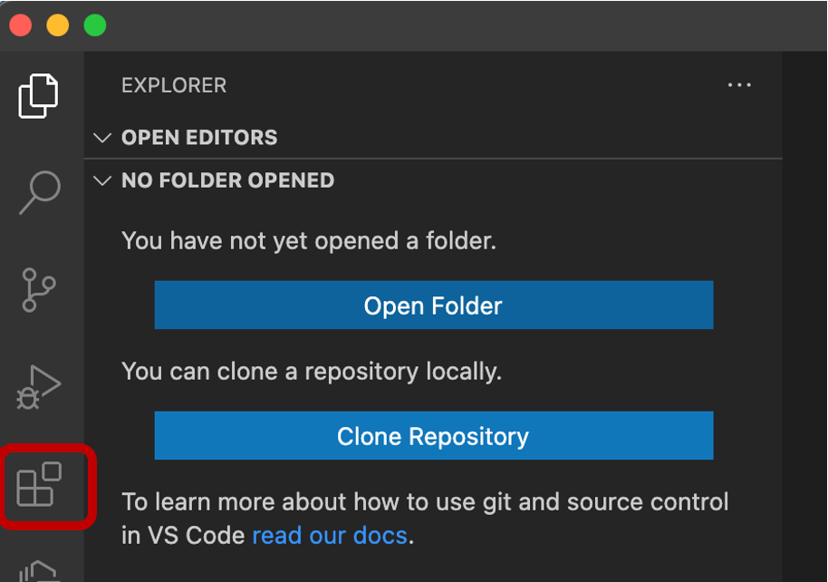
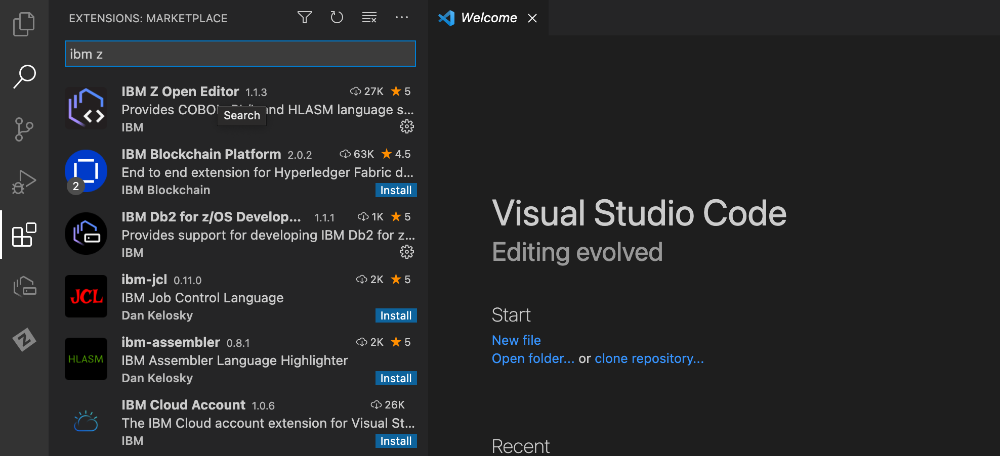

# Installing Visual Studio Code extensions

To install both extensions:

1. Open VS Code.
2. Switch to the **Extensions** view on the activity bar on the left. 

  

3. Type "ibm z" in the search field, and both extensions will be displayed at the top of the search results.
4. Click the blue **Install** button next to the extensions.

The following screenshot shows the result:

  

The development tools that you'll use with the sample application in this demo are now installed.
