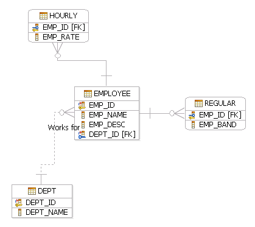

# Data modeling consideration

Data modeling is the process of defining and analyzing the data requirements that are needed to support business processes within the scope of corresponding information systems in organizations. The process of data modeling typically involves professional data modelers working closely with business stakeholders, as well as potential users of the information system.

In some organizations, data modeling tools are used in database schema design as a key part of application design, where a data modeler team uses the tools to design and create the data models. The data models are eventually converted to DDL and related physical objects.

The data model standardizes and defines the data elements, structure, and the relationship between the elements. Its main purpose is to represent the types of data within a system, the relationships between objects, and their attributes. The following figure shows what a data model might look like:

  

There are many data modeling products in the industry today, such as IBM InfoSphere Data Architect. These products in general help you simplify and accelerate integration design for business intelligence, master data management, and service-oriented architecture initiatives, and help you create or update both logical and physical data model diagrams to describe a variety of applications and systems. 

When an organization needs to make a business logic change that requires database schema changes in the application, the data modeler team usually makes the the data model change first. Then the data model change is converted to the actual DDL changes to be deployed to the systems.

The solution described in this paper doesn't cover how the data modeler takes the requirement change and creates or updates the data model. Most organizations have an established data modeling process already in place. Our solution picks up after the data model change has been translated to the actual DDL changes for the deployment.

There are different ways to transfer the data model or data model change into the DDL. Most data modeling products let you export the data model into the DDL for deployment when you are ready. The exported DDL can be checked into the SCM just like any other type of source code. After the DDL is checked in, the schema change in the DDL is handled by the CI/CD pipeline using the same process that is explained in the solution and sample. In this case, data modelers or DBAs become the developers of the DDL.
