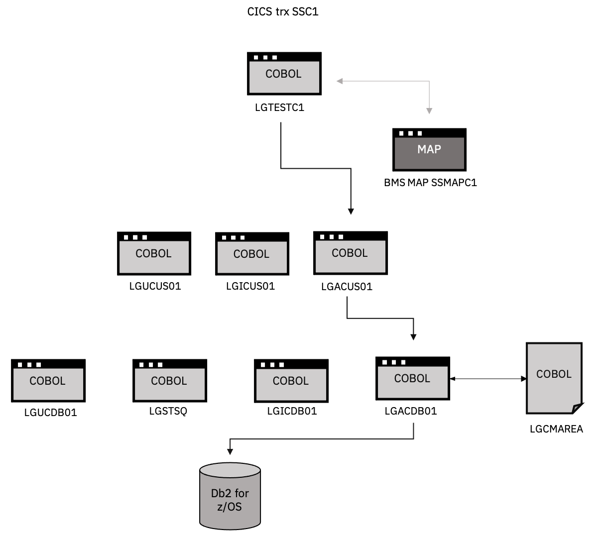

# Application change execution, documentation of the demo

### Introduction
As described in [Chapter 3](C003_description_sampleApp.md), the GenApp application needs to be adapted to add a country code for the telephone number. This chapter describes the data structure that's used in GenApp and how that data structure relates to the Db2 for z/OS schemas. We also go over what needs to be changed in the COBOL code and the DDL.

### Data structure of the GenApp application

Many COBOL applications that are deployed in CICS use a COMMUNICATION AREA (COMMAREA for short) to transfer data into the business logic. When GenApp was originally developed, data was entered by an employee of an insurance company through the use of a 3270 screen (SSMAPC1 in the following figure). When the employee pushed the button to process the input, the data from the screen (the presentation layer) was stored in the COMMAREA, and the LGTESTC1 COBOL module was called. Depending on the employee's choice during their screen session, one of the following three specific tasks could be invoked:

* **Update** a customer record (LG**U**CUS01 --> the **U** stands for Update)
* **Inquire** customer details (LG**I**CUS01  --> the **I** stands for Inquire)
* **Add** a customer (LG**A**CUS01  --> the **A** stands for Add)

For the scenario that we're using in this document, because we're only adding a new customer and a new field for the country code, we're focusing on the COBOL program LGACUS01.


<p align="center">
  
</p>

As this figure shows, the LGACUS01 program invokes the LGACDB01 program, which in turn will link to a separate COMMAREA file (LGCMAREA). In this file we'll find the original COMMAREA that we're going to use.

To simplify our explanation, we've included just the lines that are related to our use case: 

```COBOL
   
   03 CA-CUSTOMER-REQUEST REDEFINES CA-REQUEST-SPECIFIC.
      05 CA-FIRST-NAME         PIC X(10).
      05 CA-LAST-NAME          PIC X(20).
      05 CA-DOB                PIC X(10).
      05 CA-HOUSE-NAME         PIC X(20).
      05 CA-HOUSE-NUM          PIC X(4).
      05 CA-POSTCODE           PIC X(8).
      05 CA-NUM-POLICIES       PIC 9(3).
      05 CA-PHONE-MOBILE       PIC X(20).
      05 CA-PHONE-HOME         PIC X(20).
      05 CA-EMAIL-ADDRESS      PIC X(100).
      05 CA-POLICY-DATA        PIC X(32267).
      ...
```


### Use case

To demonstrate the use of Db2 DevOps Experience for z/OS, we'll change both the COBOL code and the Db2 for z/OS schema (DDL) and we'll show that the two changes are picked up by the CI/CD pipeline. We'll also introduce a violation of a site rule to demonstrate how DOE terminates a deployment and how it can generate an automated message when a site rule has not been met.

 
In the use case, we'll concentrate on adding the country code field (CA-PHONE-CC) to the COMMAREA.

```COBOL
      ...
      05 CA-PHONE-MOBILE      PIC X(20).
      05 CA-PHONE-CC          PIC(5).
      05 CA-PHONE-HOME        PIC X(20).
      ...
``` 

Because a COMMAREA is defined as a specific number of bytes, the COBOL program expects that specific byte length. When we add a new field, we need to keep the total length of the COMMAREA constant. Keep in mind that one character in a COBOL program fits into one byte. 

In our use case, we picked the CA-POLICY-DATA field, which was 32267 bytes long, and reduced it by 5 bytes to 32262. 


```COBOL
      ...
      05 CA-PHONE-MOBILE      PIC X(20).
      05 CA-PHONE-CC          PIC(5).
      05 CA-PHONE-HOME        PIC X(20).
      05 CA-EMAIL-ADDRESS     PIC X(100).
      05 CA-POLICY-DATA       PIC X(32262).
      ...
``` 
Because we added the new country code field to COMMAREA, we also need to change the schema that holds the customer data accordingly.

In our setup, the DDL files are stored in the Git repository in the db2/TB folder. For our use case, we need to change the CUSTOMER.sql file. The original schema looks like this:

```COBOL
 SET CURRENT SQLID='GENCDB0';
  CREATE TABLE GENCDB0.CUSTOMER
     (CUSTOMERNUMBER       INTEGER NOT NULL GENERATED BY DEFAULT
                           AS IDENTITY
                           (START WITH 1000001, INCREMENT BY 1, CACHE 20, NO CYCLE,
                           NO ORDER, MAXVALUE 2147483647, MINVALUE 1000001),
      FIRSTNAME            CHAR(10) FOR SBCS DATA WITH DEFAULT NULL,
      LASTNAME             CHAR(20) FOR SBCS DATA WITH DEFAULT NULL,
      DATEOFBIRTH          DATE WITH DEFAULT NULL,
      HOUSENAME            CHAR(20) FOR SBCS DATA WITH DEFAULT NULL,
      HOUSENUMBER          CHAR(4) FOR SBCS DATA WITH DEFAULT NULL,
      POSTCODE             CHAR(8) FOR SBCS DATA WITH DEFAULT NULL,
      PHONEHOME            CHAR(20) FOR SBCS DATA WITH DEFAULT NULL,
      PHONEMOBILE          CHAR(20) FOR SBCS DATA WITH DEFAULT NULL,
      EMAILADDRESS         CHAR(100) FOR SBCS DATA WITH DEFAULT NULL,
    CONSTRAINT CUSTOMERNUMBER
    PRIMARY KEY (CUSTOMERNUMBER))
    IN GENCDB0.GENCTS01
    AUDIT NONE
    DATA CAPTURE NONE
    CCSID      EBCDIC
    NOT VOLATILE
    APPEND NO  ;
  COMMIT;

```

We need to add a new column to the end of the column definitions, in this case right after the EMAILADDRESS column, to hold the data of the country code:

```COBOL
      ...
       PHONEHOME    CHAR(20) FOR SBCS DATA WITH DEFAULT NULL,
       PHONEMOBILE  CHAR(20) FOR SBCS DATA WITH DEFAULT NULL,
       EMAILADDRESS CHAR(100) FOR SBCS DATA WITH DEFAULT NULL,
       PHONEMOBILECOUNTRYCODE CHAR(5) FOR SBCS DATA WITH DEFAULT NULL,		      
      CONSTRAINT CUSTOMERNUMBER
      PRIMARY KEY (CUSTOMERNUMBER))
     IN GENCDB0.GENCTS01
     ...
```

Unfortunately, the new column name that we added (PHONEMOBILECOUNTRYCODE) is too long and violates a site rule.

When we save our changes in the COBOL files, the pipeline mechanism is triggered. The COBOL code will be compiled using the DBB process and will succeed. However, when the DDL schema is being processed, the Db2 DevOps Experience for z/OS plugin in the UrbanCode Deploy Agent will notice the site-rule violation of the new column name being too long.

<p align="center">
  
</p>

As the previous figure shows, the Jenkins pipeline failed and you can see that "Analysis failed due to syntax or site rule violation". The operator can zoom in on the failed step, identify the error, edit the CUSTOMER.sql file, and change the column name PHONEMOBILECOUNTRYCODE into PHONEMOBILECC:

```COBOL
      ...
      PHONEHOME     CHAR(20) FOR SBCS DATA WITH DEFAULT NULL,
      PHONEMOBILE   CHAR(20) FOR SBCS DATA WITH DEFAULT NULL,
      EMAILADDRESS  CHAR(100) FOR SBCS DATA WITH DEFAULT NULL,
      PHONEMOBILECC CHAR(5) FOR SBCS DATA WITH DEFAULT NULL,		      
      CONSTRAINT CUSTOMERNUMBER
      PRIMARY KEY (CUSTOMERNUMBER))
     IN GENCDB0.GENCTS01
     ...
```

Now that the DDL has been corrected and complies to the site rules, we need to update the COBOL SQL statement in the lgacdb01.cbl file:

```COBOL
     INSERT-CUSTOMER.
      *================================================================*
           MOVE ' INSERT CUSTOMER' TO EM-SQLREQ
      *================================================================*
           IF LGAC-NCS = 'ON'
             EXEC SQL
               INSERT INTO CUSTOMER
                         ( CUSTOMERNUMBER,
                           FIRSTNAME,
                           LASTNAME,
                           DATEOFBIRTH,
                           HOUSENAME,
                           HOUSENUMBER,
                           POSTCODE,
                           PHONEMOBILE,
      *                    PHONEMOBILECC,
                           PHONEHOME,
                           EMAILADDRESS )
                  VALUES ( :DB2-CUSTOMERNUM-INT,
                           :CA-FIRST-NAME,
                           :CA-LAST-NAME,
                           :CA-DOB,
                           :CA-HOUSE-NAME,
                           :CA-HOUSE-NUM,
                           :CA-POSTCODE,
                           :CA-PHONE-MOBILE,
      *                    :CA-PHONE-CC,
                           :CA-PHONE-HOME,
                           :CA-EMAIL-ADDRESS )
             END-EXEC
             IF SQLCODE NOT EQUAL 0
               MOVE '90' TO CA-RETURN-CODE
               PERFORM WRITE-ERROR-MESSAGE
               EXEC CICS RETURN END-EXEC
             END-IF
           ELSE
              EXEC SQL
               INSERT INTO CUSTOMER
                         ( CUSTOMERNUMBER,
                           FIRSTNAME,
                           LASTNAME,
                           DATEOFBIRTH,
                           HOUSENAME,
                           HOUSENUMBER,
                           POSTCODE,
                           PHONEMOBILE,
      *                    PHONEMOBILECC,
                           PHONEHOME,
                           EMAILADDRESS )
                  VALUES ( DEFAULT,
                           :CA-FIRST-NAME,
                           :CA-LAST-NAME,
                           :CA-DOB,
                           :CA-HOUSE-NAME,
                           :CA-HOUSE-NUM,
                           :CA-POSTCODE,
                           :CA-PHONE-MOBILE,
      *                    :CA-PHONE-CC,
                           :CA-PHONE-HOME,
                           :CA-EMAIL-ADDRESS )
             END-EXEC
```

Now that we've changed both the COBOL program and the DDL, we can save both files. With the git-hooks in place, Jenkins will start executing the steps again. This time, the changes will run error-free. The pipeline will be executed, the new compiled code will be deployed, and the new DDL will be activated.

When a new customer is added, a Country Code can be implemented and will be reflected in the Db2 for z/OS table.

