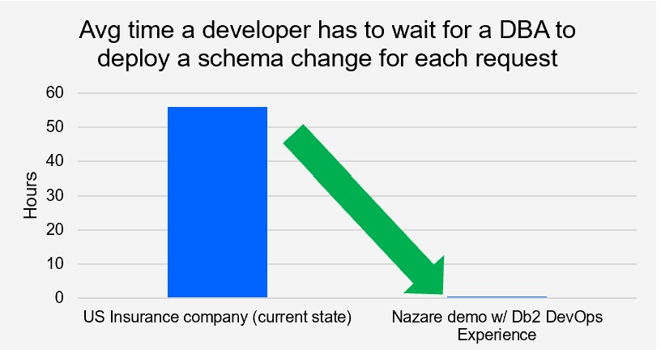

# In conclusion

As we have shown in this document, organizations today face numerous challenges as they transform their business processes to adapt to the digital economy. Many organizations must modernize their IBM Z applications to add the flexibility that's required to better serve their customers while simultaneously attaining ever-increasing levels of speed to market, all of this while  maintaining the quality standards that are critical to enterprise applications accessing data stored in Db2 for z/OS. This is where DevOps practices comes into play. We have shown, by integrating Db2 DevOps Experience for z/OS capabilities into the enterprise CI/CD pipeline, that the deployement and integration of database code changes in tandem with application code changes can be effectively modernized.

We have shown that Db2 DevOps Experience is a role-based solution that provides significant benefits to multiple personas within your organization. The Db2 system programmer is still responsible for the installation of Db2 subsystems and maintenance updates, as they have always been. The automated provisioning of Db2 subsystems for test environments as part of the CI/CD pipeline reduces repetitve work for them. The DBA is still responsible for maintaining control and security over the Db2 databases; however, with applying DevOps practices, they can simplify aspects of these tasks by creating and linking together teams, environments, permissions, and site rules that will automatically be enforced during the pipeline execution when Db2 objects are changed. 

Some of the pain points that Db2 DevOps Experience addresses are: 

-	Application developers are dependent on DBAs for code deployment. They can't afford to wait for the DBA to change database structure.
-	Typically, additional communication is needed between the DBA, the application developer, and the data modeler before a change can be implemented that slows down the deployment of the change.
-	Application developers open tickets for mostly simple database code changes that add up to a large number of changes over the year. Additionally, each request has to be repeated for multiple environments (unit test, integration test, user acceptance test, and finally production).

An US insurance company calculated that the average amount of time that application development must wait for a database change request to be completed is 56 hours. 

The pipeline execution demo illustrates that checking database code changes against DBA-defined site rules and deploying those changes to the target database together with deploying the aplication change completes in just a few minutes. Considering the number of database change requests that are fulfilled annually, these capabilities represent a massive time saver. Additionally, the developer gets immediate feedback on any violations of DBA-defined site rules and can correct them on their own without disruptive communication.

The benefits of integrating database code changes – in this case Db2 for z/OS - into a CI/CD pipeline can bolster and improve any DBA's efficiency. As a DBA, you'll be able to keep pace with the rate of change and not get bogged down in time-consuming activities so that you can provide greater benefits for your IT organization. 
