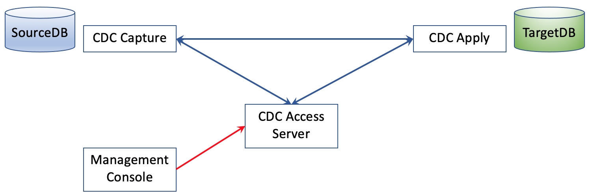
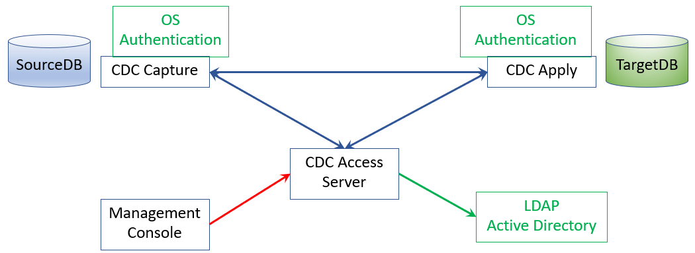
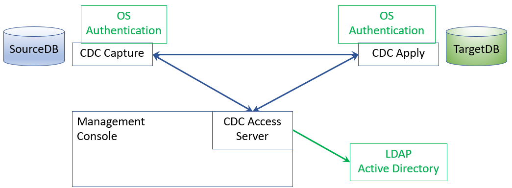
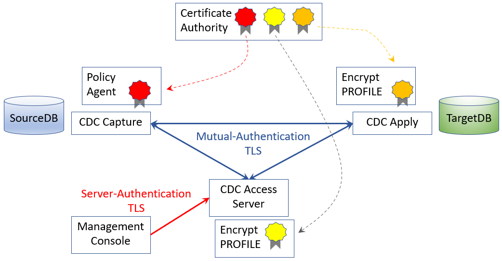

[Back to README.md and Table of Contents.](README.md)

# Securing CDC with LDAP
This chapter covers authentication and authorisation solutions for CDC


## Contents

<ul class="toc_list">
<li><a href="#abstract">Abstract</a>   
<li><a href="#1.0">1 Authentication and Authentication for CDC using LDAP</a>
<ul>
  <li><a href="#1.1">1.1 CDC Component Reference Scenarios</a></li>
  <li><a href="#1.2">1.2 Authentication and Authorisation options for CDC Users</a></li> 
  <li><a href="#1.3">1.3 Embedded Access Server</a></li> 
  <li><a href="#1.4">1.4 TLS Encryption</a></li>
</ul>  

<li><a href="#2.0">2. Configuring Authentication and Authorisation without an LDAP Server</a>
<ul>
  <li><a href="#2.1">2.1 Setting up Management Console and separate Access Server to perform Authentication without LDAP</a></li>
  <li><a href="#2.2">2.2 Setting up Management Console with embedded Access Server to perform Authentication without LDAP</a></li>
</ul> 
<li><a href="#3.0">3. Setting up an LDAP Server for CDC</a>
<ul>
  <li><a href="#3.1">3.1 Installing Open LDAP on a Raspberry Pi</a></li>
  <li><a href="#3.2">3.2 Adding CDC-related directory entries</a></li>
  <li><a href="#3.3">3.3 Verifying remote access to the LDAP Server</a></li>
</ul> 
<li><a href="#4.0">4. Setting up a separate Access Server to use the LDAP Server</a>
<ul>
  <li><a href="#4.1">4.1 Installing Access Server to use an LDAP Server</a></li>
  <li><a href="#4.2">4.2 Editing ldap.properties to use the LDAP Server</a></li>
  <li><a href="#4.3">4.3 Creating the first Access Server user (using the LDAP Server)</a></li> 
  <li><a href="#4.4">4.4 Subsequent Workflows with this setup.</a></li>  
</ul> 
<li><a href="#5.0">4. Setting up an Embedded Access Server to use the LDAP Server</a>
<ul>
  <li><a href="#5.1">5.1 Installing Management Console with Embedded Access Server to use an LDAP Server</a></li>
  <li><a href="#5.2">5.2 Editing ldap.properties to use the LDAP Server</a></li>
  <li><a href="#5.3">5.3 Creating the first Access Server user (using the LDAP Server)</a></li> 
  <li><a href="#5.4">5.4 Subsequent Workflows with this setup.</a></li>  
</ul> 
<li><a href="#6.0">6. Operational Considerations for Management Console, Access Server and LDAP Server</a>
<ul>
  <li><a href="#6.1">6.1 Understand Site Standards</a></li>
  <li><a href="#6.2">6.2 Don't overcomplicate a Proof of Concept</a></li>
</ul>
</ul>


<br><hr>

<h2 id="abstract"> Abstract</h2>
Cyber security (authentication, authorisation, encryption etc... ) is a fundamental requirement of any system that communicates over a network, regardless of whether it is a public or a private network.
This document provides worked examples of

* Implementing authentication and authorisation for CDC Administration Users with Access Server alone. 
* Implementing authentication and authorisation for CDC Administration Users with an LDAP Server. 
* Using CDC Management Console with an embedded Access Server.

It does not attempt to cover all of CDC's security features.
Comprehensive details of all CDC security features is covered in the <a href="https://www.ibm.com/docs/en/idr/11.4.0">IBM CDC knowledge centre.</a>
  
TLS Encryption is mentioned briefly in this paper, and covered in detail in [14. CDC Security - TLS Encryption.](C014_TLS.md) 
 
This paper is part of a series of documents providing practical worked examples and 
guidance for seting up CDC Replication between mainframe data sources and mid-range or Cloud targets.
The complete set of articles can be accessed using the README link at the very top of this page. 

<br><hr>

<h2 id="1.0">1 Authentication and Authentication for CDC using LDAP</h2>  

Lets start with a broad view of connectivity between CDC components, and consider what security provisions are approapriate.

<h3 id="1.1">1.1 CDC Component Reference Scenarios</h3>  

The diagram below is a generic representation of the four CDC components that you probably want to consider.



The basic communcations processes that occur between these components are

1. Management Console connects to Access Server to invoke administration tasks.
2. Access Server connects to CDC Capture and Apply Agents to define/operate subscriptions.
3. CDC Capture agent connects to CDC Apply agent over TCPIP to stream change data packets. 


<h3 id="1.2">1.2 Authentication options for CDC Users</h3> 

Moving on to Authentication options, there are several options, as depicted in the diagram below.



Users of the Windows Management Console must be authenticated by the Access Server. There are two options for this
1. Access Server stores userid/password credentials in an encrypted local file.
2. Access Server performs an authentication check using LDAP protocols.

If you use the LDAP option, then you have two further options.
1. Authentication only, where an authenticated user can then perform any CDC Access Server tasks.
2. Authentication and Authorisation, where specific privileges against specific CDC datastores are controlled at the Access Server.

Whichever LDAP option you choose, the CDC agent itself is subject to whatever authentication and authorisation controls are
implement at the various data sources. Whether z/OS or Linux, this would normally be a mixture of OS Authentication 
and associated DBMS authorisation.


<h3 id="1.3">1.3 Embedded Access Server</h3>

It is also possible to use an "embedded" Access Server, that is installed as part of the Management console, as depicted below.



This still conforms to exactly the same authentication options as a separate access server. The embedded access server option 
may be attractive depending on the way that CDC will be operated and managed in a production environment. 

* A site that wants to automate CDC operations with CHCCLP scripting would prefer a separate access server as part of the production infrastructure
* A site that uses z/OS system automation extensively may prefer to run CHCCLP scripts under JCL, and avoid the need to provision, secure and operate a separate server in the production environment.

There is no single right answer here. CDC is designed to operate in wildly heterogeneous environments. It tries not to be prescriptive on 
how operations and system automation is achieved because every site will be different. Hence - the provision of different options.

<b>IMPORTANT NOTE:</b> The decision of whether to use LDAP, and whether to use an embedded Access Server or a separate Access Server need to be made 
at installation time, because you need to choose what functions to install during the installation dialog.


<h3 id="1.4">1.4 TLS Encryption</h3>

TLS Encryption is covered in depth in the next paper, but deserves a quick preview in this paper. 
 
Encryption of sensitive business data over a network should always be encrypted. CDC supports industry-standard Transport Layer Security 
standards, as depicted in the diagram below.



All communications between CDC agents and CDC Access Server use mutual-authenticated TLS encryption (mTLS). This is based on 
certificates being used as the basis for negotiating encryption on CDC connections.

The CDC knowledge center describes an approach using self-signed certificates between the various end points. However, it would 
be more common for an enterprise to use a certificate authority to sign certificates to be stored at each end point. The worked 
examples in this paper are based on certificate authority.

Communication between Management Console and Access Server is encrypted using server-authenticated TLS.

TLS Encryption is covered with worked examples in [14. CDC Security - TLS Encryption.](C014_TLS.md) . 


<br><hr>

<h2 id="#2.0">2. Configuring Authentication and Authorisation without an LDAP Server</h2> 

This section covers the simplest model for Authentication and Authorisation for CDC Administration Users: Just use the Management Console and 
the Access Server components without an LDAP Server, and use the native authentication and authorisation functions provided by CDC.


<h3 id="2.1">2.1 Setting up Management Console and separate Access Server to perform Authentication without LDAP</h3>

Authentication without LDAP is easy. It's probably a good option if you are assessing CDC for it's replication capabilities without the effort of configuring a hardened operational production service.
The steps are

1. Install Windows Management Console without the embedded access server.
2. Install the Access Server without the LDAP Option.
3. Start the access server and create the CDC SYSADMIN userid. (dmcreateuser command)
4. Start the Management Console, and login to the Access Server (specifying TCPIP address & port)

The result of these steps will be that Access Server uses an encrypted local file to hold userids and passwords.

Screenshots from the sequence of steps follow

<b>Step 1:</b> Install Windows Management Console without the embedded access server.

Run the installer binary (eg: iidrmc-11.4.0.4-11072-setup.exe

Leave the "LDAP Embedded Access Server" box <u>unchecked</u> if you want to connect to a separate Access Server.


<b>Step 2:</b> Install the Access Server without the LDAP Option.

Prepare a Linux system for installing access server as follows

* create a group (cdcadm1) and a userid (cdcinst1)  
* set the password for the userid
* give the userid the ability to sudo 
* create the installation directories needed for installation
* change the ownership of the installation directories 

``` 
groupadd -g 970 cdcadm1

useradd -u 1070 -g cdcadm1 -m -d /home/cdcinst1 cdcinst1

passwd cdcinst1
(favepwd)

usermod -aG sudo cdcinst1

mkdir /opt/IBM/InfoSphereDataReplication  

chown cdcinst1 /opt/IBM/InfoSphereDataReplication
chgrp cdcadm1 /opt/IBM/InfoSphereDataReplication
```


The installation binary for linux x86 is iidraccess-11.4.0.4-11072-linux-x86-setup.bin

The code block below is the entire Installation dialog to install the Access Server (on Linux) without the LDAP option.
I prefer to force installers on Linux to execute in command mode rather than invoke a GUI, hence the "unset DISPLAY" command.

Note the question "Enable LDAP Configuration" and the response "1- None (Standard Mode)"

```
$ unset DISPLAY
$ ls
iidraccess-11.4.0.4-11072-linux-x86-setup.bin  setup-iidr-11.4.0.4-5618-linux-x86.bin
$ ./iidraccess-11.4.0.4-11072-linux-x86-setup.bin
Preparing to install
Extracting the JRE from the installer archive...
Unpacking the JRE...
Extracting the installation resources from the installer archive...
Configuring the installer for this system's environment...

Launching installer...

===============================================================================
Choose Locale...
----------------

    1- Deutsch
  ->2- English
    3- Español
    4- Italiano
    5- Português  (Brasil)

CHOOSE LOCALE BY NUMBER: 2
===============================================================================
IBM InfoSphere Data Replication Access Server    (created with InstallAnywhere)
-------------------------------------------------------------------------------

Preparing CONSOLE Mode Installation...


===============================================================================
Introduction
------------

InstallAnywhere will guide you through the installation of IBM InfoSphere Data
Replication Access Server.

It is strongly recommended that you quit all programs before continuing with
this installation.

Respond to each prompt to proceed to the next step in the installation.  If
you want to change something on a previous step, type 'back'.

You may cancel this installation at any time by typing 'quit'.

PRESS <ENTER> TO CONTINUE:


===============================================================================
Choose Install Folder
---------------------

Where would you like to install?

  Default Install Folder: /opt/IBM/InfoSphereDataReplication/AccessServer

ENTER AN ABSOLUTE PATH, OR PRESS <ENTER> TO ACCEPT THE DEFAULT
      :


===============================================================================


    LICENSE INFORMATION

    The Programs listed below are licensed under the following License
    Information terms and conditions in addition to the Program license
    terms previously agreed to by Client and IBM. If Client does not have
    previously agreed to license terms in effect for the Program, the
    International Program License Agreement (Z125-3301-14) applies.

    Program Name (Program Number):
    IBM InfoSphere Data Replication Management Console / Access Server v11.
    4.0.4 (Tool)
	
    The following standard terms apply to Licensee's use of the Program.

    Limited use right

    With the exception of Bundled Programs, all IBM software provided to
    Licensee with the Program can only be used to support Licensee's use
    of the Principal Program under this License Information document,

Press Enter to continue viewing the license agreement, or enter "1" to
   accept the agreement, "2" to decline it, "3" to print it, or "99" to go back
   to the previous screen.: 1


===============================================================================
Enable LDAP Configuration
-------------------------

Enable and select an LDAP configuration.
  ->1- None (Standard Mode)
    2- LDAP Authentication Only
    3- LDAP Authentication & Authorization
    4- LDAP CHCCLP Embedded

CHOOSE LDAP CONFIGURATION BY NUMBER, OR PRESS <ENTER> TO ACCEPT THE DEFAULT
   : 1


===============================================================================


Enter the TCP/IP port for Access Server.
Port Number: (Default: 10101):


===============================================================================
Configure User Data Folder
--------------------------

Access Server requires a folder to store logs, configuration information and
user data. Specify a folder where this information should be stored.


Where would you like your user data folder?

Default User Data Folder: /opt/IBM/InfoSphereDataReplication/AccessServer


   ENTER AN ABSOLUTE PATH, OR PRESS <ENTER> TO ACCEPT THE DEFAULT:


===============================================================================
Pre-Installation Summary
------------------------

Please Review the Following Before Continuing:

Product Name:
    IBM InfoSphere Data Replication Access Server

Install Folder:
    /opt/IBM/InfoSphereDataReplication/AccessServer

Link Folder:
    /home/cdcinst1

User Data Folder:
    /opt/IBM/InfoSphereDataReplication/AccessServer

Disk Space Information (for Installation Target):
    Required:  359,173,263 Bytes
    Available: 932,703,215,616 Bytes

PRESS <ENTER> TO CONTINUE:


===============================================================================
Installing...
-------------

 [==================|==================|==================|==================]
 [------------------|------------------|------------------|------------------]


===============================================================================
Installation Complete
---------------------

Congratulations. IBM InfoSphere Data Replication Access Server has been
successfully installed to:

/opt/IBM/InfoSphereDataReplication/AccessServer

Before you connect to this Access Server installation, you must start Access
Server and create the administration user account. See the installation guide
for more information. You should also install the equivalent version of IBM
InfoSphere Data Replication Management Console, if you haven't already done
so, before connecting to Access Server.


PRESS <ENTER> TO EXIT THE INSTALLER:
```

<b>Step 3:</b> Start the access server and create the CDC SYSADMIN userid. (dmcreateuser command)


1. logon as the cdc install userid
2. switch to the access server /bin directory
3. start the access server with the ```dmaccessserver``` command
4. create the access server sysadmin id with the ```dmcreateuser``` command.

```
$ pwd
/opt/IBM/InfoSphereDataReplication/AccessServer/bin
$
$ ls
asnclp                      dmchangeuserpassword  dmdeleteuser          dmlistuserdatastores  dmterminateuser
chcclp                      dmcreatedatastore     dmdisableuser         dmlistusers           dmunlockuser
dmaccessserver              dmcreateuser          dmenableuser          dmresetuser
dmaddconnection             dmdeleteconnection    dmlistdatastores      dmshowversion
dmchangeconnectionpassword  dmdeletedatastore     dmlistdatastoreusers  dmshutdownserver
$
$ ./dmaccessserver &
$
$ ./dmcreateuser cdcadmin cdcadmin cdcadmin favepwd sysadmin true false false
$
```

<b>Step 4:</b> Start the Management Console, and login to the Access Server (specifying TCPIP address & port)


Now (as cdcadmin) you can connect to CDC datastores. Go to the Access Manager tab, click on "new connection" and fill in the details.


Alternatively, you can click on the Access Manager tab, and create a hierarchy of cdc administration users, and grant the desired authorities to each of them. 
For example, you might want to control which cdc users are authorised to work with which CDC sources and targets. 


<h3 id="2.2">2.2 Setting up Management Console with embedded Access Server to perform Authentication without LDAP</h3>

If you wish to use Management Console with an embedded Access Server, you need to perform a separate installtion.

* a Management Console installation either connects to separate Access Server, or uses an embedded Access Server.
* After installation, the type of Access Server being used cannot be changed.

Run the installer binary (eg: iidrmc-11.4.0.4-11072-setup.exe)

Check the "LDAP Embedded Access Server" box  if you want to use and Embedded Access Server.


Complete the installation, start the Management Console.
The TCPIP address and port of the Access Server will be greyed out. They are hardcoded to perform TCPIP loopback to the embedded Access Server.

You will still need to issue the dmcreateuser command to create the CDC SYSADMIN userid.
After that, the user interface is identical to the previous scenario.


 
  
<h2 id="#3.0">3. Setting up an LDAP Server for CDC</h2>   

Many enterprises will want to use standard authentication mechanisms for all IT activities that require a logon identity to be authenticated, controlled and auditable.
Lightweight Directory Access Protocol is used extensively to access many directory and authentication services like Microsoft Active Directory, IBM Tivoli Directory Server, 
Open LDAP and others. CDC provides integration with LDAP so that you can use any commercial or open source directory that is LDAP-compliant.
  
CDC requires that you conform to a distinguished name base of "o=cdc,dc=ibm" 
  
  
<h3 id="3.1">3.1 Installing Open LDAP on a Raspberry Pi</h3>

In my test environment, I chose to deploy an Open LDAP Server on a Raspberry Pi. My Raspberry Pi is an always-on server performing many network services for my home network, 
which made it the perfect choice for me. The setup of Open LDAP on Pi is virtually identical to open LDAP on any other Linux distribution.

First up, install open LDAP and supporting utilities with the following command.

```
sudo apt-get install slapd ldap-utils
```

Next, invoke the dialog to configure the Open LDAP Server, with the following command.

```
sudo dpkg-reconfigure slapd 
```

My responses to the configuration dialog were as follows

* omit LDAP server config = No
* specify dns domain name = ibm
* specify organisational name = cdc
* specify admin password = secret
* for the directory backend datastore : use MDB
* when asked to purge database on slapdremoval : no
* move old DB after reconfiguration :  yes

The OpenLDAP server can be operated with standard commands such as

* sudo systemctl start slapd
* sudo systemctl enable slapd
* sudo systemctl stop slapd


Finally  perform an LDAP search to verify the cdc entries don’t yet exist.

```
pi@raspberrypi:~ $ ldapsearch -x -LLL -b "o=cdc,dc=ibm"
No such object (32)
Matched DN: dc=ibm
```

<h3 id="3.2">3.2 Adding CDC-related directory entries</h3>
  
Edit an ldif file to define the distinguised names required by CDC.

We need two distinguished names.

* the base DN is "o=cdc,dc=ibm"
* the DN of users will add the common name, for exampe "cn=cdcadmin,o=cdc,dc=ibm"

```
pi@raspberrypi:~ $ cat cdcbase.ldif
dn: o=cdc,dc=ibm
objectclass: top
objectclass: organization
o: cdc

dn: cn=cdcadmin,o=cdc,dc=ibm
objectclass: top
objectclass: person
objectclass: organizationalPerson
cn: cdcadmin
sn: Administrator
userPassword: secret
```

Add the contents of the ldif file to the OpenLDAP server with the following command.

```
pi@raspberrypi:~ $ ldapadd -x -W -D cn=admin,dc=ibm -f cdcbase.ldif
Enter LDAP Password:
adding new entry "o=cdc,dc=ibm"

adding new entry "cn=cdcadmin,o=cdc,dc=ibm"
```
  
Finally, perform a local ldapsearch to verify the names

```
pi@raspberrypi:~ $ ldapsearch -x -LLL -b "o=cdc,dc=ibm"
dn: o=cdc,dc=ibm
objectClass: top
objectClass: organization
o: cdc

dn: cn=cdcadmin,o=cdc,dc=ibm
objectClass: top
objectClass: person
objectClass: organizationalPerson
cn: cdcadmin
sn: Administrator

```  


<h3 id="3.3">3.3 Verifying remote access to the LDAP Server</h3>

Typically the CDC Access Server (192.168.1.32 in my case) will be remote from the LDAP Server (192.168.1.66 in my case), so 
it's a good idea to verify LDAP access from the Access Server.  

The ldapsearch call from the Access Server system will need to specify
* the TCPIP address and port of the LDAP Server ```-h 192.168.1.66 -p 389```
* the distinguished name for CDC ```-D "cn=cdcadmin,o=cdc,dc=ibm"```
* the password for the distinguished name ```-w secret```

My search from the Access Server system was successful as follows.

```
$ ldapsearch -h 192.168.1.66 -p 389 -D "cn=cdcadmin,o=cdc,dc=ibm" -w secret -b o=cdc,dc=ibm
# extended LDIF
#
# LDAPv3
# base <o=cdc,dc=ibm> with scope subtree
# filter: (objectclass=*)
# requesting: ALL
#

# cdc, ibm
dn: o=cdc,dc=ibm
objectClass: top
objectClass: organization
o: cdc

# cdcadmin, cdc, ibm
dn: cn=cdcadmin,o=cdc,dc=ibm
objectClass: top
objectClass: person
objectClass: organizationalPerson
cn: cdcadmin
sn: Administrator
userPassword:: c2VjcmV0

# search result
search: 2
result: 0 Success

# numResponses: 3
# numEntries: 2 
```

That concludes the setup of the OpenLDAP Server.


<h2 id="4.0">4.0 Setting up a separate Access Server to use the LDAP Server</h2>

Section 4 covers the scenario where separate Management Console and Access Server are used with an LDAP Server.
(Section 5, later on, covers the Management Console with embedded Access Server using an LDAP Server).

First Up, install the Management Console without the embedded access server, just like the base example in <a href="#2.0">2. Configuring Authentication and Authorisation without an LDAP Server</a>.

Run the installer binary (eg: iidrmc-11.4.0.4-11072-setup.exe

Leave the "LDAP Embedded Access Server" box <u>unchecked</u> if you want to connect to a separate Access Server.


<h3 id="4.1">4.1 Installing Access Server to use an LDAP Server</h3>

Next, install the Access Server, and select option 2 to enable LDAP Authentication Only.

The installation binary for linux x86 is iidraccess-11.4.0.4-11072-linux-x86-setup.bin

For brevity, I will not repeat the output of the entire installtion dialog, but I will include the "Enable LDAP Configuration" step.

Note the question "Enable LDAP Configuration" and the response "2- LDAP Authentication Only"

```
===============================================================================
Enable LDAP Configuration
-------------------------

Enable and select an LDAP configuration.
  ->1- None (Standard Mode)
    2- LDAP Authentication Only
    3- LDAP Authentication & Authorization
    4- LDAP CHCCLP Embedded

CHOOSE LDAP CONFIGURATION BY NUMBER, OR PRESS <ENTER> TO ACCEPT THE DEFAULT
   : 2
```

<h3 id="4.2">4.2 Editing ldap.properties to use the LDAP Server</h3>

You must edit the ldap.properties file to tell Access Server how to connect to the LDAP Server. ```/opt/IBM/InfoSphereDataReplication/AccessServer/ldap.properties```

1. Provide the TCPIP address of the LDAP Server : ldapHost=192.168.1.66
2. Provide the TCPIP port that the LDAP Server is listening on : ldapPort=389
3. Specify whether to access the LDAP server with SSL : false
4. Specify the LDAP Authentication user search base (authUserBaseDN, and authUserIDAttribute)
5. Specify the cdcBaseDN (o=cdc,dc=ibm)

Not being experienced in LDAP, the bit I found confusing was the Authentication user search base. 

* authUserIDAttribute=cn means that CDC will be specifying string that represents a common name in LDAP
* authUserBaseDN=o=cdc,dc=ibm specifies how CDC should expand the provided common name to define the distinguished name to use

So, If I enter a common name of cdcadmin into CDC, it will expand that into a distinguished name of "cn=cdcadmin,o=cdc,dc=ibm" when it connects to LDAP, which is the 
same as we used to successfully test ldap search from this server. ```ldapsearch -h 192.168.1.66 -p 389 -D "cn=cdcadmin,o=cdc,dc=ibm" -w secret -b o=cdc,dc=ibm```


The contents of my ldap.properties file is here: 

```
$ pwd
/opt/IBM/InfoSphereDataReplication/AccessServer
$ cat ldap.properties
#
# Sample configuration properties file for LDAP authentication support.
#
ldapHost=192.168.1.66
ldapPort=389
# Specify whether LDAP server is accessed through SSL port. (ldaps://)
SSL=false
# When LDAP server is accessed through normal(unprotected) port,
# specify if access via the use of the Start TLS Extension.
useTLS=false
# Supported authentication: SIMPLE, DIGEST-MD5, CRAM-MD5
ldapAuthMeth=SIMPLE
# REALM is only required for DIGEST-MD5
#ldapRealm=IBM.COM
#
# Authentication user search base
authUserBaseDN=o=cdc,dc=ibm
authUserIDAttribute=cn
#
# CDC base DN
cdcBaseDN=o=cdc,dc=ibm

#CDC user OU. Optional, default as following, only override when needed
#userSearchBase=ou=as
#userNameAttribute=cn
#userRoleAttribute=sn
#datastoreAccessAttribute=description

#CDC datastore OU. Optional, default as following, only override when needed
#datastoreSearchBase=ou=datastore
#datastoreNameAttribute=cn
#datastoreDefinitionAttribute=description

```

The CDC Access Server must be recycled for changes to take effect.


<h3 id="4.3">4.3 Creating the first Access Server user (using the LDAP Server)</h3>

Now that CDC is configured to use the LDAP Server, the first task is to create the first Access Server user <b>within</b> the LDAP Server.

This is done using a CHCCLP command as follows.

Logged on as cdcinst1, navigate to /opt/IBM/InfoSphereDataReplication/AccessServer/bin

Invoke CHCCLP, and issue the add ldap access manager command.

```
$ ls
asnclp  chcclp  dmaccessserver  dmshowversion  dmshutdownserver
$ ./chcclp
Command Line Processor for IBM InfoSphere Data Replication 11.4.0 [Build 11072]
(c) Copyright IBM Corporation 2013, 2016

You can execute IBM InfoSphere Data Replication commands from the command
prompt. Use double quotes around parameter values that contain special
characters or syntax keywords, or around empty strings. If the parameter value
contains double quotes, use single quotes around the value. Commands must be
terminated with ; and can span multiple lines.

For help on the available commands or for a specific command, type:

  help;
  help "connect server";
  help "11.3";

To turn on verbose output, type:

  set verbose;

To exit interactive mode, type exit; or quit;

Repl > add ldap access manager username cdcadmin password secret ;
Repl >

```


<h3 id="4.4">4.4 Subsequent Workflows with this setup</h3>

As before, you can either start doing CDC administration work under cdcadmin... 

... or Alternatively, you can click on the Access Manager tab, and create a hierarchy of cdc administration users, 
and grant the desired authorities to each of them. For example, you might want to control which cdc users are authorised to work with which CDC sources and targets.


<h2 id="5.0">5.0 Setting up an Embedded Access Server to use the LDAP Server</h2>

<h3 id="5.1">5.1 Installing Management Console with Embedded Access Server to use an LDAP Server</h3>

Run the installer binary (eg: iidrmc-11.4.0.4-11072-setup.exe)

Check the "LDAP Embedded Access Server" box  if you want to use and Embedded Access Server.


Complete the installation, start the Management Console.
The TCPIP address and port of the Access Server will be greyed out. They are hardcoded to perform TCPIP loopback to the embedded Access Server.


<h3 id="5.2">5.2 Editing ldap.properties to use the LDAP Server</h3>

When you install Management Console with Embedded Access Server, the ldap.properties file is located here

```
C:\Program Files (x86)\IBM\InfoSphere Data Replication\Management Console\ldap.properties
```

Edit the same values as you would if it were on a separate Access Server.

```
#
# Sample configuration properties file for LDAP authentication support.
#
ldapHost=192.168.1.66
ldapPort=389
# Specify whether LDAP server is accessed through SSL port. (ldaps://)
SSL=false
# When LDAP server is accessed through normal(unprotected) port,
# specify if access via the use of the Start TLS Extension.
useTLS=false
# Supported authentication: SIMPLE, DIGEST-MD5, CRAM-MD5
ldapAuthMeth=SIMPLE
# REALM is only required for DIGEST-MD5
#ldapRealm=IBM.COM
#
# Authentication user search base
authUserBaseDN=o=cdc,dc=ibm
authUserIDAttribute=cn
#
# CDC base DN
cdcBaseDN=o=cdc,dc=ibm

#CDC user OU. Optional, default as following, only override when needed
#userSearchBase=ou=as
#userNameAttribute=cn
#userRoleAttribute=sn
#datastoreAccessAttribute=description

#CDC datastore OU. Optional, default as following, only override when needed
#datastoreSearchBase=ou=datastore
#datastoreNameAttribute=cn
#datastoreDefinitionAttribute=description

```


<h3 id="5.3">5.3 Creating the first Access Server user (using the LDAP Server)</h3>

When Management Console is installed with an Embedded Access Server, the CHCCLP command line is invoked as a Windows command line window.

* START
* IBM DATA REPLICATION MANAGEMENT CONSOLE
* COMMAND LINE PROCESSOR


Invoke CHCCLP, and issue the add ldap access manager command.

```
C:\Program Files\IBM\InfoSphere Data Replication\Management Console>C:\WINDOWS\system32\cmd.exe /k "C:\Program Files\IBM\InfoSphere Data Replication\Management Console\bin\chcclp.exe"
Command Line Processor for IBM InfoSphere Data Replication 11.4.0 [Build 11072]
(c) Copyright IBM Corporation 2013, 2016

You can execute IBM InfoSphere Data Replication commands from the command
prompt. Use double quotes around parameter values that contain special
characters or syntax keywords, or around empty strings. If the parameter value
contains double quotes, use single quotes around the value. Commands must be
terminated with ; and can span multiple lines.

For help on the available commands or for a specific command, type:

  help;
  help "connect server";
  help "11.3";

To turn on verbose output, type:

  set verbose;

To exit interactive mode, type exit; or quit;

Repl > add ldap access manager username cdcadmin password secret ;
Repl >

```


<h3 id="5.4">5.4 Subsequent Workflows with this setup</h3>

As before, you can either start doing CDC administration work under cdcadmin... 

... or Alternatively, you can click on the Access Manager tab, and create a hierarchy of cdc administration users, 
and grant the desired authorities to each of them. For example, you might want to control which cdc users are authorised to work with which CDC sources and targets.


<br><hr>

<h2 id="6.0">6. Operational Considerations for Management Console, Access Server and LDAP Server</h2>  

So many choices, so little time!

Being a heterogenous, cross-platform, data replication solution, CDC is bound to cause you to interact with multiple groups in your organisation. You might 
find yourself talking to IMS systems programmers, IMS DBAs, Network Administrators, z/OS Security admins, Midrange Security admins, 
Cloud provisioning teams, Kafka admins, Open Source developers and so forth. When you are scoping your CDC project, it's a good idea to consider what teams 
you might need to work with within your organisation and figure out how to work with them efficiently.
 
 
<h3 id="6.1">6.1 Understand Site Standards</h3>  

Site standards will likely dictate if you have to use LDAP and TLS. Find out what site standards apply, and get with the programme.

<h3 id="6.2">6.2 Don't overcomplicate a Proof of Concept</h3>

You might be evaluating the function and performance of CDC. If so, you might not need to include LDAP and TLS in the scope of your POC.

<br><hr>


Appendix : Sources of Information

This document is nothing more than a worked example. You should refer to the official IBM documentation for the CDC products when planning an implementation. The following sources of information are recommended.

InfoSphere Data Replication v11.4
Knowledge Centre for all IBM Replication Solutions, including Q Replication, SQL Replication and CDC Replication.
https://www.ibm.com/docs/en/idr/11.4.0

Classic CDC for IMS v11.3
Knowledge Centre section for Classic CDC for IMS
https://www.ibm.com/docs/en/idr/11.4.0?topic=replication-infosphere-classic-cdc-zos

CDC for Kafka v11.4
Knowledge Centre section for CDC for Kafka
https://www.ibm.com/docs/en/idr/11.4.0?topic=replication-cdc-engine-kafka

IBM Data Replication wiki
A wide range of mostly technical articles providing guidance on implementing IBM Replication solutions.
https://www.ibm.com/support/pages/ibm-data-replication-community-wiki


