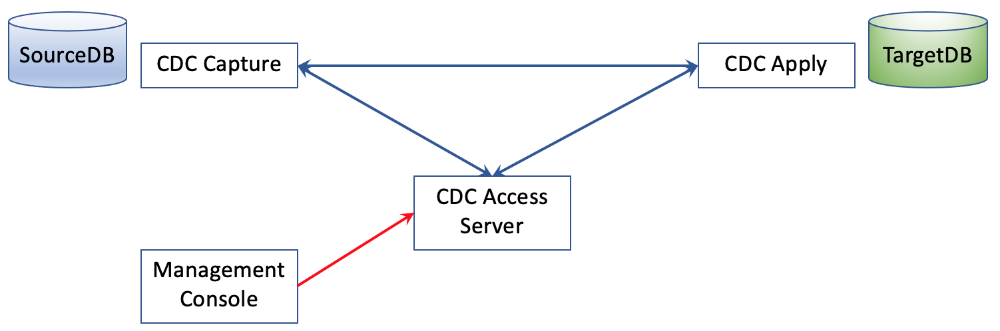
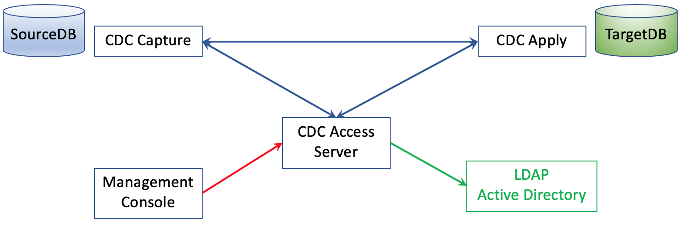
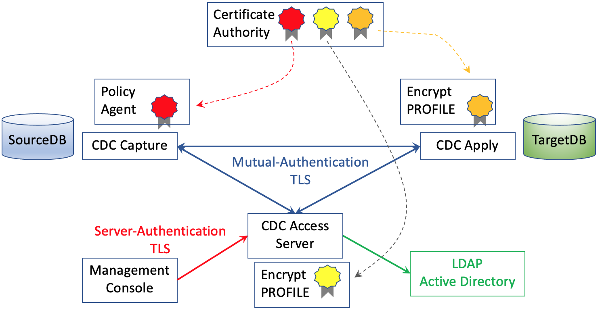
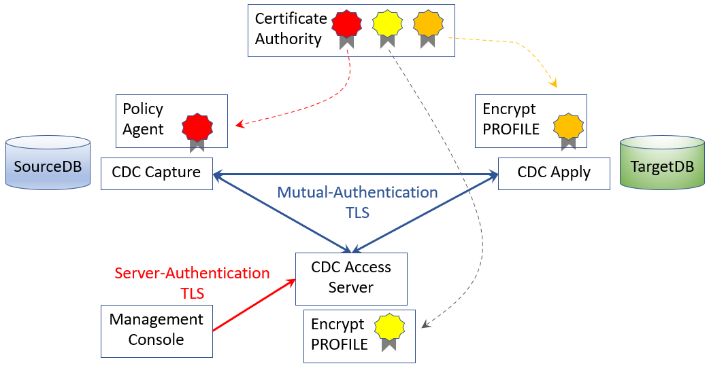

[Back to README.md and Table of Contents.](README.md)

# Securing CDC with TLS and LDAP
This chapter covers authentication and encryption solutions for CDC

Ooops. This article hasn't been written yet.


## Contents

<ul class="toc_list">
<li><a href="#abstract">Abstract</a>   
<li><a href="#1.0">1 Authentication and Encryption Options for CDC Components</a>
<ul>
  <li><a href="#1.1">1.1 CDC Component Reference Scenarios</a></li>
  <li><a href="#1.2">1.2 Authentication options for CDC Users</a></li> 
  <li><a href="#1.3">1.3 Encryption options between CDC Components</a></li>
</ul>
<li><a href="#2.0">2. Configuring Authentication</a>
<ul>
  <li><a href="#2.1">2.1 Authentication without LDAP</a></li>
  <li><a href="#2.2">2.2 Authentication-Only with LDAP</a></li>
  <li><a href="#2.3">2.3 Authentication and Authorization with LDAP</a></li>
</ul> 
<li><a href="#3.0">3. Encryption between Management Console and Access Server</a>
<li><a href="#4.0">4. Encryption between Access Server and CDC Agents</a>
<ul>
  <li><a href="#4.1">4.1 Mutually Authenticated TLS Encryption</a></li>
  <li><a href="#4.2">4.2 Simplistic mTLS with Self-Signed Certificates</a></li>
  <li><a href="#4.3">4.3 mTLS with Certificate Authorities</a></li>
  <li><a href="#4.4">4.4 Application Controlled TLS (LUW)</a></li>  
  <li><a href="#4.5">4.5 Application Transparent TLS (z/OS)</a></li>
</ul> 
<li><a href="#5.0">5. Worked Example of mTLS between z/OS Capture agent and LUW Apply Agent</a>
<ul>
  <li><a href="#5.1">5.1 Environment for Scenario without Encryption</a></li>
  <li><a href="#5.2">5.2 mTLS configuration of Access Server</a></li>
  <li><a href="#5.3">5.3 mTLS configuration of CDC Apply on Linux</a></li>
  <li><a href="#5.4">5.4 AT-TLS configuration of CDC Capture on z/OS</a></li>  
  <li><a href="#5.5">5.5 Certificate Exchanges between platforms</a></li>
  <li><a href="#5.6">5.6 Operating CDC with mTLS encryption</a></li>
  <li><a href="#5.7">5.7 Monitoring and Tracing of encrypted network flows</a></li>  
</ul>
<li><a href="#6.0">6. Operational Considerations arising from using Encryption</a>
<ul>
  <li><a href="#6.1">6.1 Always Encrypted CDC Agents</a></li>
  <li><a href="#6.2">6.2 ???</a></li>
  <li><a href="#6.3">6.3 ???</a></li> 
</ul>
<li><a hrex="Appendix">Appendix: LDAP on z/OS with an LDBM backend</li>
</ul>


<br><hr>

<h2 id="abstract"> Abstract</h2>
In recent years cyber security has become a non-negotiable requirement of any system that communicates over a network, regardless of whether it is a public or a private network.
This document provides worked examples of

* Implementing LDAP authentication for CDC users. 
* Implementing transport layer security (mutually authenticated encryption) between CDC capture and apply agents on any platform. 
* Implementing transport layer security (server authenticated encryption) between Management Console and Access Server.
* It does not attempt to cover all the product's secuirty features.
* Comprehensive details of the product's features are covered in <a href="https://www.ibm.com/docs/en/idr/11.4.0">IBM CDC knowledge centre.</a>
 

It is part of a series of documents providing practical worked examples and 
guidance for seting up CDC Replication between mainframe data sources and mid-range or Cloud targets.
The complete set of articles can be accessed using the README link at the very top of this page. 

<br><hr>

<h2 id="1.0">1 Authentication and Encryption Options for CDC Components</h2>  

Lets start with a broad view of connectivity between CDC components, and consider what security provisions are approapriate.

<h3 id="1.1">1.1 CDC Component Reference Scenarios</h3>  

The diagram below is a generic representation of the four CDC components that you probably want to consider.



The basic communcations processes that occur between these components are

1. Management Console connects to Access Server to invoke administration tasks.
2. Access Server connects to CDC Capture and Apply Agents to define/operate subscriptions.
3. CDC Capture agent connects to CDC Apply agent over TCPIP to stream change data packets. 


<h3 id="1.2">1.2 Authentication options for CDC Users</h3> 

Moving on to Authentication options, there are several options, as depicted in the diagram below.



Users of the Windows Management Console must be authenticated by the Access Server. There are two options for this
1. Access Server stores userid/password credentials in an encrypted local file.
2. Access Server performs an authentication check using LDAP protocols.

If you use the LDAP option, then you have two further options.
1. Authentication only, where an authenticated user can then perform any CDC Access Server tasks.
2. Authentication and Authorisation, where specific privileges against specific CDC datastores are controlled.

Whichever LDAP option you choose, the CDC agent itself is subject to whatever authentication and authorisation controls are
implement at the various data sources. Whether z/OS or Linux, this would normally be a mixture of OS Authentication 
and associated DBMS authorisation.


It is possible to use an "embedded" Access Server, that is installed as part of the Management console, as depicted below.



This still conforms to exactly the same authentication options as a separate access server. The embedded access server option 
may be attractive depending on the way that CDC will be operated and managed in a production environment. 

* A site that wants to automate CDC operations with CHCCLP scripting would prefer a separate access server as part of the production infrastructure
* A site that uses z/OS system automation extensively may prefer to run CHCCLP scripts under JCL, and avoid the need to provision, secure and operate a separate server in the production environment.

There is no single right answer here. CDC is designed to operate in wildly heterogeneous environments. It tries not to be prescriptive on 
how operations and system automation is achieved because every site will be different. Hence - the provision of different options.


<h3 id="1.3">1.3 Encryption options between CDC Components</h3>
 
Encryption of sensitive business data over a network should always be encrypted. CDC supports industry-standard Transport Layer Security 
standards, as depicted in the diagram below.



All communications between CDC agents and CDC Access Server use mutual-authenticated TLS encryption (mTLS). This is based on 
certificates being used as the basis for negotiating encryption on CDC connections.

The CDC knowledge center describes an approach using self-signed certificates between the various end points. However, it would 
be more common for an enterprise to use a certificate authority to sign certificates to be stored at each end point. The worked 
examples in this paper are based on certificate authority.

<h4 id="1.3.1">1.3.1 Application-Controlled and Application-Transparent TLS</h4>

The implementation of TLS encryption is quite different between z/OS and other platforms.

* Linux, Unix and Windows platforms leave the application to manage the encryption process.
* z/OS as a platform supports "Application-Transparent TLS" (AT-TLS)

Consequently, CDC components conform to the standards of their respective operating systems.

* CDC components on LUW platforms implement Application-Controlled TLS, and use an encryption profile to manage the mTLS processing.
* CDC components on the z/OS platforms are completely ignorant of AT-TLS processing. As z/OS service ( Policy Agent ) is configured to intercept selected communications (eg: on specified TCPIP ports) and enforce TLS encryption.

Both approaches implement exactly the same standards-based TLS, but the configuration is different.

<h4 id="1.3.2">1.3.2 Management Console TLS encryption</h4>

The windows Management Console supports server-authenticated TLS, which is simpler, and sufficient for a simple Graphical client to the Access Server

<br><hr>

<h2 id="#2.0">2. Configuring Authentication</h2> 

This sections provides worked example of the three configuration options for authentication.

<b>Important Note:</b> These three options are mutually exclusive for an installation of the access server. 
You must decide which option you want to use, and choose the appropriate option at installation time.

<h3 id="2.1">2.1 Authentication without LDAP</h3>

Authentication without LDAP is easy. It's probably a good option if you are assessing CDC for it's replication capabilities without the effort of configuring a hardened operational production service.
The steps are

1. Install Windows Management Console without the embedded access server.
2. Install the Access Server without the LDAP Option.
3. On the access server, create the root userid for the CDC Access Server. 
4. Start the Access Server
5. Start the Management Console, and login to the Access Server (specifying TCPIP address & port)

The result of these steps will be that Access Server uses an encrypted local file to hold userids and passwords.


<h3 id="2.2">2.2 Authentication-Only with LDAP</h3>

Using the same Windows Management Console that was installed in the previous step, we would install a different Access Server with the LDAP Autentication-Only Option.

As a <b>pre-requsuite</b> you need to setup an LDAP Server which has cdcBaseDN=o=cdc,dc=ibm setup. 
An example of using LDAP on z/OS with an LDBM backend is described in Appendix A.


1. Install the Access Server with the LDAP Authentication-Only Option.
2. Configure the connectivity from Access Server to the LDAP Server (ldap.properties file)
3. On the access server, create the root userid for the CDC Access Server. (CHCCLP command)
3. Start the Access Server
4. Start the Management Console, and login to the Access Server (specifying TCPIP address & port)

The result of these steps will be that Access Server uses the LDAP server for authentication, but not CDC authorisation control.


<h3 id="2.3">2.3 Authentication and Authorization with LDAP</h3>

This option seems like a dated throwback to the era of datamarts, as it envisages a hierarchy of CDC administrators performing ad-hoc subscriptions to a network of database servers.
In my experience with Banks and government entities anything that moves sensitive data around the network is tested heavily and then locked down very hard.
It conjures up a very 1970s office setting in my mind that just doesn't exist in today's cyber security world.
Having said that, it's an extra option that is available to you, if it is helpful.

The setup is very similar to the previous step.
The only setup difference is that the Access Server installation must specify the "Authentication and Authorization with LDAP" option.

the result is that CDC root user will be able to grant and revoke CDC administration priviledges in whatever level of granularity is required.

<br><hr>

<h2 id="3.0">3. Encryption between Management Console and Access Server</h2>  
 

<br><hr>

<h2 id="4.0">4. Encryption between Access Server and CDC Agents</h2>  
 
<h3 id="4.1">4.1 Mutually Authenticated TLS Encryption</h3>  
<h3 id="4.2">4.2 Simplistic mTLS with Self-Signed Certificates</h3>
<h3 id="4.3">4.3 mTLS with Certificate Authorities</h3>
<h3 id="4.4">4.4 Application Controlled TLS (LUW)</h3>
<h3 id="4.5">4.5 Application Transparent TLS (z/OS)</h3>


<br><hr>

<h2 id="5.0">5. Worked Example of mTLS between z/OS Capture agent and LUW Apply Agent</h2>  
 
<h3 id="5.1">5.1 Environment for Scenario without Encryption</h3>  
<h3 id="5.2">5.2 mTLS configuration of Access Server</h3>
<h3 id="5.3">5.3 mTLS configuration of CDC Apply on Linux</h3>
<h3 id="5.4">5.4 AT-TLS configuration of CDC Capture on z/OS</h3>
<h3 id="5.5">5.5 Certificate Exchanges between platforms</h3>
<h3 id="5.6">5.6 Operating CDC with mTLS encryption</h3>
<h3 id="5.7">5.7 Monitoring and Tracing of encrypted network flows</h3>


<br><hr>

<h2 id="6.0">6. Operational Considerations arising from using Encryption</h2>  
 
<h3 id="6.1">6.1 Always Encrypted CDC Agents</h3>  
<h3 id="6.2">6.2 ???</h3>
<h3 id="6.3">6.3 ???</h3>

<br><hr>

<h2 id="Appendix">Appendix: LDAP on z/OS with an LDBM backend.</h2>  

My test environment didn't have an LDAP server, so I had to install one. 
You could use any LDAP server, including OpenLDAP on any Linux distribution.
I decided to implement LDAP on z/OS, and include the notes in this document.

z/OS includes the "IBM Tivoli Directory Server for z/OS". 
The provides an LDAP Server with a choice of multiple database back ends ( file, Db2 database etc... )
For this example I chose the LDBC backend (a USS file) which is the simplest option.
LDBM setup documentation is  <a href="https://www.ibm.com/docs/en/zos/2.4.0?topic=hashing-setting-up-ldbm">here.</a>

Open a terminal in a USS directory

```
cd /u/ibmuser
```

Copy the IBM-supplied template for the configuration file to your directory

```
cp /usr/lpp/ldap/etc/ds.profile .
```

Edit /u/ibmuser/ds.profile

```
ADMINDN = "cn=root" 
ADMINPW = root 
LDBM_SUFFIX = "o=cdc,dc=ibm"
LDBM_DATABASEDIRECTORY = /var/ldap/ldbm
PROG_SUFFIX=AD 
JOBCARDLINE1S = //GLDAPF JOB 1, 
OUTPUT_DATASET = IBMUSER.LDAP
```


Export some parameters in the USS shell.

```
export STEPLIB=SYS1.SIEALNKE:$STEPLIB
export PATH=/usr/lpp/ldap/sbin:$PATH
export NLSPATH=/usr/lpp/ldap/lib/nls/msg/%L/%N:$NLSPATH
export LANG=En_US.IBM-1047
```

Invoke the ds.config configuration utility.

```
	IBMUSER:/u/ibmuser: >dsconfig -i ds.profile
	220321 17:28:59.444396 GLD2002I Directory Server configuration utility has started.
	220321 17:28:59.474210 GLD2004D
	           The output data set IBMUSER.LDAP has been previously used.
	           Existing members may be overwritten and data lost.
	           Do you wish to continue? (yes/no)
	yes
	220321 17:29:02.022564 GLD2003I Directory Server configuration utility has ended.
```

Review the generated members of the output PDS (IBMUSER.LDAP)

```
	DSLIST            IBMUSER.LDAP 
	           Name     Prompt     
	_________ APF      *Browsed    
	_________ DSCONFIG *Browsed    
	_________ DSENVVAR *Browsed    
	_________ GLDSRV   *Browsed    
	_________ PRGMCTRL *Browsed    
	_________ PROGAD   *Browsed    
	_________ RACF     *Browsed    
	          **End**
```

Review all the generated members and assess whether you need to act of them ( Environment Variables, PARMLIB members, RACF resources etc... ).
In my system ( ADCD V13 stack ) the only action I needed to take was to create the userid/group in RACF.

The copy GLDSRV to PROCLIB and add it in the VTAM startup list if you want to auto-start it.
The salient lines from my GLDSRV member are


```
//GLDSRV  PROC REGSIZE=0M,                                              
//*-------------------------------------------------------------------- 
//* CUSTOMIZABLE SYMBOLIC PARAMETERS                                    
//*-------------------------------------------------------------------- 
// PARMS='',                                                            
// OUTCLASS='A'                                                         
//*-------------------------------------------------------------------- 
//GO       EXEC PGM=GLDSRV31,REGION=&REGSIZE,TIME=1440,                 
//         PARM=('/&PARMS >DD:DSOUT 2>&1')                              
//*-------------------------------------------------------------------- 
//* CONFIG can be used to specify the LDAP server config file.          
//*-------------------------------------------------------------------- 
//CONFIG    DD DSN=IBMUSER.LDAP(DSCONFIG),DISP=SHR                      
//*-------------------------------------------------------------------- 
//* ENVVAR can be used to specify any environment variables             
//* If this DD is used, the name of the data set must be customized     
//* for the installation.                                               
//*-------------------------------------------------------------------- 
//ENVVAR   DD DSN=IBMUSER.LDAP(DSENVVAR),DISP=SHR                       
//DSOUT    DD SYSOUT=&OUTCLASS                                          
//SYSOUT   DD SYSOUT=&OUTCLASS                                          
//CEEOPTS  DD *                                                         
TERMTHDACT(UADUMP,)                                                     
//SYSMDUMP DD SYSOUT=&OUTCLASS                                          
//CEEDUMP  DD SYSOUT=&OUTCLASS                                          
```

and check the started task in SDSF.

```
 SDSF OUTPUT DISPLAY GLDSRV   STC04588  DSID     2 LINE 0       COLUMNS 21- 100 
 COMMAND INPUT ===>                                            SCROLL ===> CSR  
********************************* TOP OF DATA **********************************
    J E S 2  J O B  L O G  --  S Y S T E M  S 0 W 1  --  N O D E  S 0 W 1       
                                                                                
--- THURSDAY,  24 MAR 2022 ----                                                 
IEF695I START GLDSRV   WITH JOBNAME GLDSRV   IS ASSIGNED TO USER GLDSRV  , GROUP
$HASP373 GLDSRV   STARTED                                                       
IEF403I GLDSRV - STARTED - TIME=08.24.06                                        
BPXM023I (GLDSRV) GLD1004I LDAP server is ready for requests.                   
GLD1005I LDAP server start command processed.                                   
BPXM023I (GLDSRV) GLD1059I Listening for requests on 192.168.1.191 port 389.    
BPXM023I (GLDSRV) GLD1059I Listening for requests on 10.1.1.191 port 389.       
BPXM023I (GLDSRV) GLD1059I Listening for requests on 127.0.0.1 port 389.        
BPXM023I (GLDSRV) GLD6051I No database changes to commit for LDBM backend named 
```


<h1> Old Source Words </h1>

!!!!!!!!!!!!!!!!!!!!!!!!!!


1. Network Security Requirements.
In recent years cyber security has become a non-negotiable requirement of any system that communicates over a network, regardless of whether it is a public or a private network.
This series of CDC documents is based around the pattern of streaming core transactional data from Systems of Record to Apache Kafka event streaming systems, many of which will be hosted on public cloud services. Suitable Transport Level Security (TLS) is essential.
Each of the CDC components supports Transport Level Security (TLS). The purpose of this document is to provide a worked example of how to implement TLS on connections between all the CDC components.

1.1 Understand that z/OS differs from other platforms in how it supports TLS.
When you read the CDC knowledge centre pages on TLS support for CDC connections, everything you will read is about application-controlled TLS.
In the non-z/OS world, applications take responsibility for initiating TLS encryption. Every application that wants to use secure communications needs to write routines that implement TLS protocols.
Since z/OS v2.4 IBM has established a clear direction that z/OS applications will use application-transparent TLS ( AT-TLS ). The implementation of TLS protocols (trust, authentication and encryption) will be the responsibility of the communications layer, and that z/OS applications ( like Classic CDC for IMS, Classic CDC for VSAM, and IIDR for z/OS ) will not need to be burdened with writing TLS logic.
The IBM statement of direction for z/OS (2019) is included in the announcement letter below.
https://www-01.ibm.com/common/ssi/ShowDoc.wss?docURL=/common/ssi/rep_ca/0/877/ENUSZP19-0410/index.html&request_locale=en

1.2 Worked Example
Regardless of where the TLS processing is configured, z/OS supports TLS standards the same as other platforms. The purpose of this document is to provide a worked example of how to configure TLS between a z/OS source ( Classic CDC for IMS ) and a Linux target ( CDC for Kafka ).
The deployment scenario in this document will likely be much simpler than a real production environment, but it serves as a reference point to help customers to start from.

Note: The author of this document is a database guy who was placed in a position where he needed to understand how to implement TLS in a heterogeneous  environment. The author does not profess to have a major in network security. If you are a security expert who finds this article to be too simplistic then please feel free to reach out to me at neale.armstrong@au1.ibm.com to suggest how this article might be improved.


2. Transport Layer Security by CDC Connection Type
This section identifies the TLS implementation options for each of the connections between CDC components. The diagram below depicts the various connections and TLS options to secure those connections.


2.1 TLS Between CDC Capture Agents and CDC Apply Agents
CDC Capture Agents can communicate to CDC Apply Agents with mutually authenticated TLS. Each agent needs to share their public key (certificate) with the other agent, who needs to import it to their trust store.
* Non-z/OS CDC agents implement application-controlled TLS through the use of encryption profiles which are defined at the CDC instance level. Encryption profiles may specify that TLS encryption is set to one of 4 values : disabled, enabled, required or always.
* z/OS CDC agents defer the TLS processing to the policy agent (PAGENT) in Communication Server for z/OS. The communications administrator must specify the TTLS policies for PAGENT.
> Classic CDC for IMS and VSAM requires that non-z/OS CDC partners are configured with encryption ALWAYS ON.
> IIDR for z/OS (CDC for Db2 z/OS) is flexible to TLS negotiation.

2.2 TLS Between CDC Access Server and CDC Datastores
Access Server implements mutually authenticated TLS to communicate with CDC datastores. Access Server TLS is specified in the tls.properties file.
When Access Server is interacting with a z/OS CDC agent, the TTLS rules on PAGENT must be specified to be compatible with the Access Server tls.properties file configuration.

2.3 TLS Between Management Console and Access Server
Management Console communicates with Access Server using server-authenticated TLS. The management console just needs to trust the certificate of the access server.

2.4 TLS Between Classic Data Architect and Classic CDC for IMS
Classic Data Architect communicates with  Classic CDC using server-authenticated TLS. The management console just needs to trust the certificate of the Classic CDC server.

2.5 Authentication Options for CDC Access Server
Whilst outside the scope of TLS configuration, the requirement for CDC Access Server to Authenticate Management Console clients is well worthy of a mention at this point. 
The CDC architecture implements an Access Server as a control point for CDC administrators. CDC architecture envisioned of a hierarchy of CDC administrators, each of whom was responsible for replicating subsets of data on different platforms. This vision required a CDC authentication control point (the CDC Access Server) to govern which Management Console users could access which CDC data sources.
CDC Access Server offers two ways of authenticating CDC Management Console users
> A local access control list, in a DES-encrypted file within Access Server
> Dependency on an external LDAP Server
This dystopian vision of data governance is rather dated, but whether we like it or not, it is embedded within the CDC architecture, so we need to manage around it.
* For z/OS � centric users, CHCCLP for z/OS bypasses the access server completely. Please read paper #2 from this series of paper to learn how to perform CDC Devops from CHCCLP for z/OS.
* For midrange and cloud users � there is no way to ditch the Access Server Paradigm. Accept it and chose your authentication method for Access Server.

 


3. mTLS between CDC Capture on Linux and CDC Apply on Linux.
It will be helpful to walk through a midrange-only CDC implementation with TLS before adding z/OS and AT-TLS into the mix.
3.1 Overview of mutual TLS configuration
The diagram below illustrates the environment being used for this worked example.
* CDC Source is Db2 v11.5 on Linux (Redhat) on server �nuci7�
* CDC Target is Confluent Kafka on Linux (Ubuntu) on server �nuci3�
* CDC Access Server on Windows 10 on PC �Ryzen9�
* CDC Management Console also same Windows PC.


In the example above we want to establish mutual-authentication TLS links between CDC Capture, CDC Apply and CDC Access Server. This requires that each of the three systems generates a key pair, and each of the three systems imports the public keys (certificates) from the other two partners.
If the Management Console was on a remote PC it would need it�s own trust store, and it would need to import the certificate of the Access Server into it�s trust store, in order to perform server-authenticated TLS.
The truststore for CDC for Db2 linux is
/opt/ibm/InfoSphereDataReplication/ReplicationEngineforIBMDB2/jre64/jre/lib/security/cacerts
The truststore for CDC for Kafka is
/opt/ibm/InfoSphereDataReplication/ReplicationEngineforKafka/jre64/jre/lib/security/cacerts
Both truststores have a default password of changeit. And as you can see from my example, I didn�t bother to change it in a test environment, but you should !


3.2 Using keytool to generate keypairs and create trust stores at each CDC Node
You can use certificates that are certified by an independent certificate authority. For simplicity in this example I am using self-signed certificates. Keytool is supplied as part of the CDC installation. The commands to generate keystores and key pairs on each of the 3 systems were as follows.
nuci7
keytool -genkeypair -noprompt -alias nuci7 -keyalg RSA -keysize 2048 -sigalg SHA256withRSA -dname "CN=nuci7" -validity 3650 -keypass M34tballs -keystore /tls/nuci7.jks -storepass M34tballs -storetype JKS
nuci3
keytool -genkeypair -noprompt -alias nuci3 -keyalg RSA -keysize 2048 -sigalg SHA256withRSA -dname "CN=nuci3" -validity 3650 -keypass M34tballs -keystore /tls/nuci3.jks -storepass M34tballs -storetype JKS
ryzen9
keytool -genkeypair -noprompt -alias ryzen9 -keyalg RSA -keysize 2048 -sigalg SHA256withRSA -dname "CN=ryzen9" -validity 3650 -keypass M34tballs -keystore C:\tls\ryzen9.jks -storepass M34tballs -storetype JKS

3.3 Exporting and Importing CA Certificates for mutual trust and authentication
The commands to export certificates from each of the keystores were as follows
nuci7
keytool -exportcert -noprompt -rfc -alias nuci7 -file /tls/nuci7.crt -keystore /tls/nuci7.jks -storepass M34tballs -storetype JKS
nuci3
keytool -exportcert -noprompt -rfc -alias nuci3 -file /tls/nuci3.crt -keystore /tls/nuci3.jks -storepass M34tballs -storetype JKS
ryzen9
keytool -exportcert -noprompt -rfc -alias ryzen9 -file C:\tls\ryzen9.crt -keystore C:\tls\ryzen9.jks -storepass M34tballs -storetype JKS


3.4 Configuring Encryption Profiles for CDC Capture and CDC Apply
Certificates are essentially text files. Transfer the certificates between the systems in a secure manner. There will be two certificates to import into each server. The Commands to import them on the partner systems are as follows 
nuci7
keytool -importcert -noprompt �trustcacerts -alias ryzen9 -file /tls/ryzen9.crt -keypass M34tballs -keystore /opt/ibm/InfoSphereDataReplication/ReplicationEngineforIBMDB2/jre64/jre/lib/security/cacerts -storepass changeit -storetype JKS
keytool -importcert -noprompt �trustcacerts -alias nuci3 -file /tls/nuci3.crt -keypass M34tballs -keystore /opt/ibm/InfoSphereDataReplication/ReplicationEngineforIBMDB2/jre64/jre/lib/security/cacerts -storepass changeit -storetype JKS
nuci3
keytool -importcert -noprompt �trustcacerts -alias ryzen9 -file /tls/ryzen9.crt -keypass M34tballs -keystore /opt/ibm/InfoSphereDataReplication/ReplicationEngineforKafka/jre64/jre/lib/security/cacerts -storepass changeit -storetype JKS 
keytool -importcert -noprompt �trustcacerts -alias nuci7 -file /tls/nuci7.crt -keypass M34tballs -keystore /opt/ibm/InfoSphereDataReplication/ReplicationEngineforKafka/jre64/jre/lib/security/cacerts -storepass changeit -storetype JKS 
ryzen9
keytool -importcert -noprompt �trustcacerts -alias nuci7 -file C:\tls\nuci7.crt -keypass M34tballs -keystore C:\tls\ryzen9.jks -storepass M34tballs -storetype JKS 
keytool -importcert -noprompt �trustcacerts -alias nuci3 -file C:\tls\nuci3.crt -keypass M34tballs -keystore C:\tls\ryzen9.jks -storepass M34tballs -storetype JKS 

That takes care of exchanging the the certificates between the servers for mTLS. However, on Windows and Linux TLS is application-controlled, so we need to configure the CDC components to tell them to perform TLS encryption.


3.5 Configuring tls.propertes at the Access Server and Management Console
Configuring the Access Server and Management Console is easy. You just need to edit a tls.properties file for each of these components. 
In my case both components are on the same Windows 10 machine, so I dropped the following tls.properties file into 
1. the location required for Management Console
C:\Program Files\IBM\InfoSphere Data Replication\Management Console
2. And the location required by Access Server
C:\Users\neale\AppData\Local\IBM\InfoSphere Data Replication\Access Server\11.4


3.6 Editing Encryption Profiles for CDC Capture and CDC Apply instances.
Telling the CDC Capture and Apply Agents to perform TLS encryption requires an �encryption profile� to be created for each of those CDC instances.
1. Switch to the bin directory of each server
2. Invoke the dmconfigurets command
3. Create an encryption profile with encryption enabled
4. Save it
5. Set it as the profile to be used by the instance.
For the nuci7 server, I took a screenshot of the dialog

And


For the nuci3 server the dialog was as follows.

And


3.7 Validation of TLS Encryption
Now it was just a case of starting the subscription�


And using a tool like Wireshark to validate the TLS flows.


4. AT-TLS between Classic CDC for IMS and CDC Apply on Linux.
Now let us see how TLS is configured with a z/OS CDC Source that uses AT-TLS.
4.1 Overview of AT-TLS encryption on z/OS
Classic CDC for IMS is totally ignorant of TLS configuration !
AT-TLS is configured within the z/OS operating system in the following way
1. RACF is used to generate the keypairs.
2. RACF is used to create a keyring to store the certificates.
3. Certificates are exchanged between TLS participants.
4. The Policy Agent (PAGENT) is configured to enforce a set of TLS rules
5. The required TLS rules for outbound and inbound communications must be specified in the PAGENT rules dataset.
If you compare this diagram to the previous Linux/Windows diagram, it should be visually apparent that TLS is no different with a z/OS server. The difference is that the TLS processing is handled by the comminications layer, rather than the application layer.


4.2 Configuring keypairs and keyrings in PAGENT
In Windows and Linux we used keytool to generate the key pairs and trust stores. In z/OS we use RACF. The following job was used to create a Key Ring. ( aka a Trust Store )

For the remaining jobs I will only show the RACDCERT commands from the SYSTSIN DD cards.
Generate a Self-Signed CA Certificate. (a private key is saved to RACF to make up the keypair)

Generate a User Certificate. (a private key is saved to RACF to make up the keypair)

Connect the CA Certificate to the Keyring

Connect the User Certificate to the Keyring


4.3 Exporting and Importing CA Certificates for mutual trust and authentication
Certificates are text files, so when you transfer them between z/OS and Linux or Windows you must perform EBCDIC-ASCII conversion. You can eyeball the characters in the original and transferred certificates to check that they are the same.
We need to export the z/OS CA certificate from z/OS and import into nuci3 target and ryzen9 access server. We also need to export the certificates from nuci3 and ryzen9 and import them to the Keyring.
Job to export the z/OS certificate is

Job to import the remote certificates and add them to the keyring

Commands to import the z/OS certificate into the nuci3 and ryzen 9.
nuci3
keytool -importcert -noprompt -alias zcdcca -file /tls/zcdcca.crt -keypass M34tballs -keystore /opt/ibm/InfoSphereDataReplication/ReplicationEngineforKafka/jre64/jre/lib/security/cacerts -storepass changeit -storetype JKS 
ryzen9
keytool -importcert -noprompt -alias zcdcca -file C:\tls\zcdcca.crt -keypass M34tballs -keystore C:\tls\ryzen9.jks -storepass M34tballs -storetype JKS 


4.4 Configuring TTLS Policies in PAGENT
This is my JCL for the PAGENT PROC


The JCL refers to /etc/pagent.conf
which defines the service parameters for PAGENT.


And /etc/pagent.conf points to /etc/pagent.TCPIP.conf
which names the dataset that holds the TLS Rules


My initial set of rules only specifies an outbound TTLSRule for CDC traffic to any remote IP Address listening on ports between 5000 and 12000. In a real scenario you would probably define tighter rules that implement restrictive filters on IP Address, Specific Ports, Specific Job Names and so forth.
The Actions are configured for a Client role in the TLS Handshake, since Classic CDC is the requestor of the TLS connection to the target.
A range of ciphers and levels of TLS are specified to be considered during the TLS negotiation.
The keyring that we created is also referenced.
If I had wanted the CDC Access Server to be able to connect to Classic CDC for IMS, I would have needed to specify an Inbound TTLSRule. However, I didn�t bother because I am using CHCCLP for z/OS, which can operate over the same outbound TTLSRule. 
My rules are not intended to represent best practice. They are intended to illustrate the scope of Rule specification that you must consider.

These are my TTLS outbound policies for PAGENT
/etc/pagent.ttls.policy


4.5 Configuring compatible encryption profiles in CDC Apply 
Classic CDC does have the ability to invoke StartTLS during a conversation. Consequently, CDC target instances must be configured with encryption profiles that specify �encrypt always�.


4.6 CHCCLP for z/OS using AT-TLS 
As discussed earlier, CHCCLP or z/OS executes on z/OS, and has no responsibility to specify whether and what TLS encryption is performed. It will be subject to exactly the same outbound TTLSRule that I referenced earlier. 
Hence, I can execute CHCCLP scripts to define, operate and monitor CDC Subscriptions between IMS and Kafka, and the administration flows will be encrypted, just the same as the replication data flows.
4.7 Operate Subscriptions 
You can operate subscriptions 
> from CHCCLP scripts
> from Management Console / Access Server ( if you define the right Inbound TLS Rules )
> from the z/OS Console
For a change, I will use the z/OS console to start and monitor the subscription.

After the CEC messages from Classic CDC, we observe the EZD messages from PAGENT reporting on the TLS negotiation phase.


4.7 Validation of TLS Encryption
Given that the target is a Linux platform, you can use Wireshark on the Linux server to observe the TLS flows.
On z/OS you will see the PAGENT messages in the SYSLOG, providing evidence of TLS flows.
On z/OS TLS flows will cut SMF records ( SMF Type 112, subtype 19 ). You can use your favourite SMF monitoring tools to validate TLS encryption flows.
If you have problems with TLS you can set up a logger for diagnostics
Create a file here:   /etc/syslogd.conf 
Add the contents:   daemon.* /tmp/daemon.log
Start the logger with the following command
/usr/sbin/syslogd �c �f /etc/syslogd.conf & 
And watch the tail of the log with this command
tail �f /tmp/daemon.log 


TLS Encryption for CDC flows should be considered essential for all CDC Replication flows. Hopefully this document has been a helpful worked example on how to do it.


<li><a hrex="Appendix">Appendix: LDAP on z/OS with an LDBM backend</li>


Appendix : Sources of Information

This document is nothing more than a worked example. You should refer to the official IBM documentation for the CDC products when planning an implementation. The following sources of information are recommended.

InfoSphere Data Replication v11.4
Knowledge Centre for all IBM Replication Solutions, including Q Replication, SQL Replication and CDC Replication.
https://www.ibm.com/docs/en/idr/11.4.0

Classic CDC for IMS v11.3
Knowledge Centre section for Classic CDC for IMS
https://www.ibm.com/docs/en/idr/11.4.0?topic=replication-infosphere-classic-cdc-zos

CDC for Kafka v11.4
Knowledge Centre section for CDC for Kafka
https://www.ibm.com/docs/en/idr/11.4.0?topic=replication-cdc-engine-kafka

IBM Data Replication wiki
A wide range of mostly technical articles providing guidance on implementing IBM Replication solutions.
https://www.ibm.com/support/pages/ibm-data-replication-community-wiki


2


