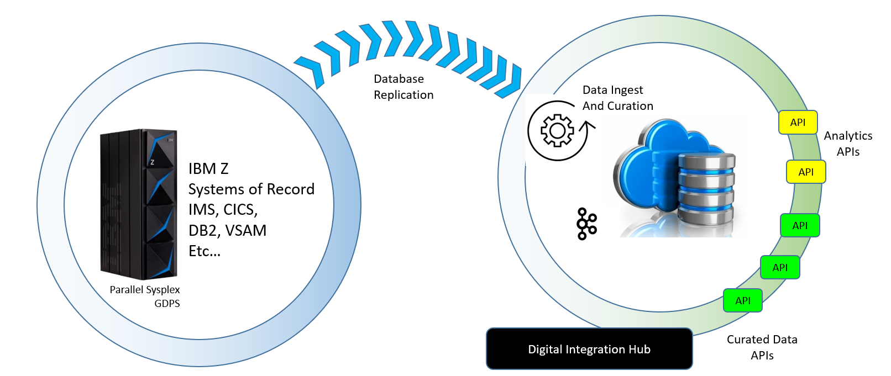

## Description

The goal of this github respository is to provide practical worked examples of implementing IBM InfoSphere CDC solutions between mainframe, midrange and cloud systems. 
It contains  

* 15 documents that illustrate a range of tasks from installation through to operations and monitoring
* suppliemented with code samples for some of the  tasks.

  

Wow 

## Contents

| Installing and Configuring CDC Agents | Using CDC |
| --- | --- |
| [Chapter 1.  Environment for CDC Worked Examples.](C001_environment.md) | [Chapter 2.  Creating and Operating CDC Subscriptions.](C002_administration.md) |
| [Chapter 8.  Setting up CDC for Db2 on z/OS.](C008_cdcdb2zos.md) | [Chapter 3.  Devops Options for CDC.](C003_devops.md) | 
| [Chapter 9.  Setting up Classic CDC for IMS.](C009_cdcims.md) | [Chapter 4.  CHCCLP Scripting.](C004_chcclp.md) |
| [Chapter 10.  Setting up Classic CDC for VSAM.](C010_vsam.md) | [Chapter 5.  Security for CDC (LDAP and TLS).](C005_security.md) |
| [Chapter 11.  Setting up CDC for Kafka in zCX.](C011_zcx.md) | [Chapter 6.  Container Deployment.](C006_containers.md) |
| [Chapter 12.  Setting up CDC for Db2 on Linux.](C012_db2linux.md) | [Chapter 7.  Monitoring and Managing outwith the Windows MC.](C007_dashboard.md) |
| [Chapter 13.  Setting up CDC for Kafka.](C013_kafka.md) |    |
| [Chapter 14.  Setting up remote CDC Capture for Db2 z/OS.](C014_rdb2zos.md) |     |
| [Chapter 15.  Setting up remote CDC Capture for VSAM.](C015_rvsam.md) |     |    

Database replication is widely used by organisations to maintain copies of operational data on systems other than the primary source database. 

Twenty years ago the most common use case was to maintain a reporting environment supporting data analytics in a dedicated reporting environment. 
The justications for the effort and cost of replicating the data would include (a) protecting the operational service levels of the critical transaction systems and 
(b) making use of hardware which was optimised for analytics.

Nowadays the primary use case is to support digital integration hubs that serve data requests via Cloud APIs. As Enterprises seize upon the benefits of cloud computing, they 
are compiling sets of APIs that are required support their Cloud applications. These business-focussed APIs do not care about the boundaries that exist between siloed 
operational systemsby the business. Digital Integration Hubs are designed to curate API-Ready data from a range of heterogeneous source systems, and they need maintain the 
currency of the curated data by consuming streams of change data from the source systems.

The focus of the worked examples in this publication are for mainframe databases such Db2 z/OS, IMS and VSAM. IBM InfoSphere CDC can capture changes from these source systems 
and publish them to targets such as Kafka, Db2 and Oracle, for consumption by Digital Integration Hubs.

Code samples for the demo application used in this Redpaper can be downloaded at [code sample](https://github.com/zeditor01/cdc_examples/tree/main/code%20sample).

| Installing and Configuring CDC Agents | Using CDC |
| --- | --- |
| [Chapter 1.  Environment for CDC Worked Examples.](C001_environment.md) | [Chapter 2.  Creating and Operating CDC Subscriptions.](C002_administration.md) |
| [Chapter 8.  Setting up CDC for Db2 on z/OS.](C008_cdcdb2zos.md) | [Chapter 3.  Devops Options for CDC.](C003_devops.md) | 
| [Chapter 9.  Setting up Classic CDC for IMS.](C009_cdcims.md) | [Chapter 4.  CHCCLP Scripting.](C004_chcclp.md) |
| [Chapter 10.  Setting up Classic CDC for VSAM.](C010_vsam.md) | [Chapter 5.  Security for CDC (LDAP and TLS).](C005_security.md) |
| [Chapter 11.  Setting up CDC for Kafka in zCX.](C011_zcx.md) | [Chapter 6.  Container Deployment.](C006_containers.md) |
| [Chapter 12.  Setting up CDC for Db2 on Linux.](C012_db2linux.md) | [Chapter 7.  Monitoring and Managing outwith the Windows MC.](C007_dashboard.md) |
| [Chapter 13.  Setting up CDC for Kafka.](C013_kafka.md) |    |
| [Chapter 14.  Setting up remote CDC Capture for Db2 z/OS.](C014_rdb2zos.md) |     |
| [Chapter 15.  Setting up remote CDC Capture for VSAM.](C015_rvsam.md) |     |    

[Chapter 1.  Environment for CDC Worked Examples.](C001_environment.md) 

[Chapter 2.  Creating and Operating CDC Subscriptions.](C002_administration.md)

[Chapter 3.  Devops Options for CDC.](C003_devops.md)

[Chapter 4.  CHCCLP Scripting.](C004_chcclp.md)

[Chapter 5.  Security for CDC (LDAP and TLS).](C005_security.md)

[Chapter 6.  Container Deployment.](C006_containers.md)

[Chapter 7.  Monitoring and Managing outwith the Windows MC.](C007_dashboard.md)

[Chapter 8.  Setting up CDC for Db2 on z/OS.](C008_cdcdb2zos.md)

[Chapter 9.  Setting up Classic CDC for IMS.](C009_cdcims.md)

[Chapter 10.  Setting up Classic CDC for VSAM.](C010_vsam.md)

[Chapter 11.  Setting up CDC for Kafka in zCX.](C011_zcx.md)

[Chapter 12.  Setting up CDC for Db2 on Linux.](C012_db2linux.md)

[Chapter 13.  Setting up CDC for Kafka.](C013_kafka.md)

[Chapter 14.  Setting up remote CDC Capture for Db2 z/OS.](C014_rdb2zos.md)

[Chapter 15.  Setting up remote CDC Capture for VSAM.](C015_rvsam.md)

[Appendix](C016_appendix.md)

[Glossary](C017_glossary.md)