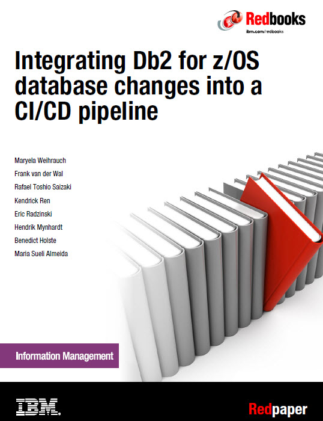

## Description

The goal of this document is to demonstrate the ability to perform single click automated deployments of multi-platform applications that include db2 for z/OS database schema changes. This is accomplished by exploiting process automation and capabilities delivered by IBM Db2 DevOps Experience for z/OS.

By pushing the application and database code changes to a SCM, it triggers a single CI/CD pipeline execution for both types of changes, and therefore mitigating the dependency on the DBA to deploy those database changes in a separate process. At the same time, DBAs can safeguard the integrity of their organization's data by implementing site rules in Db2 DevOps Experience. DBAs define whether a schema change can be approved automatically after all site rules are satisfied or whether it must be approved manually.

We describe the steps as they are relevant to the roles of the DevOps engineer who implements the enterprise CI/CD pipeline, the DBA who is responsible for database code changes in Db2 for z/OS and defines site rules changes need to adhere to for good quality in production, and the application developer who changes the application code and communicates requirements for changes in the database schema.

Code samples for the demo application used in this Redpaper can be downloaded at [code sample](https://github.com/IBMRedbooks/REDP-5646-Db2-for-z-OS-DevOps-Experience/tree/main/code%20sample).

  

## Table of Contents

[Chapter 1.  Introduction](C001_introduction.md)

[Chapter 2.  Db2 database code changes in the CI/CD pipeline](C002_position.md)

[Chapter 3.  Description of sample application](C003_description_sampleApp.md)

[Chapter 4.  Architectural overview](C004_architecture.md)

[Chapter 5.  Code repository organization](C005_codeRepoOrganization.md)

[Chapter 6.  Delivering database changes at the same speed as application changes](C006_doe_overall.md)

[Chapter 7.  IBM UrbanCode Deploy](C007_ucd_overall.md)

[Chapter 8.  Jenkins](C008_jenkins_overall.md)

[Chapter 9.  Application development tools for z/OS](C009_devEnvironment.md)

[Chapter 10.  Application change execution, documentation of the demo](C010_demo_overall.md)

[Chapter 11.  Conclusion](C011_conclusion.md)

[Appendix](C012_appendix.md)

[Glossary](C013_glossary.md)

