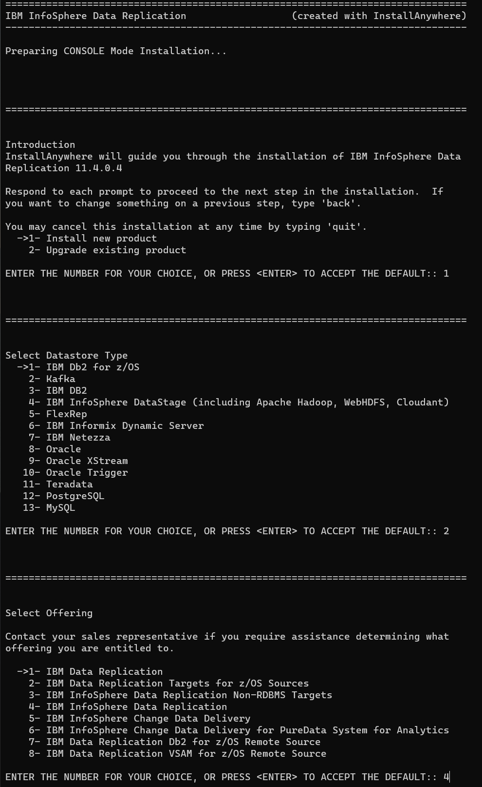
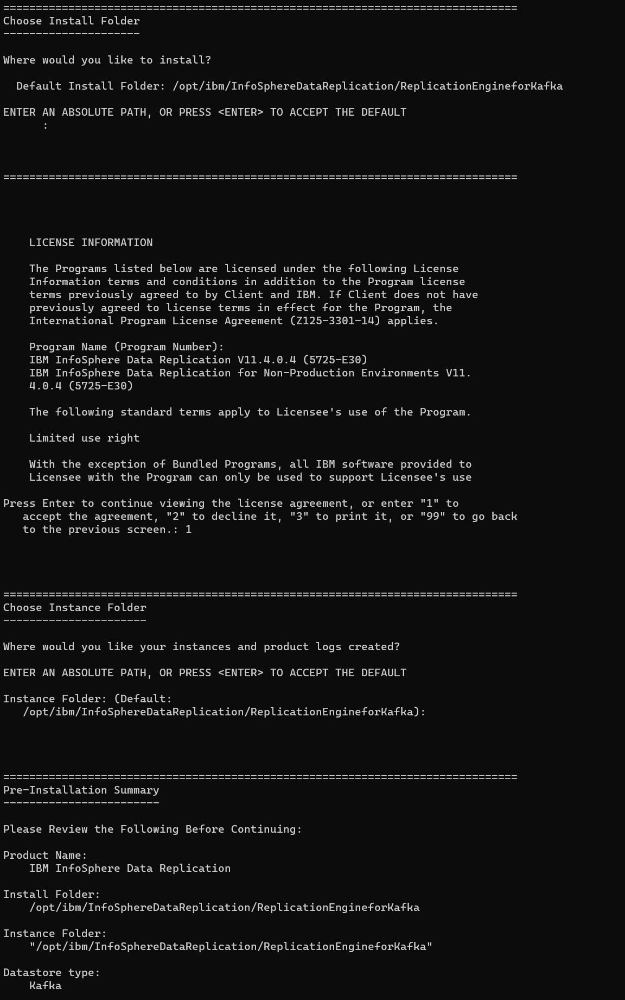
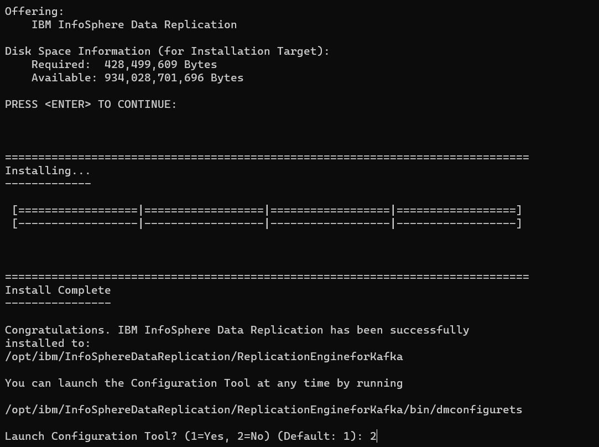
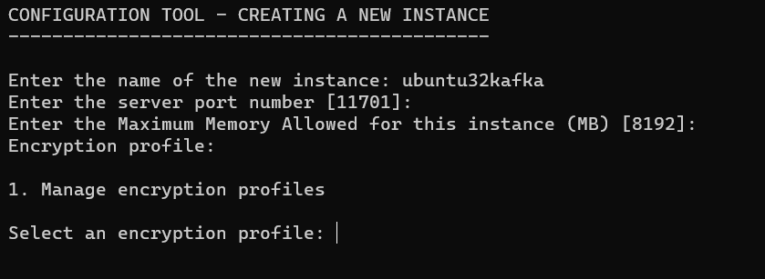
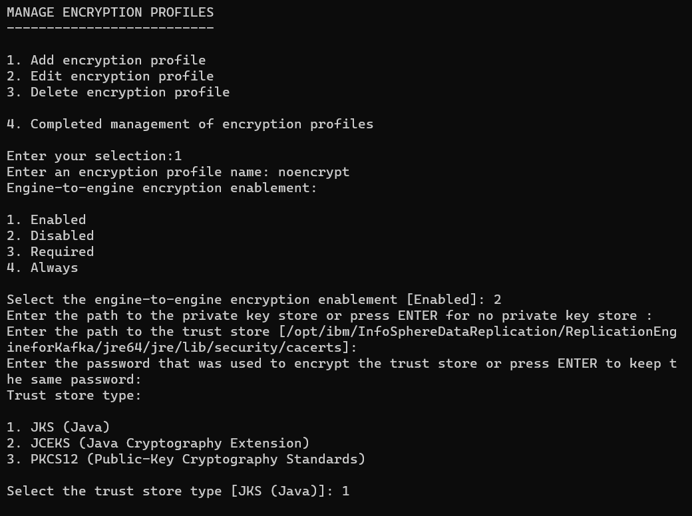
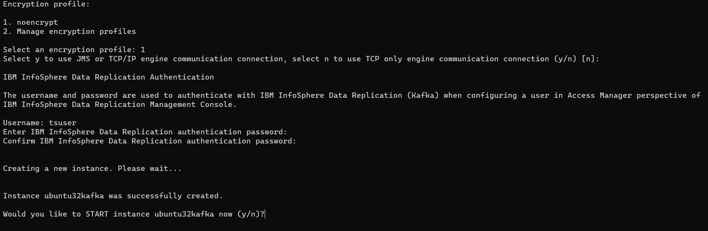
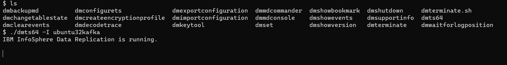
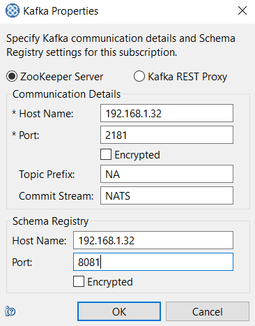
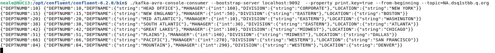

[Back to README.md and Table of Contents.](README.md)

# Setting Up CDC for Kafka - Worked Example
This chapter is a worked example of setting up CDC for Kafka on Linux. 


## Table of Contents


<ul class="toc_list">
<li><a href="#abstract">Abstract</a>   
<li><a href="#1.0">1 Introduction to CDC for Kafka</a>
<ul>
  <li><a href="#1.1">1.1 Requirements to Replicate to Apache Kafka</a></li>
  <li><a href="#1.2">1.2 Kafka Concepts</a></li>
</ul>
<li><a href="#2.0">2. High Level Review of Implementation Steps</a>
<li><a href="#3.0">3. Installing CDC Kafka</a>
<ul>
  <li><a href="#3.1">3.1 Linux paths and permissions</a></li>
  <li><a href="#3.2">3.2 Install the CDC Apply Agent for Kafka</a></li>
  <li><a href="#3.3">3.3 Create the CDC for Kafka Instance</a></li>
</ul> 
<li><a href="#4.0">4. Configure the Linux Environment</a>
<ul>
  <li><a href="#4.1">4.1 TCPIP Ports</a></li>
  <li><a href="#4.2">4.2 Kafka Connection Properties</a></li>
  <li><a href="#4.3">4.3 Likely additional Kafka configuration</a></li>  
</ul>
<li><a href="#5.0">5. Understanding CDC for Kafka as a Kafka Client</a>
<ul>
  <li><a href="#5.1">5.1 TCPIP connections between CDC and Kafka</a></li>
  <li><a href="#5.2">5.2 Kafka Schema Registry considerations</a></li>
  <li><a href="#5.3">5.3 Connecting to Kerberized Kafka</a></li>  
  <li><a href="#5.4">5.4 Console Consumers for testing Subscriptions</a></li>
  <li><a href="#5.5">5.5 Using Kafka Custom Operators (KCOPs)</a></li>
</ul>
<li><a href="#6.0">6. Integrate with the wider CDC Landscape</a>
<ul>
  <li><a href="#6.1">6.1 Automation of the CDC Apply for Kafka Service</a></li>
  <li><a href="#6.2">6.2 Connect from Management Console to CDC for Kafka instance</a></li>
  <li><a href="#6.3">6.3 Use CHCCLP Scripting</a></li>  
  <li><a href="#6.4">6.4 Conforming to site standards for cross-platform devops and security</a></li>
</ul> 
</ul>


<br><hr>


<h2 id="abstract"> Abstract</h2>

This document is a basic worked example of setting up CDC for Kafka as a CDC Target Engine. 


* It deals with the practical considerations for implementing CDC for Kafka. 
* It's scope is limited to a "basic up and running guide", and is intended to be easy to follow (assuming a base of Linux experience).
* It does not attempt to cover all the product's features.
* It is categorically <b>not</b> a replacement for the  <a href="https://www.ibm.com/docs/en/idr/11.4.0?topic=replication-cdc-engine-kafka">IBM CDC for Kafka knowledge centre</a>, which is the comprehensive official product documentation.


It is part of a series of documents providing practical worked examples and 
guidance for seting up CDC Replication between mainframe data sources and mid-range or Cloud targets.
The complete set of articles can be accessed using the README link at the very top of this page. 

<br><hr>

<h2 id="1.0">1. Introduction to CDC for Kafka</h2>  

CDC for Kafka is a CDC Apply Agent only. It does not have CDC Capture functionality. 

CDC Replication is a set of products that implement a common data replication architecture spanning 
a large number of diverse data sources and targets. The CDC common architecture is based upon replication of 
data that conforms to the relational model. Any CDC capture or apply agent that supports a non-relational data structure 
must perform whatever conversion work that is necessary to implement a mapping between that data structure and the 
relational model of data. 

<h3 id="1.1">1.1 Requirements to Replicate to Apache Kafka</h3> 

Apache Kafka, and it's various commercial distributions, is widely used for event streaming services both on-premise and in-cloud. 
This document assumes that the reader is familiar with the basics of Kafka, which is widely documented online. 

CDC architecture (which is founded on the relational model of data) provides a range of integration options to write data to Kafka topics and integrate with 
constructs in the Kafka world like Schema Registries that enable Kafka applications to consume the events that CDC writes to Kafka. 

CDC for Kafka supports all the major Kafka distributions, including Confluent, Hortonworks, Cloudera, Amazon MSK, BigInsights, Event Streams. CDC for Kafka is 
supported for Ubuntu, Redhat, Suse and CentOS. 

For latest details on supported versions of Linux and Kafka please check with the <a href="https://www.ibm.com/docs/en/idr/11.4.0?topic=replication-cdc-engine-kafka">IBM CDC for Kafka knowledge centre.</a>

<h3 id="1.1">1.2 Kafka Concepts</h3> 

The author comes from a Db2 relational database platform. If you are a specialist in Relational Database and CDC replication, you will need to become familiar with a very different set of
concepts from relational databases. Initially you will probably thing of Kafka as something similar to Websphere MQ, which provides messaging and integration solutions for many 
Enterprises today. But Kafka is different in that...</p>

* It is designed to be run on scalable, industry-standard cluster fabrics.
* It is legendary for providing lightning fast performance.
* It conforms the an "eventually consistent" model for data integrity (wheras databases follow a transactionally consistent model).
* Every message will be processed <b>at least once</b>, which means consuming applications have to be responsible for de-duping.
* Message structures are defined outside the messages in a schema registry.
* Many Kafka clusters are kerberized, which is another area of endeavour that Database and MQ experts may not be totally familiar with.


This article does not attempt to provide a tutorial on Kafka. However, if the reader is unfamiliar with Kafka, some research is strongly recommended. 
Section 6 of this paper addresses how CDC for Kafka handles some of these Kafka concepts and constructs. 

<br><hr>

<h2 id="2.0">2. High Level Review of Implementation Steps</h2>  

Deploying CDC for Kafka software is a simple process, comprising the following steps. 


1. Prepare the Linux paths and permissions
2. Run the software installer binary
3. Create an instance of CDC for Kafka with it's own operational paramaters
4. Configure TCPIP Network and Secuirty

<br><hr>

<h2 id="3.0">3. Installing CDC Kafka</h2>  

Download the CDC for Linux x64 package from Passport Advantage or Fix Central. 
The filename of the version that was used in this example is <b>setup-iidr-11.4.0.4-5618-linux-x86.bin</b> 

The version is 11.4.0.4 and the specific build is 5618. New builds are published periodically without necessarily incrementing the version number. 

Note that this installer binary contains all the CDC agents for Linux on Intel. The installer dialog will prompt you to specify which agent you wish to install. 

<h3 id="3.1">3.1 Linux paths and permissions</h3> 

I have chosen to use cdcinst1 as the linux userid that owns all cdc programs for my demo environment.
I created a group ( cdcadm1 ) for the user ( cdcinst1 ) and requested to reset the password for cdcinst1 with the following commands.

```
sudo groupadd -g 970 cdcadm1
sudo useradd -u 1070 -g cdcadm1 -m -d /home/cdcinst1 cdcinst1
passwd cdcinst1 
```

Next, create the directories that the installer will install the program to. 

```
/opt/ibm/InfoSphereDataReplication will hold all the cdc agents
/opt/IBM/InfoSphereDataReplication will hold the access server
```

Make cdcinst1 the owner of those directories, with the following commands

```
chown cdcinst1:cdcadm1 /opt/ibm/InfoSphereDataReplication
chown cdcinst1:cdcadm1 /opt/IBM/InfoSphereDataReplication
```

Also, add cdcinst1 to Sudoers for convenience

```
usermod -aG wheel username
```

If the JRE is not installed, do so now with the following command

```
sudo yum install unzip libnsl
```

<h3 id="3.2">3.2 Install the CDC Apply Agent for Kafka</h3>

logon as cdcinst1 and switch to the directory where the installer binary was downloaded to.

unset the DISPLAY variable to force a terminal dialog, rather than a GUI

```
unset DISPLAY
```

Invoke the installer with the following command

```
/setup-iidr-11.4.0.4-5618-linux-x86.bin
```

Respond to the installer dialog as follows to specify "Install New", followed by "Datastore Type:Kafka" followed by the license type of your entitlement. 




Next, accept the installation path, Choose instance directory, and Review the install request.




Then let the installer run, and defer the instance creation till later. 




<h3 id="3.3">3.3 Create the CDC for Kafka Instance</h3>

The dmconfigurets command in the installation/bin directory will start a dialog to allow you to create a CDC instance. Run the command below as cdcinst1. 
 
```
/opt/ibm/InfoSphereDataReplication/ReplicationEngineforKafka/bin/dmconfigurets
```


Now, create an instance called ubuntu32kafka, listening on port 11701, allocated 8MB of memory.  




Next step is to define an encryption profile. This dialog is iterative, allowing you to define multiple encryption profiless, and then choose the one to use. 
You can also return to this dialog later and change the encryption profile of the instance. The configuration of TLS and encryption profiles is handled as a separate 
topic in [13. Security for CDC (LDAP and TLS).](C013_security.md). For now we will create an encryption profile that disables encryption. 

Select 1 to manage encryption profiles, and then select 1 again to drive the "ADD encryption profile" dialog here 




Having defined encruption profile "noencrypt", we can select it and complete the instance creation. 

The CDC for Kafka instance needs to have a userid and password created to authenticate connections from the Access Server. In this basic 
"up and running" example, we will accept the default userid (tsuser) and assign a password. In most real world scenarios you would configure the Access Server 
to use an LDAP directory for authentication services. LDAP configuration is covered in [13. Security for CDC (LDAP and TLS).](C013_security.md) 



Once the installation is created, you can start it immediately from the dialog. The command to start it at any other time is

```
/opt/ibm/InfoSphereDataReplication/ReplicationEngineforKafka/bin/dmts64 -I ubuntu32kafka
```



<br><hr>

<h2 id="4.0">4. Configure the Linux Environment</h2>  

A couple of pieces of Linux adminsitration must be done. 

<h3 id="4.1">4.1 TCPIP Ports</h3> 

We configured this instance to listen on port 11701. You must ensure that the Linux Firewall allows incoming traffic on this port, as well as any 
other network firewalls between other CDC components and this instance. 

```
firewall-cmd --permanent --zone=public --add-port=11701/tcp
firewall-cmd --reload
```

<h3 id="4.2">4.2 Kafka Connection Properties</h3> 

You don't actually need to specify the Kafka connection properties at this stage. 
Every time you define a subscriptio you will need to add the specific Kafka connection properties to that Subscription. 
The details are covered in section 5. 


<h3 id="4.3">4.3 Likely additional Kafka configuration</h3>
Most Kafka clusters are well protected for authentication and encryption. CDC for Kafka is basically a Kafka client. At different points it will act 
as a Kafka consumer, and a Kafka producer. The CDC agent provides files for both kafkaconsumer.properties and kafkaproducer.properties where this configuration 
will be performed. This is also referenced in section 5.

<br><hr>

<h2 id="5.0">5. Understanding CDC for Kafka as a Kafka Client</h2>

The installation and configuration work up till this point has been concerned with the CDC Environment, and connections from CDC Access Server and 
CDC Capture Agents into CDC for Kafka. This section is about how CDC for Kafka communicates with the Kafka Cluster. 

This section provides an overview of what is involved in using CDC for Kafka. The worked examples of developing CDC subscriptions to Kafka are 
contained in [10. Creating and Operating CDC Subscriptions.](C010_administration.md)

<h3 id="5.1">5.1 TCPIP connections between CDC and Kafka</h3>

Kafka clients (like CDC for Kafka) have a chice of two APIs to connect to Kafka. 


* REST API.
* Java API.


The REST API to Kafka is intended for simple, lower throughput clients. The Java API is intended for high volume streaming use cases like data replication. 
This worked example uses the Java API, which will use Kafka's zookeeper service to find a broker for the connection to Kafka. 

When CDC for Kafka subscriptions are configured, they must reference the zookeeper service of the Kafka cluster. 
ZooKeeper is a centralized service for maintaining configuration information, naming, providing distributed synchronization, and providing group services. 
When you define the Kafka properties of a CDC subscription to Kafka, you must provide the TCPIP address and port of the Zookeeper service. 
The default port for zookeeper is 2181, as per the screenshot below. 




<h3 id="5.2">5.2 Kafka Schema Registry considerations</h3>

With CDC for Kafka, you have a choice of writing self-defining JSON messages into the target Kafka topics, or writing messages 
in an efficient avro format. (Avro is an open source data serialization system that helps with data exchange between systems).

It is normally preferable for CDC for Kafka to write messages to Kafka in an avro format (performance, common standards etc...). 
This requires a schema for the  record structure to be recorded in the Kafka schema registry, so that Kafka consumers have the information to parse the messages.  
At initialisation of each subscription CDC will automatically write a schema into the schema registry. 
You must provide the TCPIP address and port for the Kafka schema registry (default port 8081) on the Kafka properties of the subscription, as per the 
screenshot above. The default port for the Kafka schema registry is 8081. 

Optionally, CDC for Kafka can write messages to Kafka as self-defining JSON messages, which do not require a schema in the schema registry. 
This approach requires the use of a KCOP that specifies a JSON format, as discussed in section 5.4 below. 

<h3 id="5.3">5.3 Connecting to Kerberized Kafka</h3>

Many Enterprise Grade Kafka clusters are highly secured. At a minimum you can expect that the connection from the CDC client to Kafka will be encrypted by SSL. 
More likely the kafka cluster will be kerberized, so that certificates will be used as the basis for authentcation and encryption between the CDC client and the 
Kafka cluster. 

The worked examples in these documents are using a local Kafka instance on a single node, without SSL or kerberos. If you are dealing with SSL or Kerberos to 
connect to your kafka cluster, then please review the following excellent documents that cover the configuration of CDC for Kafka in these environments. 

<a href="https://www.ibm.com/support/pages/system/files/inline-files/IIDR.Apache.Kafka_.and_.SSL_.pdf">CDC SSL connection to Kafka</a>. 

<a href="https://www.ibm.com/support/pages/system/files/inline-files/CDC%20Kafka%20-%20Installation%20and%20Configuration_0.pdf">CDC connection to Kerberized Kafka</a>. 


<h3 id="5.4">5.4 Console Consumers for testing Subscriptions</h3>

When you use CDC to replicate to a relational database it is easy to check the results of the active subscriptions by writing some 
SQL statements to query the target tables. With Kafka you can read the messages in the topics using a range of programming lanuages, such as Spark, nifi and java. 
However, for testing purposes initial verification of messages would be via a console consumer. 

Most distributions of Kafka will include a console consumer to read messages that are not encoded with an avro schema, and an avro console consumer for messages that 
are encoded with an avro schema. An example of a command to invoke a kafka console consumer is as follows 

```
./kafka-avro-console-consumer --bootstrap-server localhost:9092 --property print.key=true --from-beginning --topic=NA.dsqlstbb.q.org 
```

The screenshot below is an example of using a console consumer to read messages that were published by CDC for Kafka. 



<h3 id="5.5">5.5 Using Kafka Custom Operators (KCOPs)</h3>

CDC for Kafka supports the use of KCOPs to control the writing of messages to Kafka topics. KCOPs are java classes that give you control of the records that 
are being written to Kafka for the purposes of formatting and topic assignment. You can code your own KCOPs or use the IBM-supplied KCOPs. 
Examples of what the IBM-supplied KCOPs can do include: 


1. controlling which replication messages get written to which Kafka topics
2. Adding headers to messages 
3. Writing Audit records. (before and after values on the same message(
4. writing messages in JSON (avoid using a serialiser)
5. referencing a custom avro serialiser (other than the default Confluent serialiser)
6. enabling partitioning of data topics


Full details are in the knowledgecenter <a href="https://www.ibm.com/docs/en/idr/11.4.0?topic=crek-kafka-custom-operation-processor-kcop-cdc-replication-engine-kafka">here</a>. 

Just a reminder that section 5 of this document is a brief overview of the Kafka integration considerations. Worked examples of thse tasks are included 
in  [10. Creating and Operating CDC Subscriptions.](C010_administration.md)

<br><hr> 

<h2 id="6.0">6. Integrate with the wider CDC Landscape</h2>

Now that the CDC for Kafka instance is created and started, you can start to use the wider CDC landscape to develop and operate subscriptions. 
Section 6 covers these matters. 


<h3 id="6.1">6.1 Automation of the CDC Apply for Kafka Service</h3> 

CDC for Kafka is no different from any other linux service with regard to automation. Use whatever method is standard at your site (cron, shell scripts, tools) 
to automate the execution and operation of the CDC instance.  

<h3 id="6.2">6.2 Connect from Management Console to CDC for Kafka instance</h3>

This document is primarily concerned with everything that needs to be done to establish CDC for Kafka as a CDC target. 
Using the the CDC administration tools is now a standard CDC task which is covered in [11. Devops Options for CDC.](C011_devops.md)

<h3 id="6.3">6.3 Use CHCCLP Scripting</h3>

CDC Replication is traditionally a Windows-centric environment for operations and control, but it also has advanced scripting capabilities for automation. 

The CDC Management Console is a comprehensive GUI that addresses all parts of the devops lifecycle ( access control, definition, operations, monitoring ). 

The CHCCLP Scripting tools offer automated devops controls using scripts. These can be executed from the Windows-based 
Management Console, or from the Access Server on Windows or Linux. 
The CHCCLP scripting option will be attractive to all shops that wish to implement strong devops governance and control to their 
CDC replication environments. Shops with a z/OS operation bridge should know that the CHCCLP scripting environment can also be deployed 
inside z/OS, either from unix system services (USS) or from JCL (using the java batch scheduler). 

All of these devops options are covered in the  [11. Devops Options for CDC.](C011_devops.md) paper 
and the [12. CHCCLP Scripting.](C012_chcclp.md) paper.


<h3 id="6.4">6.4 Conforming to site standards for cross-platform devops and security</h3>

So far, this document has been primarily concerned with the mechanics of making CDC operate with a Kafka target.

The author has worked with several customers deploying CDC from mainframe sources to midrange and Cloud targets. 
The challenges to overcome will include... 


1. different development and operational teams supporting the capture and apply services
2. co-ordinating devops tasks between cross-platform teams
3. change control procedures
4. implementing TLS encryption between the application-transparent z/OS platform and application-controlled LUW platforms

A good approach is to start by considering the non-functional requriements for the business service that CDC will support. If the business 
requires a high level of service ( low latency, stringent monitoring and alerting, minimal downtime, fast recovery from outages etc... ) then
an operational support model can be developed to meet those requirements. 


Once the required service levels are defined, that is a useful reference point for assessing whether the opertional 
management controls and interfaces between different operations teams can satisfy those service levels 

* In some cases, the co-operation between different operational teams can be adjusted to satisfy the required service levels 
* In other cases, it may be helpful to use technology options to shift the CDC operations entirely to mainframe, or entirely to non-mainframe. 
This case be done by selecting different CDC agents in many cases, as follows 

1. If a Windows/Linux operations hub is desired, then there are remote capture agent options for VSAM and DB2 z/OS.
2. If a z/OS operations hub is desired, then the Linux-based CDC agents can be deployed as software containers inside z/OS Container Extensions

Please be aware of the flexible CDC deployment options that exist, and take an early view on what choices may provide the best 
devops lifecycle proposition for your organisation. 

This series of articles includes a heavy focus of worked deployment examples, but the articles in the "Using CDC" column do aim 
to address the practical devops challenges with recommendations on how to address common challenges.

